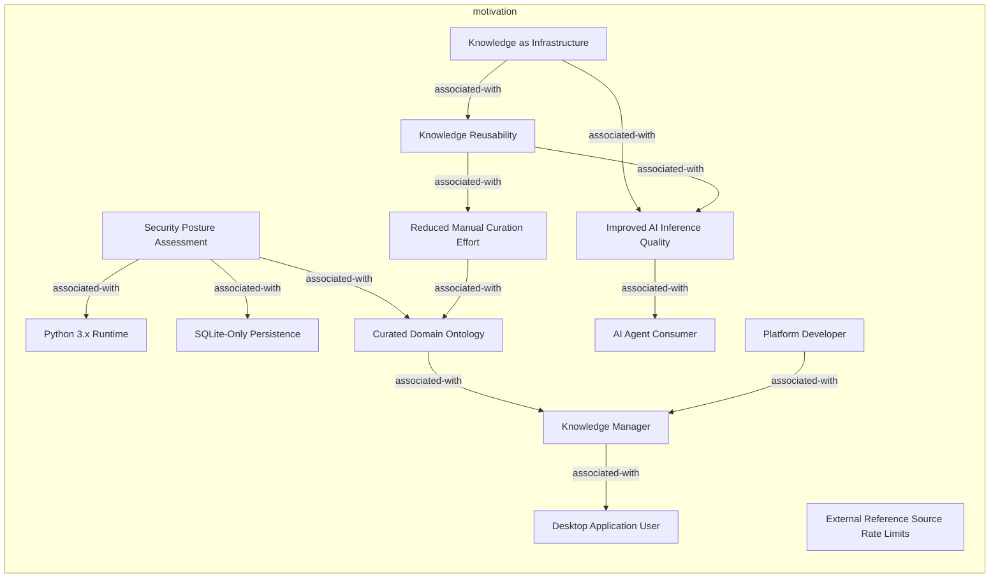
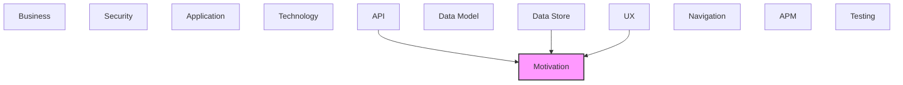

# Motivation

Goals, requirements, drivers, and strategic outcomes of the architecture.

## Report Index

- [Layer Introduction](#layer-introduction)
- [Intra-Layer Relationships](#intra-layer-relationships)
- [Inter-Layer Dependencies](#inter-layer-dependencies)
- [Inter-Layer Relationships Table](#inter-layer-relationships-table)
- [Element Reference](#element-reference)

## Layer Introduction

| Metric                    | Count |
| ------------------------- | ----- |
| Elements                  | 13    |
| Intra-Layer Relationships | 12    |
| Inter-Layer Relationships | 7     |
| Inbound Relationships     | 7     |
| Outbound Relationships    | 0     |

**Cross-Layer References**:

- **Upstream layers**: [API](./06-api-layer-report.md), [Data Store](./08-data-store-layer-report.md), [UX](./09-ux-layer-report.md)

## Intra-Layer Relationships

## Inter-Layer Dependencies

## Inter-Layer Relationships Table

| Relationship ID                                              | Source Node                                              | Dest Node                                                     | Dest Layer   | Predicate   | Cardinality  | Strength |
| ------------------------------------------------------------ | -------------------------------------------------------- | ------------------------------------------------------------- | ------------ | ----------- | ------------ | -------- |
| `api.ratelimit.satisfies.motivation.constraint`              | `api.ratelimit.external-reference-api-rate-limit`        | `motivation.constraint.external-reference-source-rate-limits` | `motivation` | `satisfies` | many-to-many | medium   |
| `data-store.retentionpolicy.satisfies.motivation.constraint` | `data-store.retentionpolicy.reference-api-cache-cleanup` | `motivation.constraint.external-reference-source-rate-limits` | `motivation` | `satisfies` | many-to-many | medium   |
| `ux.view.serves.motivation.stakeholder`                      | `ux.view.admin-view`                                     | `motivation.stakeholder.platform-developer`                   | `motivation` | `serves`    | many-to-many | medium   |
| `ux.view.serves.motivation.stakeholder`                      | `ux.view.configuration-view`                             | `motivation.stakeholder.platform-developer`                   | `motivation` | `serves`    | many-to-many | medium   |
| `ux.view.serves.motivation.stakeholder`                      | `ux.view.datasets-view`                                  | `motivation.stakeholder.knowledge-manager`                    | `motivation` | `serves`    | many-to-many | medium   |
| `ux.view.maps-to.motivation.outcome`                         | `ux.view.rag-experiments-view`                           | `motivation.outcome.improved-ai-inference-quality`            | `motivation` | `maps-to`   | many-to-many | medium   |
| `ux.view.serves.motivation.stakeholder`                      | `ux.view.rag-experiments-view`                           | `motivation.stakeholder.ai-agent-consumer`                    | `motivation` | `serves`    | many-to-many | medium   |

## Element Reference

### Security Posture Assessment {#security-posture-assessment}

**ID**: `motivation.assessment.security-posture-assessment`

**Type**: `assessment`

Security gap analysis: SQL injection prevention (SQLAlchemy ORM), optional API key auth (require_secure_key in config.json), and global exception handler sanitization are present; HTTPS enforcement, role-based access control, and multi-user auth are absent in the new hexagonal architecture

#### Attributes

| Name           | Value |
| -------------- | ----- |
| assessmentType | gap   |

#### Relationships

| Type        | Related Element                                 | Predicate         | Direction |
| ----------- | ----------------------------------------------- | ----------------- | --------- |
| intra-layer | `motivation.constraint.python-3x-runtime`       | `associated-with` | outbound  |
| intra-layer | `motivation.constraint.sqlite-only-persistence` | `associated-with` | outbound  |
| intra-layer | `motivation.outcome.curated-domain-ontology`    | `associated-with` | outbound  |

### External Reference Source Rate Limits {#external-reference-source-rate-limits}

**ID**: `motivation.constraint.external-reference-source-rate-limits`

**Type**: `constraint`

All calls to external knowledge sources (ConceptNet, DBpedia, Wikidata, schema.org) are constrained by per-source rate limits defined in config.json

#### Attributes

| Name           | Value    |
| -------------- | -------- |
| constraintType | external |

#### Relationships

| Type        | Related Element                                          | Predicate   | Direction |
| ----------- | -------------------------------------------------------- | ----------- | --------- |
| inter-layer | `api.ratelimit.external-reference-api-rate-limit`        | `satisfies` | inbound   |
| inter-layer | `data-store.retentionpolicy.reference-api-cache-cleanup` | `satisfies` | inbound   |

### Python 3.x Runtime {#python-3-x-runtime}

**ID**: `motivation.constraint.python-3x-runtime`

**Type**: `constraint`

All server-side code runs on Python 3.x; no other server languages are in scope for the back-end

#### Attributes

| Name           | Value     |
| -------------- | --------- |
| constraintType | technical |

#### Relationships

| Type        | Related Element                                     | Predicate         | Direction |
| ----------- | --------------------------------------------------- | ----------------- | --------- |
| intra-layer | `motivation.assessment.security-posture-assessment` | `associated-with` | inbound   |

### SQLite-Only Persistence {#sqlite-only-persistence}

**ID**: `motivation.constraint.sqlite-only-persistence`

**Type**: `constraint`

The primary data store must be SQLite; no other RDBMS or cloud database is used for the core workspace to maintain the local-first, zero-config guarantee

#### Attributes

| Name           | Value     |
| -------------- | --------- |
| constraintType | technical |

#### Relationships

| Type        | Related Element                                     | Predicate         | Direction |
| ----------- | --------------------------------------------------- | ----------------- | --------- |
| intra-layer | `motivation.assessment.security-posture-assessment` | `associated-with` | inbound   |

### Knowledge as Infrastructure {#knowledge-as-infrastructure}

**ID**: `motivation.meaning.knowledge-as-infrastructure`

**Type**: `meaning`

The deeper purpose of Context Studio: treat curated, structured knowledge as infrastructure that both humans and AI systems can rely on — not as a one-off deliverable

#### Relationships

| Type        | Related Element                                    | Predicate         | Direction |
| ----------- | -------------------------------------------------- | ----------------- | --------- |
| intra-layer | `motivation.outcome.improved-ai-inference-quality` | `associated-with` | outbound  |
| intra-layer | `motivation.value.knowledge-reusability`           | `associated-with` | outbound  |

### Curated Domain Ontology {#curated-domain-ontology}

**ID**: `motivation.outcome.curated-domain-ontology`

**Type**: `outcome`

The primary deliverable: a version-controlled, semantically enriched knowledge graph ready for use in RAG pipelines, documentation, and agent reasoning

#### Attributes

| Name   | Value       |
| ------ | ----------- |
| status | in-progress |

#### Relationships

| Type        | Related Element                                     | Predicate         | Direction |
| ----------- | --------------------------------------------------- | ----------------- | --------- |
| intra-layer | `motivation.assessment.security-posture-assessment` | `associated-with` | inbound   |
| intra-layer | `motivation.stakeholder.knowledge-manager`          | `associated-with` | outbound  |
| intra-layer | `motivation.value.reduced-manual-curation-effort`   | `associated-with` | inbound   |

### Improved AI Inference Quality {#improved-ai-inference-quality}

**ID**: `motivation.outcome.improved-ai-inference-quality`

**Type**: `outcome`

By grounding LLM calls in a curated ontology, the expected outcome is measurably higher accuracy and relevance in RAG pipeline outputs

#### Attributes

| Name   | Value   |
| ------ | ------- |
| status | planned |

#### Relationships

| Type        | Related Element                                  | Predicate         | Direction |
| ----------- | ------------------------------------------------ | ----------------- | --------- |
| inter-layer | `ux.view.rag-experiments-view`                   | `maps-to`         | inbound   |
| intra-layer | `motivation.meaning.knowledge-as-infrastructure` | `associated-with` | inbound   |
| intra-layer | `motivation.stakeholder.ai-agent-consumer`       | `associated-with` | outbound  |
| intra-layer | `motivation.value.knowledge-reusability`         | `associated-with` | inbound   |

### AI Agent Consumer {#ai-agent-consumer}

**ID**: `motivation.stakeholder.ai-agent-consumer`

**Type**: `stakeholder`

System stakeholder: AI agents and RAG pipelines that query the knowledge graph via REST API for contextual knowledge retrieval

#### Attributes

| Name | Value  |
| ---- | ------ |
| type | system |

#### Relationships

| Type        | Related Element                                    | Predicate         | Direction |
| ----------- | -------------------------------------------------- | ----------------- | --------- |
| inter-layer | `ux.view.rag-experiments-view`                     | `serves`          | inbound   |
| intra-layer | `motivation.outcome.improved-ai-inference-quality` | `associated-with` | inbound   |

### Desktop Application User {#desktop-application-user}

**ID**: `motivation.stakeholder.desktop-application-user`

**Type**: `stakeholder`

End-user stakeholder: individuals running Context Studio as a local-first desktop application on their own workstation

#### Attributes

| Name | Value    |
| ---- | -------- |
| type | end-user |

#### Relationships

| Type        | Related Element                            | Predicate         | Direction |
| ----------- | ------------------------------------------ | ----------------- | --------- |
| intra-layer | `motivation.stakeholder.knowledge-manager` | `associated-with` | inbound   |

### Knowledge Manager {#knowledge-manager}

**ID**: `motivation.stakeholder.knowledge-manager`

**Type**: `stakeholder`

Internal stakeholder: domain experts and ontology authors who create and curate the knowledge graph using the new hexagonal architecture back-end

#### Attributes

| Name | Value    |
| ---- | -------- |
| type | end-user |

#### Relationships

| Type        | Related Element                                   | Predicate         | Direction |
| ----------- | ------------------------------------------------- | ----------------- | --------- |
| inter-layer | `ux.view.datasets-view`                           | `serves`          | inbound   |
| intra-layer | `motivation.outcome.curated-domain-ontology`      | `associated-with` | inbound   |
| intra-layer | `motivation.stakeholder.desktop-application-user` | `associated-with` | outbound  |
| intra-layer | `motivation.stakeholder.platform-developer`       | `associated-with` | inbound   |

### Platform Developer {#platform-developer}

**ID**: `motivation.stakeholder.platform-developer`

**Type**: `stakeholder`

Internal stakeholder: developers extending or maintaining Context Studio and the underlying hexagonal architecture bounded contexts

#### Attributes

| Name | Value    |
| ---- | -------- |
| type | internal |

#### Relationships

| Type        | Related Element                            | Predicate         | Direction |
| ----------- | ------------------------------------------ | ----------------- | --------- |
| inter-layer | `ux.view.admin-view`                       | `serves`          | inbound   |
| inter-layer | `ux.view.configuration-view`               | `serves`          | inbound   |
| intra-layer | `motivation.stakeholder.knowledge-manager` | `associated-with` | outbound  |

### Knowledge Reusability {#knowledge-reusability}

**ID**: `motivation.value.knowledge-reusability`

**Type**: `value`

A curated ontology graph is a reusable asset that accelerates both human reasoning and AI inference across many tasks and domains

#### Attributes

| Name      | Value     |
| --------- | --------- |
| valueType | strategic |

#### Relationships

| Type        | Related Element                                    | Predicate         | Direction |
| ----------- | -------------------------------------------------- | ----------------- | --------- |
| intra-layer | `motivation.meaning.knowledge-as-infrastructure`   | `associated-with` | inbound   |
| intra-layer | `motivation.outcome.improved-ai-inference-quality` | `associated-with` | outbound  |
| intra-layer | `motivation.value.reduced-manual-curation-effort`  | `associated-with` | outbound  |

### Reduced Manual Curation Effort {#reduced-manual-curation-effort}

**ID**: `motivation.value.reduced-manual-curation-effort`

**Type**: `value`

Automated enrichment from multiple external knowledge bases significantly reduces the time and expertise required to build a high-quality ontology

#### Attributes

| Name      | Value       |
| --------- | ----------- |
| valueType | operational |

#### Relationships

| Type        | Related Element                              | Predicate         | Direction |
| ----------- | -------------------------------------------- | ----------------- | --------- |
| intra-layer | `motivation.value.knowledge-reusability`     | `associated-with` | inbound   |
| intra-layer | `motivation.outcome.curated-domain-ontology` | `associated-with` | outbound  |

---

Generated: 2026-05-08T12:53:37.492Z | Model Version: 0.1.0
