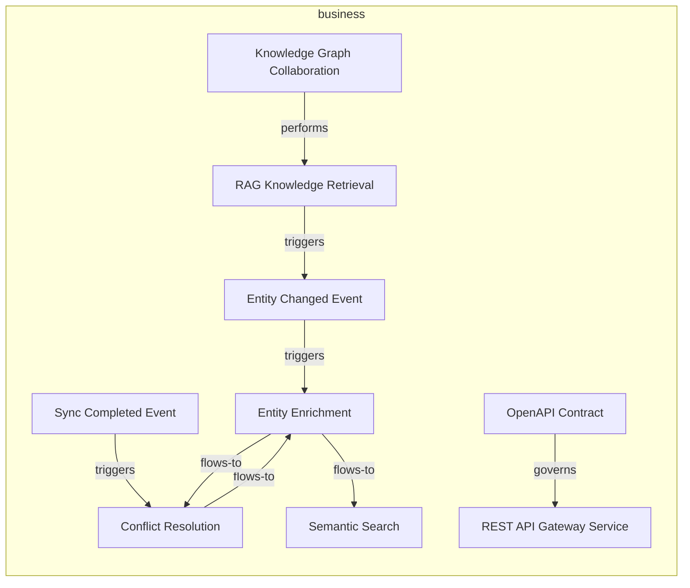
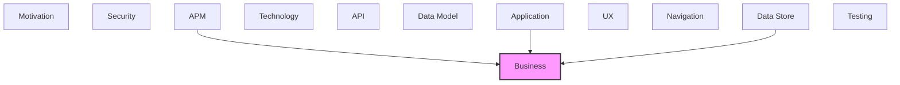

# Business

Business processes, functions, roles, and services.

## Report Index

- [Layer Introduction](#layer-introduction)
- [Intra-Layer Relationships](#intra-layer-relationships)
- [Inter-Layer Dependencies](#inter-layer-dependencies)
- [Inter-Layer Relationships Table](#inter-layer-relationships-table)
- [Element Reference](#element-reference)

## Layer Introduction

| Metric                    | Count |
| ------------------------- | ----- |
| Elements                  | 9     |
| Intra-Layer Relationships | 8     |
| Inter-Layer Relationships | 6     |
| Inbound Relationships     | 6     |
| Outbound Relationships    | 0     |

**Cross-Layer References**:

- **Upstream layers**: [APM](./11-apm-layer-report.md), [Application](./04-application-layer-report.md), [Data Store](./08-data-store-layer-report.md)

## Intra-Layer Relationships

## Inter-Layer Dependencies

## Inter-Layer Relationships Table

| Relationship ID                                                      | Source Node                                                    | Dest Node                                           | Dest Layer | Predicate  | Cardinality  | Strength |
| -------------------------------------------------------------------- | -------------------------------------------------------------- | --------------------------------------------------- | ---------- | ---------- | ------------ | -------- |
| `apm.logconfiguration.monitors.business.businessservice`             | `apm.logconfiguration.context-studio-server-log-configuration` | `business.businessservice.rest-api-gateway-service` | `business` | `monitors` | many-to-many | medium   |
| `application.applicationfunction.realizes.business.businessfunction` | `application.applicationfunction.embedding-generation`         | `business.businessfunction.entity-enrichment`       | `business` | `realizes` | many-to-many | medium   |
| `application.applicationfunction.realizes.business.businessfunction` | `application.applicationfunction.llm-provider-routing`         | `business.businessfunction.entity-enrichment`       | `business` | `realizes` | many-to-many | medium   |
| `application.applicationfunction.realizes.business.businessfunction` | `application.applicationfunction.network-metrics-function`     | `business.businessfunction.semantic-search`         | `business` | `realizes` | many-to-many | medium   |
| `application.applicationfunction.realizes.business.businessfunction` | `application.applicationfunction.sparql-query-function`        | `business.businessfunction.semantic-search`         | `business` | `realizes` | many-to-many | medium   |
| `data-store.storedlogic.realizes.business.businessfunction`          | `data-store.storedlogic.sqlite-vec-cosine-similarity`          | `business.businessfunction.semantic-search`         | `business` | `realizes` | many-to-many | medium   |

## Element Reference

### Knowledge Graph Collaboration {#knowledge-graph-collaboration}

**ID**: `business.businesscollaboration.knowledge-graph-collaboration`

**Type**: `businesscollaboration`

Business collaboration between Knowledge Managers sharing a knowledge graph through changeset-based editing and conflict resolution

#### Relationships

| Type        | Related Element                                        | Predicate  | Direction |
| ----------- | ------------------------------------------------------ | ---------- | --------- |
| intra-layer | `business.businessinteraction.rag-knowledge-retrieval` | `performs` | outbound  |

### Entity Changed Event {#entity-changed-event}

**ID**: `business.businessevent.entity-changed-event`

**Type**: `businessevent`

Business event triggered when an ontology entity is created, updated, or deleted; recorded in the change_events audit trail in local.db

#### Attributes

| Name | Value    |
| ---- | -------- |
| type | internal |

#### Relationships

| Type        | Related Element                                        | Predicate  | Direction |
| ----------- | ------------------------------------------------------ | ---------- | --------- |
| intra-layer | `business.businessfunction.entity-enrichment`          | `triggers` | outbound  |
| intra-layer | `business.businessinteraction.rag-knowledge-retrieval` | `triggers` | inbound   |

### Sync Completed Event {#sync-completed-event}

**ID**: `business.businessevent.sync-completed-event`

**Type**: `businessevent`

Business event signalling successful synchronisation of the local knowledge graph to remote S3 storage via the sync adapter

#### Attributes

| Name | Value    |
| ---- | -------- |
| type | external |

#### Relationships

| Type        | Related Element                                 | Predicate  | Direction |
| ----------- | ----------------------------------------------- | ---------- | --------- |
| intra-layer | `business.businessfunction.conflict-resolution` | `triggers` | outbound  |

### Conflict Resolution {#conflict-resolution}

**ID**: `business.businessfunction.conflict-resolution`

**Type**: `businessfunction`

Core business function: detect and resolve merge conflicts in collaborative changeset operations in the VersionControl bounded context

#### Relationships

| Type        | Related Element                               | Predicate  | Direction |
| ----------- | --------------------------------------------- | ---------- | --------- |
| intra-layer | `business.businessevent.sync-completed-event` | `triggers` | inbound   |
| intra-layer | `business.businessfunction.entity-enrichment` | `flows-to` | outbound  |
| intra-layer | `business.businessfunction.entity-enrichment` | `flows-to` | inbound   |

### Entity Enrichment {#entity-enrichment}

**ID**: `business.businessfunction.entity-enrichment`

**Type**: `businessfunction`

Core business function: automatically enrich ontology entities with definitions, synonyms, and cross-references from external knowledge bases via the reference adapters

#### Relationships

| Type        | Related Element                                        | Predicate  | Direction |
| ----------- | ------------------------------------------------------ | ---------- | --------- |
| inter-layer | `application.applicationfunction.embedding-generation` | `realizes` | inbound   |
| inter-layer | `application.applicationfunction.llm-provider-routing` | `realizes` | inbound   |
| intra-layer | `business.businessevent.entity-changed-event`          | `triggers` | inbound   |
| intra-layer | `business.businessfunction.conflict-resolution`        | `flows-to` | inbound   |
| intra-layer | `business.businessfunction.conflict-resolution`        | `flows-to` | outbound  |
| intra-layer | `business.businessfunction.semantic-search`            | `flows-to` | outbound  |

### Semantic Search {#semantic-search}

**ID**: `business.businessfunction.semantic-search`

**Type**: `businessfunction`

Core business function: vector-based similarity search across ontology entities using SentenceTransformer embeddings stored in local.db via SQLiteVector

#### Relationships

| Type        | Related Element                                            | Predicate  | Direction |
| ----------- | ---------------------------------------------------------- | ---------- | --------- |
| inter-layer | `application.applicationfunction.network-metrics-function` | `realizes` | inbound   |
| inter-layer | `application.applicationfunction.sparql-query-function`    | `realizes` | inbound   |
| inter-layer | `data-store.storedlogic.sqlite-vec-cosine-similarity`      | `realizes` | inbound   |
| intra-layer | `business.businessfunction.entity-enrichment`              | `flows-to` | inbound   |

### RAG Knowledge Retrieval {#rag-knowledge-retrieval}

**ID**: `business.businessinteraction.rag-knowledge-retrieval`

**Type**: `businessinteraction`

Business interaction: AI agents query the knowledge graph via vector similarity search to retrieve contextually relevant entities for RAG pipelines

#### Relationships

| Type        | Related Element                                                | Predicate  | Direction |
| ----------- | -------------------------------------------------------------- | ---------- | --------- |
| intra-layer | `business.businesscollaboration.knowledge-graph-collaboration` | `performs` | inbound   |
| intra-layer | `business.businessevent.entity-changed-event`                  | `triggers` | outbound  |

### REST API Gateway Service {#rest-api-gateway-service}

**ID**: `business.businessservice.rest-api-gateway-service`

**Type**: `businessservice`

The RESTful API surface of the Context Studio local server, implemented as FastAPI routes in the web adapter layer. Provides all HTTP endpoints for ontology management, graph analysis, knowledge extraction, LLM pipeline management, versioning, and system administration.

#### Relationships

| Type        | Related Element                                                | Predicate  | Direction |
| ----------- | -------------------------------------------------------------- | ---------- | --------- |
| inter-layer | `apm.logconfiguration.context-studio-server-log-configuration` | `monitors` | inbound   |
| intra-layer | `business.contract.open-api-contract`                          | `governs`  | inbound   |

### OpenAPI Contract {#openapi-contract}

**ID**: `business.contract.open-api-contract`

**Type**: `contract`

Business contract defining the REST API surface for Context Studio: endpoint signatures, request/response schemas, and versioning commitments

#### Relationships

| Type        | Related Element                                     | Predicate | Direction |
| ----------- | --------------------------------------------------- | --------- | --------- |
| intra-layer | `business.businessservice.rest-api-gateway-service` | `governs` | outbound  |

---

Generated: 2026-05-11T12:08:47.429Z | Model Version: 0.1.0
