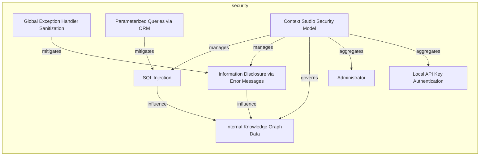
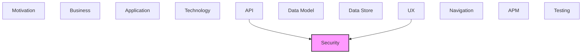

# Security

Authentication, authorization, security threats, and controls.

## Report Index

- [Layer Introduction](#layer-introduction)
- [Intra-Layer Relationships](#intra-layer-relationships)
- [Inter-Layer Dependencies](#inter-layer-dependencies)
- [Inter-Layer Relationships Table](#inter-layer-relationships-table)
- [Element Reference](#element-reference)

## Layer Introduction

| Metric                    | Count |
| ------------------------- | ----- |
| Elements                  | 8     |
| Intra-Layer Relationships | 9     |
| Inter-Layer Relationships | 2     |
| Inbound Relationships     | 2     |
| Outbound Relationships    | 0     |

**Cross-Layer References**:

- **Upstream layers**: [API](./06-api-layer-report.md), [UX](./09-ux-layer-report.md)

## Intra-Layer Relationships

## Inter-Layer Dependencies

## Inter-Layer Relationships Table

| Relationship ID                                    | Source Node                                       | Dest Node                                               | Dest Layer | Predicate    | Cardinality  | Strength |
| -------------------------------------------------- | ------------------------------------------------- | ------------------------------------------------------- | ---------- | ------------ | ------------ | -------- |
| `api.ratelimit.implements.security.countermeasure` | `api.ratelimit.external-reference-api-rate-limit` | `security.countermeasure.parameterized-queries-via-orm` | `security` | `implements` | many-to-many | medium   |
| `ux.view.requires.security.role`                   | `ux.view.admin-view`                              | `security.role.administrator`                           | `security` | `requires`   | many-to-many | medium   |

## Element Reference

### Local API Key Authentication {#local-api-key-authentication}

**ID**: `security.authenticationconfig.local-api-key-authentication`

**Type**: `authenticationconfig`

Optional API key authentication — require_secure_key toggle in config.json, X-API-Key header, no session/JWT. Configures the new local-server FastAPI application.

#### Attributes

| Name              | Value |
| ----------------- | ----- |
| mfaRequired       | false |
| provider          | local |
| sessionTimeout    | 0     |
| verificationLevel | ial1  |

#### Relationships

| Type        | Related Element                                        | Predicate    | Direction |
| ----------- | ------------------------------------------------------ | ------------ | --------- |
| intra-layer | `security.securitymodel.context-studio-security-model` | `aggregates` | inbound   |

### Global Exception Handler Sanitization {#global-exception-handler-sanitization}

**ID**: `security.countermeasure.global-exception-handler-sanitization`

**Type**: `countermeasure`

FastAPI global exception handler in local-server/app.py strips file paths and internal info from error responses before returning to clients

#### Attributes

| Name          | Value                                                           |
| ------------- | --------------------------------------------------------------- |
| description   | Exception handler sanitizes internal paths from error responses |
| effectiveness | high                                                            |
| implemented   | true                                                            |
| type          | technical                                                       |

#### Relationships

| Type        | Related Element                                             | Predicate   | Direction |
| ----------- | ----------------------------------------------------------- | ----------- | --------- |
| intra-layer | `security.threat.information-disclosure-via-error-messages` | `mitigates` | outbound  |

### Parameterized Queries via ORM {#parameterized-queries-via-orm}

**ID**: `security.countermeasure.parameterized-queries-via-orm`

**Type**: `countermeasure`

SQLAlchemy ORM uses parameterized queries for all database operations across all bounded contexts, preventing SQL injection

#### Attributes

| Name          | Value                                                      |
| ------------- | ---------------------------------------------------------- |
| description   | SQLAlchemy ORM parameterized queries prevent SQL injection |
| effectiveness | high                                                       |
| implemented   | true                                                       |
| type          | technical                                                  |

#### Relationships

| Type        | Related Element                                   | Predicate    | Direction |
| ----------- | ------------------------------------------------- | ------------ | --------- |
| inter-layer | `api.ratelimit.external-reference-api-rate-limit` | `implements` | inbound   |
| intra-layer | `security.threat.sql-injection`                   | `mitigates`  | outbound  |

### Internal Knowledge Graph Data {#internal-knowledge-graph-data}

**ID**: `security.dataclassification.internal-knowledge-graph-data`

**Type**: `dataclassification`

Data classification for the ontology entity data stored in local.db — internal, not requiring encryption at rest for the desktop use case

#### Attributes

| Name                  | Value    |
| --------------------- | -------- |
| classificationLevel   | internal |
| encryptionRequirement | none     |
| version               | 1.0      |

#### Relationships

| Type        | Related Element                                             | Predicate   | Direction |
| ----------- | ----------------------------------------------------------- | ----------- | --------- |
| intra-layer | `security.securitymodel.context-studio-security-model`      | `governs`   | inbound   |
| intra-layer | `security.threat.information-disclosure-via-error-messages` | `influence` | inbound   |
| intra-layer | `security.threat.sql-injection`                             | `influence` | inbound   |

### Administrator {#administrator}

**ID**: `security.role.administrator`

**Type**: `role`

Full administrator role — has unrestricted access to all ontology entities, datasets, pipelines, and configuration in the new hexagonal architecture

#### Attributes

| Name         | Value              |
| ------------ | ------------------ |
| description  | Full system access |
| displayName  | Administrator      |
| inheritsFrom |                    |
| level        | 1                  |

#### Relationships

| Type        | Related Element                                        | Predicate    | Direction |
| ----------- | ------------------------------------------------------ | ------------ | --------- |
| inter-layer | `ux.view.admin-view`                                   | `requires`   | inbound   |
| intra-layer | `security.securitymodel.context-studio-security-model` | `aggregates` | inbound   |

### Context Studio Security Model {#context-studio-security-model}

**ID**: `security.securitymodel.context-studio-security-model`

**Type**: `securitymodel`

Security model for the Context Studio local-first desktop app: optional API key authentication, SQL injection prevention via SQLAlchemy ORM, and global exception handler sanitization

#### Attributes

| Name               | Value                       |
| ------------------ | --------------------------- |
| accessControlModel | rbac                        |
| application        | context-studio-local-server |
| version            | 1.0                         |

#### Relationships

| Type        | Related Element                                              | Predicate    | Direction |
| ----------- | ------------------------------------------------------------ | ------------ | --------- |
| intra-layer | `security.authenticationconfig.local-api-key-authentication` | `aggregates` | outbound  |
| intra-layer | `security.role.administrator`                                | `aggregates` | outbound  |
| intra-layer | `security.dataclassification.internal-knowledge-graph-data`  | `governs`    | outbound  |
| intra-layer | `security.threat.information-disclosure-via-error-messages`  | `manages`    | outbound  |
| intra-layer | `security.threat.sql-injection`                              | `manages`    | outbound  |

### Information Disclosure via Error Messages {#information-disclosure-via-error-messages}

**ID**: `security.threat.information-disclosure-via-error-messages`

**Type**: `threat`

Threat: internal file paths and stack traces leaking through unhandled exception responses in the FastAPI application

#### Attributes

| Name        | Value                                 |
| ----------- | ------------------------------------- |
| criticality | medium                                |
| description | File path leakage via error responses |
| impact      | moderate                              |
| likelihood  | moderate                              |
| threatens   | api                                   |

#### Relationships

| Type        | Related Element                                                 | Predicate   | Direction |
| ----------- | --------------------------------------------------------------- | ----------- | --------- |
| intra-layer | `security.countermeasure.global-exception-handler-sanitization` | `mitigates` | inbound   |
| intra-layer | `security.securitymodel.context-studio-security-model`          | `manages`   | inbound   |
| intra-layer | `security.dataclassification.internal-knowledge-graph-data`     | `influence` | outbound  |

### SQL Injection {#sql-injection}

**ID**: `security.threat.sql-injection`

**Type**: `threat`

Threat: SQL injection attacks against the SQLite databases (local.db, operations.db) via unsanitized API inputs

#### Attributes

| Name        | Value                              |
| ----------- | ---------------------------------- |
| criticality | high                               |
| description | SQL injection via API input fields |
| impact      | high                               |
| likelihood  | moderate                           |
| threatens   | data-store                         |

#### Relationships

| Type        | Related Element                                             | Predicate   | Direction |
| ----------- | ----------------------------------------------------------- | ----------- | --------- |
| intra-layer | `security.countermeasure.parameterized-queries-via-orm`     | `mitigates` | inbound   |
| intra-layer | `security.securitymodel.context-studio-security-model`      | `manages`   | inbound   |
| intra-layer | `security.dataclassification.internal-knowledge-graph-data` | `influence` | outbound  |

---

Generated: 2026-05-10T10:17:36.894Z | Model Version: 0.1.0
