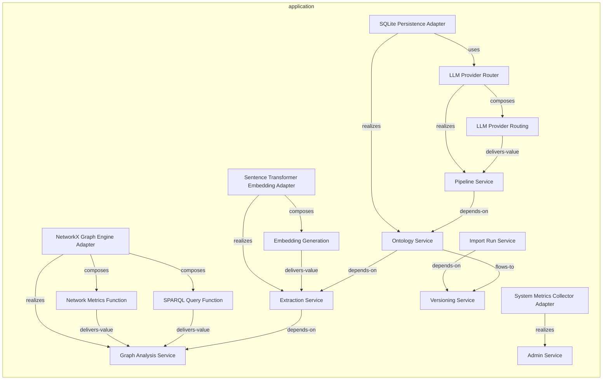
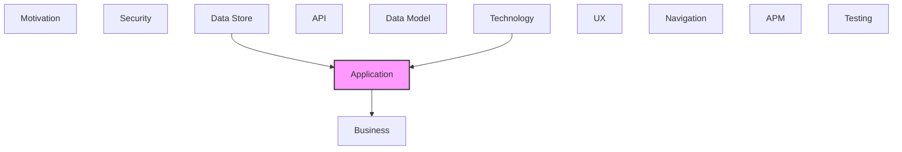

# Application

Application components, services, and interactions.

## Report Index

- [Layer Introduction](#layer-introduction)
- [Intra-Layer Relationships](#intra-layer-relationships)
- [Inter-Layer Dependencies](#inter-layer-dependencies)
- [Inter-Layer Relationships Table](#inter-layer-relationships-table)
- [Element Reference](#element-reference)

## Layer Introduction

| Metric                    | Count |
| ------------------------- | ----- |
| Elements                  | 16    |
| Intra-Layer Relationships | 19    |
| Inter-Layer Relationships | 26    |
| Inbound Relationships     | 22    |
| Outbound Relationships    | 4     |

**Cross-Layer References**:

- **Upstream layers**: [Data Store](./08-data-store-layer-report.md), [Technology](./05-technology-layer-report.md)
- **Downstream layers**: [Business](./02-business-layer-report.md)

## Intra-Layer Relationships

## Inter-Layer Dependencies

## Inter-Layer Relationships Table

| Relationship ID                                                      | Source Node                                                | Dest Node                                                                 | Dest Layer    | Predicate    | Cardinality  | Strength |
| -------------------------------------------------------------------- | ---------------------------------------------------------- | ------------------------------------------------------------------------- | ------------- | ------------ | ------------ | -------- |
| `application.applicationfunction.realizes.business.businessfunction` | `application.applicationfunction.embedding-generation`     | `business.businessfunction.entity-enrichment`                             | `business`    | `realizes`   | many-to-many | medium   |
| `application.applicationfunction.realizes.business.businessfunction` | `application.applicationfunction.llm-provider-routing`     | `business.businessfunction.entity-enrichment`                             | `business`    | `realizes`   | many-to-many | medium   |
| `application.applicationfunction.realizes.business.businessfunction` | `application.applicationfunction.network-metrics-function` | `business.businessfunction.semantic-search`                               | `business`    | `realizes`   | many-to-many | medium   |
| `application.applicationfunction.realizes.business.businessfunction` | `application.applicationfunction.sparql-query-function`    | `business.businessfunction.semantic-search`                               | `business`    | `realizes`   | many-to-many | medium   |
| `data-store.accesspattern.serves.application.applicationfunction`    | `data-store.accesspattern.entity-by-parent-range-scan`     | `application.applicationfunction.sparql-query-function`                   | `application` | `serves`     | many-to-many | medium   |
| `data-store.accesspattern.serves.application.applicationfunction`    | `data-store.accesspattern.vector-similarity-search`        | `application.applicationfunction.embedding-generation`                    | `application` | `serves`     | many-to-many | medium   |
| `data-store.storedlogic.implements.application.applicationfunction`  | `data-store.storedlogic.sqlite-vec-cosine-similarity`      | `application.applicationfunction.embedding-generation`                    | `application` | `implements` | many-to-many | medium   |
| `technology.systemsoftware.serves.application.applicationcomponent`  | `technology.systemsoftware.alembic`                        | `application.applicationcomponent.sqlite-persistence-adapter`             | `application` | `serves`     | many-to-many | medium   |
| `technology.systemsoftware.realizes.application.applicationservice`  | `technology.systemsoftware.duck-db`                        | `application.applicationservice.versioning-service`                       | `application` | `realizes`   | many-to-many | medium   |
| `technology.systemsoftware.realizes.application.applicationservice`  | `technology.systemsoftware.fast-api`                       | `application.applicationservice.ontology-service`                         | `application` | `realizes`   | many-to-many | medium   |
| `technology.systemsoftware.serves.application.applicationcomponent`  | `technology.systemsoftware.fast-api`                       | `application.applicationcomponent.sqlite-persistence-adapter`             | `application` | `serves`     | many-to-many | medium   |
| `technology.systemsoftware.serves.application.applicationcomponent`  | `technology.systemsoftware.network-x`                      | `application.applicationcomponent.network-x-graph-engine-adapter`         | `application` | `serves`     | many-to-many | medium   |
| `technology.systemsoftware.realizes.application.applicationservice`  | `technology.systemsoftware.pydantic`                       | `application.applicationservice.ontology-service`                         | `application` | `realizes`   | many-to-many | medium   |
| `technology.systemsoftware.realizes.application.applicationservice`  | `technology.systemsoftware.python`                         | `application.applicationservice.admin-service`                            | `application` | `realizes`   | many-to-many | medium   |
| `technology.systemsoftware.realizes.application.applicationservice`  | `technology.systemsoftware.python`                         | `application.applicationservice.ontology-service`                         | `application` | `realizes`   | many-to-many | medium   |
| `technology.systemsoftware.realizes.application.applicationservice`  | `technology.systemsoftware.python`                         | `application.applicationservice.pipeline-service`                         | `application` | `realizes`   | many-to-many | medium   |
| `technology.systemsoftware.realizes.application.applicationservice`  | `technology.systemsoftware.python`                         | `application.applicationservice.versioning-service`                       | `application` | `realizes`   | many-to-many | medium   |
| `technology.systemsoftware.realizes.application.applicationservice`  | `technology.systemsoftware.rdflib`                         | `application.applicationservice.graph-analysis-service`                   | `application` | `realizes`   | many-to-many | medium   |
| `technology.systemsoftware.realizes.application.applicationservice`  | `technology.systemsoftware.react`                          | `application.applicationservice.admin-service`                            | `application` | `realizes`   | many-to-many | medium   |
| `technology.systemsoftware.realizes.application.applicationservice`  | `technology.systemsoftware.sentence-transformers`          | `application.applicationservice.extraction-service`                       | `application` | `realizes`   | many-to-many | medium   |
| `technology.systemsoftware.serves.application.applicationcomponent`  | `technology.systemsoftware.sentence-transformers`          | `application.applicationcomponent.sentence-transformer-embedding-adapter` | `application` | `serves`     | many-to-many | medium   |
| `technology.systemsoftware.realizes.application.applicationservice`  | `technology.systemsoftware.spa-cy`                         | `application.applicationservice.extraction-service`                       | `application` | `realizes`   | many-to-many | medium   |
| `technology.systemsoftware.serves.application.applicationcomponent`  | `technology.systemsoftware.spa-cy`                         | `application.applicationcomponent.sentence-transformer-embedding-adapter` | `application` | `serves`     | many-to-many | medium   |
| `technology.systemsoftware.serves.application.applicationcomponent`  | `technology.systemsoftware.sqlalchemy`                     | `application.applicationcomponent.sqlite-persistence-adapter`             | `application` | `serves`     | many-to-many | medium   |
| `technology.systemsoftware.realizes.application.applicationservice`  | `technology.systemsoftware.tan-stack-query`                | `application.applicationservice.admin-service`                            | `application` | `realizes`   | many-to-many | medium   |
| `technology.systemsoftware.realizes.application.applicationservice`  | `technology.systemsoftware.tan-stack-router`               | `application.applicationservice.admin-service`                            | `application` | `realizes`   | many-to-many | medium   |

## Element Reference

### LLM Provider Router {#llm-provider-router}

**ID**: `application.applicationcomponent.llm-provider-router`

**Type**: `applicationcomponent`

Infrastructure adapter routing LLM completion requests to the appropriate provider — selects between OpenAI and Anthropic providers based on pipeline configuration and exposes available provider list for health checks

#### Relationships

| Type        | Related Element                                               | Predicate  | Direction |
| ----------- | ------------------------------------------------------------- | ---------- | --------- |
| intra-layer | `application.applicationfunction.llm-provider-routing`        | `composes` | outbound  |
| intra-layer | `application.applicationservice.pipeline-service`             | `realizes` | outbound  |
| intra-layer | `application.applicationcomponent.sqlite-persistence-adapter` | `uses`     | inbound   |

### NetworkX Graph Engine Adapter {#networkx-graph-engine-adapter}

**ID**: `application.applicationcomponent.network-x-graph-engine-adapter`

**Type**: `applicationcomponent`

Infrastructure adapter implementing the GraphEngine port using NetworkX DiGraph — supports directed graph construction, shortest/all paths, centrality algorithms (betweenness, pagerank, closeness, degree), community detection, and subgraph extraction

#### Relationships

| Type        | Related Element                                            | Predicate  | Direction |
| ----------- | ---------------------------------------------------------- | ---------- | --------- |
| inter-layer | `technology.systemsoftware.network-x`                      | `serves`   | inbound   |
| intra-layer | `application.applicationfunction.network-metrics-function` | `composes` | outbound  |
| intra-layer | `application.applicationfunction.sparql-query-function`    | `composes` | outbound  |
| intra-layer | `application.applicationservice.graph-analysis-service`    | `realizes` | outbound  |

### Sentence Transformer Embedding Adapter {#sentence-transformer-embedding-adapter}

**ID**: `application.applicationcomponent.sentence-transformer-embedding-adapter`

**Type**: `applicationcomponent`

Infrastructure adapter wrapping the sentence-transformers library — provides lazy-loaded semantic embedding generation (all-MiniLM-L12-v2) with sync and async interfaces for single and batch text encoding

#### Relationships

| Type        | Related Element                                        | Predicate  | Direction |
| ----------- | ------------------------------------------------------ | ---------- | --------- |
| inter-layer | `technology.systemsoftware.sentence-transformers`      | `serves`   | inbound   |
| inter-layer | `technology.systemsoftware.spa-cy`                     | `serves`   | inbound   |
| intra-layer | `application.applicationfunction.embedding-generation` | `composes` | outbound  |
| intra-layer | `application.applicationservice.extraction-service`    | `realizes` | outbound  |

### SQLite Persistence Adapter {#sqlite-persistence-adapter}

**ID**: `application.applicationcomponent.sqlite-persistence-adapter`

**Type**: `applicationcomponent`

Infrastructure adapter implementing repository ports via SQLAlchemy — persists ontology entities, relationships, change events, changesets, proposals, and extraction results to local.db using single-table inheritance ORM model

#### Relationships

| Type        | Related Element                                        | Predicate  | Direction |
| ----------- | ------------------------------------------------------ | ---------- | --------- |
| inter-layer | `technology.systemsoftware.alembic`                    | `serves`   | inbound   |
| inter-layer | `technology.systemsoftware.fast-api`                   | `serves`   | inbound   |
| inter-layer | `technology.systemsoftware.sqlalchemy`                 | `serves`   | inbound   |
| intra-layer | `application.applicationservice.ontology-service`      | `realizes` | outbound  |
| intra-layer | `application.applicationcomponent.llm-provider-router` | `uses`     | outbound  |

### System Metrics Collector Adapter {#system-metrics-collector-adapter}

**ID**: `application.applicationcomponent.system-metrics-collector-adapter`

**Type**: `applicationcomponent`

Infrastructure adapter implementing the MetricsCollector port — aggregates health status from LLM providers, NLP pipeline, embedding model, and SQLite database connectivity; tracks service uptime

#### Relationships

| Type        | Related Element                                | Predicate  | Direction |
| ----------- | ---------------------------------------------- | ---------- | --------- |
| intra-layer | `application.applicationservice.admin-service` | `realizes` | outbound  |

### Embedding Generation {#embedding-generation}

**ID**: `application.applicationfunction.embedding-generation`

**Type**: `applicationfunction`

Application function that generates vector embeddings for ontology entities using the SentenceTransformer adapter — stored in local.db via SQLiteVector

#### Relationships

| Type        | Related Element                                                           | Predicate        | Direction |
| ----------- | ------------------------------------------------------------------------- | ---------------- | --------- |
| inter-layer | `business.businessfunction.entity-enrichment`                             | `realizes`       | outbound  |
| inter-layer | `data-store.accesspattern.vector-similarity-search`                       | `serves`         | inbound   |
| inter-layer | `data-store.storedlogic.sqlite-vec-cosine-similarity`                     | `implements`     | inbound   |
| intra-layer | `application.applicationcomponent.sentence-transformer-embedding-adapter` | `composes`       | inbound   |
| intra-layer | `application.applicationservice.extraction-service`                       | `delivers-value` | outbound  |

### LLM Provider Routing {#llm-provider-routing}

**ID**: `application.applicationfunction.llm-provider-routing`

**Type**: `applicationfunction`

Application function that routes LLM requests to the appropriate provider (OpenAI, Anthropic) via the LLMProviderRouter in the llm adapter

#### Relationships

| Type        | Related Element                                        | Predicate        | Direction |
| ----------- | ------------------------------------------------------ | ---------------- | --------- |
| inter-layer | `business.businessfunction.entity-enrichment`          | `realizes`       | outbound  |
| intra-layer | `application.applicationcomponent.llm-provider-router` | `composes`       | inbound   |
| intra-layer | `application.applicationservice.pipeline-service`      | `delivers-value` | outbound  |

### Network Metrics Function {#network-metrics-function}

**ID**: `application.applicationfunction.network-metrics-function`

**Type**: `applicationfunction`

Application function that computes graph network metrics (centrality, density, clustering) using NetworkX within the Graph Analysis bounded context

#### Relationships

| Type        | Related Element                                                   | Predicate        | Direction |
| ----------- | ----------------------------------------------------------------- | ---------------- | --------- |
| inter-layer | `business.businessfunction.semantic-search`                       | `realizes`       | outbound  |
| intra-layer | `application.applicationcomponent.network-x-graph-engine-adapter` | `composes`       | inbound   |
| intra-layer | `application.applicationservice.graph-analysis-service`           | `delivers-value` | outbound  |

### SPARQL Query Function {#sparql-query-function}

**ID**: `application.applicationfunction.sparql-query-function`

**Type**: `applicationfunction`

Application function that executes SPARQL queries over the in-memory graph constructed by RDFLib in the Graph Analysis bounded context

#### Relationships

| Type        | Related Element                                                   | Predicate        | Direction |
| ----------- | ----------------------------------------------------------------- | ---------------- | --------- |
| inter-layer | `business.businessfunction.semantic-search`                       | `realizes`       | outbound  |
| inter-layer | `data-store.accesspattern.entity-by-parent-range-scan`            | `serves`         | inbound   |
| intra-layer | `application.applicationcomponent.network-x-graph-engine-adapter` | `composes`       | inbound   |
| intra-layer | `application.applicationservice.graph-analysis-service`           | `delivers-value` | outbound  |

### Admin Service {#admin-service}

**ID**: `application.applicationservice.admin-service`

**Type**: `applicationservice`

Domain service for system administration — aggregates health checks from metrics, embedding, NLP, and LLM components; manages application configuration sections; tracks background task lifecycle

#### Relationships

| Type        | Related Element                                                     | Predicate  | Direction |
| ----------- | ------------------------------------------------------------------- | ---------- | --------- |
| inter-layer | `technology.systemsoftware.python`                                  | `realizes` | inbound   |
| inter-layer | `technology.systemsoftware.react`                                   | `realizes` | inbound   |
| inter-layer | `technology.systemsoftware.tan-stack-query`                         | `realizes` | inbound   |
| inter-layer | `technology.systemsoftware.tan-stack-router`                        | `realizes` | inbound   |
| intra-layer | `application.applicationcomponent.system-metrics-collector-adapter` | `realizes` | inbound   |

### Extraction Service {#extraction-service}

**ID**: `application.applicationservice.extraction-service`

**Type**: `applicationservice`

Domain service orchestrating four-layer knowledge extraction pipeline (KG context, LLM, NLP, reference enrichment) — coordinates layer execution, recovers from failures, deduplicates entities by label similarity, and persists results

#### Relationships

| Type        | Related Element                                                           | Predicate        | Direction |
| ----------- | ------------------------------------------------------------------------- | ---------------- | --------- |
| inter-layer | `technology.systemsoftware.sentence-transformers`                         | `realizes`       | inbound   |
| inter-layer | `technology.systemsoftware.spa-cy`                                        | `realizes`       | inbound   |
| intra-layer | `application.applicationcomponent.sentence-transformer-embedding-adapter` | `realizes`       | inbound   |
| intra-layer | `application.applicationfunction.embedding-generation`                    | `delivers-value` | inbound   |
| intra-layer | `application.applicationservice.graph-analysis-service`                   | `depends-on`     | outbound  |
| intra-layer | `application.applicationservice.ontology-service`                         | `depends-on`     | inbound   |

### Graph Analysis Service {#graph-analysis-service}

**ID**: `application.applicationservice.graph-analysis-service`

**Type**: `applicationservice`

Read-only domain service for knowledge graph analytics — builds in-memory NetworkX and RDFLib graphs with lazy stale-flag invalidation; supports shortest path, centrality, community detection, subgraph extraction, and SPARQL queries

#### Relationships

| Type        | Related Element                                                   | Predicate        | Direction |
| ----------- | ----------------------------------------------------------------- | ---------------- | --------- |
| inter-layer | `technology.systemsoftware.rdflib`                                | `realizes`       | inbound   |
| intra-layer | `application.applicationcomponent.network-x-graph-engine-adapter` | `realizes`       | inbound   |
| intra-layer | `application.applicationfunction.network-metrics-function`        | `delivers-value` | inbound   |
| intra-layer | `application.applicationfunction.sparql-query-function`           | `delivers-value` | inbound   |
| intra-layer | `application.applicationservice.extraction-service`               | `depends-on`     | inbound   |

### Import Run Service {#import-run-service}

**ID**: `application.applicationservice.import-run-service`

**Type**: `applicationservice`

Domain service managing import run lifecycle for SKOS/OWL/GraphML interchange — creates runs in PENDING state, transitions them to COMMITTED/FAILED/ROLLED_BACK, and manages correlation context for change event linkage

#### Relationships

| Type        | Related Element                                     | Predicate    | Direction |
| ----------- | --------------------------------------------------- | ------------ | --------- |
| intra-layer | `application.applicationservice.versioning-service` | `depends-on` | outbound  |

### Ontology Service {#ontology-service}

**ID**: `application.applicationservice.ontology-service`

**Type**: `applicationservice`

Core domain service managing the full ontology lifecycle — create/read/update/delete for taxonomies, concept schemes, classes, individuals, and property definitions; generates embeddings and publishes domain events

#### Relationships

| Type        | Related Element                                               | Predicate    | Direction |
| ----------- | ------------------------------------------------------------- | ------------ | --------- |
| inter-layer | `technology.systemsoftware.fast-api`                          | `realizes`   | inbound   |
| inter-layer | `technology.systemsoftware.pydantic`                          | `realizes`   | inbound   |
| inter-layer | `technology.systemsoftware.python`                            | `realizes`   | inbound   |
| intra-layer | `application.applicationcomponent.sqlite-persistence-adapter` | `realizes`   | inbound   |
| intra-layer | `application.applicationservice.extraction-service`           | `depends-on` | outbound  |
| intra-layer | `application.applicationservice.versioning-service`           | `flows-to`   | outbound  |
| intra-layer | `application.applicationservice.pipeline-service`             | `depends-on` | inbound   |

### Pipeline Service {#pipeline-service}

**ID**: `application.applicationservice.pipeline-service`

**Type**: `applicationservice`

Domain service managing LLM pipeline configuration lifecycle and execution — creates/updates/deletes configurations, executes pipelines with timeout handling and full token/duration instrumentation, publishes PipelineExecuted events

#### Relationships

| Type        | Related Element                                        | Predicate        | Direction |
| ----------- | ------------------------------------------------------ | ---------------- | --------- |
| inter-layer | `technology.systemsoftware.python`                     | `realizes`       | inbound   |
| intra-layer | `application.applicationcomponent.llm-provider-router` | `realizes`       | inbound   |
| intra-layer | `application.applicationfunction.llm-provider-routing` | `delivers-value` | inbound   |
| intra-layer | `application.applicationservice.ontology-service`      | `depends-on`     | outbound  |

### Versioning Service {#versioning-service}

**ID**: `application.applicationservice.versioning-service`

**Type**: `applicationservice`

Unified domain service for change history, changeset lifecycle (WORKING→STAGED→PROPOSED→APPROVED→MERGED), conflict detection and resolution, proposal workflow, and remote sync push/pull

#### Relationships

| Type        | Related Element                                     | Predicate    | Direction |
| ----------- | --------------------------------------------------- | ------------ | --------- |
| inter-layer | `technology.systemsoftware.duck-db`                 | `realizes`   | inbound   |
| inter-layer | `technology.systemsoftware.python`                  | `realizes`   | inbound   |
| intra-layer | `application.applicationservice.import-run-service` | `depends-on` | inbound   |
| intra-layer | `application.applicationservice.ontology-service`   | `flows-to`   | inbound   |

---

Generated: 2026-05-07T22:24:32.020Z | Model Version: 0.1.0
