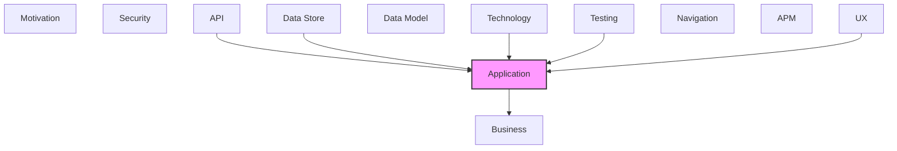

# Application

Application components, services, and interactions.

## Report Index

- [Layer Introduction](#layer-introduction)
- [Intra-Layer Relationships](#intra-layer-relationships)
- [Inter-Layer Dependencies](#inter-layer-dependencies)
- [Inter-Layer Relationships Table](#inter-layer-relationships-table)
- [Element Reference](#element-reference)

## Layer Introduction

| Metric                    | Count |
| ------------------------- | ----- |
| Elements                  | 40    |
| Intra-Layer Relationships | 55    |
| Inter-Layer Relationships | 155   |
| Inbound Relationships     | 151   |
| Outbound Relationships    | 4     |

**Cross-Layer References**:

- **Upstream layers**: [API](./06-api-layer-report.md), [Data Store](./08-data-store-layer-report.md), [Technology](./05-technology-layer-report.md), [Testing](./12-testing-layer-report.md), [UX](./09-ux-layer-report.md)
- **Downstream layers**: [Business](./02-business-layer-report.md)

## Intra-Layer Relationships

*This layer has >30 elements. Summary table shown instead of diagram.*

| Element                                                                   | Type                   | Relationships |
| ------------------------------------------------------------------------- | ---------------------- | ------------- |
| `application.applicationcomponent.anthropic-llm-provider`                 | `applicationcomponent` | 1             |
| `application.applicationcomponent.cached-reference-source`                | `applicationcomponent` | 1             |
| `application.applicationcomponent.change-event-recorder`                  | `applicationcomponent` | 1             |
| `application.applicationcomponent.concept-net-reference-source`           | `applicationcomponent` | 1             |
| `application.applicationcomponent.dbpedia-reference-source`               | `applicationcomponent` | 1             |
| `application.applicationcomponent.duck-db-sync-adapter`                   | `applicationcomponent` | 1             |
| `application.applicationcomponent.graph-ml-interchange-adapter`           | `applicationcomponent` | 1             |
| `application.applicationcomponent.in-process-event-publisher`             | `applicationcomponent` | 2             |
| `application.applicationcomponent.json-file-config-store`                 | `applicationcomponent` | 1             |
| `application.applicationcomponent.llm-provider-router`                    | `applicationcomponent` | 3             |
| `application.applicationcomponent.local-reference-repository`             | `applicationcomponent` | 1             |
| `application.applicationcomponent.network-x-graph-engine-adapter`         | `applicationcomponent` | 3             |
| `application.applicationcomponent.no-op-sync-adapter`                     | `applicationcomponent` | 1             |
| `application.applicationcomponent.open-ai-llm-provider`                   | `applicationcomponent` | 1             |
| `application.applicationcomponent.owl-interchange-adapter`                | `applicationcomponent` | 1             |
| `application.applicationcomponent.rdflib-query-engine-adapter`            | `applicationcomponent` | 1             |
| `application.applicationcomponent.s3-sync-adapter`                        | `applicationcomponent` | 1             |
| `application.applicationcomponent.schema-org-reference-source`            | `applicationcomponent` | 1             |
| `application.applicationcomponent.sentence-transformer-embedding-adapter` | `applicationcomponent` | 2             |
| `application.applicationcomponent.skos-interchange-adapter`               | `applicationcomponent` | 1             |
| `application.applicationcomponent.spa-cy-nlp-processor`                   | `applicationcomponent` | 1             |
| `application.applicationcomponent.sqlite-change-repository`               | `applicationcomponent` | 1             |
| `application.applicationcomponent.sqlite-extraction-repository`           | `applicationcomponent` | 1             |
| `application.applicationcomponent.sqlite-interchange-repository`          | `applicationcomponent` | 1             |
| `application.applicationcomponent.sqlite-ontology-repository`             | `applicationcomponent` | 1             |
| `application.applicationcomponent.sqlite-persistence-adapter`             | `applicationcomponent` | 2             |
| `application.applicationcomponent.sqlite-pipeline-repository`             | `applicationcomponent` | 1             |
| `application.applicationcomponent.system-metrics-collector-adapter`       | `applicationcomponent` | 1             |
| `application.applicationcomponent.wikidata-reference-source`              | `applicationcomponent` | 1             |
| `application.applicationfunction.embedding-generation`                    | `applicationfunction`  | 2             |
| `application.applicationfunction.llm-provider-routing`                    | `applicationfunction`  | 2             |
| `application.applicationfunction.network-metrics-function`                | `applicationfunction`  | 2             |
| `application.applicationfunction.sparql-query-function`                   | `applicationfunction`  | 2             |
| `application.applicationservice.admin-service`                            | `applicationservice`   | 3             |
| `application.applicationservice.extraction-service`                       | `applicationservice`   | 18            |
| `application.applicationservice.graph-analysis-service`                   | `applicationservice`   | 8             |
| `application.applicationservice.import-run-service`                       | `applicationservice`   | 8             |
| `application.applicationservice.ontology-service`                         | `applicationservice`   | 14            |
| `application.applicationservice.pipeline-service`                         | `applicationservice`   | 6             |
| `application.applicationservice.versioning-service`                       | `applicationservice`   | 9             |

## Inter-Layer Dependencies

## Inter-Layer Relationships Table

| Relationship ID                                                      | Source Node                                                | Dest Node                                                                 | Dest Layer    | Predicate    | Cardinality  | Strength |
| -------------------------------------------------------------------- | ---------------------------------------------------------- | ------------------------------------------------------------------------- | ------------- | ------------ | ------------ | -------- |
| `api.operation.references.application.applicationservice`            | `api.operation.add-class-to-scheme`                        | `application.applicationservice.ontology-service`                         | `application` | `references` | many-to-many | medium   |
| `api.operation.references.application.applicationservice`            | `api.operation.add-parent-class-to-individual`             | `application.applicationservice.ontology-service`                         | `application` | `references` | many-to-many | medium   |
| `api.operation.references.application.applicationservice`            | `api.operation.analyze-text`                               | `application.applicationservice.extraction-service`                       | `application` | `references` | many-to-many | medium   |
| `api.operation.references.application.applicationservice`            | `api.operation.approve-proposal`                           | `application.applicationservice.versioning-service`                       | `application` | `references` | many-to-many | medium   |
| `api.operation.references.application.applicationservice`            | `api.operation.auto-resolve-conflicts`                     | `application.applicationservice.versioning-service`                       | `application` | `references` | many-to-many | medium   |
| `api.operation.references.application.applicationservice`            | `api.operation.build-graph`                                | `application.applicationservice.graph-analysis-service`                   | `application` | `references` | many-to-many | medium   |
| `api.operation.references.application.applicationservice`            | `api.operation.build-knowledge-graph`                      | `application.applicationservice.graph-analysis-service`                   | `application` | `references` | many-to-many | medium   |
| `api.operation.references.application.applicationservice`            | `api.operation.check-cycle`                                | `application.applicationservice.graph-analysis-service`                   | `application` | `references` | many-to-many | medium   |
| `api.operation.references.application.applicationservice`            | `api.operation.create-changeset`                           | `application.applicationservice.versioning-service`                       | `application` | `references` | many-to-many | medium   |
| `api.operation.references.application.applicationservice`            | `api.operation.create-class`                               | `application.applicationservice.ontology-service`                         | `application` | `references` | many-to-many | medium   |
| `api.operation.references.application.applicationservice`            | `api.operation.create-concept-scheme`                      | `application.applicationservice.ontology-service`                         | `application` | `references` | many-to-many | medium   |
| `api.operation.references.application.applicationservice`            | `api.operation.create-individual`                          | `application.applicationservice.ontology-service`                         | `application` | `references` | many-to-many | medium   |
| `api.operation.references.application.applicationservice`            | `api.operation.create-pipeline-configuration`              | `application.applicationservice.pipeline-service`                         | `application` | `references` | many-to-many | medium   |
| `api.operation.references.application.applicationservice`            | `api.operation.create-property-definition`                 | `application.applicationservice.ontology-service`                         | `application` | `references` | many-to-many | medium   |
| `api.operation.references.application.applicationservice`            | `api.operation.create-relationship`                        | `application.applicationservice.ontology-service`                         | `application` | `references` | many-to-many | medium   |
| `api.operation.references.application.applicationservice`            | `api.operation.create-taxonomy`                            | `application.applicationservice.ontology-service`                         | `application` | `references` | many-to-many | medium   |
| `api.operation.references.application.applicationservice`            | `api.operation.delete-class`                               | `application.applicationservice.ontology-service`                         | `application` | `references` | many-to-many | medium   |
| `api.operation.references.application.applicationservice`            | `api.operation.delete-concept-scheme`                      | `application.applicationservice.ontology-service`                         | `application` | `references` | many-to-many | medium   |
| `api.operation.references.application.applicationservice`            | `api.operation.delete-individual`                          | `application.applicationservice.ontology-service`                         | `application` | `references` | many-to-many | medium   |
| `api.operation.references.application.applicationservice`            | `api.operation.delete-pipeline-configuration`              | `application.applicationservice.pipeline-service`                         | `application` | `references` | many-to-many | medium   |
| `api.operation.references.application.applicationservice`            | `api.operation.delete-property-definition`                 | `application.applicationservice.ontology-service`                         | `application` | `references` | many-to-many | medium   |
| `api.operation.references.application.applicationservice`            | `api.operation.delete-relationship`                        | `application.applicationservice.ontology-service`                         | `application` | `references` | many-to-many | medium   |
| `api.operation.references.application.applicationservice`            | `api.operation.delete-taxonomy`                            | `application.applicationservice.ontology-service`                         | `application` | `references` | many-to-many | medium   |
| `api.operation.references.application.applicationservice`            | `api.operation.detect-conflicts`                           | `application.applicationservice.versioning-service`                       | `application` | `references` | many-to-many | medium   |
| `api.operation.references.application.applicationservice`            | `api.operation.enrich-from-references`                     | `application.applicationservice.extraction-service`                       | `application` | `references` | many-to-many | medium   |
| `api.operation.references.application.applicationservice`            | `api.operation.execute-pipeline`                           | `application.applicationservice.pipeline-service`                         | `application` | `references` | many-to-many | medium   |
| `api.operation.references.application.applicationservice`            | `api.operation.execute-sparql`                             | `application.applicationservice.graph-analysis-service`                   | `application` | `references` | many-to-many | medium   |
| `api.operation.references.application.applicationservice`            | `api.operation.export-ontology`                            | `application.applicationservice.import-run-service`                       | `application` | `references` | many-to-many | medium   |
| `api.operation.references.application.applicationservice`            | `api.operation.extract-entities`                           | `application.applicationservice.extraction-service`                       | `application` | `references` | many-to-many | medium   |
| `api.operation.references.application.applicationservice`            | `api.operation.get-all-paths`                              | `application.applicationservice.graph-analysis-service`                   | `application` | `references` | many-to-many | medium   |
| `api.operation.references.application.applicationservice`            | `api.operation.get-background-task`                        | `application.applicationservice.admin-service`                            | `application` | `references` | many-to-many | medium   |
| `api.operation.references.application.applicationservice`            | `api.operation.get-background-tasks-summary`               | `application.applicationservice.admin-service`                            | `application` | `references` | many-to-many | medium   |
| `api.operation.references.application.applicationservice`            | `api.operation.get-centrality`                             | `application.applicationservice.graph-analysis-service`                   | `application` | `references` | many-to-many | medium   |
| `api.operation.references.application.applicationservice`            | `api.operation.get-change-history-all`                     | `application.applicationservice.versioning-service`                       | `application` | `references` | many-to-many | medium   |
| `api.operation.references.application.applicationservice`            | `api.operation.get-change-history-by-entity`               | `application.applicationservice.versioning-service`                       | `application` | `references` | many-to-many | medium   |
| `api.operation.references.application.applicationservice`            | `api.operation.get-changeset`                              | `application.applicationservice.versioning-service`                       | `application` | `references` | many-to-many | medium   |
| `api.operation.references.application.applicationservice`            | `api.operation.get-class`                                  | `application.applicationservice.ontology-service`                         | `application` | `references` | many-to-many | medium   |
| `api.operation.references.application.applicationservice`            | `api.operation.get-communities`                            | `application.applicationservice.graph-analysis-service`                   | `application` | `references` | many-to-many | medium   |
| `api.operation.references.application.applicationservice`            | `api.operation.get-concept-scheme`                         | `application.applicationservice.ontology-service`                         | `application` | `references` | many-to-many | medium   |
| `api.operation.references.application.applicationservice`            | `api.operation.get-configuration`                          | `application.applicationservice.admin-service`                            | `application` | `references` | many-to-many | medium   |
| `api.operation.references.application.applicationservice`            | `api.operation.get-database-health`                        | `application.applicationservice.admin-service`                            | `application` | `references` | many-to-many | medium   |
| `api.operation.references.application.applicationservice`            | `api.operation.get-degree-distribution`                    | `application.applicationservice.graph-analysis-service`                   | `application` | `references` | many-to-many | medium   |
| `api.operation.references.application.applicationservice`            | `api.operation.get-embedding-health`                       | `application.applicationservice.admin-service`                            | `application` | `references` | many-to-many | medium   |
| `api.operation.references.application.applicationservice`            | `api.operation.get-entity-version`                         | `application.applicationservice.versioning-service`                       | `application` | `references` | many-to-many | medium   |
| `api.operation.references.application.applicationservice`            | `api.operation.get-graph-metrics`                          | `application.applicationservice.graph-analysis-service`                   | `application` | `references` | many-to-many | medium   |
| `api.operation.references.application.applicationservice`            | `api.operation.get-import-run`                             | `application.applicationservice.import-run-service`                       | `application` | `references` | many-to-many | medium   |
| `api.operation.references.application.applicationservice`            | `api.operation.get-individual-inherited-properties`        | `application.applicationservice.ontology-service`                         | `application` | `references` | many-to-many | medium   |
| `api.operation.references.application.applicationservice`            | `api.operation.get-individual`                             | `application.applicationservice.ontology-service`                         | `application` | `references` | many-to-many | medium   |
| `api.operation.references.application.applicationservice`            | `api.operation.get-neighbors`                              | `application.applicationservice.graph-analysis-service`                   | `application` | `references` | many-to-many | medium   |
| `api.operation.references.application.applicationservice`            | `api.operation.get-nlp-health`                             | `application.applicationservice.admin-service`                            | `application` | `references` | many-to-many | medium   |
| `api.operation.references.application.applicationservice`            | `api.operation.get-pipeline-configuration`                 | `application.applicationservice.pipeline-service`                         | `application` | `references` | many-to-many | medium   |
| `api.operation.references.application.applicationservice`            | `api.operation.get-pipeline-executions`                    | `application.applicationservice.pipeline-service`                         | `application` | `references` | many-to-many | medium   |
| `api.operation.references.application.applicationservice`            | `api.operation.get-property-definition`                    | `application.applicationservice.ontology-service`                         | `application` | `references` | many-to-many | medium   |
| `api.operation.references.application.applicationservice`            | `api.operation.get-rdf-triple-count`                       | `application.applicationservice.graph-analysis-service`                   | `application` | `references` | many-to-many | medium   |
| `api.operation.references.application.applicationservice`            | `api.operation.get-rdf-triples`                            | `application.applicationservice.graph-analysis-service`                   | `application` | `references` | many-to-many | medium   |
| `api.operation.references.application.applicationservice`            | `api.operation.get-reference-relations`                    | `application.applicationservice.extraction-service`                       | `application` | `references` | many-to-many | medium   |
| `api.operation.references.application.applicationservice`            | `api.operation.get-reference-status`                       | `application.applicationservice.extraction-service`                       | `application` | `references` | many-to-many | medium   |
| `api.operation.references.application.applicationservice`            | `api.operation.get-relationship`                           | `application.applicationservice.ontology-service`                         | `application` | `references` | many-to-many | medium   |
| `api.operation.references.application.applicationservice`            | `api.operation.get-run-change-events`                      | `application.applicationservice.import-run-service`                       | `application` | `references` | many-to-many | medium   |
| `api.operation.references.application.applicationservice`            | `api.operation.get-service-metrics`                        | `application.applicationservice.admin-service`                            | `application` | `references` | many-to-many | medium   |
| `api.operation.references.application.applicationservice`            | `api.operation.get-services-health`                        | `application.applicationservice.admin-service`                            | `application` | `references` | many-to-many | medium   |
| `api.operation.references.application.applicationservice`            | `api.operation.get-shortest-path`                          | `application.applicationservice.graph-analysis-service`                   | `application` | `references` | many-to-many | medium   |
| `api.operation.references.application.applicationservice`            | `api.operation.get-subgraph-by-depth`                      | `application.applicationservice.graph-analysis-service`                   | `application` | `references` | many-to-many | medium   |
| `api.operation.references.application.applicationservice`            | `api.operation.get-subgraph`                               | `application.applicationservice.graph-analysis-service`                   | `application` | `references` | many-to-many | medium   |
| `api.operation.references.application.applicationservice`            | `api.operation.get-sync-status`                            | `application.applicationservice.versioning-service`                       | `application` | `references` | many-to-many | medium   |
| `api.operation.references.application.applicationservice`            | `api.operation.get-system-health`                          | `application.applicationservice.admin-service`                            | `application` | `references` | many-to-many | medium   |
| `api.operation.references.application.applicationservice`            | `api.operation.get-tasks-health`                           | `application.applicationservice.admin-service`                            | `application` | `references` | many-to-many | medium   |
| `api.operation.references.application.applicationservice`            | `api.operation.get-taxonomy`                               | `application.applicationservice.ontology-service`                         | `application` | `references` | many-to-many | medium   |
| `api.operation.references.application.applicationservice`            | `api.operation.import-ontology`                            | `application.applicationservice.import-run-service`                       | `application` | `references` | many-to-many | medium   |
| `api.operation.references.application.applicationservice`            | `api.operation.list-background-tasks`                      | `application.applicationservice.admin-service`                            | `application` | `references` | many-to-many | medium   |
| `api.operation.references.application.applicationservice`            | `api.operation.list-classes`                               | `application.applicationservice.ontology-service`                         | `application` | `references` | many-to-many | medium   |
| `api.operation.references.application.applicationservice`            | `api.operation.list-concept-schemes`                       | `application.applicationservice.ontology-service`                         | `application` | `references` | many-to-many | medium   |
| `api.operation.references.application.applicationservice`            | `api.operation.list-entity-versions`                       | `application.applicationservice.versioning-service`                       | `application` | `references` | many-to-many | medium   |
| `api.operation.references.application.applicationservice`            | `api.operation.list-import-runs`                           | `application.applicationservice.import-run-service`                       | `application` | `references` | many-to-many | medium   |
| `api.operation.references.application.applicationservice`            | `api.operation.list-individuals`                           | `application.applicationservice.ontology-service`                         | `application` | `references` | many-to-many | medium   |
| `api.operation.references.application.applicationservice`            | `api.operation.list-pipeline-configurations`               | `application.applicationservice.pipeline-service`                         | `application` | `references` | many-to-many | medium   |
| `api.operation.references.application.applicationservice`            | `api.operation.list-property-definitions`                  | `application.applicationservice.ontology-service`                         | `application` | `references` | many-to-many | medium   |
| `api.operation.references.application.applicationservice`            | `api.operation.list-relationships`                         | `application.applicationservice.ontology-service`                         | `application` | `references` | many-to-many | medium   |
| `api.operation.references.application.applicationservice`            | `api.operation.list-taxonomies`                            | `application.applicationservice.ontology-service`                         | `application` | `references` | many-to-many | medium   |
| `api.operation.references.application.applicationservice`            | `api.operation.merge-proposal`                             | `application.applicationservice.versioning-service`                       | `application` | `references` | many-to-many | medium   |
| `api.operation.references.application.applicationservice`            | `api.operation.move-class`                                 | `application.applicationservice.ontology-service`                         | `application` | `references` | many-to-many | medium   |
| `api.operation.references.application.applicationservice`            | `api.operation.pull-changes`                               | `application.applicationservice.versioning-service`                       | `application` | `references` | many-to-many | medium   |
| `api.operation.references.application.applicationservice`            | `api.operation.push-changes`                               | `application.applicationservice.versioning-service`                       | `application` | `references` | many-to-many | medium   |
| `api.operation.references.application.applicationservice`            | `api.operation.reject-proposal`                            | `application.applicationservice.versioning-service`                       | `application` | `references` | many-to-many | medium   |
| `api.operation.references.application.applicationservice`            | `api.operation.remove-parent-class-from-individual`        | `application.applicationservice.ontology-service`                         | `application` | `references` | many-to-many | medium   |
| `api.operation.references.application.applicationservice`            | `api.operation.reorder-individual-classes`                 | `application.applicationservice.ontology-service`                         | `application` | `references` | many-to-many | medium   |
| `api.operation.references.application.applicationservice`            | `api.operation.reset-configuration`                        | `application.applicationservice.admin-service`                            | `application` | `references` | many-to-many | medium   |
| `api.operation.references.application.applicationservice`            | `api.operation.resolve-conflicts`                          | `application.applicationservice.versioning-service`                       | `application` | `references` | many-to-many | medium   |
| `api.operation.references.application.applicationservice`            | `api.operation.search-references`                          | `application.applicationservice.extraction-service`                       | `application` | `references` | many-to-many | medium   |
| `api.operation.references.application.applicationservice`            | `api.operation.stage-changeset`                            | `application.applicationservice.versioning-service`                       | `application` | `references` | many-to-many | medium   |
| `api.operation.references.application.applicationservice`            | `api.operation.submit-proposal`                            | `application.applicationservice.versioning-service`                       | `application` | `references` | many-to-many | medium   |
| `api.operation.references.application.applicationservice`            | `api.operation.update-class`                               | `application.applicationservice.ontology-service`                         | `application` | `references` | many-to-many | medium   |
| `api.operation.references.application.applicationservice`            | `api.operation.update-concept-scheme`                      | `application.applicationservice.ontology-service`                         | `application` | `references` | many-to-many | medium   |
| `api.operation.references.application.applicationservice`            | `api.operation.update-configuration-section`               | `application.applicationservice.admin-service`                            | `application` | `references` | many-to-many | medium   |
| `api.operation.references.application.applicationservice`            | `api.operation.update-individual`                          | `application.applicationservice.ontology-service`                         | `application` | `references` | many-to-many | medium   |
| `api.operation.references.application.applicationservice`            | `api.operation.update-pipeline-configuration`              | `application.applicationservice.pipeline-service`                         | `application` | `references` | many-to-many | medium   |
| `api.operation.references.application.applicationservice`            | `api.operation.update-property-definition`                 | `application.applicationservice.ontology-service`                         | `application` | `references` | many-to-many | medium   |
| `api.operation.references.application.applicationservice`            | `api.operation.update-taxonomy`                            | `application.applicationservice.ontology-service`                         | `application` | `references` | many-to-many | medium   |
| `application.applicationfunction.realizes.business.businessfunction` | `application.applicationfunction.embedding-generation`     | `business.businessfunction.entity-enrichment`                             | `business`    | `realizes`   | many-to-many | medium   |
| `application.applicationfunction.realizes.business.businessfunction` | `application.applicationfunction.llm-provider-routing`     | `business.businessfunction.entity-enrichment`                             | `business`    | `realizes`   | many-to-many | medium   |
| `application.applicationfunction.realizes.business.businessfunction` | `application.applicationfunction.network-metrics-function` | `business.businessfunction.semantic-search`                               | `business`    | `realizes`   | many-to-many | medium   |
| `application.applicationfunction.realizes.business.businessfunction` | `application.applicationfunction.sparql-query-function`    | `business.businessfunction.semantic-search`                               | `business`    | `realizes`   | many-to-many | medium   |
| `data-store.accesspattern.serves.application.applicationfunction`    | `data-store.accesspattern.entity-by-parent-range-scan`     | `application.applicationfunction.sparql-query-function`                   | `application` | `serves`     | many-to-many | medium   |
| `data-store.accesspattern.serves.application.applicationfunction`    | `data-store.accesspattern.vector-similarity-search`        | `application.applicationfunction.embedding-generation`                    | `application` | `serves`     | many-to-many | medium   |
| `data-store.collection.serves.application.applicationcomponent`      | `data-store.collection.change-events`                      | `application.applicationcomponent.sqlite-change-repository`               | `application` | `serves`     | many-to-many | medium   |
| `data-store.collection.serves.application.applicationcomponent`      | `data-store.collection.changeset-events-table`             | `application.applicationcomponent.sqlite-change-repository`               | `application` | `serves`     | many-to-many | medium   |
| `data-store.collection.serves.application.applicationcomponent`      | `data-store.collection.changesets-table`                   | `application.applicationcomponent.sqlite-change-repository`               | `application` | `serves`     | many-to-many | medium   |
| `data-store.collection.serves.application.applicationcomponent`      | `data-store.collection.conflict-resolutions-table`         | `application.applicationcomponent.sqlite-change-repository`               | `application` | `serves`     | many-to-many | medium   |
| `data-store.collection.serves.application.applicationcomponent`      | `data-store.collection.entity-versions-table`              | `application.applicationcomponent.sqlite-change-repository`               | `application` | `serves`     | many-to-many | medium   |
| `data-store.collection.serves.application.applicationcomponent`      | `data-store.collection.extraction-results-table`           | `application.applicationcomponent.sqlite-extraction-repository`           | `application` | `serves`     | many-to-many | medium   |
| `data-store.collection.serves.application.applicationcomponent`      | `data-store.collection.import-runs-table`                  | `application.applicationcomponent.sqlite-interchange-repository`          | `application` | `serves`     | many-to-many | medium   |
| `data-store.collection.serves.application.applicationcomponent`      | `data-store.collection.individual-classes-table`           | `application.applicationcomponent.sqlite-ontology-repository`             | `application` | `serves`     | many-to-many | medium   |
| `data-store.collection.serves.application.applicationcomponent`      | `data-store.collection.ontology-entities`                  | `application.applicationcomponent.sqlite-ontology-repository`             | `application` | `serves`     | many-to-many | medium   |
| `data-store.collection.serves.application.applicationcomponent`      | `data-store.collection.pipeline-configurations-table`      | `application.applicationcomponent.sqlite-pipeline-repository`             | `application` | `serves`     | many-to-many | medium   |
| `data-store.collection.serves.application.applicationcomponent`      | `data-store.collection.pipeline-executions-table`          | `application.applicationcomponent.sqlite-pipeline-repository`             | `application` | `serves`     | many-to-many | medium   |
| `data-store.collection.serves.application.applicationcomponent`      | `data-store.collection.property-definitions-table`         | `application.applicationcomponent.sqlite-ontology-repository`             | `application` | `serves`     | many-to-many | medium   |
| `data-store.collection.serves.application.applicationcomponent`      | `data-store.collection.proposals-table`                    | `application.applicationcomponent.sqlite-change-repository`               | `application` | `serves`     | many-to-many | medium   |
| `data-store.database.serves.application.applicationcomponent`        | `data-store.database.operationsdb`                         | `application.applicationcomponent.sqlite-pipeline-repository`             | `application` | `serves`     | many-to-many | medium   |
| `data-store.database.serves.application.applicationcomponent`        | `data-store.database.reference-api-cachedb`                | `application.applicationcomponent.cached-reference-source`                | `application` | `serves`     | many-to-many | medium   |
| `data-store.database.serves.application.applicationcomponent`        | `data-store.database.referencedb`                          | `application.applicationcomponent.local-reference-repository`             | `application` | `serves`     | many-to-many | medium   |
| `data-store.storedlogic.implements.application.applicationfunction`  | `data-store.storedlogic.sqlite-vec-cosine-similarity`      | `application.applicationfunction.embedding-generation`                    | `application` | `implements` | many-to-many | medium   |
| `data-store.storedlogic.serves.application.applicationservice`       | `data-store.storedlogic.sqlite-vec-cosine-similarity`      | `application.applicationservice.extraction-service`                       | `application` | `serves`     | many-to-many | medium   |
| `technology.systemsoftware.serves.application.applicationcomponent`  | `technology.systemsoftware.alembic`                        | `application.applicationcomponent.sqlite-persistence-adapter`             | `application` | `serves`     | many-to-many | medium   |
| `technology.systemsoftware.realizes.application.applicationservice`  | `technology.systemsoftware.duck-db`                        | `application.applicationservice.versioning-service`                       | `application` | `realizes`   | many-to-many | medium   |
| `technology.systemsoftware.realizes.application.applicationservice`  | `technology.systemsoftware.fast-api`                       | `application.applicationservice.ontology-service`                         | `application` | `realizes`   | many-to-many | medium   |
| `technology.systemsoftware.serves.application.applicationcomponent`  | `technology.systemsoftware.fast-api`                       | `application.applicationcomponent.sqlite-persistence-adapter`             | `application` | `serves`     | many-to-many | medium   |
| `technology.systemsoftware.serves.application.applicationcomponent`  | `technology.systemsoftware.network-x`                      | `application.applicationcomponent.network-x-graph-engine-adapter`         | `application` | `serves`     | many-to-many | medium   |
| `technology.systemsoftware.realizes.application.applicationservice`  | `technology.systemsoftware.pydantic`                       | `application.applicationservice.ontology-service`                         | `application` | `realizes`   | many-to-many | medium   |
| `technology.systemsoftware.realizes.application.applicationservice`  | `technology.systemsoftware.python`                         | `application.applicationservice.admin-service`                            | `application` | `realizes`   | many-to-many | medium   |
| `technology.systemsoftware.realizes.application.applicationservice`  | `technology.systemsoftware.python`                         | `application.applicationservice.ontology-service`                         | `application` | `realizes`   | many-to-many | medium   |
| `technology.systemsoftware.realizes.application.applicationservice`  | `technology.systemsoftware.python`                         | `application.applicationservice.pipeline-service`                         | `application` | `realizes`   | many-to-many | medium   |
| `technology.systemsoftware.realizes.application.applicationservice`  | `technology.systemsoftware.python`                         | `application.applicationservice.versioning-service`                       | `application` | `realizes`   | many-to-many | medium   |
| `technology.systemsoftware.realizes.application.applicationservice`  | `technology.systemsoftware.rdflib`                         | `application.applicationservice.graph-analysis-service`                   | `application` | `realizes`   | many-to-many | medium   |
| `technology.systemsoftware.realizes.application.applicationservice`  | `technology.systemsoftware.react`                          | `application.applicationservice.admin-service`                            | `application` | `realizes`   | many-to-many | medium   |
| `technology.systemsoftware.realizes.application.applicationservice`  | `technology.systemsoftware.sentence-transformers`          | `application.applicationservice.extraction-service`                       | `application` | `realizes`   | many-to-many | medium   |
| `technology.systemsoftware.serves.application.applicationcomponent`  | `technology.systemsoftware.sentence-transformers`          | `application.applicationcomponent.sentence-transformer-embedding-adapter` | `application` | `serves`     | many-to-many | medium   |
| `technology.systemsoftware.realizes.application.applicationservice`  | `technology.systemsoftware.spa-cy`                         | `application.applicationservice.extraction-service`                       | `application` | `realizes`   | many-to-many | medium   |
| `technology.systemsoftware.serves.application.applicationcomponent`  | `technology.systemsoftware.spa-cy`                         | `application.applicationcomponent.sentence-transformer-embedding-adapter` | `application` | `serves`     | many-to-many | medium   |
| `technology.systemsoftware.serves.application.applicationcomponent`  | `technology.systemsoftware.sqlalchemy`                     | `application.applicationcomponent.sqlite-persistence-adapter`             | `application` | `serves`     | many-to-many | medium   |
| `technology.systemsoftware.realizes.application.applicationservice`  | `technology.systemsoftware.tan-stack-query`                | `application.applicationservice.admin-service`                            | `application` | `realizes`   | many-to-many | medium   |
| `technology.systemsoftware.realizes.application.applicationservice`  | `technology.systemsoftware.tan-stack-router`               | `application.applicationservice.admin-service`                            | `application` | `realizes`   | many-to-many | medium   |
| `testing.testcoveragetarget.tests.application.applicationcomponent`  | `testing.testcoveragetarget.interchange-integration-tests` | `application.applicationcomponent.sqlite-interchange-repository`          | `application` | `tests`      | many-to-many | medium   |
| `testing.testcoveragetarget.tests.application.applicationcomponent`  | `testing.testcoveragetarget.route-integration-tests`       | `application.applicationcomponent.sqlite-ontology-repository`             | `application` | `tests`      | many-to-many | medium   |
| `testing.testcoveragetarget.tests.application.applicationcomponent`  | `testing.testcoveragetarget.versioning-integration-tests`  | `application.applicationcomponent.sqlite-change-repository`               | `application` | `tests`      | many-to-many | medium   |
| `ux.view.serves.application.applicationservice`                      | `ux.view.admin-view`                                       | `application.applicationservice.admin-service`                            | `application` | `serves`     | many-to-many | medium   |
| `ux.view.serves.application.applicationservice`                      | `ux.view.classes-view`                                     | `application.applicationservice.ontology-service`                         | `application` | `serves`     | many-to-many | medium   |
| `ux.view.serves.application.applicationservice`                      | `ux.view.concept-schemes-view`                             | `application.applicationservice.ontology-service`                         | `application` | `serves`     | many-to-many | medium   |
| `ux.view.serves.application.applicationservice`                      | `ux.view.configuration-view`                               | `application.applicationservice.admin-service`                            | `application` | `serves`     | many-to-many | medium   |
| `ux.view.serves.application.applicationservice`                      | `ux.view.datasets-view`                                    | `application.applicationservice.ontology-service`                         | `application` | `serves`     | many-to-many | medium   |
| `ux.view.serves.application.applicationservice`                      | `ux.view.individuals-view`                                 | `application.applicationservice.ontology-service`                         | `application` | `serves`     | many-to-many | medium   |
| `ux.view.serves.application.applicationservice`                      | `ux.view.interchange-view`                                 | `application.applicationservice.import-run-service`                       | `application` | `serves`     | many-to-many | medium   |
| `ux.view.serves.application.applicationservice`                      | `ux.view.properties-view`                                  | `application.applicationservice.ontology-service`                         | `application` | `serves`     | many-to-many | medium   |
| `ux.view.serves.application.applicationservice`                      | `ux.view.rag-experiments-view`                             | `application.applicationservice.extraction-service`                       | `application` | `serves`     | many-to-many | medium   |
| `ux.view.serves.application.applicationservice`                      | `ux.view.relationships-view`                               | `application.applicationservice.ontology-service`                         | `application` | `serves`     | many-to-many | medium   |
| `ux.view.serves.application.applicationservice`                      | `ux.view.taxonomies-view`                                  | `application.applicationservice.ontology-service`                         | `application` | `serves`     | many-to-many | medium   |

## Element Reference

### Anthropic LLM Provider {#anthropic-llm-provider}

**ID**: `application.applicationcomponent.anthropic-llm-provider`

**Type**: `applicationcomponent`

LLM provider for Anthropic Claude models (Opus, Sonnet, Haiku) — implements the LLMProvider protocol to provide access to Anthropic's API for knowledge extraction and pipeline tasks

#### Attributes

| Name | Value             |
| ---- | ----------------- |
| type | service-component |

#### Relationships

| Type        | Related Element                                     | Predicate  | Direction |
| ----------- | --------------------------------------------------- | ---------- | --------- |
| intra-layer | `application.applicationservice.extraction-service` | `realizes` | outbound  |

### Cached Reference Source {#cached-reference-source}

**ID**: `application.applicationcomponent.cached-reference-source`

**Type**: `applicationcomponent`

Decorator that wraps a ReferenceSource and caches results to SQLite — provides TTL-based expiry ensuring stale data is refreshed while improving efficiency when querying the same terms repeatedly

#### Attributes

| Name | Value             |
| ---- | ----------------- |
| type | service-component |

#### Relationships

| Type        | Related Element                                     | Predicate  | Direction |
| ----------- | --------------------------------------------------- | ---------- | --------- |
| inter-layer | `data-store.database.reference-api-cachedb`         | `serves`   | inbound   |
| intra-layer | `application.applicationservice.extraction-service` | `realizes` | outbound  |

### Change Event Recorder {#change-event-recorder}

**ID**: `application.applicationcomponent.change-event-recorder`

**Type**: `applicationcomponent`

Records domain events to the change audit trail — subscribes to domain events and persists them as change records using a change record port, registered with the event publisher during application startup

#### Attributes

| Name | Value             |
| ---- | ----------------- |
| type | service-component |

#### Relationships

| Type        | Related Element                                   | Predicate  | Direction |
| ----------- | ------------------------------------------------- | ---------- | --------- |
| intra-layer | `application.applicationservice.ontology-service` | `realizes` | outbound  |

### ConceptNet Reference Source {#conceptnet-reference-source}

**ID**: `application.applicationcomponent.concept-net-reference-source`

**Type**: `applicationcomponent`

Infrastructure adapter fetching semantic relation data from the ConceptNet knowledge graph API for ontology enrichment

#### Attributes

| Name | Value             |
| ---- | ----------------- |
| type | service-component |

#### Relationships

| Type        | Related Element                                     | Predicate  | Direction |
| ----------- | --------------------------------------------------- | ---------- | --------- |
| intra-layer | `application.applicationservice.extraction-service` | `realizes` | outbound  |

### DBpedia Reference Source {#dbpedia-reference-source}

**ID**: `application.applicationcomponent.dbpedia-reference-source`

**Type**: `applicationcomponent`

Infrastructure adapter fetching entity data from DBpedia SPARQL endpoint for ontology enrichment

#### Attributes

| Name | Value             |
| ---- | ----------------- |
| type | service-component |

#### Relationships

| Type        | Related Element                                     | Predicate  | Direction |
| ----------- | --------------------------------------------------- | ---------- | --------- |
| intra-layer | `application.applicationservice.extraction-service` | `realizes` | outbound  |

### DuckDB Sync Adapter {#duckdb-sync-adapter}

**ID**: `application.applicationcomponent.duck-db-sync-adapter`

**Type**: `applicationcomponent`

Infrastructure adapter implementing remote sync via DuckDB and Parquet files — provides efficient columnar snapshot-based synchronization

#### Attributes

| Name | Value             |
| ---- | ----------------- |
| type | service-component |

#### Relationships

| Type        | Related Element                                     | Predicate  | Direction |
| ----------- | --------------------------------------------------- | ---------- | --------- |
| intra-layer | `application.applicationservice.versioning-service` | `realizes` | outbound  |

### GraphML Interchange Adapter {#graphml-interchange-adapter}

**ID**: `application.applicationcomponent.graph-ml-interchange-adapter`

**Type**: `applicationcomponent`

Infrastructure adapter implementing GraphML serialization and deserialization for graph-structured ontology import/export

#### Attributes

| Name | Value             |
| ---- | ----------------- |
| type | service-component |

#### Relationships

| Type        | Related Element                                     | Predicate  | Direction |
| ----------- | --------------------------------------------------- | ---------- | --------- |
| intra-layer | `application.applicationservice.import-run-service` | `realizes` | outbound  |

### In-Process Event Publisher {#in-process-event-publisher}

**ID**: `application.applicationcomponent.in-process-event-publisher`

**Type**: `applicationcomponent`

In-process event publisher using the observer pattern — handlers execute synchronously within the same transaction boundary, implementing the EventPublisher port for local single-process deployments with isolated exception handling to prevent cascade failures

#### Attributes

| Name | Value             |
| ---- | ----------------- |
| type | service-component |

#### Relationships

| Type        | Related Element                                     | Predicate  | Direction |
| ----------- | --------------------------------------------------- | ---------- | --------- |
| intra-layer | `application.applicationservice.extraction-service` | `realizes` | outbound  |
| intra-layer | `application.applicationservice.ontology-service`   | `realizes` | outbound  |

### JSON File Config Store {#json-file-config-store}

**ID**: `application.applicationcomponent.json-file-config-store`

**Type**: `applicationcomponent`

Wraps ConfigurationManager to implement the ConfigurationStore port — converts Pydantic Settings objects to plain dicts for the domain entity, maintaining separation between infrastructure and domain logic

#### Attributes

| Name | Value             |
| ---- | ----------------- |
| type | service-component |

#### Relationships

| Type        | Related Element                                | Predicate  | Direction |
| ----------- | ---------------------------------------------- | ---------- | --------- |
| intra-layer | `application.applicationservice.admin-service` | `realizes` | outbound  |

### LLM Provider Router {#llm-provider-router}

**ID**: `application.applicationcomponent.llm-provider-router`

**Type**: `applicationcomponent`

Infrastructure adapter routing LLM completion requests to the appropriate provider — selects between OpenAI and Anthropic providers based on pipeline configuration and exposes available provider list for health checks

#### Attributes

| Name | Value             |
| ---- | ----------------- |
| type | service-component |

#### Relationships

| Type        | Related Element                                               | Predicate  | Direction |
| ----------- | ------------------------------------------------------------- | ---------- | --------- |
| intra-layer | `application.applicationfunction.llm-provider-routing`        | `composes` | outbound  |
| intra-layer | `application.applicationservice.pipeline-service`             | `realizes` | outbound  |
| intra-layer | `application.applicationcomponent.sqlite-persistence-adapter` | `uses`     | inbound   |

### Local Reference Repository {#local-reference-repository}

**ID**: `application.applicationcomponent.local-reference-repository`

**Type**: `applicationcomponent`

Repository for offline reference data lookups — queries pre-imported reference.db to provide fast offline access to reference data from ConceptNet, DBpedia, Wikidata, and schema.org

#### Attributes

| Name | Value             |
| ---- | ----------------- |
| type | service-component |

#### Relationships

| Type        | Related Element                                     | Predicate  | Direction |
| ----------- | --------------------------------------------------- | ---------- | --------- |
| inter-layer | `data-store.database.referencedb`                   | `serves`   | inbound   |
| intra-layer | `application.applicationservice.extraction-service` | `realizes` | outbound  |

### NetworkX Graph Engine Adapter {#networkx-graph-engine-adapter}

**ID**: `application.applicationcomponent.network-x-graph-engine-adapter`

**Type**: `applicationcomponent`

Infrastructure adapter implementing the GraphEngine port using NetworkX DiGraph — supports directed graph construction, shortest/all paths, centrality algorithms (betweenness, pagerank, closeness, degree), community detection, and subgraph extraction

#### Attributes

| Name | Value             |
| ---- | ----------------- |
| type | service-component |

#### Relationships

| Type        | Related Element                                            | Predicate  | Direction |
| ----------- | ---------------------------------------------------------- | ---------- | --------- |
| inter-layer | `technology.systemsoftware.network-x`                      | `serves`   | inbound   |
| intra-layer | `application.applicationfunction.network-metrics-function` | `composes` | outbound  |
| intra-layer | `application.applicationfunction.sparql-query-function`    | `composes` | outbound  |
| intra-layer | `application.applicationservice.graph-analysis-service`    | `realizes` | outbound  |

### No-Op Sync Adapter {#no-op-sync-adapter}

**ID**: `application.applicationcomponent.no-op-sync-adapter`

**Type**: `applicationcomponent`

No-op implementation of the SyncTarget port — used when remote synchronization is not configured, all operations succeed without side effects allowing the versioning system to function normally in single-workspace scenarios

#### Attributes

| Name | Value             |
| ---- | ----------------- |
| type | service-component |

#### Relationships

| Type        | Related Element                                     | Predicate  | Direction |
| ----------- | --------------------------------------------------- | ---------- | --------- |
| intra-layer | `application.applicationservice.versioning-service` | `realizes` | outbound  |

### OpenAI LLM Provider {#openai-llm-provider}

**ID**: `application.applicationcomponent.open-ai-llm-provider`

**Type**: `applicationcomponent`

LLM provider for OpenAI models (GPT-4o, GPT-4-turbo, GPT-3.5-turbo) — implements the LLMProvider protocol to provide access to OpenAI's API for knowledge extraction and pipeline tasks

#### Attributes

| Name | Value             |
| ---- | ----------------- |
| type | service-component |

#### Relationships

| Type        | Related Element                                     | Predicate  | Direction |
| ----------- | --------------------------------------------------- | ---------- | --------- |
| intra-layer | `application.applicationservice.extraction-service` | `realizes` | outbound  |

### OWL Interchange Adapter {#owl-interchange-adapter}

**ID**: `application.applicationcomponent.owl-interchange-adapter`

**Type**: `applicationcomponent`

Infrastructure adapter implementing OWL (Web Ontology Language) serialization and deserialization for ontology round-trip import/export

#### Attributes

| Name | Value             |
| ---- | ----------------- |
| type | service-component |

#### Relationships

| Type        | Related Element                                     | Predicate  | Direction |
| ----------- | --------------------------------------------------- | ---------- | --------- |
| intra-layer | `application.applicationservice.import-run-service` | `realizes` | outbound  |

### RDFLib Query Engine Adapter {#rdflib-query-engine-adapter}

**ID**: `application.applicationcomponent.rdflib-query-engine-adapter`

**Type**: `applicationcomponent`

Semantic query engine implementation using RDFLib for RDF/SPARQL operations — provides the SemanticQueryEngine protocol interface via an RDFLib in-memory graph supporting SPARQL queries with validation

#### Attributes

| Name | Value             |
| ---- | ----------------- |
| type | service-component |

#### Relationships

| Type        | Related Element                                         | Predicate  | Direction |
| ----------- | ------------------------------------------------------- | ---------- | --------- |
| intra-layer | `application.applicationservice.graph-analysis-service` | `realizes` | outbound  |

### S3 Sync Adapter {#s3-sync-adapter}

**ID**: `application.applicationcomponent.s3-sync-adapter`

**Type**: `applicationcomponent`

Infrastructure adapter implementing remote sync via AWS S3 — pushes and pulls Parquet snapshots for cross-device ontology synchronization

#### Attributes

| Name | Value             |
| ---- | ----------------- |
| type | service-component |

#### Relationships

| Type        | Related Element                                     | Predicate  | Direction |
| ----------- | --------------------------------------------------- | ---------- | --------- |
| intra-layer | `application.applicationservice.versioning-service` | `realizes` | outbound  |

### Schema Org Reference Source {#schema-org-reference-source}

**ID**: `application.applicationcomponent.schema-org-reference-source`

**Type**: `applicationcomponent`

Infrastructure adapter fetching type and property definitions from schema.org vocabulary for ontology enrichment

#### Attributes

| Name | Value             |
| ---- | ----------------- |
| type | service-component |

#### Relationships

| Type        | Related Element                                     | Predicate  | Direction |
| ----------- | --------------------------------------------------- | ---------- | --------- |
| intra-layer | `application.applicationservice.extraction-service` | `realizes` | outbound  |

### Sentence Transformer Embedding Adapter {#sentence-transformer-embedding-adapter}

**ID**: `application.applicationcomponent.sentence-transformer-embedding-adapter`

**Type**: `applicationcomponent`

Infrastructure adapter wrapping the sentence-transformers library — provides lazy-loaded semantic embedding generation (all-MiniLM-L12-v2) with sync and async interfaces for single and batch text encoding

#### Attributes

| Name | Value             |
| ---- | ----------------- |
| type | service-component |

#### Relationships

| Type        | Related Element                                        | Predicate  | Direction |
| ----------- | ------------------------------------------------------ | ---------- | --------- |
| inter-layer | `technology.systemsoftware.sentence-transformers`      | `serves`   | inbound   |
| inter-layer | `technology.systemsoftware.spa-cy`                     | `serves`   | inbound   |
| intra-layer | `application.applicationfunction.embedding-generation` | `composes` | outbound  |
| intra-layer | `application.applicationservice.extraction-service`    | `realizes` | outbound  |

### SKOS Interchange Adapter {#skos-interchange-adapter}

**ID**: `application.applicationcomponent.skos-interchange-adapter`

**Type**: `applicationcomponent`

Infrastructure adapter implementing SKOS (Simple Knowledge Organization System) serialization and deserialization for ontology round-trip import/export in Turtle/RDF format

#### Attributes

| Name | Value             |
| ---- | ----------------- |
| type | service-component |

#### Relationships

| Type        | Related Element                                     | Predicate  | Direction |
| ----------- | --------------------------------------------------- | ---------- | --------- |
| intra-layer | `application.applicationservice.import-run-service` | `realizes` | outbound  |

### SpaCy NLP Processor {#spacy-nlp-processor}

**ID**: `application.applicationcomponent.spa-cy-nlp-processor`

**Type**: `applicationcomponent`

Infrastructure adapter implementing NLP text processing using spaCy — performs named entity recognition, dependency parsing, and concept extraction

#### Attributes

| Name | Value             |
| ---- | ----------------- |
| type | service-component |

#### Relationships

| Type        | Related Element                                     | Predicate  | Direction |
| ----------- | --------------------------------------------------- | ---------- | --------- |
| intra-layer | `application.applicationservice.extraction-service` | `realizes` | outbound  |

### SQLite Change Repository {#sqlite-change-repository}

**ID**: `application.applicationcomponent.sqlite-change-repository`

**Type**: `applicationcomponent`

SQLAlchemy-based repository for persisting versioning domain entities — implements the ChangeRepository protocol handling persistence of change events, entity versions, changesets, and proposals to SQLite

#### Attributes

| Name | Value    |
| ---- | -------- |
| type | internal |

#### Relationships

| Type        | Related Element                                           | Predicate  | Direction |
| ----------- | --------------------------------------------------------- | ---------- | --------- |
| inter-layer | `data-store.collection.change-events`                     | `serves`   | inbound   |
| inter-layer | `data-store.collection.changeset-events-table`            | `serves`   | inbound   |
| inter-layer | `data-store.collection.changesets-table`                  | `serves`   | inbound   |
| inter-layer | `data-store.collection.conflict-resolutions-table`        | `serves`   | inbound   |
| inter-layer | `data-store.collection.entity-versions-table`             | `serves`   | inbound   |
| inter-layer | `data-store.collection.proposals-table`                   | `serves`   | inbound   |
| inter-layer | `testing.testcoveragetarget.versioning-integration-tests` | `tests`    | inbound   |
| intra-layer | `application.applicationservice.versioning-service`       | `realizes` | outbound  |

### SQLite Extraction Repository {#sqlite-extraction-repository}

**ID**: `application.applicationcomponent.sqlite-extraction-repository`

**Type**: `applicationcomponent`

SQLAlchemy-based implementation of the ExtractionRepository port — manages persistence of extraction results using SQLAlchemy ORM with full entity and layer execution metadata

#### Attributes

| Name | Value    |
| ---- | -------- |
| type | internal |

#### Relationships

| Type        | Related Element                                     | Predicate  | Direction |
| ----------- | --------------------------------------------------- | ---------- | --------- |
| inter-layer | `data-store.collection.extraction-results-table`    | `serves`   | inbound   |
| intra-layer | `application.applicationservice.extraction-service` | `realizes` | outbound  |

### SQLite Interchange Repository {#sqlite-interchange-repository}

**ID**: `application.applicationcomponent.sqlite-interchange-repository`

**Type**: `applicationcomponent`

SQLAlchemy-based repository for interchange domain persistence — implements the ImportRunRepository port handling persistence of ImportRun entities and their change event correlations using SQLite

#### Attributes

| Name | Value    |
| ---- | -------- |
| type | internal |

#### Relationships

| Type        | Related Element                                            | Predicate  | Direction |
| ----------- | ---------------------------------------------------------- | ---------- | --------- |
| inter-layer | `data-store.collection.import-runs-table`                  | `serves`   | inbound   |
| inter-layer | `testing.testcoveragetarget.interchange-integration-tests` | `tests`    | inbound   |
| intra-layer | `application.applicationservice.import-run-service`        | `realizes` | outbound  |

### SQLite Ontology Repository {#sqlite-ontology-repository}

**ID**: `application.applicationcomponent.sqlite-ontology-repository`

**Type**: `applicationcomponent`

SQLAlchemy-based implementation of the OntologyRepository port — manages persistence of all ontology entities using a unified single-table inheritance pattern with node_type discriminator, enforcing invariants and maintaining referential integrity

#### Attributes

| Name | Value    |
| ---- | -------- |
| type | internal |

#### Relationships

| Type        | Related Element                                      | Predicate  | Direction |
| ----------- | ---------------------------------------------------- | ---------- | --------- |
| inter-layer | `data-store.collection.individual-classes-table`     | `serves`   | inbound   |
| inter-layer | `data-store.collection.ontology-entities`            | `serves`   | inbound   |
| inter-layer | `data-store.collection.property-definitions-table`   | `serves`   | inbound   |
| inter-layer | `testing.testcoveragetarget.route-integration-tests` | `tests`    | inbound   |
| intra-layer | `application.applicationservice.ontology-service`    | `realizes` | outbound  |

### SQLite Persistence Adapter {#sqlite-persistence-adapter}

**ID**: `application.applicationcomponent.sqlite-persistence-adapter`

**Type**: `applicationcomponent`

Infrastructure adapter implementing repository ports via SQLAlchemy — persists ontology entities, relationships, change events, changesets, proposals, and extraction results to local.db using single-table inheritance ORM model

#### Attributes

| Name | Value    |
| ---- | -------- |
| type | internal |

#### Relationships

| Type        | Related Element                                        | Predicate  | Direction |
| ----------- | ------------------------------------------------------ | ---------- | --------- |
| inter-layer | `technology.systemsoftware.alembic`                    | `serves`   | inbound   |
| inter-layer | `technology.systemsoftware.fast-api`                   | `serves`   | inbound   |
| inter-layer | `technology.systemsoftware.sqlalchemy`                 | `serves`   | inbound   |
| intra-layer | `application.applicationservice.ontology-service`      | `realizes` | outbound  |
| intra-layer | `application.applicationcomponent.llm-provider-router` | `uses`     | outbound  |

### SQLite Pipeline Repository {#sqlite-pipeline-repository}

**ID**: `application.applicationcomponent.sqlite-pipeline-repository`

**Type**: `applicationcomponent`

SQLite implementation of the PipelineRepository port for operations.db — manages persistence of pipeline configurations and execution records with complete instrumentation for observability

#### Attributes

| Name | Value    |
| ---- | -------- |
| type | internal |

#### Relationships

| Type        | Related Element                                       | Predicate  | Direction |
| ----------- | ----------------------------------------------------- | ---------- | --------- |
| inter-layer | `data-store.collection.pipeline-configurations-table` | `serves`   | inbound   |
| inter-layer | `data-store.collection.pipeline-executions-table`     | `serves`   | inbound   |
| inter-layer | `data-store.database.operationsdb`                    | `serves`   | inbound   |
| intra-layer | `application.applicationservice.pipeline-service`     | `realizes` | outbound  |

### System Metrics Collector Adapter {#system-metrics-collector-adapter}

**ID**: `application.applicationcomponent.system-metrics-collector-adapter`

**Type**: `applicationcomponent`

Infrastructure adapter implementing the MetricsCollector port — aggregates health status from LLM providers, NLP pipeline, embedding model, and SQLite database connectivity; tracks service uptime

#### Attributes

| Name | Value             |
| ---- | ----------------- |
| type | service-component |

#### Relationships

| Type        | Related Element                                | Predicate  | Direction |
| ----------- | ---------------------------------------------- | ---------- | --------- |
| intra-layer | `application.applicationservice.admin-service` | `realizes` | outbound  |

### Wikidata Reference Source {#wikidata-reference-source}

**ID**: `application.applicationcomponent.wikidata-reference-source`

**Type**: `applicationcomponent`

Infrastructure adapter fetching entity data from Wikidata SPARQL endpoint for ontology enrichment

#### Attributes

| Name | Value             |
| ---- | ----------------- |
| type | service-component |

#### Relationships

| Type        | Related Element                                     | Predicate  | Direction |
| ----------- | --------------------------------------------------- | ---------- | --------- |
| intra-layer | `application.applicationservice.extraction-service` | `realizes` | outbound  |

### Embedding Generation {#embedding-generation}

**ID**: `application.applicationfunction.embedding-generation`

**Type**: `applicationfunction`

Application function that generates vector embeddings for ontology entities using the SentenceTransformer adapter — stored in local.db via SQLiteVector

#### Relationships

| Type        | Related Element                                                           | Predicate        | Direction |
| ----------- | ------------------------------------------------------------------------- | ---------------- | --------- |
| inter-layer | `business.businessfunction.entity-enrichment`                             | `realizes`       | outbound  |
| inter-layer | `data-store.accesspattern.vector-similarity-search`                       | `serves`         | inbound   |
| inter-layer | `data-store.storedlogic.sqlite-vec-cosine-similarity`                     | `implements`     | inbound   |
| intra-layer | `application.applicationcomponent.sentence-transformer-embedding-adapter` | `composes`       | inbound   |
| intra-layer | `application.applicationservice.extraction-service`                       | `delivers-value` | outbound  |

### LLM Provider Routing {#llm-provider-routing}

**ID**: `application.applicationfunction.llm-provider-routing`

**Type**: `applicationfunction`

Application function that routes LLM requests to the appropriate provider (OpenAI, Anthropic) via the LLMProviderRouter in the llm adapter

#### Relationships

| Type        | Related Element                                        | Predicate        | Direction |
| ----------- | ------------------------------------------------------ | ---------------- | --------- |
| inter-layer | `business.businessfunction.entity-enrichment`          | `realizes`       | outbound  |
| intra-layer | `application.applicationcomponent.llm-provider-router` | `composes`       | inbound   |
| intra-layer | `application.applicationservice.pipeline-service`      | `delivers-value` | outbound  |

### Network Metrics Function {#network-metrics-function}

**ID**: `application.applicationfunction.network-metrics-function`

**Type**: `applicationfunction`

Application function that computes graph network metrics (centrality, density, clustering) using NetworkX within the Graph Analysis bounded context

#### Relationships

| Type        | Related Element                                                   | Predicate        | Direction |
| ----------- | ----------------------------------------------------------------- | ---------------- | --------- |
| inter-layer | `business.businessfunction.semantic-search`                       | `realizes`       | outbound  |
| intra-layer | `application.applicationcomponent.network-x-graph-engine-adapter` | `composes`       | inbound   |
| intra-layer | `application.applicationservice.graph-analysis-service`           | `delivers-value` | outbound  |

### SPARQL Query Function {#sparql-query-function}

**ID**: `application.applicationfunction.sparql-query-function`

**Type**: `applicationfunction`

Application function that executes SPARQL queries over the in-memory graph constructed by RDFLib in the Graph Analysis bounded context

#### Relationships

| Type        | Related Element                                                   | Predicate        | Direction |
| ----------- | ----------------------------------------------------------------- | ---------------- | --------- |
| inter-layer | `business.businessfunction.semantic-search`                       | `realizes`       | outbound  |
| inter-layer | `data-store.accesspattern.entity-by-parent-range-scan`            | `serves`         | inbound   |
| intra-layer | `application.applicationcomponent.network-x-graph-engine-adapter` | `composes`       | inbound   |
| intra-layer | `application.applicationservice.graph-analysis-service`           | `delivers-value` | outbound  |

### Admin Service {#admin-service}

**ID**: `application.applicationservice.admin-service`

**Type**: `applicationservice`

Domain service for system administration — aggregates health checks from metrics, embedding, NLP, and LLM components; manages application configuration sections; tracks background task lifecycle

#### Attributes

| Name        | Value       |
| ----------- | ----------- |
| serviceType | synchronous |

#### Relationships

| Type        | Related Element                                                     | Predicate    | Direction |
| ----------- | ------------------------------------------------------------------- | ------------ | --------- |
| inter-layer | `api.operation.get-background-task`                                 | `references` | inbound   |
| inter-layer | `api.operation.get-background-tasks-summary`                        | `references` | inbound   |
| inter-layer | `api.operation.get-configuration`                                   | `references` | inbound   |
| inter-layer | `api.operation.get-database-health`                                 | `references` | inbound   |
| inter-layer | `api.operation.get-embedding-health`                                | `references` | inbound   |
| inter-layer | `api.operation.get-nlp-health`                                      | `references` | inbound   |
| inter-layer | `api.operation.get-service-metrics`                                 | `references` | inbound   |
| inter-layer | `api.operation.get-services-health`                                 | `references` | inbound   |
| inter-layer | `api.operation.get-system-health`                                   | `references` | inbound   |
| inter-layer | `api.operation.get-tasks-health`                                    | `references` | inbound   |
| inter-layer | `api.operation.list-background-tasks`                               | `references` | inbound   |
| inter-layer | `api.operation.reset-configuration`                                 | `references` | inbound   |
| inter-layer | `api.operation.update-configuration-section`                        | `references` | inbound   |
| inter-layer | `technology.systemsoftware.python`                                  | `realizes`   | inbound   |
| inter-layer | `technology.systemsoftware.react`                                   | `realizes`   | inbound   |
| inter-layer | `technology.systemsoftware.tan-stack-query`                         | `realizes`   | inbound   |
| inter-layer | `technology.systemsoftware.tan-stack-router`                        | `realizes`   | inbound   |
| inter-layer | `ux.view.admin-view`                                                | `serves`     | inbound   |
| inter-layer | `ux.view.configuration-view`                                        | `serves`     | inbound   |
| intra-layer | `application.applicationcomponent.json-file-config-store`           | `realizes`   | inbound   |
| intra-layer | `application.applicationcomponent.system-metrics-collector-adapter` | `realizes`   | inbound   |
| intra-layer | `application.applicationservice.pipeline-service`                   | `depends-on` | outbound  |

### Extraction Service {#extraction-service}

**ID**: `application.applicationservice.extraction-service`

**Type**: `applicationservice`

Domain service orchestrating four-layer knowledge extraction pipeline (KG context, LLM, NLP, reference enrichment) — coordinates layer execution, recovers from failures, deduplicates entities by label similarity, and persists results

#### Attributes

| Name        | Value       |
| ----------- | ----------- |
| serviceType | synchronous |

#### Relationships

| Type        | Related Element                                                           | Predicate        | Direction |
| ----------- | ------------------------------------------------------------------------- | ---------------- | --------- |
| inter-layer | `api.operation.analyze-text`                                              | `references`     | inbound   |
| inter-layer | `api.operation.enrich-from-references`                                    | `references`     | inbound   |
| inter-layer | `api.operation.extract-entities`                                          | `references`     | inbound   |
| inter-layer | `api.operation.get-reference-relations`                                   | `references`     | inbound   |
| inter-layer | `api.operation.get-reference-status`                                      | `references`     | inbound   |
| inter-layer | `api.operation.search-references`                                         | `references`     | inbound   |
| inter-layer | `data-store.storedlogic.sqlite-vec-cosine-similarity`                     | `serves`         | inbound   |
| inter-layer | `technology.systemsoftware.sentence-transformers`                         | `realizes`       | inbound   |
| inter-layer | `technology.systemsoftware.spa-cy`                                        | `realizes`       | inbound   |
| inter-layer | `ux.view.rag-experiments-view`                                            | `serves`         | inbound   |
| intra-layer | `application.applicationcomponent.anthropic-llm-provider`                 | `realizes`       | inbound   |
| intra-layer | `application.applicationcomponent.cached-reference-source`                | `realizes`       | inbound   |
| intra-layer | `application.applicationcomponent.concept-net-reference-source`           | `realizes`       | inbound   |
| intra-layer | `application.applicationcomponent.dbpedia-reference-source`               | `realizes`       | inbound   |
| intra-layer | `application.applicationcomponent.in-process-event-publisher`             | `realizes`       | inbound   |
| intra-layer | `application.applicationcomponent.local-reference-repository`             | `realizes`       | inbound   |
| intra-layer | `application.applicationcomponent.open-ai-llm-provider`                   | `realizes`       | inbound   |
| intra-layer | `application.applicationcomponent.schema-org-reference-source`            | `realizes`       | inbound   |
| intra-layer | `application.applicationcomponent.sentence-transformer-embedding-adapter` | `realizes`       | inbound   |
| intra-layer | `application.applicationcomponent.spa-cy-nlp-processor`                   | `realizes`       | inbound   |
| intra-layer | `application.applicationcomponent.sqlite-extraction-repository`           | `realizes`       | inbound   |
| intra-layer | `application.applicationcomponent.wikidata-reference-source`              | `realizes`       | inbound   |
| intra-layer | `application.applicationfunction.embedding-generation`                    | `delivers-value` | inbound   |
| intra-layer | `application.applicationservice.graph-analysis-service`                   | `depends-on`     | outbound  |
| intra-layer | `application.applicationservice.ontology-service`                         | `depends-on`     | outbound  |
| intra-layer | `application.applicationservice.graph-analysis-service`                   | `flows-to`       | outbound  |
| intra-layer | `application.applicationservice.ontology-service`                         | `depends-on`     | inbound   |
| intra-layer | `application.applicationservice.pipeline-service`                         | `depends-on`     | inbound   |

### Graph Analysis Service {#graph-analysis-service}

**ID**: `application.applicationservice.graph-analysis-service`

**Type**: `applicationservice`

Read-only domain service for knowledge graph analytics — builds in-memory NetworkX and RDFLib graphs with lazy stale-flag invalidation; supports shortest path, centrality, community detection, subgraph extraction, and SPARQL queries

#### Attributes

| Name        | Value       |
| ----------- | ----------- |
| serviceType | synchronous |

#### Relationships

| Type        | Related Element                                                   | Predicate        | Direction |
| ----------- | ----------------------------------------------------------------- | ---------------- | --------- |
| inter-layer | `api.operation.build-graph`                                       | `references`     | inbound   |
| inter-layer | `api.operation.build-knowledge-graph`                             | `references`     | inbound   |
| inter-layer | `api.operation.check-cycle`                                       | `references`     | inbound   |
| inter-layer | `api.operation.execute-sparql`                                    | `references`     | inbound   |
| inter-layer | `api.operation.get-all-paths`                                     | `references`     | inbound   |
| inter-layer | `api.operation.get-centrality`                                    | `references`     | inbound   |
| inter-layer | `api.operation.get-communities`                                   | `references`     | inbound   |
| inter-layer | `api.operation.get-degree-distribution`                           | `references`     | inbound   |
| inter-layer | `api.operation.get-graph-metrics`                                 | `references`     | inbound   |
| inter-layer | `api.operation.get-neighbors`                                     | `references`     | inbound   |
| inter-layer | `api.operation.get-rdf-triple-count`                              | `references`     | inbound   |
| inter-layer | `api.operation.get-rdf-triples`                                   | `references`     | inbound   |
| inter-layer | `api.operation.get-shortest-path`                                 | `references`     | inbound   |
| inter-layer | `api.operation.get-subgraph-by-depth`                             | `references`     | inbound   |
| inter-layer | `api.operation.get-subgraph`                                      | `references`     | inbound   |
| inter-layer | `technology.systemsoftware.rdflib`                                | `realizes`       | inbound   |
| intra-layer | `application.applicationcomponent.network-x-graph-engine-adapter` | `realizes`       | inbound   |
| intra-layer | `application.applicationcomponent.rdflib-query-engine-adapter`    | `realizes`       | inbound   |
| intra-layer | `application.applicationfunction.network-metrics-function`        | `delivers-value` | inbound   |
| intra-layer | `application.applicationfunction.sparql-query-function`           | `delivers-value` | inbound   |
| intra-layer | `application.applicationservice.extraction-service`               | `depends-on`     | inbound   |
| intra-layer | `application.applicationservice.extraction-service`               | `flows-to`       | inbound   |
| intra-layer | `application.applicationservice.ontology-service`                 | `depends-on`     | outbound  |
| intra-layer | `application.applicationservice.ontology-service`                 | `depends-on`     | inbound   |

### Import Run Service {#import-run-service}

**ID**: `application.applicationservice.import-run-service`

**Type**: `applicationservice`

Domain service managing import run lifecycle for SKOS/OWL/GraphML interchange — creates runs in PENDING state, transitions them to COMMITTED/FAILED/ROLLED_BACK, and manages correlation context for change event linkage

#### Attributes

| Name        | Value       |
| ----------- | ----------- |
| serviceType | synchronous |

#### Relationships

| Type        | Related Element                                                  | Predicate    | Direction |
| ----------- | ---------------------------------------------------------------- | ------------ | --------- |
| inter-layer | `api.operation.export-ontology`                                  | `references` | inbound   |
| inter-layer | `api.operation.get-import-run`                                   | `references` | inbound   |
| inter-layer | `api.operation.get-run-change-events`                            | `references` | inbound   |
| inter-layer | `api.operation.import-ontology`                                  | `references` | inbound   |
| inter-layer | `api.operation.list-import-runs`                                 | `references` | inbound   |
| inter-layer | `ux.view.interchange-view`                                       | `serves`     | inbound   |
| intra-layer | `application.applicationcomponent.graph-ml-interchange-adapter`  | `realizes`   | inbound   |
| intra-layer | `application.applicationcomponent.owl-interchange-adapter`       | `realizes`   | inbound   |
| intra-layer | `application.applicationcomponent.skos-interchange-adapter`      | `realizes`   | inbound   |
| intra-layer | `application.applicationcomponent.sqlite-interchange-repository` | `realizes`   | inbound   |
| intra-layer | `application.applicationservice.ontology-service`                | `depends-on` | outbound  |
| intra-layer | `application.applicationservice.versioning-service`              | `depends-on` | outbound  |
| intra-layer | `application.applicationservice.versioning-service`              | `flows-to`   | outbound  |
| intra-layer | `application.applicationservice.ontology-service`                | `depends-on` | inbound   |

### Ontology Service {#ontology-service}

**ID**: `application.applicationservice.ontology-service`

**Type**: `applicationservice`

Core domain service managing the full ontology lifecycle — create/read/update/delete for taxonomies, concept schemes, classes, individuals, and property definitions; generates embeddings and publishes domain events

#### Attributes

| Name        | Value       |
| ----------- | ----------- |
| serviceType | synchronous |

#### Relationships

| Type        | Related Element                                               | Predicate    | Direction |
| ----------- | ------------------------------------------------------------- | ------------ | --------- |
| inter-layer | `api.operation.add-class-to-scheme`                           | `references` | inbound   |
| inter-layer | `api.operation.add-parent-class-to-individual`                | `references` | inbound   |
| inter-layer | `api.operation.create-class`                                  | `references` | inbound   |
| inter-layer | `api.operation.create-concept-scheme`                         | `references` | inbound   |
| inter-layer | `api.operation.create-individual`                             | `references` | inbound   |
| inter-layer | `api.operation.create-property-definition`                    | `references` | inbound   |
| inter-layer | `api.operation.create-relationship`                           | `references` | inbound   |
| inter-layer | `api.operation.create-taxonomy`                               | `references` | inbound   |
| inter-layer | `api.operation.delete-class`                                  | `references` | inbound   |
| inter-layer | `api.operation.delete-concept-scheme`                         | `references` | inbound   |
| inter-layer | `api.operation.delete-individual`                             | `references` | inbound   |
| inter-layer | `api.operation.delete-property-definition`                    | `references` | inbound   |
| inter-layer | `api.operation.delete-relationship`                           | `references` | inbound   |
| inter-layer | `api.operation.delete-taxonomy`                               | `references` | inbound   |
| inter-layer | `api.operation.get-class`                                     | `references` | inbound   |
| inter-layer | `api.operation.get-concept-scheme`                            | `references` | inbound   |
| inter-layer | `api.operation.get-individual-inherited-properties`           | `references` | inbound   |
| inter-layer | `api.operation.get-individual`                                | `references` | inbound   |
| inter-layer | `api.operation.get-property-definition`                       | `references` | inbound   |
| inter-layer | `api.operation.get-relationship`                              | `references` | inbound   |
| inter-layer | `api.operation.get-taxonomy`                                  | `references` | inbound   |
| inter-layer | `api.operation.list-classes`                                  | `references` | inbound   |
| inter-layer | `api.operation.list-concept-schemes`                          | `references` | inbound   |
| inter-layer | `api.operation.list-individuals`                              | `references` | inbound   |
| inter-layer | `api.operation.list-property-definitions`                     | `references` | inbound   |
| inter-layer | `api.operation.list-relationships`                            | `references` | inbound   |
| inter-layer | `api.operation.list-taxonomies`                               | `references` | inbound   |
| inter-layer | `api.operation.move-class`                                    | `references` | inbound   |
| inter-layer | `api.operation.remove-parent-class-from-individual`           | `references` | inbound   |
| inter-layer | `api.operation.reorder-individual-classes`                    | `references` | inbound   |
| inter-layer | `api.operation.update-class`                                  | `references` | inbound   |
| inter-layer | `api.operation.update-concept-scheme`                         | `references` | inbound   |
| inter-layer | `api.operation.update-individual`                             | `references` | inbound   |
| inter-layer | `api.operation.update-property-definition`                    | `references` | inbound   |
| inter-layer | `api.operation.update-taxonomy`                               | `references` | inbound   |
| inter-layer | `technology.systemsoftware.fast-api`                          | `realizes`   | inbound   |
| inter-layer | `technology.systemsoftware.pydantic`                          | `realizes`   | inbound   |
| inter-layer | `technology.systemsoftware.python`                            | `realizes`   | inbound   |
| inter-layer | `ux.view.classes-view`                                        | `serves`     | inbound   |
| inter-layer | `ux.view.concept-schemes-view`                                | `serves`     | inbound   |
| inter-layer | `ux.view.datasets-view`                                       | `serves`     | inbound   |
| inter-layer | `ux.view.individuals-view`                                    | `serves`     | inbound   |
| inter-layer | `ux.view.properties-view`                                     | `serves`     | inbound   |
| inter-layer | `ux.view.relationships-view`                                  | `serves`     | inbound   |
| inter-layer | `ux.view.taxonomies-view`                                     | `serves`     | inbound   |
| intra-layer | `application.applicationcomponent.change-event-recorder`      | `realizes`   | inbound   |
| intra-layer | `application.applicationcomponent.in-process-event-publisher` | `realizes`   | inbound   |
| intra-layer | `application.applicationcomponent.sqlite-ontology-repository` | `realizes`   | inbound   |
| intra-layer | `application.applicationcomponent.sqlite-persistence-adapter` | `realizes`   | inbound   |
| intra-layer | `application.applicationservice.extraction-service`           | `depends-on` | inbound   |
| intra-layer | `application.applicationservice.graph-analysis-service`       | `depends-on` | inbound   |
| intra-layer | `application.applicationservice.import-run-service`           | `depends-on` | inbound   |
| intra-layer | `application.applicationservice.extraction-service`           | `depends-on` | outbound  |
| intra-layer | `application.applicationservice.graph-analysis-service`       | `depends-on` | outbound  |
| intra-layer | `application.applicationservice.import-run-service`           | `depends-on` | outbound  |
| intra-layer | `application.applicationservice.versioning-service`           | `depends-on` | outbound  |
| intra-layer | `application.applicationservice.versioning-service`           | `flows-to`   | outbound  |
| intra-layer | `application.applicationservice.pipeline-service`             | `depends-on` | inbound   |
| intra-layer | `application.applicationservice.versioning-service`           | `depends-on` | inbound   |

### Pipeline Service {#pipeline-service}

**ID**: `application.applicationservice.pipeline-service`

**Type**: `applicationservice`

Domain service managing LLM pipeline configuration lifecycle and execution — creates/updates/deletes configurations, executes pipelines with timeout handling and full token/duration instrumentation, publishes PipelineExecuted events

#### Attributes

| Name        | Value       |
| ----------- | ----------- |
| serviceType | synchronous |

#### Relationships

| Type        | Related Element                                               | Predicate        | Direction |
| ----------- | ------------------------------------------------------------- | ---------------- | --------- |
| inter-layer | `api.operation.create-pipeline-configuration`                 | `references`     | inbound   |
| inter-layer | `api.operation.delete-pipeline-configuration`                 | `references`     | inbound   |
| inter-layer | `api.operation.execute-pipeline`                              | `references`     | inbound   |
| inter-layer | `api.operation.get-pipeline-configuration`                    | `references`     | inbound   |
| inter-layer | `api.operation.get-pipeline-executions`                       | `references`     | inbound   |
| inter-layer | `api.operation.list-pipeline-configurations`                  | `references`     | inbound   |
| inter-layer | `api.operation.update-pipeline-configuration`                 | `references`     | inbound   |
| inter-layer | `technology.systemsoftware.python`                            | `realizes`       | inbound   |
| intra-layer | `application.applicationcomponent.llm-provider-router`        | `realizes`       | inbound   |
| intra-layer | `application.applicationcomponent.sqlite-pipeline-repository` | `realizes`       | inbound   |
| intra-layer | `application.applicationfunction.llm-provider-routing`        | `delivers-value` | inbound   |
| intra-layer | `application.applicationservice.admin-service`                | `depends-on`     | inbound   |
| intra-layer | `application.applicationservice.extraction-service`           | `depends-on`     | outbound  |
| intra-layer | `application.applicationservice.ontology-service`             | `depends-on`     | outbound  |

### Versioning Service {#versioning-service}

**ID**: `application.applicationservice.versioning-service`

**Type**: `applicationservice`

Unified domain service for change history, changeset lifecycle (WORKING→STAGED→PROPOSED→APPROVED→MERGED), conflict detection and resolution, proposal workflow, and remote sync push/pull

#### Attributes

| Name        | Value       |
| ----------- | ----------- |
| serviceType | synchronous |

#### Relationships

| Type        | Related Element                                             | Predicate    | Direction |
| ----------- | ----------------------------------------------------------- | ------------ | --------- |
| inter-layer | `api.operation.approve-proposal`                            | `references` | inbound   |
| inter-layer | `api.operation.auto-resolve-conflicts`                      | `references` | inbound   |
| inter-layer | `api.operation.create-changeset`                            | `references` | inbound   |
| inter-layer | `api.operation.detect-conflicts`                            | `references` | inbound   |
| inter-layer | `api.operation.get-change-history-all`                      | `references` | inbound   |
| inter-layer | `api.operation.get-change-history-by-entity`                | `references` | inbound   |
| inter-layer | `api.operation.get-changeset`                               | `references` | inbound   |
| inter-layer | `api.operation.get-entity-version`                          | `references` | inbound   |
| inter-layer | `api.operation.get-sync-status`                             | `references` | inbound   |
| inter-layer | `api.operation.list-entity-versions`                        | `references` | inbound   |
| inter-layer | `api.operation.merge-proposal`                              | `references` | inbound   |
| inter-layer | `api.operation.pull-changes`                                | `references` | inbound   |
| inter-layer | `api.operation.push-changes`                                | `references` | inbound   |
| inter-layer | `api.operation.reject-proposal`                             | `references` | inbound   |
| inter-layer | `api.operation.resolve-conflicts`                           | `references` | inbound   |
| inter-layer | `api.operation.stage-changeset`                             | `references` | inbound   |
| inter-layer | `api.operation.submit-proposal`                             | `references` | inbound   |
| inter-layer | `technology.systemsoftware.duck-db`                         | `realizes`   | inbound   |
| inter-layer | `technology.systemsoftware.python`                          | `realizes`   | inbound   |
| intra-layer | `application.applicationcomponent.duck-db-sync-adapter`     | `realizes`   | inbound   |
| intra-layer | `application.applicationcomponent.no-op-sync-adapter`       | `realizes`   | inbound   |
| intra-layer | `application.applicationcomponent.s3-sync-adapter`          | `realizes`   | inbound   |
| intra-layer | `application.applicationcomponent.sqlite-change-repository` | `realizes`   | inbound   |
| intra-layer | `application.applicationservice.import-run-service`         | `depends-on` | inbound   |
| intra-layer | `application.applicationservice.import-run-service`         | `flows-to`   | inbound   |
| intra-layer | `application.applicationservice.ontology-service`           | `depends-on` | inbound   |
| intra-layer | `application.applicationservice.ontology-service`           | `flows-to`   | inbound   |
| intra-layer | `application.applicationservice.ontology-service`           | `depends-on` | outbound  |

---

Generated: 2026-05-10T10:17:36.894Z | Model Version: 0.1.0
