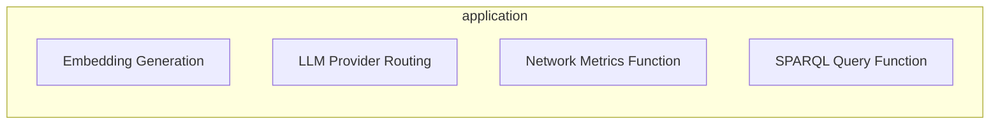
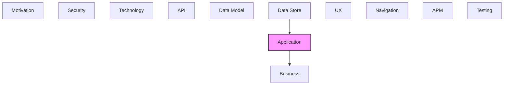

# Application

Application components, services, and interactions.

## Report Index

- [Layer Introduction](#layer-introduction)
- [Intra-Layer Relationships](#intra-layer-relationships)
- [Inter-Layer Dependencies](#inter-layer-dependencies)
- [Inter-Layer Relationships Table](#inter-layer-relationships-table)
- [Element Reference](#element-reference)

## Layer Introduction

| Metric                    | Count |
| ------------------------- | ----- |
| Elements                  | 4     |
| Intra-Layer Relationships | 0     |
| Inter-Layer Relationships | 7     |
| Inbound Relationships     | 3     |
| Outbound Relationships    | 4     |

**Cross-Layer References**:

- **Upstream layers**: [Data Store](./08-data-store-layer-report.md)
- **Downstream layers**: [Business](./02-business-layer-report.md)

## Intra-Layer Relationships

## Inter-Layer Dependencies

## Inter-Layer Relationships Table

| Relationship ID                                                      | Source Node                                                | Dest Node                                               | Dest Layer    | Predicate    | Cardinality  | Strength |
| -------------------------------------------------------------------- | ---------------------------------------------------------- | ------------------------------------------------------- | ------------- | ------------ | ------------ | -------- |
| `application.applicationfunction.realizes.business.businessfunction` | `application.applicationfunction.embedding-generation`     | `business.businessfunction.entity-enrichment`           | `business`    | `realizes`   | many-to-many | medium   |
| `application.applicationfunction.realizes.business.businessfunction` | `application.applicationfunction.llm-provider-routing`     | `business.businessfunction.entity-enrichment`           | `business`    | `realizes`   | many-to-many | medium   |
| `application.applicationfunction.realizes.business.businessfunction` | `application.applicationfunction.network-metrics-function` | `business.businessfunction.semantic-search`             | `business`    | `realizes`   | many-to-many | medium   |
| `application.applicationfunction.realizes.business.businessfunction` | `application.applicationfunction.sparql-query-function`    | `business.businessfunction.semantic-search`             | `business`    | `realizes`   | many-to-many | medium   |
| `data-store.accesspattern.serves.application.applicationfunction`    | `data-store.accesspattern.entity-by-parent-range-scan`     | `application.applicationfunction.sparql-query-function` | `application` | `serves`     | many-to-many | medium   |
| `data-store.accesspattern.serves.application.applicationfunction`    | `data-store.accesspattern.vector-similarity-search`        | `application.applicationfunction.embedding-generation`  | `application` | `serves`     | many-to-many | medium   |
| `data-store.storedlogic.implements.application.applicationfunction`  | `data-store.storedlogic.sqlite-vec-cosine-similarity`      | `application.applicationfunction.embedding-generation`  | `application` | `implements` | many-to-many | medium   |

## Element Reference

### Embedding Generation {#embedding-generation}

**ID**: `application.applicationfunction.embedding-generation`

**Type**: `applicationfunction`

Application function that generates vector embeddings for ontology entities using the SentenceTransformer adapter — stored in local.db via SQLiteVector

#### Relationships

| Type        | Related Element                                       | Predicate    | Direction |
| ----------- | ----------------------------------------------------- | ------------ | --------- |
| inter-layer | `business.businessfunction.entity-enrichment`         | `realizes`   | outbound  |
| inter-layer | `data-store.accesspattern.vector-similarity-search`   | `serves`     | inbound   |
| inter-layer | `data-store.storedlogic.sqlite-vec-cosine-similarity` | `implements` | inbound   |

### LLM Provider Routing {#llm-provider-routing}

**ID**: `application.applicationfunction.llm-provider-routing`

**Type**: `applicationfunction`

Application function that routes LLM requests to the appropriate provider (OpenAI, Anthropic) via the LLMProviderRouter in the llm adapter

#### Relationships

| Type        | Related Element                               | Predicate  | Direction |
| ----------- | --------------------------------------------- | ---------- | --------- |
| inter-layer | `business.businessfunction.entity-enrichment` | `realizes` | outbound  |

### Network Metrics Function {#network-metrics-function}

**ID**: `application.applicationfunction.network-metrics-function`

**Type**: `applicationfunction`

Application function that computes graph network metrics (centrality, density, clustering) using NetworkX within the Graph Analysis bounded context

#### Relationships

| Type        | Related Element                             | Predicate  | Direction |
| ----------- | ------------------------------------------- | ---------- | --------- |
| inter-layer | `business.businessfunction.semantic-search` | `realizes` | outbound  |

### SPARQL Query Function {#sparql-query-function}

**ID**: `application.applicationfunction.sparql-query-function`

**Type**: `applicationfunction`

Application function that executes SPARQL queries over the in-memory graph constructed by RDFLib in the Graph Analysis bounded context

#### Relationships

| Type        | Related Element                                        | Predicate  | Direction |
| ----------- | ------------------------------------------------------ | ---------- | --------- |
| inter-layer | `business.businessfunction.semantic-search`            | `realizes` | outbound  |
| inter-layer | `data-store.accesspattern.entity-by-parent-range-scan` | `serves`   | inbound   |

---

Generated: 2026-05-07T22:00:51.579Z | Model Version: 0.1.0
