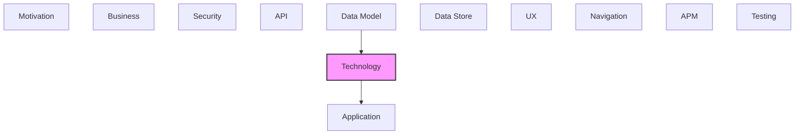

# Technology

Infrastructure, platforms, systems, and technology components.

## Report Index

- [Layer Introduction](#layer-introduction)
- [Intra-Layer Relationships](#intra-layer-relationships)
- [Inter-Layer Dependencies](#inter-layer-dependencies)
- [Inter-Layer Relationships Table](#inter-layer-relationships-table)
- [Element Reference](#element-reference)

## Layer Introduction

| Metric                    | Count |
| ------------------------- | ----- |
| Elements                  | 33    |
| Intra-Layer Relationships | 31    |
| Inter-Layer Relationships | 38    |
| Inbound Relationships     | 6     |
| Outbound Relationships    | 32    |

**Cross-Layer References**:

- **Upstream layers**: [Data Model](./07-data-model-layer-report.md)
- **Downstream layers**: [Application](./04-application-layer-report.md)

## Intra-Layer Relationships

*This layer has >30 elements. Summary table shown instead of diagram.*

| Element                                                             | Type                      | Relationships |
| ------------------------------------------------------------------- | ------------------------- | ------------- |
| `technology.communicationnetwork.localhost-lan`                     | `communicationnetwork`    | 4             |
| `technology.systemsoftware.alembic`                                 | `systemsoftware`          | 2             |
| `technology.systemsoftware.anthropic-sdk`                           | `systemsoftware`          | 1             |
| `technology.systemsoftware.axios`                                   | `systemsoftware`          | 1             |
| `technology.systemsoftware.boto3`                                   | `systemsoftware`          | 1             |
| `technology.systemsoftware.duck-db`                                 | `systemsoftware`          | 2             |
| `technology.systemsoftware.fast-api`                                | `systemsoftware`          | 4             |
| `technology.systemsoftware.flowbite-react`                          | `systemsoftware`          | 1             |
| `technology.systemsoftware.httpx`                                   | `systemsoftware`          | 1             |
| `technology.systemsoftware.hugging-face-datasets`                   | `systemsoftware`          | 0             |
| `technology.systemsoftware.network-x`                               | `systemsoftware`          | 1             |
| `technology.systemsoftware.openai-sdk`                              | `systemsoftware`          | 1             |
| `technology.systemsoftware.pyarrow`                                 | `systemsoftware`          | 1             |
| `technology.systemsoftware.pydantic`                                | `systemsoftware`          | 1             |
| `technology.systemsoftware.python`                                  | `systemsoftware`          | 13            |
| `technology.systemsoftware.python-multipart`                        | `systemsoftware`          | 0             |
| `technology.systemsoftware.rdflib`                                  | `systemsoftware`          | 1             |
| `technology.systemsoftware.react`                                   | `systemsoftware`          | 4             |
| `technology.systemsoftware.reagraph`                                | `systemsoftware`          | 0             |
| `technology.systemsoftware.sentence-transformers`                   | `systemsoftware`          | 1             |
| `technology.systemsoftware.spa-cy`                                  | `systemsoftware`          | 1             |
| `technology.systemsoftware.sqlalchemy`                              | `systemsoftware`          | 2             |
| `technology.systemsoftware.tailwind-css`                            | `systemsoftware`          | 1             |
| `technology.systemsoftware.tan-stack-form`                          | `systemsoftware`          | 0             |
| `technology.systemsoftware.tan-stack-query`                         | `systemsoftware`          | 1             |
| `technology.systemsoftware.tan-stack-router`                        | `systemsoftware`          | 1             |
| `technology.systemsoftware.tan-stack-table`                         | `systemsoftware`          | 0             |
| `technology.systemsoftware.uvicorn`                                 | `systemsoftware`          | 1             |
| `technology.systemsoftware.vite`                                    | `systemsoftware`          | 3             |
| `technology.systemsoftware.zustand`                                 | `systemsoftware`          | 0             |
| `technology.technologycollaboration.external-knowledge-integration` | `technologycollaboration` | 4             |
| `technology.technologyevent.rate-limit-threshold-event`             | `technologyevent`         | 4             |
| `technology.technologyinteraction.s3-sync-via-boto3`                | `technologyinteraction`   | 4             |

## Inter-Layer Dependencies

## Inter-Layer Relationships Table

| Relationship ID                                                     | Source Node                                       | Dest Node                                                                 | Dest Layer    | Predicate    | Cardinality  | Strength |
| ------------------------------------------------------------------- | ------------------------------------------------- | ------------------------------------------------------------------------- | ------------- | ------------ | ------------ | -------- |
| `data-model.objectschema.depends-on.technology.systemsoftware`      | `data-model.objectschema.change-event`            | `technology.systemsoftware.sqlalchemy`                                    | `technology`  | `depends-on` | many-to-many | medium   |
| `data-model.objectschema.depends-on.technology.systemsoftware`      | `data-model.objectschema.changeset`               | `technology.systemsoftware.sqlalchemy`                                    | `technology`  | `depends-on` | many-to-many | medium   |
| `data-model.objectschema.depends-on.technology.systemsoftware`      | `data-model.objectschema.import-run`              | `technology.systemsoftware.sqlalchemy`                                    | `technology`  | `depends-on` | many-to-many | medium   |
| `data-model.objectschema.depends-on.technology.systemsoftware`      | `data-model.objectschema.ontology-entity`         | `technology.systemsoftware.sqlalchemy`                                    | `technology`  | `depends-on` | many-to-many | medium   |
| `data-model.objectschema.depends-on.technology.systemsoftware`      | `data-model.objectschema.pipeline-configuration`  | `technology.systemsoftware.sqlalchemy`                                    | `technology`  | `depends-on` | many-to-many | medium   |
| `data-model.objectschema.depends-on.technology.systemsoftware`      | `data-model.objectschema.relationship`            | `technology.systemsoftware.sqlalchemy`                                    | `technology`  | `depends-on` | many-to-many | medium   |
| `technology.systemsoftware.serves.application.applicationcomponent` | `technology.systemsoftware.alembic`               | `application.applicationcomponent.sqlite-persistence-adapter`             | `application` | `serves`     | many-to-many | medium   |
| `technology.systemsoftware.realizes.application.applicationservice` | `technology.systemsoftware.anthropic-sdk`         | `application.applicationservice.pipeline-service`                         | `application` | `realizes`   | many-to-many | medium   |
| `technology.systemsoftware.realizes.application.applicationservice` | `technology.systemsoftware.boto3`                 | `application.applicationservice.versioning-service`                       | `application` | `realizes`   | many-to-many | medium   |
| `technology.systemsoftware.realizes.application.applicationservice` | `technology.systemsoftware.duck-db`               | `application.applicationservice.versioning-service`                       | `application` | `realizes`   | many-to-many | medium   |
| `technology.systemsoftware.realizes.application.applicationservice` | `technology.systemsoftware.fast-api`              | `application.applicationservice.ontology-service`                         | `application` | `realizes`   | many-to-many | medium   |
| `technology.systemsoftware.serves.application.applicationcomponent` | `technology.systemsoftware.fast-api`              | `application.applicationcomponent.sqlite-persistence-adapter`             | `application` | `serves`     | many-to-many | medium   |
| `technology.systemsoftware.realizes.application.applicationservice` | `technology.systemsoftware.httpx`                 | `application.applicationservice.extraction-service`                       | `application` | `realizes`   | many-to-many | medium   |
| `technology.systemsoftware.realizes.application.applicationservice` | `technology.systemsoftware.hugging-face-datasets` | `application.applicationservice.extraction-service`                       | `application` | `realizes`   | many-to-many | medium   |
| `technology.systemsoftware.serves.application.applicationcomponent` | `technology.systemsoftware.network-x`             | `application.applicationcomponent.network-x-graph-engine-adapter`         | `application` | `serves`     | many-to-many | medium   |
| `technology.systemsoftware.realizes.application.applicationservice` | `technology.systemsoftware.openai-sdk`            | `application.applicationservice.pipeline-service`                         | `application` | `realizes`   | many-to-many | medium   |
| `technology.systemsoftware.realizes.application.applicationservice` | `technology.systemsoftware.pyarrow`               | `application.applicationservice.versioning-service`                       | `application` | `realizes`   | many-to-many | medium   |
| `technology.systemsoftware.realizes.application.applicationservice` | `technology.systemsoftware.pydantic`              | `application.applicationservice.ontology-service`                         | `application` | `realizes`   | many-to-many | medium   |
| `technology.systemsoftware.realizes.application.applicationservice` | `technology.systemsoftware.python-multipart`      | `application.applicationservice.ontology-service`                         | `application` | `realizes`   | many-to-many | medium   |
| `technology.systemsoftware.realizes.application.applicationservice` | `technology.systemsoftware.python`                | `application.applicationservice.admin-service`                            | `application` | `realizes`   | many-to-many | medium   |
| `technology.systemsoftware.realizes.application.applicationservice` | `technology.systemsoftware.python`                | `application.applicationservice.ontology-service`                         | `application` | `realizes`   | many-to-many | medium   |
| `technology.systemsoftware.realizes.application.applicationservice` | `technology.systemsoftware.python`                | `application.applicationservice.pipeline-service`                         | `application` | `realizes`   | many-to-many | medium   |
| `technology.systemsoftware.realizes.application.applicationservice` | `technology.systemsoftware.python`                | `application.applicationservice.versioning-service`                       | `application` | `realizes`   | many-to-many | medium   |
| `technology.systemsoftware.realizes.application.applicationservice` | `technology.systemsoftware.rdflib`                | `application.applicationservice.graph-analysis-service`                   | `application` | `realizes`   | many-to-many | medium   |
| `technology.systemsoftware.realizes.application.applicationservice` | `technology.systemsoftware.react`                 | `application.applicationservice.admin-service`                            | `application` | `realizes`   | many-to-many | medium   |
| `technology.systemsoftware.realizes.application.applicationservice` | `technology.systemsoftware.reagraph`              | `application.applicationservice.graph-analysis-service`                   | `application` | `realizes`   | many-to-many | medium   |
| `technology.systemsoftware.realizes.application.applicationservice` | `technology.systemsoftware.sentence-transformers` | `application.applicationservice.extraction-service`                       | `application` | `realizes`   | many-to-many | medium   |
| `technology.systemsoftware.serves.application.applicationcomponent` | `technology.systemsoftware.sentence-transformers` | `application.applicationcomponent.sentence-transformer-embedding-adapter` | `application` | `serves`     | many-to-many | medium   |
| `technology.systemsoftware.realizes.application.applicationservice` | `technology.systemsoftware.spa-cy`                | `application.applicationservice.extraction-service`                       | `application` | `realizes`   | many-to-many | medium   |
| `technology.systemsoftware.serves.application.applicationcomponent` | `technology.systemsoftware.spa-cy`                | `application.applicationcomponent.sentence-transformer-embedding-adapter` | `application` | `serves`     | many-to-many | medium   |
| `technology.systemsoftware.serves.application.applicationcomponent` | `technology.systemsoftware.sqlalchemy`            | `application.applicationcomponent.sqlite-persistence-adapter`             | `application` | `serves`     | many-to-many | medium   |
| `technology.systemsoftware.realizes.application.applicationservice` | `technology.systemsoftware.tan-stack-form`        | `application.applicationservice.ontology-service`                         | `application` | `realizes`   | many-to-many | medium   |
| `technology.systemsoftware.realizes.application.applicationservice` | `technology.systemsoftware.tan-stack-query`       | `application.applicationservice.admin-service`                            | `application` | `realizes`   | many-to-many | medium   |
| `technology.systemsoftware.realizes.application.applicationservice` | `technology.systemsoftware.tan-stack-router`      | `application.applicationservice.admin-service`                            | `application` | `realizes`   | many-to-many | medium   |
| `technology.systemsoftware.realizes.application.applicationservice` | `technology.systemsoftware.tan-stack-table`       | `application.applicationservice.admin-service`                            | `application` | `realizes`   | many-to-many | medium   |
| `technology.systemsoftware.realizes.application.applicationservice` | `technology.systemsoftware.uvicorn`               | `application.applicationservice.admin-service`                            | `application` | `realizes`   | many-to-many | medium   |
| `technology.systemsoftware.realizes.application.applicationservice` | `technology.systemsoftware.uvicorn`               | `application.applicationservice.ontology-service`                         | `application` | `realizes`   | many-to-many | medium   |
| `technology.systemsoftware.realizes.application.applicationservice` | `technology.systemsoftware.zustand`               | `application.applicationservice.admin-service`                            | `application` | `realizes`   | many-to-many | medium   |

## Element Reference

### Localhost LAN {#localhost-lan}

**ID**: `technology.communicationnetwork.localhost-lan`

**Type**: `communicationnetwork`

The local loopback network over which the React SPA communicates with the FastAPI back-end — standard localhost/127.0.0.1 HTTP

#### Attributes

| Name          | Value                                               |
| ------------- | --------------------------------------------------- |
| documentation | Localhost communication between UX and local-server |
| networkType   | lan                                                 |

#### Relationships

| Type        | Related Element                                                     | Predicate | Direction |
| ----------- | ------------------------------------------------------------------- | --------- | --------- |
| intra-layer | `technology.systemsoftware.axios`                                   | `uses`    | inbound   |
| intra-layer | `technology.systemsoftware.fast-api`                                | `uses`    | inbound   |
| intra-layer | `technology.systemsoftware.vite`                                    | `uses`    | inbound   |
| intra-layer | `technology.technologycollaboration.external-knowledge-integration` | `uses`    | inbound   |

### Alembic {#alembic}

**ID**: `technology.systemsoftware.alembic`

**Type**: `systemsoftware`

Database schema migration tool for SQLite — autogenerates migration scripts from SQLAlchemy ORM models for local.db and operations.db

#### Attributes

| Name         | Value      |
| ------------ | ---------- |
| softwareType | middleware |

#### Relationships

| Type        | Related Element                                               | Predicate    | Direction |
| ----------- | ------------------------------------------------------------- | ------------ | --------- |
| inter-layer | `application.applicationcomponent.sqlite-persistence-adapter` | `serves`     | outbound  |
| intra-layer | `technology.systemsoftware.python`                            | `depends-on` | outbound  |
| intra-layer | `technology.systemsoftware.sqlalchemy`                        | `depends-on` | outbound  |

### anthropic-sdk {#anthropic-sdk}

**ID**: `technology.systemsoftware.anthropic-sdk`

**Type**: `systemsoftware`

Official Anthropic Python client library used by the Anthropic LLM provider adapter to call Claude models.

#### Attributes

| Name         | Value      |
| ------------ | ---------- |
| softwareType | middleware |

#### Relationships

| Type        | Related Element                                   | Predicate    | Direction |
| ----------- | ------------------------------------------------- | ------------ | --------- |
| inter-layer | `application.applicationservice.pipeline-service` | `realizes`   | outbound  |
| intra-layer | `technology.systemsoftware.python`                | `depends-on` | outbound  |

### Axios {#axios}

**ID**: `technology.systemsoftware.axios`

**Type**: `systemsoftware`

Promise-based HTTP client used by the type-safe API layer for communicating with the FastAPI backend

#### Attributes

| Name         | Value      |
| ------------ | ---------- |
| softwareType | middleware |

#### Relationships

| Type        | Related Element                                 | Predicate | Direction |
| ----------- | ----------------------------------------------- | --------- | --------- |
| intra-layer | `technology.communicationnetwork.localhost-lan` | `uses`    | outbound  |

### boto3 {#boto3}

**ID**: `technology.systemsoftware.boto3`

**Type**: `systemsoftware`

AWS SDK for Python. Used by the S3 sync adapter to push and pull DuckDB snapshot files to remote storage.

#### Attributes

| Name         | Value      |
| ------------ | ---------- |
| softwareType | middleware |

#### Relationships

| Type        | Related Element                                     | Predicate    | Direction |
| ----------- | --------------------------------------------------- | ------------ | --------- |
| inter-layer | `application.applicationservice.versioning-service` | `realizes`   | outbound  |
| intra-layer | `technology.systemsoftware.python`                  | `depends-on` | outbound  |

### DuckDB {#duckdb}

**ID**: `technology.systemsoftware.duck-db`

**Type**: `systemsoftware`

In-process analytical SQL engine used by DuckDBSyncAdapter for serializing the local knowledge graph to Parquet format for remote sync

#### Attributes

| Name         | Value |
| ------------ | ----- |
| softwareType | dbms  |

#### Relationships

| Type        | Related Element                                     | Predicate    | Direction |
| ----------- | --------------------------------------------------- | ------------ | --------- |
| inter-layer | `application.applicationservice.versioning-service` | `realizes`   | outbound  |
| intra-layer | `technology.systemsoftware.python`                  | `depends-on` | outbound  |
| intra-layer | `technology.systemsoftware.pyarrow`                 | `depends-on` | inbound   |

### FastAPI {#fastapi}

**ID**: `technology.systemsoftware.fast-api`

**Type**: `systemsoftware`

Python HTTP API framework — provides route declarations, dependency injection, and automatic OpenAPI spec generation for the backend

#### Attributes

| Name         | Value      |
| ------------ | ---------- |
| softwareType | middleware |

#### Relationships

| Type        | Related Element                                               | Predicate    | Direction |
| ----------- | ------------------------------------------------------------- | ------------ | --------- |
| inter-layer | `application.applicationservice.ontology-service`             | `realizes`   | outbound  |
| inter-layer | `application.applicationcomponent.sqlite-persistence-adapter` | `serves`     | outbound  |
| intra-layer | `technology.systemsoftware.python`                            | `depends-on` | outbound  |
| intra-layer | `technology.technologyevent.rate-limit-threshold-event`       | `triggers`   | outbound  |
| intra-layer | `technology.communicationnetwork.localhost-lan`               | `uses`       | outbound  |
| intra-layer | `technology.systemsoftware.uvicorn`                           | `depends-on` | inbound   |

### Flowbite React {#flowbite-react}

**ID**: `technology.systemsoftware.flowbite-react`

**Type**: `systemsoftware`

Component library (v0.11) built on Tailwind CSS used for UX interface elements — buttons, modals, tables, and form controls

#### Attributes

| Name         | Value      |
| ------------ | ---------- |
| softwareType | middleware |

#### Relationships

| Type        | Related Element                   | Predicate    | Direction |
| ----------- | --------------------------------- | ------------ | --------- |
| intra-layer | `technology.systemsoftware.react` | `depends-on` | outbound  |

### httpx {#httpx}

**ID**: `technology.systemsoftware.httpx`

**Type**: `systemsoftware`

Async-capable HTTP client for Python. Used by the reference adapter and test infrastructure for making HTTP requests to external APIs and the FastAPI test client.

#### Attributes

| Name         | Value      |
| ------------ | ---------- |
| softwareType | middleware |

#### Relationships

| Type        | Related Element                                     | Predicate    | Direction |
| ----------- | --------------------------------------------------- | ------------ | --------- |
| inter-layer | `application.applicationservice.extraction-service` | `realizes`   | outbound  |
| intra-layer | `technology.systemsoftware.python`                  | `depends-on` | outbound  |

### HuggingFace Datasets {#huggingface-datasets}

**ID**: `technology.systemsoftware.hugging-face-datasets`

**Type**: `systemsoftware`

HuggingFace datasets library used for loading and processing reference datasets for ontology enrichment

#### Attributes

| Name         | Value      |
| ------------ | ---------- |
| softwareType | middleware |

#### Relationships

| Type        | Related Element                                     | Predicate  | Direction |
| ----------- | --------------------------------------------------- | ---------- | --------- |
| inter-layer | `application.applicationservice.extraction-service` | `realizes` | outbound  |

### NetworkX {#networkx}

**ID**: `technology.systemsoftware.network-x`

**Type**: `systemsoftware`

Python graph library (v3.1+) used by NetworkXGraphEngine adapter — provides directed graph construction, shortest path, centrality, and community detection algorithms

#### Attributes

| Name         | Value      |
| ------------ | ---------- |
| softwareType | middleware |

#### Relationships

| Type        | Related Element                                                   | Predicate    | Direction |
| ----------- | ----------------------------------------------------------------- | ------------ | --------- |
| inter-layer | `application.applicationcomponent.network-x-graph-engine-adapter` | `serves`     | outbound  |
| intra-layer | `technology.systemsoftware.python`                                | `depends-on` | outbound  |

### openai-sdk {#openai-sdk}

**ID**: `technology.systemsoftware.openai-sdk`

**Type**: `systemsoftware`

Official OpenAI Python client library used by the OpenAI LLM provider adapter to call GPT models.

#### Attributes

| Name         | Value      |
| ------------ | ---------- |
| softwareType | middleware |

#### Relationships

| Type        | Related Element                                   | Predicate    | Direction |
| ----------- | ------------------------------------------------- | ------------ | --------- |
| inter-layer | `application.applicationservice.pipeline-service` | `realizes`   | outbound  |
| intra-layer | `technology.systemsoftware.python`                | `depends-on` | outbound  |

### pyarrow {#pyarrow}

**ID**: `technology.systemsoftware.pyarrow`

**Type**: `systemsoftware`

Apache Arrow columnar data format library used for Parquet file serialization in DuckDB-based remote sync operations

#### Attributes

| Name         | Value      |
| ------------ | ---------- |
| softwareType | middleware |

#### Relationships

| Type        | Related Element                                     | Predicate    | Direction |
| ----------- | --------------------------------------------------- | ------------ | --------- |
| inter-layer | `application.applicationservice.versioning-service` | `realizes`   | outbound  |
| intra-layer | `technology.systemsoftware.duck-db`                 | `depends-on` | outbound  |

### Pydantic {#pydantic}

**ID**: `technology.systemsoftware.pydantic`

**Type**: `systemsoftware`

Data validation library used exclusively in the adapter/web layer — Pydantic schemas define request and response shapes for all FastAPI routes

#### Attributes

| Name         | Value      |
| ------------ | ---------- |
| softwareType | middleware |

#### Relationships

| Type        | Related Element                                   | Predicate    | Direction |
| ----------- | ------------------------------------------------- | ------------ | --------- |
| inter-layer | `application.applicationservice.ontology-service` | `realizes`   | outbound  |
| intra-layer | `technology.systemsoftware.python`                | `depends-on` | outbound  |

### Python {#python}

**ID**: `technology.systemsoftware.python`

**Type**: `systemsoftware`

Primary backend runtime for local-server — all domain services, adapters, and API routes are implemented in Python 3.x

#### Attributes

| Name         | Value      |
| ------------ | ---------- |
| softwareType | middleware |

#### Relationships

| Type        | Related Element                                     | Predicate    | Direction |
| ----------- | --------------------------------------------------- | ------------ | --------- |
| inter-layer | `application.applicationservice.admin-service`      | `realizes`   | outbound  |
| inter-layer | `application.applicationservice.ontology-service`   | `realizes`   | outbound  |
| inter-layer | `application.applicationservice.pipeline-service`   | `realizes`   | outbound  |
| inter-layer | `application.applicationservice.versioning-service` | `realizes`   | outbound  |
| intra-layer | `technology.systemsoftware.alembic`                 | `depends-on` | inbound   |
| intra-layer | `technology.systemsoftware.anthropic-sdk`           | `depends-on` | inbound   |
| intra-layer | `technology.systemsoftware.boto3`                   | `depends-on` | inbound   |
| intra-layer | `technology.systemsoftware.duck-db`                 | `depends-on` | inbound   |
| intra-layer | `technology.systemsoftware.fast-api`                | `depends-on` | inbound   |
| intra-layer | `technology.systemsoftware.httpx`                   | `depends-on` | inbound   |
| intra-layer | `technology.systemsoftware.network-x`               | `depends-on` | inbound   |
| intra-layer | `technology.systemsoftware.openai-sdk`              | `depends-on` | inbound   |
| intra-layer | `technology.systemsoftware.pydantic`                | `depends-on` | inbound   |
| intra-layer | `technology.systemsoftware.rdflib`                  | `depends-on` | inbound   |
| intra-layer | `technology.systemsoftware.sentence-transformers`   | `depends-on` | inbound   |
| intra-layer | `technology.systemsoftware.spa-cy`                  | `depends-on` | inbound   |
| intra-layer | `technology.systemsoftware.sqlalchemy`              | `depends-on` | inbound   |

### python-multipart {#python-multipart}

**ID**: `technology.systemsoftware.python-multipart`

**Type**: `systemsoftware`

Python library providing multipart form data parsing, enabling FastAPI file upload endpoints for ontology import operations

#### Attributes

| Name         | Value      |
| ------------ | ---------- |
| softwareType | middleware |

#### Relationships

| Type        | Related Element                                   | Predicate  | Direction |
| ----------- | ------------------------------------------------- | ---------- | --------- |
| inter-layer | `application.applicationservice.ontology-service` | `realizes` | outbound  |

### RDFLib {#rdflib}

**ID**: `technology.systemsoftware.rdflib`

**Type**: `systemsoftware`

Python RDF library used by the graph adapter for RDF graph construction, SPARQL query execution, and ontology triple management

#### Attributes

| Name         | Value      |
| ------------ | ---------- |
| softwareType | middleware |

#### Relationships

| Type        | Related Element                                         | Predicate    | Direction |
| ----------- | ------------------------------------------------------- | ------------ | --------- |
| inter-layer | `application.applicationservice.graph-analysis-service` | `realizes`   | outbound  |
| intra-layer | `technology.systemsoftware.python`                      | `depends-on` | outbound  |

### React {#react}

**ID**: `technology.systemsoftware.react`

**Type**: `systemsoftware`

JavaScript UI library (v19.1) powering the Context Studio front-end — all UX components are React functional components with hooks

#### Attributes

| Name         | Value      |
| ------------ | ---------- |
| softwareType | middleware |

#### Relationships

| Type        | Related Element                                | Predicate    | Direction |
| ----------- | ---------------------------------------------- | ------------ | --------- |
| inter-layer | `application.applicationservice.admin-service` | `realizes`   | outbound  |
| intra-layer | `technology.systemsoftware.flowbite-react`     | `depends-on` | inbound   |
| intra-layer | `technology.systemsoftware.tan-stack-query`    | `depends-on` | inbound   |
| intra-layer | `technology.systemsoftware.tan-stack-router`   | `depends-on` | inbound   |
| intra-layer | `technology.systemsoftware.vite`               | `depends-on` | inbound   |

### Reagraph {#reagraph}

**ID**: `technology.systemsoftware.reagraph`

**Type**: `systemsoftware`

React-based graph visualization library used for rendering knowledge graph network diagrams in the UX

#### Attributes

| Name         | Value      |
| ------------ | ---------- |
| softwareType | middleware |

#### Relationships

| Type        | Related Element                                         | Predicate  | Direction |
| ----------- | ------------------------------------------------------- | ---------- | --------- |
| inter-layer | `application.applicationservice.graph-analysis-service` | `realizes` | outbound  |

### sentence-transformers {#sentence-transformers}

**ID**: `technology.systemsoftware.sentence-transformers`

**Type**: `systemsoftware`

Python library providing pre-trained SentenceTransformer models — used by SentenceTransformerEmbedding adapter to generate semantic vector embeddings (default: all-MiniLM-L12-v2)

#### Attributes

| Name         | Value      |
| ------------ | ---------- |
| softwareType | middleware |

#### Relationships

| Type        | Related Element                                                           | Predicate    | Direction |
| ----------- | ------------------------------------------------------------------------- | ------------ | --------- |
| inter-layer | `application.applicationservice.extraction-service`                       | `realizes`   | outbound  |
| inter-layer | `application.applicationcomponent.sentence-transformer-embedding-adapter` | `serves`     | outbound  |
| intra-layer | `technology.systemsoftware.python`                                        | `depends-on` | outbound  |

### spaCy {#spacy}

**ID**: `technology.systemsoftware.spa-cy`

**Type**: `systemsoftware`

Industrial-strength NLP library used by SpacyProcessor adapter for tokenization, named entity recognition, and linguistic feature extraction

#### Attributes

| Name         | Value      |
| ------------ | ---------- |
| softwareType | middleware |

#### Relationships

| Type        | Related Element                                                           | Predicate    | Direction |
| ----------- | ------------------------------------------------------------------------- | ------------ | --------- |
| inter-layer | `application.applicationservice.extraction-service`                       | `realizes`   | outbound  |
| inter-layer | `application.applicationcomponent.sentence-transformer-embedding-adapter` | `serves`     | outbound  |
| intra-layer | `technology.systemsoftware.python`                                        | `depends-on` | outbound  |

### SQLAlchemy {#sqlalchemy}

**ID**: `technology.systemsoftware.sqlalchemy`

**Type**: `systemsoftware`

Python ORM and SQL toolkit (v2.0+) used for all SQLite persistence — models, repositories, and connection management in local-server

#### Attributes

| Name         | Value      |
| ------------ | ---------- |
| softwareType | middleware |

#### Relationships

| Type        | Related Element                                               | Predicate    | Direction |
| ----------- | ------------------------------------------------------------- | ------------ | --------- |
| inter-layer | `data-model.objectschema.change-event`                        | `depends-on` | inbound   |
| inter-layer | `data-model.objectschema.changeset`                           | `depends-on` | inbound   |
| inter-layer | `data-model.objectschema.import-run`                          | `depends-on` | inbound   |
| inter-layer | `data-model.objectschema.ontology-entity`                     | `depends-on` | inbound   |
| inter-layer | `data-model.objectschema.pipeline-configuration`              | `depends-on` | inbound   |
| inter-layer | `data-model.objectschema.relationship`                        | `depends-on` | inbound   |
| inter-layer | `application.applicationcomponent.sqlite-persistence-adapter` | `serves`     | outbound  |
| intra-layer | `technology.systemsoftware.alembic`                           | `depends-on` | inbound   |
| intra-layer | `technology.systemsoftware.python`                            | `depends-on` | outbound  |

### Tailwind CSS {#tailwind-css}

**ID**: `technology.systemsoftware.tailwind-css`

**Type**: `systemsoftware`

Utility-first CSS framework (v4.1) used for all frontend styling in the React UX

#### Attributes

| Name         | Value      |
| ------------ | ---------- |
| softwareType | middleware |

#### Relationships

| Type        | Related Element                  | Predicate    | Direction |
| ----------- | -------------------------------- | ------------ | --------- |
| intra-layer | `technology.systemsoftware.vite` | `depends-on` | outbound  |

### TanStack Form {#tanstack-form}

**ID**: `technology.systemsoftware.tan-stack-form`

**Type**: `systemsoftware`

TanStack Form library used for type-safe form state management in Context Studio UX components

#### Attributes

| Name         | Value      |
| ------------ | ---------- |
| softwareType | middleware |

#### Relationships

| Type        | Related Element                                   | Predicate  | Direction |
| ----------- | ------------------------------------------------- | ---------- | --------- |
| inter-layer | `application.applicationservice.ontology-service` | `realizes` | outbound  |

### TanStack Query {#tanstack-query}

**ID**: `technology.systemsoftware.tan-stack-query`

**Type**: `systemsoftware`

Server-state management library (v5.83) for the React UX — handles API data fetching, caching, and synchronization

#### Attributes

| Name         | Value      |
| ------------ | ---------- |
| softwareType | middleware |

#### Relationships

| Type        | Related Element                                | Predicate    | Direction |
| ----------- | ---------------------------------------------- | ------------ | --------- |
| inter-layer | `application.applicationservice.admin-service` | `realizes`   | outbound  |
| intra-layer | `technology.systemsoftware.react`              | `depends-on` | outbound  |

### TanStack Router {#tanstack-router}

**ID**: `technology.systemsoftware.tan-stack-router`

**Type**: `systemsoftware`

Type-safe file-based router (v1.116) for the React UX — manages all client-side navigation routes

#### Attributes

| Name         | Value      |
| ------------ | ---------- |
| softwareType | middleware |

#### Relationships

| Type        | Related Element                                | Predicate    | Direction |
| ----------- | ---------------------------------------------- | ------------ | --------- |
| inter-layer | `application.applicationservice.admin-service` | `realizes`   | outbound  |
| intra-layer | `technology.systemsoftware.react`              | `depends-on` | outbound  |

### TanStack Table {#tanstack-table}

**ID**: `technology.systemsoftware.tan-stack-table`

**Type**: `systemsoftware`

TanStack Table (formerly React Table) used for building data-intensive tables with sorting, filtering, and pagination in the Context Studio UX

#### Attributes

| Name         | Value      |
| ------------ | ---------- |
| softwareType | middleware |

#### Relationships

| Type        | Related Element                                | Predicate  | Direction |
| ----------- | ---------------------------------------------- | ---------- | --------- |
| inter-layer | `application.applicationservice.admin-service` | `realizes` | outbound  |

### uvicorn {#uvicorn}

**ID**: `technology.systemsoftware.uvicorn`

**Type**: `systemsoftware`

ASGI server that serves the FastAPI application. Configured with standard extras for websocket and HTTP/2 support.

#### Attributes

| Name         | Value      |
| ------------ | ---------- |
| softwareType | middleware |

#### Relationships

| Type        | Related Element                                   | Predicate    | Direction |
| ----------- | ------------------------------------------------- | ------------ | --------- |
| inter-layer | `application.applicationservice.admin-service`    | `realizes`   | outbound  |
| inter-layer | `application.applicationservice.ontology-service` | `realizes`   | outbound  |
| intra-layer | `technology.systemsoftware.fast-api`              | `depends-on` | outbound  |

### Vite {#vite}

**ID**: `technology.systemsoftware.vite`

**Type**: `systemsoftware`

Frontend build tool (v6.2) for the React UX — handles TypeScript compilation, hot module replacement, and production bundling

#### Attributes

| Name         | Value      |
| ------------ | ---------- |
| softwareType | middleware |

#### Relationships

| Type        | Related Element                                 | Predicate    | Direction |
| ----------- | ----------------------------------------------- | ------------ | --------- |
| intra-layer | `technology.systemsoftware.tailwind-css`        | `depends-on` | inbound   |
| intra-layer | `technology.systemsoftware.react`               | `depends-on` | outbound  |
| intra-layer | `technology.communicationnetwork.localhost-lan` | `uses`       | outbound  |

### Zustand {#zustand}

**ID**: `technology.systemsoftware.zustand`

**Type**: `systemsoftware`

Zustand lightweight state management library used for complex UI state in Context Studio React components

#### Attributes

| Name         | Value      |
| ------------ | ---------- |
| softwareType | middleware |

#### Relationships

| Type        | Related Element                                | Predicate  | Direction |
| ----------- | ---------------------------------------------- | ---------- | --------- |
| inter-layer | `application.applicationservice.admin-service` | `realizes` | outbound  |

### External Knowledge Integration {#external-knowledge-integration}

**ID**: `technology.technologycollaboration.external-knowledge-integration`

**Type**: `technologycollaboration`

Technology collaboration between the reference adapter and external knowledge sources (ConceptNet, DBpedia, Wikidata, schema.org) coordinated by the reference adapter

#### Relationships

| Type        | Related Element                                         | Predicate  | Direction |
| ----------- | ------------------------------------------------------- | ---------- | --------- |
| intra-layer | `technology.technologyinteraction.s3-sync-via-boto3`    | `performs` | outbound  |
| intra-layer | `technology.technologyevent.rate-limit-threshold-event` | `triggers` | outbound  |
| intra-layer | `technology.communicationnetwork.localhost-lan`         | `uses`     | outbound  |
| intra-layer | `technology.technologyinteraction.s3-sync-via-boto3`    | `realizes` | inbound   |

### Rate Limit Threshold Event {#rate-limit-threshold-event}

**ID**: `technology.technologyevent.rate-limit-threshold-event`

**Type**: `technologyevent`

Technology event fired when per-source request rate approaches the configured limit in config.json for external reference adapters (ConceptNet, DBpedia, Wikidata, schema.org)

#### Attributes

| Name          | Value                                                        |
| ------------- | ------------------------------------------------------------ |
| documentation | Per-source rate limit enforcement event in reference adapter |
| eventType     | threshold-breach                                             |

#### Relationships

| Type        | Related Element                                                     | Predicate  | Direction |
| ----------- | ------------------------------------------------------------------- | ---------- | --------- |
| intra-layer | `technology.systemsoftware.fast-api`                                | `triggers` | inbound   |
| intra-layer | `technology.technologycollaboration.external-knowledge-integration` | `triggers` | inbound   |
| intra-layer | `technology.technologyinteraction.s3-sync-via-boto3`                | `triggers` | outbound  |
| intra-layer | `technology.technologyinteraction.s3-sync-via-boto3`                | `triggers` | inbound   |

### S3 Sync via boto3 {#s3-sync-via-boto3}

**ID**: `technology.technologyinteraction.s3-sync-via-boto3`

**Type**: `technologyinteraction`

Technology interaction in which the sync adapter serializes the local knowledge graph to Parquet format and uploads to S3 using boto3

#### Relationships

| Type        | Related Element                                                     | Predicate  | Direction |
| ----------- | ------------------------------------------------------------------- | ---------- | --------- |
| intra-layer | `technology.technologycollaboration.external-knowledge-integration` | `performs` | inbound   |
| intra-layer | `technology.technologyevent.rate-limit-threshold-event`             | `triggers` | inbound   |
| intra-layer | `technology.technologycollaboration.external-knowledge-integration` | `realizes` | outbound  |
| intra-layer | `technology.technologyevent.rate-limit-threshold-event`             | `triggers` | outbound  |

---

Generated: 2026-05-11T12:08:50.651Z | Model Version: 0.1.0
