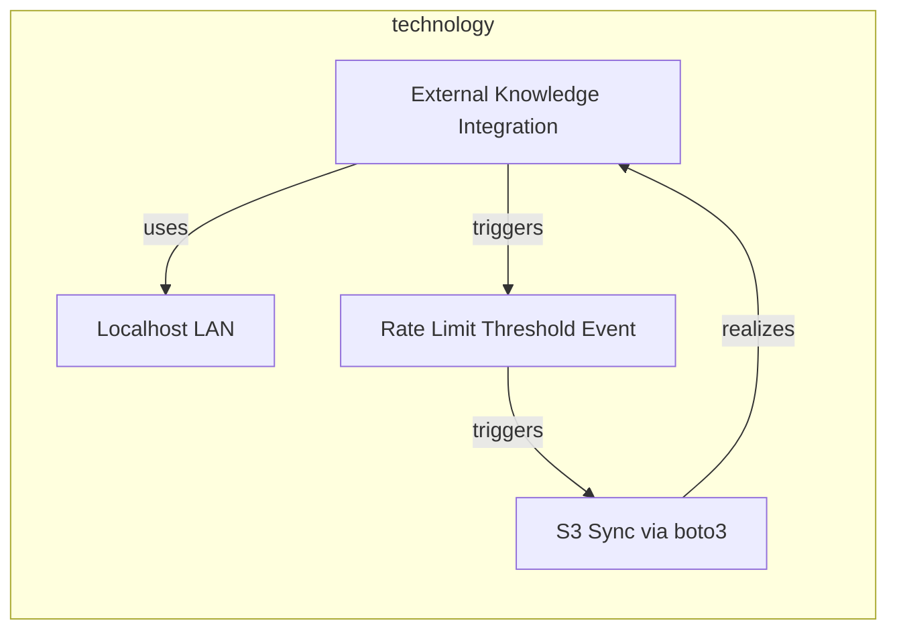

# Technology

Infrastructure, platforms, systems, and technology components.

## Report Index

- [Layer Introduction](#layer-introduction)
- [Intra-Layer Relationships](#intra-layer-relationships)
- [Inter-Layer Dependencies](#inter-layer-dependencies)
- [Element Reference](#element-reference)

## Layer Introduction

| Metric                    | Count |
| ------------------------- | ----- |
| Elements                  | 4     |
| Intra-Layer Relationships | 4     |
| Inter-Layer Relationships | 0     |
| Inbound Relationships     | 0     |
| Outbound Relationships    | 0     |

## Intra-Layer Relationships

## Inter-Layer Dependencies

```mermaid
flowchart TB
  classDef current fill:#f9f,stroke:#333,stroke-width:2px
  motivation["Motivation"]
  business["Business"]
  security["Security"]
  application["Application"]
  technology["Technology"]
  api["API"]
  data_model["Data Model"]
  data_store["Data Store"]
  ux["UX"]
  navigation["Navigation"]
  apm["APM"]
  testing["Testing"]
  class technology current
```

## Element Reference

### Localhost LAN {#localhost-lan}

**ID**: `technology.communicationnetwork.localhost-lan`

**Type**: `communicationnetwork`

The local loopback network over which the React SPA communicates with the FastAPI back-end — standard localhost/127.0.0.1 HTTP

#### Attributes

| Name          | Value                                               |
| ------------- | --------------------------------------------------- |
| documentation | Localhost communication between UX and local-server |
| networkType   | lan                                                 |

#### Relationships

| Type        | Related Element                                                     | Predicate | Direction |
| ----------- | ------------------------------------------------------------------- | --------- | --------- |
| intra-layer | `technology.technologycollaboration.external-knowledge-integration` | `uses`    | inbound   |

### External Knowledge Integration {#external-knowledge-integration}

**ID**: `technology.technologycollaboration.external-knowledge-integration`

**Type**: `technologycollaboration`

Technology collaboration between the reference adapter and external knowledge sources (ConceptNet, DBpedia, Wikidata, schema.org) coordinated by the reference adapter

#### Relationships

| Type        | Related Element                                         | Predicate  | Direction |
| ----------- | ------------------------------------------------------- | ---------- | --------- |
| intra-layer | `technology.technologyevent.rate-limit-threshold-event` | `triggers` | outbound  |
| intra-layer | `technology.communicationnetwork.localhost-lan`         | `uses`     | outbound  |
| intra-layer | `technology.technologyinteraction.s3-sync-via-boto3`    | `realizes` | inbound   |

### Rate Limit Threshold Event {#rate-limit-threshold-event}

**ID**: `technology.technologyevent.rate-limit-threshold-event`

**Type**: `technologyevent`

Technology event fired when per-source request rate approaches the configured limit in config.json for external reference adapters (ConceptNet, DBpedia, Wikidata, schema.org)

#### Attributes

| Name          | Value                                                        |
| ------------- | ------------------------------------------------------------ |
| documentation | Per-source rate limit enforcement event in reference adapter |
| eventType     | threshold-breach                                             |

#### Relationships

| Type        | Related Element                                                     | Predicate  | Direction |
| ----------- | ------------------------------------------------------------------- | ---------- | --------- |
| intra-layer | `technology.technologycollaboration.external-knowledge-integration` | `triggers` | inbound   |
| intra-layer | `technology.technologyinteraction.s3-sync-via-boto3`                | `triggers` | outbound  |

### S3 Sync via boto3 {#s3-sync-via-boto3}

**ID**: `technology.technologyinteraction.s3-sync-via-boto3`

**Type**: `technologyinteraction`

Technology interaction in which the sync adapter serializes the local knowledge graph to Parquet format and uploads to S3 using boto3

#### Relationships

| Type        | Related Element                                                     | Predicate  | Direction |
| ----------- | ------------------------------------------------------------------- | ---------- | --------- |
| intra-layer | `technology.technologyevent.rate-limit-threshold-event`             | `triggers` | inbound   |
| intra-layer | `technology.technologycollaboration.external-knowledge-integration` | `realizes` | outbound  |

---

Generated: 2026-05-07T22:00:51.579Z | Model Version: 0.1.0
