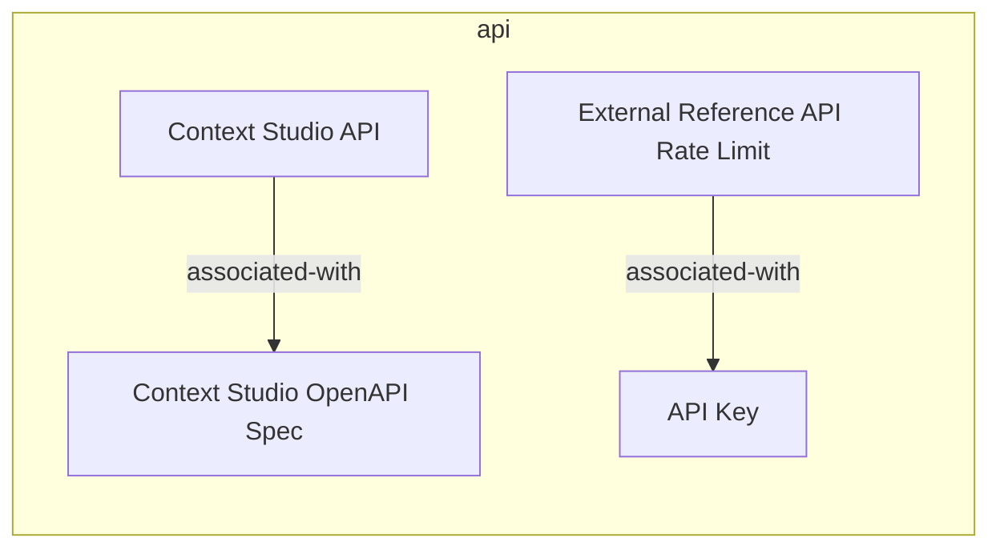
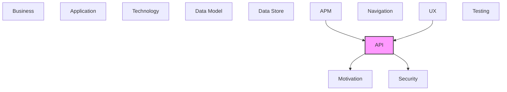

# API

REST APIs, operations, endpoints, and API integrations.

## Report Index

- [Layer Introduction](#layer-introduction)
- [Intra-Layer Relationships](#intra-layer-relationships)
- [Inter-Layer Dependencies](#inter-layer-dependencies)
- [Inter-Layer Relationships Table](#inter-layer-relationships-table)
- [Element Reference](#element-reference)

## Layer Introduction

| Metric                    | Count |
| ------------------------- | ----- |
| Elements                  | 4     |
| Intra-Layer Relationships | 2     |
| Inter-Layer Relationships | 11    |
| Inbound Relationships     | 9     |
| Outbound Relationships    | 2     |

**Cross-Layer References**:

- **Upstream layers**: [APM](./11-apm-layer-report.md), [UX](./09-ux-layer-report.md)
- **Downstream layers**: [Motivation](./01-motivation-layer-report.md), [Security](./03-security-layer-report.md)

## Intra-Layer Relationships

## Inter-Layer Dependencies

## Inter-Layer Relationships Table

| Relationship ID                                    | Source Node                                       | Dest Node                                                     | Dest Layer   | Predicate    | Cardinality  | Strength |
| -------------------------------------------------- | ------------------------------------------------- | ------------------------------------------------------------- | ------------ | ------------ | ------------ | -------- |
| `api.ratelimit.implements.security.countermeasure` | `api.ratelimit.external-reference-api-rate-limit` | `security.countermeasure.parameterized-queries-via-orm`       | `security`   | `implements` | many-to-many | medium   |
| `api.ratelimit.satisfies.motivation.constraint`    | `api.ratelimit.external-reference-api-rate-limit` | `motivation.constraint.external-reference-source-rate-limits` | `motivation` | `satisfies`  | many-to-many | medium   |
| `apm.alert.monitors.api.ratelimit`                 | `apm.alert.rate-limit-breach-alert`               | `api.ratelimit.external-reference-api-rate-limit`             | `api`        | `monitors`   | many-to-many | medium   |
| `ux.view.uses.api.securityscheme`                  | `ux.view.admin-view`                              | `api.securityscheme.api-key`                                  | `api`        | `uses`       | many-to-many | medium   |
| `ux.view.uses.api.securityscheme`                  | `ux.view.configuration-view`                      | `api.securityscheme.api-key`                                  | `api`        | `uses`       | many-to-many | medium   |
| `ux.view.uses.api.securityscheme`                  | `ux.view.datasets-view`                           | `api.securityscheme.api-key`                                  | `api`        | `uses`       | many-to-many | medium   |
| `ux.view.uses.api.securityscheme`                  | `ux.view.domains-view`                            | `api.securityscheme.api-key`                                  | `api`        | `uses`       | many-to-many | medium   |
| `ux.view.uses.api.securityscheme`                  | `ux.view.layers-view`                             | `api.securityscheme.api-key`                                  | `api`        | `uses`       | many-to-many | medium   |
| `ux.view.uses.api.securityscheme`                  | `ux.view.predicates-view`                         | `api.securityscheme.api-key`                                  | `api`        | `uses`       | many-to-many | medium   |
| `ux.view.uses.api.securityscheme`                  | `ux.view.rag-experiments-view`                    | `api.securityscheme.api-key`                                  | `api`        | `uses`       | many-to-many | medium   |
| `ux.view.uses.api.securityscheme`                  | `ux.view.terms-view`                              | `api.securityscheme.api-key`                                  | `api`        | `uses`       | many-to-many | medium   |

## Element Reference

### Context Studio API {#context-studio-api}

**ID**: `api.info.context-studio-api`

**Type**: `info`

OpenAPI Info object for the Context Studio local-server REST API — knowledge graph management, RAG pipeline, and system administration endpoints

#### Attributes

| Name        | Value                                                           |
| ----------- | --------------------------------------------------------------- |
| description | Local-first knowledge graph API for RAG and ontology management |
| title       | Context Studio API                                              |
| version     | 0.1.0                                                           |

#### Relationships

| Type        | Related Element                                    | Predicate         | Direction |
| ----------- | -------------------------------------------------- | ----------------- | --------- |
| intra-layer | `api.openapidocument.context-studio-open-api-spec` | `associated-with` | outbound  |

### Context Studio OpenAPI Spec {#context-studio-openapi-spec}

**ID**: `api.openapidocument.context-studio-open-api-spec`

**Type**: `openapidocument`

The generated OpenAPI 3.0.3 specification document for the Context Studio local server. Auto-generated by scripts/update_api_specs.py from FastAPI route definitions and served as openapi.json.

#### Attributes

| Name    | Value                      |
| ------- | -------------------------- |
| info    | Context Studio API v0.1.0  |
| openapi | 3.0.3                      |
| paths   | /local-server/openapi.json |

#### Relationships

| Type        | Related Element               | Predicate         | Direction |
| ----------- | ----------------------------- | ----------------- | --------- |
| intra-layer | `api.info.context-studio-api` | `associated-with` | inbound   |

### External Reference API Rate Limit {#external-reference-api-rate-limit}

**ID**: `api.ratelimit.external-reference-api-rate-limit`

**Type**: `ratelimit`

Per-source rate limits for external knowledge base requests (ConceptNet, DBpedia, Wikidata, schema.org) — configured per-source in config.json reference_sources

#### Attributes

| Name     | Value    |
| -------- | -------- |
| action   | throttle |
| keyBy    | source   |
| requests | 60       |
| scope    | global   |
| window   | PT1M     |

#### Relationships

| Type        | Related Element                                               | Predicate         | Direction |
| ----------- | ------------------------------------------------------------- | ----------------- | --------- |
| inter-layer | `security.countermeasure.parameterized-queries-via-orm`       | `implements`      | outbound  |
| inter-layer | `motivation.constraint.external-reference-source-rate-limits` | `satisfies`       | outbound  |
| inter-layer | `apm.alert.rate-limit-breach-alert`                           | `monitors`        | inbound   |
| intra-layer | `api.securityscheme.api-key`                                  | `associated-with` | outbound  |

### API Key {#api-key}

**ID**: `api.securityscheme.api-key`

**Type**: `securityscheme`

X-API-Key header authentication scheme — optional, enabled when require_secure_key is true in config.json

#### Attributes

| Name        | Value                                                                               |
| ----------- | ----------------------------------------------------------------------------------- |
| description | X-API-Key header authentication, configurable via require_secure_key in config.json |
| in          | header                                                                              |
| type        | apiKey                                                                              |

#### Relationships

| Type        | Related Element                                   | Predicate         | Direction |
| ----------- | ------------------------------------------------- | ----------------- | --------- |
| inter-layer | `ux.view.admin-view`                              | `uses`            | inbound   |
| inter-layer | `ux.view.configuration-view`                      | `uses`            | inbound   |
| inter-layer | `ux.view.datasets-view`                           | `uses`            | inbound   |
| inter-layer | `ux.view.domains-view`                            | `uses`            | inbound   |
| inter-layer | `ux.view.layers-view`                             | `uses`            | inbound   |
| inter-layer | `ux.view.predicates-view`                         | `uses`            | inbound   |
| inter-layer | `ux.view.rag-experiments-view`                    | `uses`            | inbound   |
| inter-layer | `ux.view.terms-view`                              | `uses`            | inbound   |
| intra-layer | `api.ratelimit.external-reference-api-rate-limit` | `associated-with` | inbound   |

---

Generated: 2026-05-07T22:00:51.579Z | Model Version: 0.1.0
