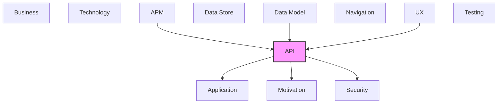

# API

REST APIs, operations, endpoints, and API integrations.

## Report Index

- [Layer Introduction](#layer-introduction)
- [Intra-Layer Relationships](#intra-layer-relationships)
- [Inter-Layer Dependencies](#inter-layer-dependencies)
- [Inter-Layer Relationships Table](#inter-layer-relationships-table)
- [Element Reference](#element-reference)

## Layer Introduction

| Metric                    | Count |
| ------------------------- | ----- |
| Elements                  | 191   |
| Intra-Layer Relationships | 137   |
| Inter-Layer Relationships | 139   |
| Inbound Relationships     | 39    |
| Outbound Relationships    | 100   |

**Cross-Layer References**:

- **Upstream layers**: [APM](./11-apm-layer-report.md), [Data Model](./07-data-model-layer-report.md), [UX](./09-ux-layer-report.md)
- **Downstream layers**: [Application](./04-application-layer-report.md), [Motivation](./01-motivation-layer-report.md), [Security](./03-security-layer-report.md)

## Intra-Layer Relationships

*This layer has >30 elements. Summary table shown instead of diagram.*

| Element                                              | Type              | Relationships |
| ---------------------------------------------------- | ----------------- | ------------- |
| `api.info.context-studio-api`                        | `info`            | 1             |
| `api.openapidocument.context-studio-open-api-spec`   | `openapidocument` | 1             |
| `api.operation.add-class-to-scheme`                  | `operation`       | 0             |
| `api.operation.add-parent-class-to-individual`       | `operation`       | 2             |
| `api.operation.analyze-text`                         | `operation`       | 2             |
| `api.operation.approve-proposal`                     | `operation`       | 1             |
| `api.operation.auto-resolve-conflicts`               | `operation`       | 2             |
| `api.operation.build-graph`                          | `operation`       | 0             |
| `api.operation.build-knowledge-graph`                | `operation`       | 1             |
| `api.operation.check-cycle`                          | `operation`       | 2             |
| `api.operation.create-changeset`                     | `operation`       | 2             |
| `api.operation.create-class`                         | `operation`       | 2             |
| `api.operation.create-concept-scheme`                | `operation`       | 2             |
| `api.operation.create-individual`                    | `operation`       | 4             |
| `api.operation.create-pipeline-configuration`        | `operation`       | 2             |
| `api.operation.create-property-definition`           | `operation`       | 2             |
| `api.operation.create-relationship`                  | `operation`       | 2             |
| `api.operation.create-taxonomy`                      | `operation`       | 2             |
| `api.operation.delete-class`                         | `operation`       | 1             |
| `api.operation.delete-concept-scheme`                | `operation`       | 1             |
| `api.operation.delete-individual`                    | `operation`       | 1             |
| `api.operation.delete-pipeline-configuration`        | `operation`       | 1             |
| `api.operation.delete-property-definition`           | `operation`       | 1             |
| `api.operation.delete-relationship`                  | `operation`       | 1             |
| `api.operation.delete-taxonomy`                      | `operation`       | 1             |
| `api.operation.detect-conflicts`                     | `operation`       | 1             |
| `api.operation.enrich-from-references`               | `operation`       | 2             |
| `api.operation.execute-pipeline`                     | `operation`       | 2             |
| `api.operation.execute-sparql`                       | `operation`       | 2             |
| `api.operation.export-ontology`                      | `operation`       | 2             |
| `api.operation.extract-entities`                     | `operation`       | 2             |
| `api.operation.get-all-paths`                        | `operation`       | 1             |
| `api.operation.get-background-task`                  | `operation`       | 1             |
| `api.operation.get-background-tasks-summary`         | `operation`       | 1             |
| `api.operation.get-centrality`                       | `operation`       | 1             |
| `api.operation.get-change-history-all`               | `operation`       | 2             |
| `api.operation.get-change-history-by-entity`         | `operation`       | 1             |
| `api.operation.get-changeset`                        | `operation`       | 1             |
| `api.operation.get-class`                            | `operation`       | 1             |
| `api.operation.get-communities`                      | `operation`       | 1             |
| `api.operation.get-concept-scheme`                   | `operation`       | 1             |
| `api.operation.get-configuration`                    | `operation`       | 1             |
| `api.operation.get-database-health`                  | `operation`       | 1             |
| `api.operation.get-degree-distribution`              | `operation`       | 1             |
| `api.operation.get-embedding-health`                 | `operation`       | 1             |
| `api.operation.get-entity-version`                   | `operation`       | 1             |
| `api.operation.get-graph-metrics`                    | `operation`       | 1             |
| `api.operation.get-import-run`                       | `operation`       | 1             |
| `api.operation.get-individual`                       | `operation`       | 3             |
| `api.operation.get-individual-inherited-properties`  | `operation`       | 1             |
| `api.operation.get-neighbors`                        | `operation`       | 1             |
| `api.operation.get-nlp-health`                       | `operation`       | 1             |
| `api.operation.get-pipeline-configuration`           | `operation`       | 1             |
| `api.operation.get-pipeline-executions`              | `operation`       | 1             |
| `api.operation.get-property-definition`              | `operation`       | 1             |
| `api.operation.get-rdf-triple-count`                 | `operation`       | 1             |
| `api.operation.get-rdf-triples`                      | `operation`       | 2             |
| `api.operation.get-reference-relations`              | `operation`       | 3             |
| `api.operation.get-reference-status`                 | `operation`       | 2             |
| `api.operation.get-relationship`                     | `operation`       | 1             |
| `api.operation.get-run-change-events`                | `operation`       | 1             |
| `api.operation.get-service-metrics`                  | `operation`       | 1             |
| `api.operation.get-services-health`                  | `operation`       | 0             |
| `api.operation.get-shortest-path`                    | `operation`       | 1             |
| `api.operation.get-subgraph`                         | `operation`       | 1             |
| `api.operation.get-subgraph-by-depth`                | `operation`       | 1             |
| `api.operation.get-sync-status`                      | `operation`       | 1             |
| `api.operation.get-system-health`                    | `operation`       | 1             |
| `api.operation.get-tasks-health`                     | `operation`       | 0             |
| `api.operation.get-taxonomy`                         | `operation`       | 1             |
| `api.operation.import-ontology`                      | `operation`       | 3             |
| `api.operation.list-background-tasks`                | `operation`       | 1             |
| `api.operation.list-classes`                         | `operation`       | 1             |
| `api.operation.list-concept-schemes`                 | `operation`       | 1             |
| `api.operation.list-entity-versions`                 | `operation`       | 1             |
| `api.operation.list-import-runs`                     | `operation`       | 1             |
| `api.operation.list-individuals`                     | `operation`       | 1             |
| `api.operation.list-pipeline-configurations`         | `operation`       | 1             |
| `api.operation.list-property-definitions`            | `operation`       | 1             |
| `api.operation.list-relationships`                   | `operation`       | 1             |
| `api.operation.list-taxonomies`                      | `operation`       | 1             |
| `api.operation.merge-proposal`                       | `operation`       | 1             |
| `api.operation.move-class`                           | `operation`       | 2             |
| `api.operation.pull-changes`                         | `operation`       | 1             |
| `api.operation.push-changes`                         | `operation`       | 1             |
| `api.operation.reject-proposal`                      | `operation`       | 2             |
| `api.operation.remove-parent-class-from-individual`  | `operation`       | 1             |
| `api.operation.reorder-individual-classes`           | `operation`       | 2             |
| `api.operation.reset-configuration`                  | `operation`       | 1             |
| `api.operation.resolve-conflicts`                    | `operation`       | 2             |
| `api.operation.search-references`                    | `operation`       | 3             |
| `api.operation.stage-changeset`                      | `operation`       | 1             |
| `api.operation.submit-proposal`                      | `operation`       | 1             |
| `api.operation.update-class`                         | `operation`       | 2             |
| `api.operation.update-concept-scheme`                | `operation`       | 2             |
| `api.operation.update-configuration-section`         | `operation`       | 2             |
| `api.operation.update-individual`                    | `operation`       | 2             |
| `api.operation.update-pipeline-configuration`        | `operation`       | 2             |
| `api.operation.update-property-definition`           | `operation`       | 2             |
| `api.operation.update-taxonomy`                      | `operation`       | 2             |
| `api.ratelimit.external-reference-api-rate-limit`    | `ratelimit`       | 1             |
| `api.requestbody.analyze-text-request`               | `requestbody`     | 1             |
| `api.requestbody.auto-resolve-conflicts-request`     | `requestbody`     | 1             |
| `api.requestbody.changeset-create-request`           | `requestbody`     | 1             |
| `api.requestbody.class-create-request`               | `requestbody`     | 1             |
| `api.requestbody.class-move-request`                 | `requestbody`     | 1             |
| `api.requestbody.class-update-request`               | `requestbody`     | 1             |
| `api.requestbody.concept-scheme-create-request`      | `requestbody`     | 1             |
| `api.requestbody.concept-scheme-update-request`      | `requestbody`     | 1             |
| `api.requestbody.config-section-update-request`      | `requestbody`     | 1             |
| `api.requestbody.cycle-check-request`                | `requestbody`     | 1             |
| `api.requestbody.data-property-value-request`        | `requestbody`     | 1             |
| `api.requestbody.enrich-from-references-request`     | `requestbody`     | 1             |
| `api.requestbody.export-request`                     | `requestbody`     | 1             |
| `api.requestbody.external-reference-request`         | `requestbody`     | 1             |
| `api.requestbody.extract-request`                    | `requestbody`     | 1             |
| `api.requestbody.individual-class-list-request`      | `requestbody`     | 1             |
| `api.requestbody.individual-class-request`           | `requestbody`     | 1             |
| `api.requestbody.individual-create-request`          | `requestbody`     | 1             |
| `api.requestbody.individual-update-request`          | `requestbody`     | 1             |
| `api.requestbody.lexical-sense-request`              | `requestbody`     | 1             |
| `api.requestbody.pipeline-configuration-create`      | `requestbody`     | 1             |
| `api.requestbody.pipeline-configuration-update`      | `requestbody`     | 1             |
| `api.requestbody.pipeline-execute-request`           | `requestbody`     | 1             |
| `api.requestbody.property-definition-create-request` | `requestbody`     | 1             |
| `api.requestbody.property-definition-update-request` | `requestbody`     | 1             |
| `api.requestbody.reference-relations-request`        | `requestbody`     | 1             |
| `api.requestbody.reference-search-request`           | `requestbody`     | 1             |
| `api.requestbody.reject-proposal-request`            | `requestbody`     | 1             |
| `api.requestbody.relationship-create-request`        | `requestbody`     | 1             |
| `api.requestbody.resolve-conflicts-request`          | `requestbody`     | 1             |
| `api.requestbody.serialization-scope-request`        | `requestbody`     | 1             |
| `api.requestbody.sparqlrequest`                      | `requestbody`     | 1             |
| `api.requestbody.taxonomy-create-request`            | `requestbody`     | 1             |
| `api.requestbody.taxonomy-update-request`            | `requestbody`     | 1             |
| `api.response.app-configuration-response`            | `response`        | 3             |
| `api.response.background-task-response`              | `response`        | 2             |
| `api.response.background-task-summary-response`      | `response`        | 1             |
| `api.response.centrality-response`                   | `response`        | 1             |
| `api.response.change-history-response`               | `response`        | 2             |
| `api.response.changeset-response`                    | `response`        | 3             |
| `api.response.class-response`                        | `response`        | 6             |
| `api.response.communities-response`                  | `response`        | 1             |
| `api.response.component-status-response`             | `response`        | 2             |
| `api.response.concept-scheme-response`               | `response`        | 5             |
| `api.response.conflict-report-response`              | `response`        | 1             |
| `api.response.conflict-response`                     | `response`        | 1             |
| `api.response.cycle-check-response`                  | `response`        | 1             |
| `api.response.data-property-value-response`          | `response`        | 1             |
| `api.response.database-health-response`              | `response`        | 1             |
| `api.response.degree-distribution-response`          | `response`        | 1             |
| `api.response.entity-version-response`               | `response`        | 2             |
| `api.response.execution-response`                    | `response`        | 2             |
| `api.response.external-reference-response`           | `response`        | 1             |
| `api.response.extraction-result-schema`              | `response`        | 2             |
| `api.response.graph-metrics-response`                | `response`        | 1             |
| `api.response.import-conflict-response`              | `response`        | 1             |
| `api.response.import-plan-response`                  | `response`        | 1             |
| `api.response.import-run-response`                   | `response`        | 2             |
| `api.response.individual-response`                   | `response`        | 8             |
| `api.response.interchange-change-event-response`     | `response`        | 1             |
| `api.response.knowledge-graph-response`              | `response`        | 1             |
| `api.response.lexical-sense-response`                | `response`        | 1             |
| `api.response.merge-result-response`                 | `response`        | 1             |
| `api.response.neighbors-response`                    | `response`        | 1             |
| `api.response.path-result-response`                  | `response`        | 2             |
| `api.response.pipeline-configuration-response`       | `response`        | 5             |
| `api.response.property-definition-response`          | `response`        | 5             |
| `api.response.proposal-response`                     | `response`        | 3             |
| `api.response.reference-relation-schema`             | `response`        | 1             |
| `api.response.reference-relations-response-schema`   | `response`        | 1             |
| `api.response.reference-result-schema`               | `response`        | 1             |
| `api.response.reference-search-response-schema`      | `response`        | 1             |
| `api.response.reference-source-status-schema`        | `response`        | 1             |
| `api.response.reference-status-response-schema`      | `response`        | 1             |
| `api.response.relationship-response`                 | `response`        | 4             |
| `api.response.resolution-record-response`            | `response`        | 1             |
| `api.response.serialization-scope-response`          | `response`        | 1             |
| `api.response.service-metrics-response`              | `response`        | 1             |
| `api.response.sparqlresponse`                        | `response`        | 1             |
| `api.response.subgraph-data-response`                | `response`        | 1             |
| `api.response.subgraph-result-response`              | `response`        | 1             |
| `api.response.sync-result-response`                  | `response`        | 2             |
| `api.response.sync-status-response`                  | `response`        | 1             |
| `api.response.system-health-response`                | `response`        | 1             |
| `api.response.taxonomy-response`                     | `response`        | 5             |
| `api.response.triple-count-response`                 | `response`        | 1             |
| `api.response.triple-response`                       | `response`        | 1             |
| `api.response.triples-response`                      | `response`        | 1             |
| `api.response.versioning-change-event-response`      | `response`        | 1             |
| `api.securityscheme.api-key`                         | `securityscheme`  | 1             |

## Inter-Layer Dependencies

## Inter-Layer Relationships Table

| Relationship ID                                           | Source Node                                             | Dest Node                                                     | Dest Layer    | Predicate    | Cardinality  | Strength |
| --------------------------------------------------------- | ------------------------------------------------------- | ------------------------------------------------------------- | ------------- | ------------ | ------------ | -------- |
| `api.operation.references.application.applicationservice` | `api.operation.add-class-to-scheme`                     | `application.applicationservice.ontology-service`             | `application` | `references` | many-to-many | medium   |
| `api.operation.references.application.applicationservice` | `api.operation.add-parent-class-to-individual`          | `application.applicationservice.ontology-service`             | `application` | `references` | many-to-many | medium   |
| `api.operation.references.application.applicationservice` | `api.operation.analyze-text`                            | `application.applicationservice.extraction-service`           | `application` | `references` | many-to-many | medium   |
| `api.operation.references.application.applicationservice` | `api.operation.approve-proposal`                        | `application.applicationservice.versioning-service`           | `application` | `references` | many-to-many | medium   |
| `api.operation.references.application.applicationservice` | `api.operation.auto-resolve-conflicts`                  | `application.applicationservice.versioning-service`           | `application` | `references` | many-to-many | medium   |
| `api.operation.references.application.applicationservice` | `api.operation.build-graph`                             | `application.applicationservice.graph-analysis-service`       | `application` | `references` | many-to-many | medium   |
| `api.operation.references.application.applicationservice` | `api.operation.build-knowledge-graph`                   | `application.applicationservice.graph-analysis-service`       | `application` | `references` | many-to-many | medium   |
| `api.operation.references.application.applicationservice` | `api.operation.check-cycle`                             | `application.applicationservice.graph-analysis-service`       | `application` | `references` | many-to-many | medium   |
| `api.operation.references.application.applicationservice` | `api.operation.create-changeset`                        | `application.applicationservice.versioning-service`           | `application` | `references` | many-to-many | medium   |
| `api.operation.references.application.applicationservice` | `api.operation.create-class`                            | `application.applicationservice.ontology-service`             | `application` | `references` | many-to-many | medium   |
| `api.operation.references.application.applicationservice` | `api.operation.create-concept-scheme`                   | `application.applicationservice.ontology-service`             | `application` | `references` | many-to-many | medium   |
| `api.operation.references.application.applicationservice` | `api.operation.create-individual`                       | `application.applicationservice.ontology-service`             | `application` | `references` | many-to-many | medium   |
| `api.operation.references.application.applicationservice` | `api.operation.create-pipeline-configuration`           | `application.applicationservice.pipeline-service`             | `application` | `references` | many-to-many | medium   |
| `api.operation.references.application.applicationservice` | `api.operation.create-property-definition`              | `application.applicationservice.ontology-service`             | `application` | `references` | many-to-many | medium   |
| `api.operation.references.application.applicationservice` | `api.operation.create-relationship`                     | `application.applicationservice.ontology-service`             | `application` | `references` | many-to-many | medium   |
| `api.operation.references.application.applicationservice` | `api.operation.create-taxonomy`                         | `application.applicationservice.ontology-service`             | `application` | `references` | many-to-many | medium   |
| `api.operation.references.application.applicationservice` | `api.operation.delete-class`                            | `application.applicationservice.ontology-service`             | `application` | `references` | many-to-many | medium   |
| `api.operation.references.application.applicationservice` | `api.operation.delete-concept-scheme`                   | `application.applicationservice.ontology-service`             | `application` | `references` | many-to-many | medium   |
| `api.operation.references.application.applicationservice` | `api.operation.delete-individual`                       | `application.applicationservice.ontology-service`             | `application` | `references` | many-to-many | medium   |
| `api.operation.references.application.applicationservice` | `api.operation.delete-pipeline-configuration`           | `application.applicationservice.pipeline-service`             | `application` | `references` | many-to-many | medium   |
| `api.operation.references.application.applicationservice` | `api.operation.delete-property-definition`              | `application.applicationservice.ontology-service`             | `application` | `references` | many-to-many | medium   |
| `api.operation.references.application.applicationservice` | `api.operation.delete-relationship`                     | `application.applicationservice.ontology-service`             | `application` | `references` | many-to-many | medium   |
| `api.operation.references.application.applicationservice` | `api.operation.delete-taxonomy`                         | `application.applicationservice.ontology-service`             | `application` | `references` | many-to-many | medium   |
| `api.operation.references.application.applicationservice` | `api.operation.detect-conflicts`                        | `application.applicationservice.versioning-service`           | `application` | `references` | many-to-many | medium   |
| `api.operation.references.application.applicationservice` | `api.operation.enrich-from-references`                  | `application.applicationservice.extraction-service`           | `application` | `references` | many-to-many | medium   |
| `api.operation.references.application.applicationservice` | `api.operation.execute-pipeline`                        | `application.applicationservice.pipeline-service`             | `application` | `references` | many-to-many | medium   |
| `api.operation.references.application.applicationservice` | `api.operation.execute-sparql`                          | `application.applicationservice.graph-analysis-service`       | `application` | `references` | many-to-many | medium   |
| `api.operation.references.application.applicationservice` | `api.operation.export-ontology`                         | `application.applicationservice.import-run-service`           | `application` | `references` | many-to-many | medium   |
| `api.operation.references.application.applicationservice` | `api.operation.extract-entities`                        | `application.applicationservice.extraction-service`           | `application` | `references` | many-to-many | medium   |
| `api.operation.references.application.applicationservice` | `api.operation.get-all-paths`                           | `application.applicationservice.graph-analysis-service`       | `application` | `references` | many-to-many | medium   |
| `api.operation.references.application.applicationservice` | `api.operation.get-background-task`                     | `application.applicationservice.admin-service`                | `application` | `references` | many-to-many | medium   |
| `api.operation.references.application.applicationservice` | `api.operation.get-background-tasks-summary`            | `application.applicationservice.admin-service`                | `application` | `references` | many-to-many | medium   |
| `api.operation.references.application.applicationservice` | `api.operation.get-centrality`                          | `application.applicationservice.graph-analysis-service`       | `application` | `references` | many-to-many | medium   |
| `api.operation.references.application.applicationservice` | `api.operation.get-change-history-all`                  | `application.applicationservice.versioning-service`           | `application` | `references` | many-to-many | medium   |
| `api.operation.references.application.applicationservice` | `api.operation.get-change-history-by-entity`            | `application.applicationservice.versioning-service`           | `application` | `references` | many-to-many | medium   |
| `api.operation.references.application.applicationservice` | `api.operation.get-changeset`                           | `application.applicationservice.versioning-service`           | `application` | `references` | many-to-many | medium   |
| `api.operation.references.application.applicationservice` | `api.operation.get-class`                               | `application.applicationservice.ontology-service`             | `application` | `references` | many-to-many | medium   |
| `api.operation.references.application.applicationservice` | `api.operation.get-communities`                         | `application.applicationservice.graph-analysis-service`       | `application` | `references` | many-to-many | medium   |
| `api.operation.references.application.applicationservice` | `api.operation.get-concept-scheme`                      | `application.applicationservice.ontology-service`             | `application` | `references` | many-to-many | medium   |
| `api.operation.references.application.applicationservice` | `api.operation.get-configuration`                       | `application.applicationservice.admin-service`                | `application` | `references` | many-to-many | medium   |
| `api.operation.references.application.applicationservice` | `api.operation.get-database-health`                     | `application.applicationservice.admin-service`                | `application` | `references` | many-to-many | medium   |
| `api.operation.references.application.applicationservice` | `api.operation.get-degree-distribution`                 | `application.applicationservice.graph-analysis-service`       | `application` | `references` | many-to-many | medium   |
| `api.operation.references.application.applicationservice` | `api.operation.get-embedding-health`                    | `application.applicationservice.admin-service`                | `application` | `references` | many-to-many | medium   |
| `api.operation.references.application.applicationservice` | `api.operation.get-entity-version`                      | `application.applicationservice.versioning-service`           | `application` | `references` | many-to-many | medium   |
| `api.operation.references.application.applicationservice` | `api.operation.get-graph-metrics`                       | `application.applicationservice.graph-analysis-service`       | `application` | `references` | many-to-many | medium   |
| `api.operation.references.application.applicationservice` | `api.operation.get-import-run`                          | `application.applicationservice.import-run-service`           | `application` | `references` | many-to-many | medium   |
| `api.operation.references.application.applicationservice` | `api.operation.get-individual-inherited-properties`     | `application.applicationservice.ontology-service`             | `application` | `references` | many-to-many | medium   |
| `api.operation.references.application.applicationservice` | `api.operation.get-individual`                          | `application.applicationservice.ontology-service`             | `application` | `references` | many-to-many | medium   |
| `api.operation.references.application.applicationservice` | `api.operation.get-neighbors`                           | `application.applicationservice.graph-analysis-service`       | `application` | `references` | many-to-many | medium   |
| `api.operation.references.application.applicationservice` | `api.operation.get-nlp-health`                          | `application.applicationservice.admin-service`                | `application` | `references` | many-to-many | medium   |
| `api.operation.references.application.applicationservice` | `api.operation.get-pipeline-configuration`              | `application.applicationservice.pipeline-service`             | `application` | `references` | many-to-many | medium   |
| `api.operation.references.application.applicationservice` | `api.operation.get-pipeline-executions`                 | `application.applicationservice.pipeline-service`             | `application` | `references` | many-to-many | medium   |
| `api.operation.references.application.applicationservice` | `api.operation.get-property-definition`                 | `application.applicationservice.ontology-service`             | `application` | `references` | many-to-many | medium   |
| `api.operation.references.application.applicationservice` | `api.operation.get-rdf-triple-count`                    | `application.applicationservice.graph-analysis-service`       | `application` | `references` | many-to-many | medium   |
| `api.operation.references.application.applicationservice` | `api.operation.get-rdf-triples`                         | `application.applicationservice.graph-analysis-service`       | `application` | `references` | many-to-many | medium   |
| `api.operation.references.application.applicationservice` | `api.operation.get-reference-relations`                 | `application.applicationservice.extraction-service`           | `application` | `references` | many-to-many | medium   |
| `api.operation.references.application.applicationservice` | `api.operation.get-reference-status`                    | `application.applicationservice.extraction-service`           | `application` | `references` | many-to-many | medium   |
| `api.operation.references.application.applicationservice` | `api.operation.get-relationship`                        | `application.applicationservice.ontology-service`             | `application` | `references` | many-to-many | medium   |
| `api.operation.references.application.applicationservice` | `api.operation.get-run-change-events`                   | `application.applicationservice.import-run-service`           | `application` | `references` | many-to-many | medium   |
| `api.operation.references.application.applicationservice` | `api.operation.get-service-metrics`                     | `application.applicationservice.admin-service`                | `application` | `references` | many-to-many | medium   |
| `api.operation.references.application.applicationservice` | `api.operation.get-services-health`                     | `application.applicationservice.admin-service`                | `application` | `references` | many-to-many | medium   |
| `api.operation.references.application.applicationservice` | `api.operation.get-shortest-path`                       | `application.applicationservice.graph-analysis-service`       | `application` | `references` | many-to-many | medium   |
| `api.operation.references.application.applicationservice` | `api.operation.get-subgraph-by-depth`                   | `application.applicationservice.graph-analysis-service`       | `application` | `references` | many-to-many | medium   |
| `api.operation.references.application.applicationservice` | `api.operation.get-subgraph`                            | `application.applicationservice.graph-analysis-service`       | `application` | `references` | many-to-many | medium   |
| `api.operation.references.application.applicationservice` | `api.operation.get-sync-status`                         | `application.applicationservice.versioning-service`           | `application` | `references` | many-to-many | medium   |
| `api.operation.references.application.applicationservice` | `api.operation.get-system-health`                       | `application.applicationservice.admin-service`                | `application` | `references` | many-to-many | medium   |
| `api.operation.references.application.applicationservice` | `api.operation.get-tasks-health`                        | `application.applicationservice.admin-service`                | `application` | `references` | many-to-many | medium   |
| `api.operation.references.application.applicationservice` | `api.operation.get-taxonomy`                            | `application.applicationservice.ontology-service`             | `application` | `references` | many-to-many | medium   |
| `api.operation.references.application.applicationservice` | `api.operation.import-ontology`                         | `application.applicationservice.import-run-service`           | `application` | `references` | many-to-many | medium   |
| `api.operation.references.application.applicationservice` | `api.operation.list-background-tasks`                   | `application.applicationservice.admin-service`                | `application` | `references` | many-to-many | medium   |
| `api.operation.references.application.applicationservice` | `api.operation.list-classes`                            | `application.applicationservice.ontology-service`             | `application` | `references` | many-to-many | medium   |
| `api.operation.references.application.applicationservice` | `api.operation.list-concept-schemes`                    | `application.applicationservice.ontology-service`             | `application` | `references` | many-to-many | medium   |
| `api.operation.references.application.applicationservice` | `api.operation.list-entity-versions`                    | `application.applicationservice.versioning-service`           | `application` | `references` | many-to-many | medium   |
| `api.operation.references.application.applicationservice` | `api.operation.list-import-runs`                        | `application.applicationservice.import-run-service`           | `application` | `references` | many-to-many | medium   |
| `api.operation.references.application.applicationservice` | `api.operation.list-individuals`                        | `application.applicationservice.ontology-service`             | `application` | `references` | many-to-many | medium   |
| `api.operation.references.application.applicationservice` | `api.operation.list-pipeline-configurations`            | `application.applicationservice.pipeline-service`             | `application` | `references` | many-to-many | medium   |
| `api.operation.references.application.applicationservice` | `api.operation.list-property-definitions`               | `application.applicationservice.ontology-service`             | `application` | `references` | many-to-many | medium   |
| `api.operation.references.application.applicationservice` | `api.operation.list-relationships`                      | `application.applicationservice.ontology-service`             | `application` | `references` | many-to-many | medium   |
| `api.operation.references.application.applicationservice` | `api.operation.list-taxonomies`                         | `application.applicationservice.ontology-service`             | `application` | `references` | many-to-many | medium   |
| `api.operation.references.application.applicationservice` | `api.operation.merge-proposal`                          | `application.applicationservice.versioning-service`           | `application` | `references` | many-to-many | medium   |
| `api.operation.references.application.applicationservice` | `api.operation.move-class`                              | `application.applicationservice.ontology-service`             | `application` | `references` | many-to-many | medium   |
| `api.operation.references.application.applicationservice` | `api.operation.pull-changes`                            | `application.applicationservice.versioning-service`           | `application` | `references` | many-to-many | medium   |
| `api.operation.references.application.applicationservice` | `api.operation.push-changes`                            | `application.applicationservice.versioning-service`           | `application` | `references` | many-to-many | medium   |
| `api.operation.references.application.applicationservice` | `api.operation.reject-proposal`                         | `application.applicationservice.versioning-service`           | `application` | `references` | many-to-many | medium   |
| `api.operation.references.application.applicationservice` | `api.operation.remove-parent-class-from-individual`     | `application.applicationservice.ontology-service`             | `application` | `references` | many-to-many | medium   |
| `api.operation.references.application.applicationservice` | `api.operation.reorder-individual-classes`              | `application.applicationservice.ontology-service`             | `application` | `references` | many-to-many | medium   |
| `api.operation.references.application.applicationservice` | `api.operation.reset-configuration`                     | `application.applicationservice.admin-service`                | `application` | `references` | many-to-many | medium   |
| `api.operation.references.application.applicationservice` | `api.operation.resolve-conflicts`                       | `application.applicationservice.versioning-service`           | `application` | `references` | many-to-many | medium   |
| `api.operation.references.application.applicationservice` | `api.operation.search-references`                       | `application.applicationservice.extraction-service`           | `application` | `references` | many-to-many | medium   |
| `api.operation.references.application.applicationservice` | `api.operation.stage-changeset`                         | `application.applicationservice.versioning-service`           | `application` | `references` | many-to-many | medium   |
| `api.operation.references.application.applicationservice` | `api.operation.submit-proposal`                         | `application.applicationservice.versioning-service`           | `application` | `references` | many-to-many | medium   |
| `api.operation.references.application.applicationservice` | `api.operation.update-class`                            | `application.applicationservice.ontology-service`             | `application` | `references` | many-to-many | medium   |
| `api.operation.references.application.applicationservice` | `api.operation.update-concept-scheme`                   | `application.applicationservice.ontology-service`             | `application` | `references` | many-to-many | medium   |
| `api.operation.references.application.applicationservice` | `api.operation.update-configuration-section`            | `application.applicationservice.admin-service`                | `application` | `references` | many-to-many | medium   |
| `api.operation.references.application.applicationservice` | `api.operation.update-individual`                       | `application.applicationservice.ontology-service`             | `application` | `references` | many-to-many | medium   |
| `api.operation.references.application.applicationservice` | `api.operation.update-pipeline-configuration`           | `application.applicationservice.pipeline-service`             | `application` | `references` | many-to-many | medium   |
| `api.operation.references.application.applicationservice` | `api.operation.update-property-definition`              | `application.applicationservice.ontology-service`             | `application` | `references` | many-to-many | medium   |
| `api.operation.references.application.applicationservice` | `api.operation.update-taxonomy`                         | `application.applicationservice.ontology-service`             | `application` | `references` | many-to-many | medium   |
| `api.ratelimit.implements.security.countermeasure`        | `api.ratelimit.external-reference-api-rate-limit`       | `security.countermeasure.parameterized-queries-via-orm`       | `security`    | `implements` | many-to-many | medium   |
| `api.ratelimit.satisfies.motivation.constraint`           | `api.ratelimit.external-reference-api-rate-limit`       | `motivation.constraint.external-reference-source-rate-limits` | `motivation`  | `satisfies`  | many-to-many | medium   |
| `apm.alert.monitors.api.ratelimit`                        | `apm.alert.rate-limit-breach-alert`                     | `api.ratelimit.external-reference-api-rate-limit`             | `api`         | `monitors`   | many-to-many | medium   |
| `data-model.objectschema.maps-to.api.response`            | `data-model.objectschema.app-configuration`             | `api.response.app-configuration-response`                     | `api`         | `maps-to`    | many-to-many | medium   |
| `data-model.objectschema.maps-to.api.response`            | `data-model.objectschema.background-task`               | `api.response.background-task-response`                       | `api`         | `maps-to`    | many-to-many | medium   |
| `data-model.objectschema.maps-to.api.response`            | `data-model.objectschema.change-event-entity`           | `api.response.change-history-response`                        | `api`         | `maps-to`    | many-to-many | medium   |
| `data-model.objectschema.maps-to.api.response`            | `data-model.objectschema.changeset-entity`              | `api.response.changeset-response`                             | `api`         | `maps-to`    | many-to-many | medium   |
| `data-model.objectschema.maps-to.api.response`            | `data-model.objectschema.concept-scheme-entity`         | `api.response.concept-scheme-response`                        | `api`         | `maps-to`    | many-to-many | medium   |
| `data-model.objectschema.maps-to.api.response`            | `data-model.objectschema.conflict-entity`               | `api.response.conflict-response`                              | `api`         | `maps-to`    | many-to-many | medium   |
| `data-model.objectschema.maps-to.api.response`            | `data-model.objectschema.conflict-report`               | `api.response.conflict-report-response`                       | `api`         | `maps-to`    | many-to-many | medium   |
| `data-model.objectschema.maps-to.api.response`            | `data-model.objectschema.entity-version-entity`         | `api.response.entity-version-response`                        | `api`         | `maps-to`    | many-to-many | medium   |
| `data-model.objectschema.maps-to.api.response`            | `data-model.objectschema.entity-version`                | `api.response.entity-version-response`                        | `api`         | `maps-to`    | many-to-many | medium   |
| `data-model.objectschema.maps-to.api.response`            | `data-model.objectschema.execution-entity`              | `api.response.execution-response`                             | `api`         | `maps-to`    | many-to-many | medium   |
| `data-model.objectschema.maps-to.api.response`            | `data-model.objectschema.extracted-entity`              | `api.response.extraction-result-schema`                       | `api`         | `maps-to`    | many-to-many | medium   |
| `data-model.objectschema.maps-to.api.response`            | `data-model.objectschema.extraction-result`             | `api.response.extraction-result-schema`                       | `api`         | `maps-to`    | many-to-many | medium   |
| `data-model.objectschema.maps-to.api.response`            | `data-model.objectschema.extraction-run`                | `api.response.extraction-result-schema`                       | `api`         | `maps-to`    | many-to-many | medium   |
| `data-model.objectschema.maps-to.api.response`            | `data-model.objectschema.graph-metrics`                 | `api.response.graph-metrics-response`                         | `api`         | `maps-to`    | many-to-many | medium   |
| `data-model.objectschema.maps-to.api.response`            | `data-model.objectschema.import-run-entity`             | `api.response.import-run-response`                            | `api`         | `maps-to`    | many-to-many | medium   |
| `data-model.objectschema.maps-to.api.requestbody`         | `data-model.objectschema.individual-class`              | `api.requestbody.individual-class-list-request`               | `api`         | `maps-to`    | many-to-many | medium   |
| `data-model.objectschema.maps-to.api.requestbody`         | `data-model.objectschema.individual-class`              | `api.requestbody.individual-class-request`                    | `api`         | `maps-to`    | many-to-many | medium   |
| `data-model.objectschema.maps-to.api.response`            | `data-model.objectschema.individual-entity`             | `api.response.individual-response`                            | `api`         | `maps-to`    | many-to-many | medium   |
| `data-model.objectschema.maps-to.api.response`            | `data-model.objectschema.knowledge-graph`               | `api.response.knowledge-graph-response`                       | `api`         | `maps-to`    | many-to-many | medium   |
| `data-model.objectschema.maps-to.api.response`            | `data-model.objectschema.merge-result`                  | `api.response.merge-result-response`                          | `api`         | `maps-to`    | many-to-many | medium   |
| `data-model.objectschema.maps-to.api.response`            | `data-model.objectschema.ontology-class-entity`         | `api.response.class-response`                                 | `api`         | `maps-to`    | many-to-many | medium   |
| `data-model.objectschema.maps-to.api.response`            | `data-model.objectschema.path-result`                   | `api.response.path-result-response`                           | `api`         | `maps-to`    | many-to-many | medium   |
| `data-model.objectschema.maps-to.api.requestbody`         | `data-model.objectschema.pipeline-configuration-entity` | `api.requestbody.pipeline-configuration-create`               | `api`         | `maps-to`    | many-to-many | medium   |
| `data-model.objectschema.maps-to.api.response`            | `data-model.objectschema.processing-metrics`            | `api.response.service-metrics-response`                       | `api`         | `maps-to`    | many-to-many | medium   |
| `data-model.objectschema.maps-to.api.requestbody`         | `data-model.objectschema.property-definition-entity`    | `api.requestbody.property-definition-create-request`          | `api`         | `maps-to`    | many-to-many | medium   |
| `data-model.objectschema.maps-to.api.requestbody`         | `data-model.objectschema.property-definition`           | `api.requestbody.property-definition-create-request`          | `api`         | `maps-to`    | many-to-many | medium   |
| `data-model.objectschema.maps-to.api.response`            | `data-model.objectschema.property-definition`           | `api.response.property-definition-response`                   | `api`         | `maps-to`    | many-to-many | medium   |
| `data-model.objectschema.maps-to.api.response`            | `data-model.objectschema.relationship-entity`           | `api.response.relationship-response`                          | `api`         | `maps-to`    | many-to-many | medium   |
| `data-model.objectschema.maps-to.api.response`            | `data-model.objectschema.resolution-record`             | `api.response.resolution-record-response`                     | `api`         | `maps-to`    | many-to-many | medium   |
| `data-model.objectschema.maps-to.api.response`            | `data-model.objectschema.subgraph`                      | `api.response.subgraph-data-response`                         | `api`         | `maps-to`    | many-to-many | medium   |
| `data-model.objectschema.maps-to.api.response`            | `data-model.objectschema.subgraph-result`               | `api.response.subgraph-result-response`                       | `api`         | `maps-to`    | many-to-many | medium   |
| `data-model.objectschema.maps-to.api.response`            | `data-model.objectschema.system-health`                 | `api.response.database-health-response`                       | `api`         | `maps-to`    | many-to-many | medium   |
| `data-model.objectschema.maps-to.api.response`            | `data-model.objectschema.taxonomy-entity`               | `api.response.taxonomy-response`                              | `api`         | `maps-to`    | many-to-many | medium   |
| `data-model.objectschema.maps-to.api.response`            | `data-model.objectschema.triple-extraction-result`      | `api.response.triples-response`                               | `api`         | `maps-to`    | many-to-many | medium   |
| `ux.view.uses.api.securityscheme`                         | `ux.view.admin-view`                                    | `api.securityscheme.api-key`                                  | `api`         | `uses`       | many-to-many | medium   |
| `ux.view.uses.api.securityscheme`                         | `ux.view.configuration-view`                            | `api.securityscheme.api-key`                                  | `api`         | `uses`       | many-to-many | medium   |
| `ux.view.uses.api.securityscheme`                         | `ux.view.datasets-view`                                 | `api.securityscheme.api-key`                                  | `api`         | `uses`       | many-to-many | medium   |
| `ux.view.uses.api.securityscheme`                         | `ux.view.rag-experiments-view`                          | `api.securityscheme.api-key`                                  | `api`         | `uses`       | many-to-many | medium   |

## Element Reference

### Context Studio API {#context-studio-api}

**ID**: `api.info.context-studio-api`

**Type**: `info`

OpenAPI Info object for the Context Studio local-server REST API — knowledge graph management, RAG pipeline, and system administration endpoints

#### Attributes

| Name        | Value                                                           |
| ----------- | --------------------------------------------------------------- |
| description | Local-first knowledge graph API for RAG and ontology management |
| title       | Context Studio API                                              |
| version     | 0.1.0                                                           |

#### Relationships

| Type        | Related Element                                    | Predicate         | Direction |
| ----------- | -------------------------------------------------- | ----------------- | --------- |
| intra-layer | `api.openapidocument.context-studio-open-api-spec` | `associated-with` | outbound  |

### Context Studio OpenAPI Spec {#context-studio-openapi-spec}

**ID**: `api.openapidocument.context-studio-open-api-spec`

**Type**: `openapidocument`

The generated OpenAPI 3.0.3 specification document for the Context Studio local server. Auto-generated by scripts/update_api_specs.py from FastAPI route definitions and served as openapi.json.

#### Attributes

| Name    | Value                      |
| ------- | -------------------------- |
| info    | Context Studio API v0.1.0  |
| openapi | 3.0.3                      |
| paths   | /local-server/openapi.json |

#### Relationships

| Type        | Related Element               | Predicate         | Direction |
| ----------- | ----------------------------- | ----------------- | --------- |
| intra-layer | `api.info.context-studio-api` | `associated-with` | inbound   |

### Add Class To Scheme {#add-class-to-scheme}

**ID**: `api.operation.add-class-to-scheme`

**Type**: `operation`

Add an existing class to a concept scheme

#### Attributes

| Name        | Value                                           |
| ----------- | ----------------------------------------------- |
| http_method | POST                                            |
| http_path   | /api/schemes/\{scheme_id\}/classes/\{class_id\} |
| operationId | addClassToScheme                                |
| summary     | Add Class To Scheme                             |
| tags        | schemes                                         |

#### Relationships

| Type        | Related Element                                   | Predicate    | Direction |
| ----------- | ------------------------------------------------- | ------------ | --------- |
| inter-layer | `application.applicationservice.ontology-service` | `references` | outbound  |

### Add Parent Class To Individual {#add-parent-class-to-individual}

**ID**: `api.operation.add-parent-class-to-individual`

**Type**: `operation`

POST /api/individuals/\{individual_id\}/classes — add a parent class assignment to an individual

#### Attributes

| Name        | Value                                      |
| ----------- | ------------------------------------------ |
| http_method | POST                                       |
| http_path   | /api/individuals/\{individual_id\}/classes |
| operationId | addParentClassToIndividual                 |
| summary     | Add Parent Class To Individual             |
| tags        | individuals                                |

#### Relationships

| Type        | Related Element                                   | Predicate    | Direction |
| ----------- | ------------------------------------------------- | ------------ | --------- |
| inter-layer | `application.applicationservice.ontology-service` | `references` | outbound  |
| intra-layer | `api.requestbody.individual-class-request`        | `aggregates` | outbound  |
| intra-layer | `api.response.individual-response`                | `delivers`   | outbound  |

### Analyze Text {#analyze-text}

**ID**: `api.operation.analyze-text`

**Type**: `operation`

POST /api/analyze_text — analyze text for entities, concepts, and relationships without persisting

#### Attributes

| Name        | Value             |
| ----------- | ----------------- |
| http_method | POST              |
| http_path   | /api/analyze_text |
| operationId | analyzeText       |
| summary     | Analyze Text      |
| tags        | analyze_text      |

#### Relationships

| Type        | Related Element                                     | Predicate    | Direction |
| ----------- | --------------------------------------------------- | ------------ | --------- |
| inter-layer | `application.applicationservice.extraction-service` | `references` | outbound  |
| intra-layer | `api.requestbody.analyze-text-request`              | `aggregates` | outbound  |
| intra-layer | `api.response.extraction-result-schema`             | `delivers`   | outbound  |

### Approve Proposal {#approve-proposal}

**ID**: `api.operation.approve-proposal`

**Type**: `operation`

POST /api/v1/versioning/proposals/\{proposal_id\}/approve — approve a merge proposal

#### Attributes

| Name        | Value                                                |
| ----------- | ---------------------------------------------------- |
| http_method | POST                                                 |
| http_path   | /api/v1/versioning/proposals/\{proposal_id\}/approve |
| operationId | approveProposal                                      |
| summary     | Approve Proposal                                     |
| tags        | versioning                                           |

#### Relationships

| Type        | Related Element                                     | Predicate    | Direction |
| ----------- | --------------------------------------------------- | ------------ | --------- |
| inter-layer | `application.applicationservice.versioning-service` | `references` | outbound  |
| intra-layer | `api.response.proposal-response`                    | `delivers`   | outbound  |

### Auto Resolve Conflicts {#auto-resolve-conflicts}

**ID**: `api.operation.auto-resolve-conflicts`

**Type**: `operation`

POST /api/v1/versioning/proposals/\{proposal_id\}/auto-resolve — automatically resolve merge conflicts using default strategies

#### Attributes

| Name        | Value                                                     |
| ----------- | --------------------------------------------------------- |
| http_method | POST                                                      |
| http_path   | /api/v1/versioning/proposals/\{proposal_id\}/auto-resolve |
| operationId | autoResolveConflicts                                      |
| summary     | Auto Resolve Conflicts                                    |
| tags        | versioning                                                |

#### Relationships

| Type        | Related Element                                     | Predicate    | Direction |
| ----------- | --------------------------------------------------- | ------------ | --------- |
| inter-layer | `application.applicationservice.versioning-service` | `references` | outbound  |
| intra-layer | `api.requestbody.auto-resolve-conflicts-request`    | `aggregates` | outbound  |
| intra-layer | `api.response.conflict-response`                    | `delivers`   | outbound  |

### Build Graph {#build-graph}

**ID**: `api.operation.build-graph`

**Type**: `operation`

Explicitly build the in-memory graph from current ontology data; allows on-demand graph refresh and validates that construction succeeds without errors

#### Attributes

| Name        | Value            |
| ----------- | ---------------- |
| http_method | POST             |
| http_path   | /api/graph/build |
| operationId | buildGraph       |
| summary     | Build Graph      |
| tags        | graph            |

#### Relationships

| Type        | Related Element                                         | Predicate    | Direction |
| ----------- | ------------------------------------------------------- | ------------ | --------- |
| inter-layer | `application.applicationservice.graph-analysis-service` | `references` | outbound  |

### Build Knowledge Graph {#build-knowledge-graph}

**ID**: `api.operation.build-knowledge-graph`

**Type**: `operation`

POST /api/graph/build — build an in-memory knowledge graph from persisted ontology entities and relationships

#### Attributes

| Name        | Value                 |
| ----------- | --------------------- |
| http_method | POST                  |
| http_path   | /api/graph/build      |
| operationId | buildKnowledgeGraph   |
| summary     | Build Knowledge Graph |
| tags        | graph                 |

#### Relationships

| Type        | Related Element                                         | Predicate    | Direction |
| ----------- | ------------------------------------------------------- | ------------ | --------- |
| inter-layer | `application.applicationservice.graph-analysis-service` | `references` | outbound  |
| intra-layer | `api.response.knowledge-graph-response`                 | `delivers`   | outbound  |

### Check Cycle {#check-cycle}

**ID**: `api.operation.check-cycle`

**Type**: `operation`

POST /api/graph/cycle-check — detect if adding a directed edge would create a cycle

#### Attributes

| Name        | Value                  |
| ----------- | ---------------------- |
| http_method | POST                   |
| http_path   | /api/graph/cycle-check |
| operationId | checkCycle             |
| summary     | Check Cycle            |
| tags        | graph                  |

#### Relationships

| Type        | Related Element                                         | Predicate    | Direction |
| ----------- | ------------------------------------------------------- | ------------ | --------- |
| inter-layer | `application.applicationservice.graph-analysis-service` | `references` | outbound  |
| intra-layer | `api.requestbody.cycle-check-request`                   | `aggregates` | outbound  |
| intra-layer | `api.response.cycle-check-response`                     | `delivers`   | outbound  |

### Create Changeset {#create-changeset}

**ID**: `api.operation.create-changeset`

**Type**: `operation`

POST /api/v1/versioning/changesets — create a new versioning changeset for grouping changes

#### Attributes

| Name        | Value                         |
| ----------- | ----------------------------- |
| http_method | POST                          |
| http_path   | /api/v1/versioning/changesets |
| operationId | createChangeset               |
| summary     | Create Changeset              |
| tags        | versioning                    |

#### Relationships

| Type        | Related Element                                     | Predicate    | Direction |
| ----------- | --------------------------------------------------- | ------------ | --------- |
| inter-layer | `application.applicationservice.versioning-service` | `references` | outbound  |
| intra-layer | `api.requestbody.changeset-create-request`          | `aggregates` | outbound  |
| intra-layer | `api.response.changeset-response`                   | `delivers`   | outbound  |

### Create Class {#create-class}

**ID**: `api.operation.create-class`

**Type**: `operation`

POST /api/schemes/\{scheme_id\}/classes — create a class within a concept scheme

#### Attributes

| Name        | Value                              |
| ----------- | ---------------------------------- |
| http_method | POST                               |
| http_path   | /api/schemes/\{scheme_id\}/classes |
| operationId | createClass                        |
| summary     | Create Class                       |
| tags        | schemes                            |

#### Relationships

| Type        | Related Element                                   | Predicate    | Direction |
| ----------- | ------------------------------------------------- | ------------ | --------- |
| inter-layer | `application.applicationservice.ontology-service` | `references` | outbound  |
| intra-layer | `api.requestbody.class-create-request`            | `aggregates` | outbound  |
| intra-layer | `api.response.class-response`                     | `delivers`   | outbound  |

### Create Concept Scheme {#create-concept-scheme}

**ID**: `api.operation.create-concept-scheme`

**Type**: `operation`

POST /api/taxonomies/\{taxonomy_id\}/schemes — create a concept scheme within a taxonomy

#### Attributes

| Name        | Value                                   |
| ----------- | --------------------------------------- |
| http_method | POST                                    |
| http_path   | /api/taxonomies/\{taxonomy_id\}/schemes |
| operationId | createConceptScheme                     |
| summary     | Create Concept Scheme                   |
| tags        | taxonomies                              |

#### Relationships

| Type        | Related Element                                   | Predicate    | Direction |
| ----------- | ------------------------------------------------- | ------------ | --------- |
| inter-layer | `application.applicationservice.ontology-service` | `references` | outbound  |
| intra-layer | `api.requestbody.concept-scheme-create-request`   | `aggregates` | outbound  |
| intra-layer | `api.response.concept-scheme-response`            | `delivers`   | outbound  |

### Create Individual {#create-individual}

**ID**: `api.operation.create-individual`

**Type**: `operation`

POST /api/individuals — create an individual (named instance) of one or more classes

#### Attributes

| Name        | Value             |
| ----------- | ----------------- |
| http_method | POST              |
| http_path   | /api/individuals  |
| operationId | createIndividual  |
| summary     | Create Individual |
| tags        | individuals       |

#### Relationships

| Type        | Related Element                                   | Predicate    | Direction |
| ----------- | ------------------------------------------------- | ------------ | --------- |
| inter-layer | `application.applicationservice.ontology-service` | `references` | outbound  |
| intra-layer | `api.requestbody.external-reference-request`      | `aggregates` | outbound  |
| intra-layer | `api.requestbody.individual-create-request`       | `aggregates` | outbound  |
| intra-layer | `api.requestbody.lexical-sense-request`           | `aggregates` | outbound  |
| intra-layer | `api.response.individual-response`                | `delivers`   | outbound  |

### Create Pipeline Configuration {#create-pipeline-configuration}

**ID**: `api.operation.create-pipeline-configuration`

**Type**: `operation`

POST /api/pipelines — create a new LLM pipeline configuration

#### Attributes

| Name        | Value                         |
| ----------- | ----------------------------- |
| http_method | POST                          |
| http_path   | /api/pipelines                |
| operationId | createPipelineConfiguration   |
| summary     | Create Pipeline Configuration |
| tags        | pipelines                     |

#### Relationships

| Type        | Related Element                                   | Predicate    | Direction |
| ----------- | ------------------------------------------------- | ------------ | --------- |
| inter-layer | `application.applicationservice.pipeline-service` | `references` | outbound  |
| intra-layer | `api.requestbody.pipeline-configuration-create`   | `aggregates` | outbound  |
| intra-layer | `api.response.pipeline-configuration-response`    | `delivers`   | outbound  |

### Create Property Definition {#create-property-definition}

**ID**: `api.operation.create-property-definition`

**Type**: `operation`

POST /api/properties — define a new relationship type (object property) in the ontology

#### Attributes

| Name        | Value                      |
| ----------- | -------------------------- |
| http_method | POST                       |
| http_path   | /api/properties            |
| operationId | createPropertyDefinition   |
| summary     | Create Property Definition |
| tags        | properties                 |

#### Relationships

| Type        | Related Element                                      | Predicate    | Direction |
| ----------- | ---------------------------------------------------- | ------------ | --------- |
| inter-layer | `application.applicationservice.ontology-service`    | `references` | outbound  |
| intra-layer | `api.requestbody.property-definition-create-request` | `aggregates` | outbound  |
| intra-layer | `api.response.property-definition-response`          | `delivers`   | outbound  |

### Create Relationship {#create-relationship}

**ID**: `api.operation.create-relationship`

**Type**: `operation`

POST /api/relationships — create a typed directed relationship between two ontology entities

#### Attributes

| Name        | Value               |
| ----------- | ------------------- |
| http_method | POST                |
| http_path   | /api/relationships  |
| operationId | createRelationship  |
| summary     | Create Relationship |
| tags        | relationships       |

#### Relationships

| Type        | Related Element                                   | Predicate    | Direction |
| ----------- | ------------------------------------------------- | ------------ | --------- |
| inter-layer | `application.applicationservice.ontology-service` | `references` | outbound  |
| intra-layer | `api.requestbody.relationship-create-request`     | `aggregates` | outbound  |
| intra-layer | `api.response.relationship-response`              | `delivers`   | outbound  |

### Create Taxonomy {#create-taxonomy}

**ID**: `api.operation.create-taxonomy`

**Type**: `operation`

POST /api/taxonomies — create a new taxonomy in the ontology management context

#### Attributes

| Name        | Value           |
| ----------- | --------------- |
| http_method | POST            |
| http_path   | /api/taxonomies |
| operationId | createTaxonomy  |
| summary     | Create Taxonomy |
| tags        | taxonomies      |

#### Relationships

| Type        | Related Element                                   | Predicate    | Direction |
| ----------- | ------------------------------------------------- | ------------ | --------- |
| inter-layer | `application.applicationservice.ontology-service` | `references` | outbound  |
| intra-layer | `api.requestbody.taxonomy-create-request`         | `aggregates` | outbound  |
| intra-layer | `api.response.taxonomy-response`                  | `delivers`   | outbound  |

### Delete Class {#delete-class}

**ID**: `api.operation.delete-class`

**Type**: `operation`

DELETE /api/classes/\{class_id\} — delete a class and cascade to subclasses

#### Attributes

| Name        | Value                     |
| ----------- | ------------------------- |
| http_method | DELETE                    |
| http_path   | /api/classes/\{class_id\} |
| operationId | deleteClass               |
| summary     | Delete Class              |
| tags        | classes                   |

#### Relationships

| Type        | Related Element                                   | Predicate    | Direction |
| ----------- | ------------------------------------------------- | ------------ | --------- |
| inter-layer | `application.applicationservice.ontology-service` | `references` | outbound  |
| intra-layer | `api.response.class-response`                     | `delivers`   | outbound  |

### Delete Concept Scheme {#delete-concept-scheme}

**ID**: `api.operation.delete-concept-scheme`

**Type**: `operation`

DELETE /api/schemes/\{scheme_id\} — delete a concept scheme and its classes

#### Attributes

| Name        | Value                      |
| ----------- | -------------------------- |
| http_method | DELETE                     |
| http_path   | /api/schemes/\{scheme_id\} |
| operationId | deleteConceptScheme        |
| summary     | Delete Concept Scheme      |
| tags        | schemes                    |

#### Relationships

| Type        | Related Element                                   | Predicate    | Direction |
| ----------- | ------------------------------------------------- | ------------ | --------- |
| inter-layer | `application.applicationservice.ontology-service` | `references` | outbound  |
| intra-layer | `api.response.concept-scheme-response`            | `delivers`   | outbound  |

### Delete Individual {#delete-individual}

**ID**: `api.operation.delete-individual`

**Type**: `operation`

DELETE /api/individuals/\{individual_id\} — delete an individual

#### Attributes

| Name        | Value                              |
| ----------- | ---------------------------------- |
| http_method | DELETE                             |
| http_path   | /api/individuals/\{individual_id\} |
| operationId | deleteIndividual                   |
| summary     | Delete Individual                  |
| tags        | individuals                        |

#### Relationships

| Type        | Related Element                                   | Predicate    | Direction |
| ----------- | ------------------------------------------------- | ------------ | --------- |
| inter-layer | `application.applicationservice.ontology-service` | `references` | outbound  |
| intra-layer | `api.response.individual-response`                | `delivers`   | outbound  |

### Delete Pipeline Configuration {#delete-pipeline-configuration}

**ID**: `api.operation.delete-pipeline-configuration`

**Type**: `operation`

DELETE /api/pipelines/\{pipeline_id\} — delete a pipeline configuration

#### Attributes

| Name        | Value                          |
| ----------- | ------------------------------ |
| http_method | DELETE                         |
| http_path   | /api/pipelines/\{pipeline_id\} |
| operationId | deletePipelineConfiguration    |
| summary     | Delete Pipeline Configuration  |
| tags        | pipelines                      |

#### Relationships

| Type        | Related Element                                   | Predicate    | Direction |
| ----------- | ------------------------------------------------- | ------------ | --------- |
| inter-layer | `application.applicationservice.pipeline-service` | `references` | outbound  |
| intra-layer | `api.response.pipeline-configuration-response`    | `delivers`   | outbound  |

### Delete Property Definition {#delete-property-definition}

**ID**: `api.operation.delete-property-definition`

**Type**: `operation`

DELETE /api/properties/\{property_id\} — delete a property definition

#### Attributes

| Name        | Value                           |
| ----------- | ------------------------------- |
| http_method | DELETE                          |
| http_path   | /api/properties/\{property_id\} |
| operationId | deletePropertyDefinition        |
| summary     | Delete Property Definition      |
| tags        | properties                      |

#### Relationships

| Type        | Related Element                                   | Predicate    | Direction |
| ----------- | ------------------------------------------------- | ------------ | --------- |
| inter-layer | `application.applicationservice.ontology-service` | `references` | outbound  |
| intra-layer | `api.response.property-definition-response`       | `delivers`   | outbound  |

### Delete Relationship {#delete-relationship}

**ID**: `api.operation.delete-relationship`

**Type**: `operation`

DELETE /api/relationships/\{relationship_id\} — remove a typed relationship between ontology entities

#### Attributes

| Name        | Value                                  |
| ----------- | -------------------------------------- |
| http_method | DELETE                                 |
| http_path   | /api/relationships/\{relationship_id\} |
| operationId | deleteRelationship                     |
| summary     | Delete Relationship                    |
| tags        | relationships                          |

#### Relationships

| Type        | Related Element                                   | Predicate    | Direction |
| ----------- | ------------------------------------------------- | ------------ | --------- |
| inter-layer | `application.applicationservice.ontology-service` | `references` | outbound  |
| intra-layer | `api.response.relationship-response`              | `delivers`   | outbound  |

### Delete Taxonomy {#delete-taxonomy}

**ID**: `api.operation.delete-taxonomy`

**Type**: `operation`

DELETE /api/taxonomies/\{taxonomy_id\} — delete a taxonomy and cascade to child entities

#### Attributes

| Name        | Value                           |
| ----------- | ------------------------------- |
| http_method | DELETE                          |
| http_path   | /api/taxonomies/\{taxonomy_id\} |
| operationId | deleteTaxonomy                  |
| summary     | Delete Taxonomy                 |
| tags        | taxonomies                      |

#### Relationships

| Type        | Related Element                                   | Predicate    | Direction |
| ----------- | ------------------------------------------------- | ------------ | --------- |
| inter-layer | `application.applicationservice.ontology-service` | `references` | outbound  |
| intra-layer | `api.response.taxonomy-response`                  | `delivers`   | outbound  |

### Detect Conflicts {#detect-conflicts}

**ID**: `api.operation.detect-conflicts`

**Type**: `operation`

GET /api/v1/versioning/proposals/\{proposal_id\}/conflicts — detect merge conflicts in a proposal

#### Attributes

| Name        | Value                                                  |
| ----------- | ------------------------------------------------------ |
| http_method | GET                                                    |
| http_path   | /api/v1/versioning/proposals/\{proposal_id\}/conflicts |
| operationId | detectConflicts                                        |
| summary     | Detect Conflicts                                       |
| tags        | versioning                                             |

#### Relationships

| Type        | Related Element                                     | Predicate    | Direction |
| ----------- | --------------------------------------------------- | ------------ | --------- |
| inter-layer | `application.applicationservice.versioning-service` | `references` | outbound  |
| intra-layer | `api.response.conflict-report-response`             | `delivers`   | outbound  |

### Enrich From References {#enrich-from-references}

**ID**: `api.operation.enrich-from-references`

**Type**: `operation`

POST /api/enrich_from_references — enrich existing ontology entities with data from external reference sources

#### Attributes

| Name        | Value                       |
| ----------- | --------------------------- |
| http_method | POST                        |
| http_path   | /api/enrich_from_references |
| operationId | enrichFromReferences        |
| summary     | Enrich From References      |
| tags        | enrich_from_references      |

#### Relationships

| Type        | Related Element                                     | Predicate    | Direction |
| ----------- | --------------------------------------------------- | ------------ | --------- |
| inter-layer | `application.applicationservice.extraction-service` | `references` | outbound  |
| intra-layer | `api.requestbody.enrich-from-references-request`    | `aggregates` | outbound  |
| intra-layer | `api.response.external-reference-response`          | `delivers`   | outbound  |

### Execute Pipeline {#execute-pipeline}

**ID**: `api.operation.execute-pipeline`

**Type**: `operation`

POST /api/pipelines/\{pipeline_id\}/execute — execute a pipeline configuration with optional input overrides

#### Attributes

| Name        | Value                                  |
| ----------- | -------------------------------------- |
| http_method | POST                                   |
| http_path   | /api/pipelines/\{pipeline_id\}/execute |
| operationId | executePipeline                        |
| summary     | Execute Pipeline                       |
| tags        | pipelines                              |

#### Relationships

| Type        | Related Element                                   | Predicate    | Direction |
| ----------- | ------------------------------------------------- | ------------ | --------- |
| inter-layer | `application.applicationservice.pipeline-service` | `references` | outbound  |
| intra-layer | `api.requestbody.pipeline-execute-request`        | `aggregates` | outbound  |
| intra-layer | `api.response.execution-response`                 | `delivers`   | outbound  |

### Execute SPARQL {#execute-sparql}

**ID**: `api.operation.execute-sparql`

**Type**: `operation`

POST /api/graph/sparql — execute a SPARQL SELECT query over the in-memory RDF graph

#### Attributes

| Name        | Value             |
| ----------- | ----------------- |
| http_method | POST              |
| http_path   | /api/graph/sparql |
| operationId | executeSparql     |
| summary     | Execute SPARQL    |
| tags        | graph             |

#### Relationships

| Type        | Related Element                                         | Predicate    | Direction |
| ----------- | ------------------------------------------------------- | ------------ | --------- |
| inter-layer | `application.applicationservice.graph-analysis-service` | `references` | outbound  |
| intra-layer | `api.requestbody.sparqlrequest`                         | `aggregates` | outbound  |
| intra-layer | `api.response.sparqlresponse`                           | `delivers`   | outbound  |

### Export Ontology {#export-ontology}

**ID**: `api.operation.export-ontology`

**Type**: `operation`

POST /api/v1/interchange/export — export ontology in SKOS, OWL, or GraphML format as streaming response

#### Attributes

| Name        | Value                      |
| ----------- | -------------------------- |
| http_method | POST                       |
| http_path   | /api/v1/interchange/export |
| operationId | exportOntology             |
| summary     | Export Ontology            |
| tags        | interchange                |

#### Relationships

| Type        | Related Element                                     | Predicate    | Direction |
| ----------- | --------------------------------------------------- | ------------ | --------- |
| inter-layer | `application.applicationservice.import-run-service` | `references` | outbound  |
| intra-layer | `api.requestbody.export-request`                    | `aggregates` | outbound  |
| intra-layer | `api.response.serialization-scope-response`         | `delivers`   | outbound  |

### Extract Entities {#extract-entities}

**ID**: `api.operation.extract-entities`

**Type**: `operation`

POST /api/extract — extract ontology entities from a text corpus using NLP and LLM pipelines

#### Attributes

| Name        | Value            |
| ----------- | ---------------- |
| http_method | POST             |
| http_path   | /api/extract     |
| operationId | extractEntities  |
| summary     | Extract Entities |
| tags        | extract          |

#### Relationships

| Type        | Related Element                                     | Predicate    | Direction |
| ----------- | --------------------------------------------------- | ------------ | --------- |
| inter-layer | `application.applicationservice.extraction-service` | `references` | outbound  |
| intra-layer | `api.requestbody.extract-request`                   | `aggregates` | outbound  |
| intra-layer | `api.response.extraction-result-schema`             | `delivers`   | outbound  |

### Get All Paths {#get-all-paths}

**ID**: `api.operation.get-all-paths`

**Type**: `operation`

GET /api/graph/paths/all — find all paths between two graph nodes up to a maximum depth

#### Attributes

| Name        | Value                |
| ----------- | -------------------- |
| http_method | GET                  |
| http_path   | /api/graph/paths/all |
| operationId | getAllPaths          |
| summary     | Get All Paths        |
| tags        | graph                |

#### Relationships

| Type        | Related Element                                         | Predicate    | Direction |
| ----------- | ------------------------------------------------------- | ------------ | --------- |
| inter-layer | `application.applicationservice.graph-analysis-service` | `references` | outbound  |
| intra-layer | `api.response.path-result-response`                     | `delivers`   | outbound  |

### Get Background Task {#get-background-task}

**ID**: `api.operation.get-background-task`

**Type**: `operation`

GET /api/v1/admin/tasks/\{task_id\} — retrieve a single background task by ID

#### Attributes

| Name        | Value                           |
| ----------- | ------------------------------- |
| http_method | GET                             |
| http_path   | /api/v1/admin/tasks/\{task_id\} |
| operationId | getBackgroundTask               |
| summary     | Get Background Task             |
| tags        | admin                           |

#### Relationships

| Type        | Related Element                                | Predicate    | Direction |
| ----------- | ---------------------------------------------- | ------------ | --------- |
| inter-layer | `application.applicationservice.admin-service` | `references` | outbound  |
| intra-layer | `api.response.background-task-response`        | `delivers`   | outbound  |

### Get Background Tasks Summary {#get-background-tasks-summary}

**ID**: `api.operation.get-background-tasks-summary`

**Type**: `operation`

GET /api/v1/admin/health/tasks — retrieve background task queue summary and counts

#### Attributes

| Name        | Value                        |
| ----------- | ---------------------------- |
| http_method | GET                          |
| http_path   | /api/v1/admin/health/tasks   |
| operationId | getBackgroundTasksSummary    |
| summary     | Get Background Tasks Summary |
| tags        | admin                        |

#### Relationships

| Type        | Related Element                                 | Predicate    | Direction |
| ----------- | ----------------------------------------------- | ------------ | --------- |
| inter-layer | `application.applicationservice.admin-service`  | `references` | outbound  |
| intra-layer | `api.response.background-task-summary-response` | `delivers`   | outbound  |

### Get Centrality {#get-centrality}

**ID**: `api.operation.get-centrality`

**Type**: `operation`

GET /api/graph/centrality — compute node centrality scores (betweenness, pagerank, closeness, degree)

#### Attributes

| Name        | Value                 |
| ----------- | --------------------- |
| http_method | GET                   |
| http_path   | /api/graph/centrality |
| operationId | getCentrality         |
| summary     | Get Centrality        |
| tags        | graph                 |

#### Relationships

| Type        | Related Element                                         | Predicate    | Direction |
| ----------- | ------------------------------------------------------- | ------------ | --------- |
| inter-layer | `application.applicationservice.graph-analysis-service` | `references` | outbound  |
| intra-layer | `api.response.centrality-response`                      | `delivers`   | outbound  |

### Get Change History All {#get-change-history-all}

**ID**: `api.operation.get-change-history-all`

**Type**: `operation`

GET /api/v1/versioning/changes — retrieve full change history for all entities

#### Attributes

| Name        | Value                      |
| ----------- | -------------------------- |
| http_method | GET                        |
| http_path   | /api/v1/versioning/changes |
| operationId | getChangeHistoryAll        |
| summary     | Get Change History All     |
| tags        | versioning                 |

#### Relationships

| Type        | Related Element                                     | Predicate    | Direction |
| ----------- | --------------------------------------------------- | ------------ | --------- |
| inter-layer | `application.applicationservice.versioning-service` | `references` | outbound  |
| intra-layer | `api.response.change-history-response`              | `delivers`   | outbound  |
| intra-layer | `api.response.versioning-change-event-response`     | `delivers`   | outbound  |

### Get Change History By Entity {#get-change-history-by-entity}

**ID**: `api.operation.get-change-history-by-entity`

**Type**: `operation`

GET /api/v1/versioning/changes/\{entity_id\} — retrieve change history for a specific entity

#### Attributes

| Name        | Value                                    |
| ----------- | ---------------------------------------- |
| http_method | GET                                      |
| http_path   | /api/v1/versioning/changes/\{entity_id\} |
| operationId | getChangeHistoryByEntity                 |
| summary     | Get Change History By Entity             |
| tags        | versioning                               |

#### Relationships

| Type        | Related Element                                     | Predicate    | Direction |
| ----------- | --------------------------------------------------- | ------------ | --------- |
| inter-layer | `application.applicationservice.versioning-service` | `references` | outbound  |
| intra-layer | `api.response.change-history-response`              | `delivers`   | outbound  |

### Get Changeset {#get-changeset}

**ID**: `api.operation.get-changeset`

**Type**: `operation`

GET /api/v1/versioning/changesets/\{changeset_id\} — retrieve a versioning changeset by ID

#### Attributes

| Name        | Value                                          |
| ----------- | ---------------------------------------------- |
| http_method | GET                                            |
| http_path   | /api/v1/versioning/changesets/\{changeset_id\} |
| operationId | getChangeset                                   |
| summary     | Get Changeset                                  |
| tags        | versioning                                     |

#### Relationships

| Type        | Related Element                                     | Predicate    | Direction |
| ----------- | --------------------------------------------------- | ------------ | --------- |
| inter-layer | `application.applicationservice.versioning-service` | `references` | outbound  |
| intra-layer | `api.response.changeset-response`                   | `delivers`   | outbound  |

### Get Class {#get-class}

**ID**: `api.operation.get-class`

**Type**: `operation`

GET /api/classes/\{class_id\} — retrieve a single ontology class by ID

#### Attributes

| Name        | Value                     |
| ----------- | ------------------------- |
| http_method | GET                       |
| http_path   | /api/classes/\{class_id\} |
| operationId | getClass                  |
| summary     | Get Class                 |
| tags        | classes                   |

#### Relationships

| Type        | Related Element                                   | Predicate    | Direction |
| ----------- | ------------------------------------------------- | ------------ | --------- |
| inter-layer | `application.applicationservice.ontology-service` | `references` | outbound  |
| intra-layer | `api.response.class-response`                     | `delivers`   | outbound  |

### Get Communities {#get-communities}

**ID**: `api.operation.get-communities`

**Type**: `operation`

GET /api/graph/communities — detect communities/clusters in the knowledge graph

#### Attributes

| Name        | Value                  |
| ----------- | ---------------------- |
| http_method | GET                    |
| http_path   | /api/graph/communities |
| operationId | getCommunities         |
| summary     | Get Communities        |
| tags        | graph                  |

#### Relationships

| Type        | Related Element                                         | Predicate    | Direction |
| ----------- | ------------------------------------------------------- | ------------ | --------- |
| inter-layer | `application.applicationservice.graph-analysis-service` | `references` | outbound  |
| intra-layer | `api.response.communities-response`                     | `delivers`   | outbound  |

### Get Concept Scheme {#get-concept-scheme}

**ID**: `api.operation.get-concept-scheme`

**Type**: `operation`

GET /api/schemes/\{scheme_id\} — retrieve a single concept scheme by ID

#### Attributes

| Name        | Value                      |
| ----------- | -------------------------- |
| http_method | GET                        |
| http_path   | /api/schemes/\{scheme_id\} |
| operationId | getConceptScheme           |
| summary     | Get Concept Scheme         |
| tags        | schemes                    |

#### Relationships

| Type        | Related Element                                   | Predicate    | Direction |
| ----------- | ------------------------------------------------- | ------------ | --------- |
| inter-layer | `application.applicationservice.ontology-service` | `references` | outbound  |
| intra-layer | `api.response.concept-scheme-response`            | `delivers`   | outbound  |

### Get Configuration {#get-configuration}

**ID**: `api.operation.get-configuration`

**Type**: `operation`

GET /api/v1/admin/configuration — retrieve current application configuration

#### Attributes

| Name        | Value                       |
| ----------- | --------------------------- |
| http_method | GET                         |
| http_path   | /api/v1/admin/configuration |
| operationId | getConfiguration            |
| summary     | Get Configuration           |
| tags        | admin                       |

#### Relationships

| Type        | Related Element                                | Predicate    | Direction |
| ----------- | ---------------------------------------------- | ------------ | --------- |
| inter-layer | `application.applicationservice.admin-service` | `references` | outbound  |
| intra-layer | `api.response.app-configuration-response`      | `delivers`   | outbound  |

### Get Database Health {#get-database-health}

**ID**: `api.operation.get-database-health`

**Type**: `operation`

GET /api/v1/admin/health/database — check database connectivity and integrity for local.db and operations.db

#### Attributes

| Name        | Value                         |
| ----------- | ----------------------------- |
| http_method | GET                           |
| http_path   | /api/v1/admin/health/database |
| operationId | getDatabaseHealth             |
| summary     | Get Database Health           |
| tags        | admin                         |

#### Relationships

| Type        | Related Element                                | Predicate    | Direction |
| ----------- | ---------------------------------------------- | ------------ | --------- |
| inter-layer | `application.applicationservice.admin-service` | `references` | outbound  |
| intra-layer | `api.response.database-health-response`        | `delivers`   | outbound  |

### Get Degree Distribution {#get-degree-distribution}

**ID**: `api.operation.get-degree-distribution`

**Type**: `operation`

GET /api/graph/degree-distribution — retrieve node degree distribution histogram

#### Attributes

| Name        | Value                          |
| ----------- | ------------------------------ |
| http_method | GET                            |
| http_path   | /api/graph/degree-distribution |
| operationId | getDegreeDistribution          |
| summary     | Get Degree Distribution        |
| tags        | graph                          |

#### Relationships

| Type        | Related Element                                         | Predicate    | Direction |
| ----------- | ------------------------------------------------------- | ------------ | --------- |
| inter-layer | `application.applicationservice.graph-analysis-service` | `references` | outbound  |
| intra-layer | `api.response.degree-distribution-response`             | `delivers`   | outbound  |

### Get Embedding Health {#get-embedding-health}

**ID**: `api.operation.get-embedding-health`

**Type**: `operation`

GET /api/v1/admin/health/embedding — check embedding model availability and readiness

#### Attributes

| Name        | Value                          |
| ----------- | ------------------------------ |
| http_method | GET                            |
| http_path   | /api/v1/admin/health/embedding |
| operationId | getEmbeddingHealth             |
| summary     | Get Embedding Health           |
| tags        | admin                          |

#### Relationships

| Type        | Related Element                                | Predicate    | Direction |
| ----------- | ---------------------------------------------- | ------------ | --------- |
| inter-layer | `application.applicationservice.admin-service` | `references` | outbound  |
| intra-layer | `api.response.component-status-response`       | `delivers`   | outbound  |

### Get Entity Version {#get-entity-version}

**ID**: `api.operation.get-entity-version`

**Type**: `operation`

GET /api/v1/versioning/versions/\{entity_id\}/\{version\} — retrieve a specific historical version of an entity

#### Attributes

| Name        | Value                                                 |
| ----------- | ----------------------------------------------------- |
| http_method | GET                                                   |
| http_path   | /api/v1/versioning/versions/\{entity_id\}/\{version\} |
| operationId | getEntityVersion                                      |
| summary     | Get Entity Version                                    |
| tags        | versioning                                            |

#### Relationships

| Type        | Related Element                                     | Predicate    | Direction |
| ----------- | --------------------------------------------------- | ------------ | --------- |
| inter-layer | `application.applicationservice.versioning-service` | `references` | outbound  |
| intra-layer | `api.response.entity-version-response`              | `delivers`   | outbound  |

### Get Graph Metrics {#get-graph-metrics}

**ID**: `api.operation.get-graph-metrics`

**Type**: `operation`

GET /api/graph/metrics — retrieve global graph statistics (node count, edge count, density, diameter)

#### Attributes

| Name        | Value              |
| ----------- | ------------------ |
| http_method | GET                |
| http_path   | /api/graph/metrics |
| operationId | getGraphMetrics    |
| summary     | Get Graph Metrics  |
| tags        | graph              |

#### Relationships

| Type        | Related Element                                         | Predicate    | Direction |
| ----------- | ------------------------------------------------------- | ------------ | --------- |
| inter-layer | `application.applicationservice.graph-analysis-service` | `references` | outbound  |
| intra-layer | `api.response.graph-metrics-response`                   | `delivers`   | outbound  |

### Get Import Run {#get-import-run}

**ID**: `api.operation.get-import-run`

**Type**: `operation`

GET /api/v1/interchange/runs/\{run_id\} — retrieve a single import run record by ID

#### Attributes

| Name        | Value                               |
| ----------- | ----------------------------------- |
| http_method | GET                                 |
| http_path   | /api/v1/interchange/runs/\{run_id\} |
| operationId | getImportRun                        |
| summary     | Get Import Run                      |
| tags        | interchange                         |

#### Relationships

| Type        | Related Element                                     | Predicate    | Direction |
| ----------- | --------------------------------------------------- | ------------ | --------- |
| inter-layer | `application.applicationservice.import-run-service` | `references` | outbound  |
| intra-layer | `api.response.import-run-response`                  | `delivers`   | outbound  |

### Get Individual {#get-individual}

**ID**: `api.operation.get-individual`

**Type**: `operation`

GET /api/individuals/\{individual_id\} — retrieve a single individual by ID

#### Attributes

| Name        | Value                              |
| ----------- | ---------------------------------- |
| http_method | GET                                |
| http_path   | /api/individuals/\{individual_id\} |
| operationId | getIndividual                      |
| summary     | Get Individual                     |
| tags        | individuals                        |

#### Relationships

| Type        | Related Element                                   | Predicate    | Direction |
| ----------- | ------------------------------------------------- | ------------ | --------- |
| inter-layer | `application.applicationservice.ontology-service` | `references` | outbound  |
| intra-layer | `api.requestbody.data-property-value-request`     | `aggregates` | outbound  |
| intra-layer | `api.response.individual-response`                | `delivers`   | outbound  |
| intra-layer | `api.response.lexical-sense-response`             | `delivers`   | outbound  |

### Get Individual Inherited Properties {#get-individual-inherited-properties}

**ID**: `api.operation.get-individual-inherited-properties`

**Type**: `operation`

GET /api/individuals/\{individual_id\}/inherited-properties — retrieve data properties inherited from parent classes

#### Attributes

| Name        | Value                                                   |
| ----------- | ------------------------------------------------------- |
| http_method | GET                                                     |
| http_path   | /api/individuals/\{individual_id\}/inherited-properties |
| operationId | getIndividualInheritedProperties                        |
| summary     | Get Individual Inherited Properties                     |
| tags        | individuals                                             |

#### Relationships

| Type        | Related Element                                   | Predicate    | Direction |
| ----------- | ------------------------------------------------- | ------------ | --------- |
| inter-layer | `application.applicationservice.ontology-service` | `references` | outbound  |
| intra-layer | `api.response.data-property-value-response`       | `delivers`   | outbound  |

### Get Neighbors {#get-neighbors}

**ID**: `api.operation.get-neighbors`

**Type**: `operation`

GET /api/graph/nodes/\{node_id\}/neighbors — retrieve immediate neighbors of a graph node

#### Attributes

| Name        | Value                                  |
| ----------- | -------------------------------------- |
| http_method | GET                                    |
| http_path   | /api/graph/nodes/\{node_id\}/neighbors |
| operationId | getNeighbors                           |
| summary     | Get Neighbors                          |
| tags        | graph                                  |

#### Relationships

| Type        | Related Element                                         | Predicate    | Direction |
| ----------- | ------------------------------------------------------- | ------------ | --------- |
| inter-layer | `application.applicationservice.graph-analysis-service` | `references` | outbound  |
| intra-layer | `api.response.neighbors-response`                       | `delivers`   | outbound  |

### Get NLP Health {#get-nlp-health}

**ID**: `api.operation.get-nlp-health`

**Type**: `operation`

GET /api/v1/admin/health/nlp — check spaCy NLP processor availability and readiness

#### Attributes

| Name        | Value                    |
| ----------- | ------------------------ |
| http_method | GET                      |
| http_path   | /api/v1/admin/health/nlp |
| operationId | getNlpHealth             |
| summary     | Get NLP Health           |
| tags        | admin                    |

#### Relationships

| Type        | Related Element                                | Predicate    | Direction |
| ----------- | ---------------------------------------------- | ------------ | --------- |
| inter-layer | `application.applicationservice.admin-service` | `references` | outbound  |
| intra-layer | `api.response.component-status-response`       | `delivers`   | outbound  |

### Get Pipeline Configuration {#get-pipeline-configuration}

**ID**: `api.operation.get-pipeline-configuration`

**Type**: `operation`

GET /api/pipelines/\{pipeline_id\} — retrieve a single pipeline configuration by ID

#### Attributes

| Name        | Value                          |
| ----------- | ------------------------------ |
| http_method | GET                            |
| http_path   | /api/pipelines/\{pipeline_id\} |
| operationId | getPipelineConfiguration       |
| summary     | Get Pipeline Configuration     |
| tags        | pipelines                      |

#### Relationships

| Type        | Related Element                                   | Predicate    | Direction |
| ----------- | ------------------------------------------------- | ------------ | --------- |
| inter-layer | `application.applicationservice.pipeline-service` | `references` | outbound  |
| intra-layer | `api.response.pipeline-configuration-response`    | `delivers`   | outbound  |

### Get Pipeline Executions {#get-pipeline-executions}

**ID**: `api.operation.get-pipeline-executions`

**Type**: `operation`

GET /api/pipelines/\{pipeline_id\}/executions — list all execution records for a pipeline

#### Attributes

| Name        | Value                                     |
| ----------- | ----------------------------------------- |
| http_method | GET                                       |
| http_path   | /api/pipelines/\{pipeline_id\}/executions |
| operationId | getPipelineExecutions                     |
| summary     | Get Pipeline Executions                   |
| tags        | pipelines                                 |

#### Relationships

| Type        | Related Element                                   | Predicate    | Direction |
| ----------- | ------------------------------------------------- | ------------ | --------- |
| inter-layer | `application.applicationservice.pipeline-service` | `references` | outbound  |
| intra-layer | `api.response.execution-response`                 | `delivers`   | outbound  |

### Get Property Definition {#get-property-definition}

**ID**: `api.operation.get-property-definition`

**Type**: `operation`

GET /api/properties/\{property_id\} — retrieve a single property definition by ID

#### Attributes

| Name        | Value                           |
| ----------- | ------------------------------- |
| http_method | GET                             |
| http_path   | /api/properties/\{property_id\} |
| operationId | getPropertyDefinition           |
| summary     | Get Property Definition         |
| tags        | properties                      |

#### Relationships

| Type        | Related Element                                   | Predicate    | Direction |
| ----------- | ------------------------------------------------- | ------------ | --------- |
| inter-layer | `application.applicationservice.ontology-service` | `references` | outbound  |
| intra-layer | `api.response.property-definition-response`       | `delivers`   | outbound  |

### Get RDF Triple Count {#get-rdf-triple-count}

**ID**: `api.operation.get-rdf-triple-count`

**Type**: `operation`

GET /api/graph/rdf/count — get the count of RDF triples in the knowledge graph

#### Attributes

| Name        | Value                |
| ----------- | -------------------- |
| http_method | GET                  |
| http_path   | /api/graph/rdf/count |
| operationId | getRdfTripleCount    |
| summary     | Get RDF Triple Count |
| tags        | graph                |

#### Relationships

| Type        | Related Element                                         | Predicate    | Direction |
| ----------- | ------------------------------------------------------- | ------------ | --------- |
| inter-layer | `application.applicationservice.graph-analysis-service` | `references` | outbound  |
| intra-layer | `api.response.triple-count-response`                    | `delivers`   | outbound  |

### Get RDF Triples {#get-rdf-triples}

**ID**: `api.operation.get-rdf-triples`

**Type**: `operation`

GET /api/graph/rdf/triples — retrieve all RDF triples from the knowledge graph

#### Attributes

| Name        | Value                  |
| ----------- | ---------------------- |
| http_method | GET                    |
| http_path   | /api/graph/rdf/triples |
| operationId | getRdfTriples          |
| summary     | Get RDF Triples        |
| tags        | graph                  |

#### Relationships

| Type        | Related Element                                         | Predicate    | Direction |
| ----------- | ------------------------------------------------------- | ------------ | --------- |
| inter-layer | `application.applicationservice.graph-analysis-service` | `references` | outbound  |
| intra-layer | `api.response.triple-response`                          | `delivers`   | outbound  |
| intra-layer | `api.response.triples-response`                         | `delivers`   | outbound  |

### Get Reference Relations {#get-reference-relations}

**ID**: `api.operation.get-reference-relations`

**Type**: `operation`

POST /api/reference/relations — retrieve semantic relations for a concept from external reference sources

#### Attributes

| Name        | Value                    |
| ----------- | ------------------------ |
| http_method | POST                     |
| http_path   | /api/reference/relations |
| operationId | getReferenceRelations    |
| summary     | Get Reference Relations  |
| tags        | reference                |

#### Relationships

| Type        | Related Element                                     | Predicate    | Direction |
| ----------- | --------------------------------------------------- | ------------ | --------- |
| inter-layer | `application.applicationservice.extraction-service` | `references` | outbound  |
| intra-layer | `api.requestbody.reference-relations-request`       | `aggregates` | outbound  |
| intra-layer | `api.response.reference-relation-schema`            | `delivers`   | outbound  |
| intra-layer | `api.response.reference-relations-response-schema`  | `delivers`   | outbound  |

### Get Reference Status {#get-reference-status}

**ID**: `api.operation.get-reference-status`

**Type**: `operation`

GET /api/reference/status — check availability and status of external reference sources (ConceptNet, DBpedia, Wikidata, schema.org)

#### Attributes

| Name        | Value                 |
| ----------- | --------------------- |
| http_method | GET                   |
| http_path   | /api/reference/status |
| operationId | getReferenceStatus    |
| summary     | Get Reference Status  |
| tags        | reference             |

#### Relationships

| Type        | Related Element                                     | Predicate    | Direction |
| ----------- | --------------------------------------------------- | ------------ | --------- |
| inter-layer | `application.applicationservice.extraction-service` | `references` | outbound  |
| intra-layer | `api.response.reference-source-status-schema`       | `delivers`   | outbound  |
| intra-layer | `api.response.reference-status-response-schema`     | `delivers`   | outbound  |

### Get Relationship {#get-relationship}

**ID**: `api.operation.get-relationship`

**Type**: `operation`

GET /api/relationships/\{relationship_id\} — retrieve a single relationship by ID

#### Attributes

| Name        | Value                                  |
| ----------- | -------------------------------------- |
| http_method | GET                                    |
| http_path   | /api/relationships/\{relationship_id\} |
| operationId | getRelationship                        |
| summary     | Get Relationship                       |
| tags        | relationships                          |

#### Relationships

| Type        | Related Element                                   | Predicate    | Direction |
| ----------- | ------------------------------------------------- | ------------ | --------- |
| inter-layer | `application.applicationservice.ontology-service` | `references` | outbound  |
| intra-layer | `api.response.relationship-response`              | `delivers`   | outbound  |

### Get Run Change Events {#get-run-change-events}

**ID**: `api.operation.get-run-change-events`

**Type**: `operation`

GET /api/v1/interchange/runs/\{run_id\}/change-events — retrieve all change events generated by an import run

#### Attributes

| Name        | Value                                             |
| ----------- | ------------------------------------------------- |
| http_method | GET                                               |
| http_path   | /api/v1/interchange/runs/\{run_id\}/change-events |
| operationId | getRunChangeEvents                                |
| summary     | Get Run Change Events                             |
| tags        | interchange                                       |

#### Relationships

| Type        | Related Element                                     | Predicate    | Direction |
| ----------- | --------------------------------------------------- | ------------ | --------- |
| inter-layer | `application.applicationservice.import-run-service` | `references` | outbound  |
| intra-layer | `api.response.interchange-change-event-response`    | `delivers`   | outbound  |

### Get Service Metrics {#get-service-metrics}

**ID**: `api.operation.get-service-metrics`

**Type**: `operation`

GET /api/v1/admin/health/services — retrieve per-service metrics and uptime statistics

#### Attributes

| Name        | Value                         |
| ----------- | ----------------------------- |
| http_method | GET                           |
| http_path   | /api/v1/admin/health/services |
| operationId | getServiceMetrics             |
| summary     | Get Service Metrics           |
| tags        | admin                         |

#### Relationships

| Type        | Related Element                                | Predicate    | Direction |
| ----------- | ---------------------------------------------- | ------------ | --------- |
| inter-layer | `application.applicationservice.admin-service` | `references` | outbound  |
| intra-layer | `api.response.service-metrics-response`        | `delivers`   | outbound  |

### Get Services Health {#get-services-health}

**ID**: `api.operation.get-services-health`

**Type**: `operation`

Get service-level metrics including system uptime and list of available LLM providers

#### Attributes

| Name        | Value                         |
| ----------- | ----------------------------- |
| http_method | GET                           |
| http_path   | /api/v1/admin/health/services |
| operationId | getServicesHealth             |
| summary     | Get Services Health           |
| tags        | admin                         |

#### Relationships

| Type        | Related Element                                | Predicate    | Direction |
| ----------- | ---------------------------------------------- | ------------ | --------- |
| inter-layer | `application.applicationservice.admin-service` | `references` | outbound  |

### Get Shortest Path {#get-shortest-path}

**ID**: `api.operation.get-shortest-path`

**Type**: `operation`

GET /api/graph/paths/shortest — find shortest path between two graph nodes

#### Attributes

| Name        | Value                     |
| ----------- | ------------------------- |
| http_method | GET                       |
| http_path   | /api/graph/paths/shortest |
| operationId | getShortestPath           |
| summary     | Get Shortest Path         |
| tags        | graph                     |

#### Relationships

| Type        | Related Element                                         | Predicate    | Direction |
| ----------- | ------------------------------------------------------- | ------------ | --------- |
| inter-layer | `application.applicationservice.graph-analysis-service` | `references` | outbound  |
| intra-layer | `api.response.path-result-response`                     | `delivers`   | outbound  |

### Get Subgraph {#get-subgraph}

**ID**: `api.operation.get-subgraph`

**Type**: `operation`

GET /api/graph/subgraph — extract a subgraph for a set of root node IDs

#### Attributes

| Name        | Value               |
| ----------- | ------------------- |
| http_method | GET                 |
| http_path   | /api/graph/subgraph |
| operationId | getSubgraph         |
| summary     | Get Subgraph        |
| tags        | graph               |

#### Relationships

| Type        | Related Element                                         | Predicate    | Direction |
| ----------- | ------------------------------------------------------- | ------------ | --------- |
| inter-layer | `application.applicationservice.graph-analysis-service` | `references` | outbound  |
| intra-layer | `api.response.subgraph-result-response`                 | `delivers`   | outbound  |

### Get Subgraph By Depth {#get-subgraph-by-depth}

**ID**: `api.operation.get-subgraph-by-depth`

**Type**: `operation`

GET /api/graph/nodes/\{node_id\}/subgraph — extract a depth-bounded subgraph rooted at a node

#### Attributes

| Name        | Value                                 |
| ----------- | ------------------------------------- |
| http_method | GET                                   |
| http_path   | /api/graph/nodes/\{node_id\}/subgraph |
| operationId | getSubgraphByDepth                    |
| summary     | Get Subgraph By Depth                 |
| tags        | graph                                 |

#### Relationships

| Type        | Related Element                                         | Predicate    | Direction |
| ----------- | ------------------------------------------------------- | ------------ | --------- |
| inter-layer | `application.applicationservice.graph-analysis-service` | `references` | outbound  |
| intra-layer | `api.response.subgraph-data-response`                   | `delivers`   | outbound  |

### Get Sync Status {#get-sync-status}

**ID**: `api.operation.get-sync-status`

**Type**: `operation`

GET /api/v1/versioning/sync/status — retrieve current remote sync status and last sync timestamps

#### Attributes

| Name        | Value                          |
| ----------- | ------------------------------ |
| http_method | GET                            |
| http_path   | /api/v1/versioning/sync/status |
| operationId | getSyncStatus                  |
| summary     | Get Sync Status                |
| tags        | versioning                     |

#### Relationships

| Type        | Related Element                                     | Predicate    | Direction |
| ----------- | --------------------------------------------------- | ------------ | --------- |
| inter-layer | `application.applicationservice.versioning-service` | `references` | outbound  |
| intra-layer | `api.response.sync-status-response`                 | `delivers`   | outbound  |

### Get System Health {#get-system-health}

**ID**: `api.operation.get-system-health`

**Type**: `operation`

GET /api/v1/admin/health — retrieve overall system health status across all services

#### Attributes

| Name        | Value                |
| ----------- | -------------------- |
| http_method | GET                  |
| http_path   | /api/v1/admin/health |
| operationId | getSystemHealth      |
| summary     | Get System Health    |
| tags        | admin                |

#### Relationships

| Type        | Related Element                                | Predicate    | Direction |
| ----------- | ---------------------------------------------- | ------------ | --------- |
| inter-layer | `application.applicationservice.admin-service` | `references` | outbound  |
| intra-layer | `api.response.system-health-response`          | `delivers`   | outbound  |

### Get Tasks Health {#get-tasks-health}

**ID**: `api.operation.get-tasks-health`

**Type**: `operation`

Get summary of background task execution status with counts grouped by status (pending, running, completed, failed)

#### Attributes

| Name        | Value                      |
| ----------- | -------------------------- |
| http_method | GET                        |
| http_path   | /api/v1/admin/health/tasks |
| operationId | getTasksHealth             |
| summary     | Get Tasks Health           |
| tags        | admin                      |

#### Relationships

| Type        | Related Element                                | Predicate    | Direction |
| ----------- | ---------------------------------------------- | ------------ | --------- |
| inter-layer | `application.applicationservice.admin-service` | `references` | outbound  |

### Get Taxonomy {#get-taxonomy}

**ID**: `api.operation.get-taxonomy`

**Type**: `operation`

GET /api/taxonomies/\{taxonomy_id\} — retrieve a single taxonomy by ID

#### Attributes

| Name        | Value                           |
| ----------- | ------------------------------- |
| http_method | GET                             |
| http_path   | /api/taxonomies/\{taxonomy_id\} |
| operationId | getTaxonomy                     |
| summary     | Get Taxonomy                    |
| tags        | taxonomies                      |

#### Relationships

| Type        | Related Element                                   | Predicate    | Direction |
| ----------- | ------------------------------------------------- | ------------ | --------- |
| inter-layer | `application.applicationservice.ontology-service` | `references` | outbound  |
| intra-layer | `api.response.taxonomy-response`                  | `delivers`   | outbound  |

### Import Ontology {#import-ontology}

**ID**: `api.operation.import-ontology`

**Type**: `operation`

POST /api/v1/interchange/import — import ontology from SKOS, OWL, or GraphML file; creates ImportRun record

#### Attributes

| Name        | Value                      |
| ----------- | -------------------------- |
| http_method | POST                       |
| http_path   | /api/v1/interchange/import |
| operationId | importOntology             |
| summary     | Import Ontology            |
| tags        | interchange                |

#### Relationships

| Type        | Related Element                                     | Predicate    | Direction |
| ----------- | --------------------------------------------------- | ------------ | --------- |
| inter-layer | `application.applicationservice.import-run-service` | `references` | outbound  |
| intra-layer | `api.requestbody.serialization-scope-request`       | `aggregates` | outbound  |
| intra-layer | `api.response.import-conflict-response`             | `delivers`   | outbound  |
| intra-layer | `api.response.import-plan-response`                 | `delivers`   | outbound  |

### List Background Tasks {#list-background-tasks}

**ID**: `api.operation.list-background-tasks`

**Type**: `operation`

GET /api/v1/admin/tasks — list all background tasks with status

#### Attributes

| Name        | Value                 |
| ----------- | --------------------- |
| http_method | GET                   |
| http_path   | /api/v1/admin/tasks   |
| operationId | listBackgroundTasks   |
| summary     | List Background Tasks |
| tags        | admin                 |

#### Relationships

| Type        | Related Element                                | Predicate    | Direction |
| ----------- | ---------------------------------------------- | ------------ | --------- |
| inter-layer | `application.applicationservice.admin-service` | `references` | outbound  |
| intra-layer | `api.response.background-task-response`        | `delivers`   | outbound  |

### List Classes {#list-classes}

**ID**: `api.operation.list-classes`

**Type**: `operation`

GET /api/classes — list all classes with optional filtering by scheme, parent, search

#### Attributes

| Name        | Value        |
| ----------- | ------------ |
| http_method | GET          |
| http_path   | /api/classes |
| operationId | listClasses  |
| summary     | List Classes |
| tags        | classes      |

#### Relationships

| Type        | Related Element                                   | Predicate    | Direction |
| ----------- | ------------------------------------------------- | ------------ | --------- |
| inter-layer | `application.applicationservice.ontology-service` | `references` | outbound  |
| intra-layer | `api.response.class-response`                     | `delivers`   | outbound  |

### List Concept Schemes {#list-concept-schemes}

**ID**: `api.operation.list-concept-schemes`

**Type**: `operation`

GET /api/schemes — list all concept schemes with optional taxonomy filter

#### Attributes

| Name        | Value                |
| ----------- | -------------------- |
| http_method | GET                  |
| http_path   | /api/schemes         |
| operationId | listConceptSchemes   |
| summary     | List Concept Schemes |
| tags        | schemes              |

#### Relationships

| Type        | Related Element                                   | Predicate    | Direction |
| ----------- | ------------------------------------------------- | ------------ | --------- |
| inter-layer | `application.applicationservice.ontology-service` | `references` | outbound  |
| intra-layer | `api.response.concept-scheme-response`            | `delivers`   | outbound  |

### List Entity Versions {#list-entity-versions}

**ID**: `api.operation.list-entity-versions`

**Type**: `operation`

GET /api/v1/versioning/versions/\{entity_id\} — list all stored versions of an entity

#### Attributes

| Name        | Value                                     |
| ----------- | ----------------------------------------- |
| http_method | GET                                       |
| http_path   | /api/v1/versioning/versions/\{entity_id\} |
| operationId | listEntityVersions                        |
| summary     | List Entity Versions                      |
| tags        | versioning                                |

#### Relationships

| Type        | Related Element                                     | Predicate    | Direction |
| ----------- | --------------------------------------------------- | ------------ | --------- |
| inter-layer | `application.applicationservice.versioning-service` | `references` | outbound  |
| intra-layer | `api.response.entity-version-response`              | `delivers`   | outbound  |

### List Import Runs {#list-import-runs}

**ID**: `api.operation.list-import-runs`

**Type**: `operation`

GET /api/v1/interchange/runs — list all import run records with status and metadata

#### Attributes

| Name        | Value                    |
| ----------- | ------------------------ |
| http_method | GET                      |
| http_path   | /api/v1/interchange/runs |
| operationId | listImportRuns           |
| summary     | List Import Runs         |
| tags        | interchange              |

#### Relationships

| Type        | Related Element                                     | Predicate    | Direction |
| ----------- | --------------------------------------------------- | ------------ | --------- |
| inter-layer | `application.applicationservice.import-run-service` | `references` | outbound  |
| intra-layer | `api.response.import-run-response`                  | `delivers`   | outbound  |

### List Individuals {#list-individuals}

**ID**: `api.operation.list-individuals`

**Type**: `operation`

GET /api/individuals — list all individuals with optional class/scheme filtering

#### Attributes

| Name        | Value            |
| ----------- | ---------------- |
| http_method | GET              |
| http_path   | /api/individuals |
| operationId | listIndividuals  |
| summary     | List Individuals |
| tags        | individuals      |

#### Relationships

| Type        | Related Element                                   | Predicate    | Direction |
| ----------- | ------------------------------------------------- | ------------ | --------- |
| inter-layer | `application.applicationservice.ontology-service` | `references` | outbound  |
| intra-layer | `api.response.individual-response`                | `delivers`   | outbound  |

### List Pipeline Configurations {#list-pipeline-configurations}

**ID**: `api.operation.list-pipeline-configurations`

**Type**: `operation`

GET /api/pipelines — list all LLM pipeline configurations

#### Attributes

| Name        | Value                        |
| ----------- | ---------------------------- |
| http_method | GET                          |
| http_path   | /api/pipelines               |
| operationId | listPipelineConfigurations   |
| summary     | List Pipeline Configurations |
| tags        | pipelines                    |

#### Relationships

| Type        | Related Element                                   | Predicate    | Direction |
| ----------- | ------------------------------------------------- | ------------ | --------- |
| inter-layer | `application.applicationservice.pipeline-service` | `references` | outbound  |
| intra-layer | `api.response.pipeline-configuration-response`    | `delivers`   | outbound  |

### List Property Definitions {#list-property-definitions}

**ID**: `api.operation.list-property-definitions`

**Type**: `operation`

GET /api/properties — list all property definitions (relationship types)

#### Attributes

| Name        | Value                     |
| ----------- | ------------------------- |
| http_method | GET                       |
| http_path   | /api/properties           |
| operationId | listPropertyDefinitions   |
| summary     | List Property Definitions |
| tags        | properties                |

#### Relationships

| Type        | Related Element                                   | Predicate    | Direction |
| ----------- | ------------------------------------------------- | ------------ | --------- |
| inter-layer | `application.applicationservice.ontology-service` | `references` | outbound  |
| intra-layer | `api.response.property-definition-response`       | `delivers`   | outbound  |

### List Relationships {#list-relationships}

**ID**: `api.operation.list-relationships`

**Type**: `operation`

GET /api/relationships — list relationships with optional source/target/type filtering

#### Attributes

| Name        | Value              |
| ----------- | ------------------ |
| http_method | GET                |
| http_path   | /api/relationships |
| operationId | listRelationships  |
| summary     | List Relationships |
| tags        | relationships      |

#### Relationships

| Type        | Related Element                                   | Predicate    | Direction |
| ----------- | ------------------------------------------------- | ------------ | --------- |
| inter-layer | `application.applicationservice.ontology-service` | `references` | outbound  |
| intra-layer | `api.response.relationship-response`              | `delivers`   | outbound  |

### List Taxonomies {#list-taxonomies}

**ID**: `api.operation.list-taxonomies`

**Type**: `operation`

GET /api/taxonomies — list all taxonomies with optional filtering

#### Attributes

| Name        | Value           |
| ----------- | --------------- |
| http_method | GET             |
| http_path   | /api/taxonomies |
| operationId | listTaxonomies  |
| summary     | List Taxonomies |
| tags        | taxonomies      |

#### Relationships

| Type        | Related Element                                   | Predicate    | Direction |
| ----------- | ------------------------------------------------- | ------------ | --------- |
| inter-layer | `application.applicationservice.ontology-service` | `references` | outbound  |
| intra-layer | `api.response.taxonomy-response`                  | `delivers`   | outbound  |

### Merge Proposal {#merge-proposal}

**ID**: `api.operation.merge-proposal`

**Type**: `operation`

POST /api/v1/versioning/proposals/\{proposal_id\}/merge — merge an approved proposal into the main ontology

#### Attributes

| Name        | Value                                              |
| ----------- | -------------------------------------------------- |
| http_method | POST                                               |
| http_path   | /api/v1/versioning/proposals/\{proposal_id\}/merge |
| operationId | mergeProposal                                      |
| summary     | Merge Proposal                                     |
| tags        | versioning                                         |

#### Relationships

| Type        | Related Element                                     | Predicate    | Direction |
| ----------- | --------------------------------------------------- | ------------ | --------- |
| inter-layer | `application.applicationservice.versioning-service` | `references` | outbound  |
| intra-layer | `api.response.merge-result-response`                | `delivers`   | outbound  |

### Move Class {#move-class}

**ID**: `api.operation.move-class`

**Type**: `operation`

POST /api/classes/\{class_id\}/move — move a class to a different parent within the hierarchy

#### Attributes

| Name        | Value                          |
| ----------- | ------------------------------ |
| http_method | POST                           |
| http_path   | /api/classes/\{class_id\}/move |
| operationId | moveClass                      |
| summary     | Move Class                     |
| tags        | classes                        |

#### Relationships

| Type        | Related Element                                   | Predicate    | Direction |
| ----------- | ------------------------------------------------- | ------------ | --------- |
| inter-layer | `application.applicationservice.ontology-service` | `references` | outbound  |
| intra-layer | `api.requestbody.class-move-request`              | `aggregates` | outbound  |
| intra-layer | `api.response.class-response`                     | `delivers`   | outbound  |

### Pull Changes {#pull-changes}

**ID**: `api.operation.pull-changes`

**Type**: `operation`

POST /api/v1/versioning/sync/pull — pull remote changes from sync target into local ontology

#### Attributes

| Name        | Value                        |
| ----------- | ---------------------------- |
| http_method | POST                         |
| http_path   | /api/v1/versioning/sync/pull |
| operationId | pullChanges                  |
| summary     | Pull Changes                 |
| tags        | versioning                   |

#### Relationships

| Type        | Related Element                                     | Predicate    | Direction |
| ----------- | --------------------------------------------------- | ------------ | --------- |
| inter-layer | `application.applicationservice.versioning-service` | `references` | outbound  |
| intra-layer | `api.response.sync-result-response`                 | `delivers`   | outbound  |

### Push Changes {#push-changes}

**ID**: `api.operation.push-changes`

**Type**: `operation`

POST /api/v1/versioning/sync/push — push local changes to remote sync target (S3/DuckDB)

#### Attributes

| Name        | Value                        |
| ----------- | ---------------------------- |
| http_method | POST                         |
| http_path   | /api/v1/versioning/sync/push |
| operationId | pushChanges                  |
| summary     | Push Changes                 |
| tags        | versioning                   |

#### Relationships

| Type        | Related Element                                     | Predicate    | Direction |
| ----------- | --------------------------------------------------- | ------------ | --------- |
| inter-layer | `application.applicationservice.versioning-service` | `references` | outbound  |
| intra-layer | `api.response.sync-result-response`                 | `delivers`   | outbound  |

### Reject Proposal {#reject-proposal}

**ID**: `api.operation.reject-proposal`

**Type**: `operation`

POST /api/v1/versioning/proposals/\{proposal_id\}/reject — reject a merge proposal

#### Attributes

| Name        | Value                                               |
| ----------- | --------------------------------------------------- |
| http_method | POST                                                |
| http_path   | /api/v1/versioning/proposals/\{proposal_id\}/reject |
| operationId | rejectProposal                                      |
| summary     | Reject Proposal                                     |
| tags        | versioning                                          |

#### Relationships

| Type        | Related Element                                     | Predicate    | Direction |
| ----------- | --------------------------------------------------- | ------------ | --------- |
| inter-layer | `application.applicationservice.versioning-service` | `references` | outbound  |
| intra-layer | `api.requestbody.reject-proposal-request`           | `aggregates` | outbound  |
| intra-layer | `api.response.proposal-response`                    | `delivers`   | outbound  |

### Remove Parent Class From Individual {#remove-parent-class-from-individual}

**ID**: `api.operation.remove-parent-class-from-individual`

**Type**: `operation`

DELETE /api/individuals/\{individual_id\}/classes/\{class_id\} — remove a class assignment from an individual

#### Attributes

| Name        | Value                                                   |
| ----------- | ------------------------------------------------------- |
| http_method | DELETE                                                  |
| http_path   | /api/individuals/\{individual_id\}/classes/\{class_id\} |
| operationId | removeParentClassFromIndividual                         |
| summary     | Remove Parent Class From Individual                     |
| tags        | individuals                                             |

#### Relationships

| Type        | Related Element                                   | Predicate    | Direction |
| ----------- | ------------------------------------------------- | ------------ | --------- |
| inter-layer | `application.applicationservice.ontology-service` | `references` | outbound  |
| intra-layer | `api.response.individual-response`                | `delivers`   | outbound  |

### Reorder Individual Classes {#reorder-individual-classes}

**ID**: `api.operation.reorder-individual-classes`

**Type**: `operation`

PUT /api/individuals/\{individual_id\}/classes — reorder the class assignments on an individual

#### Attributes

| Name        | Value                                      |
| ----------- | ------------------------------------------ |
| http_method | PUT                                        |
| http_path   | /api/individuals/\{individual_id\}/classes |
| operationId | reorderIndividualClasses                   |
| summary     | Reorder Individual Classes                 |
| tags        | individuals                                |

#### Relationships

| Type        | Related Element                                   | Predicate    | Direction |
| ----------- | ------------------------------------------------- | ------------ | --------- |
| inter-layer | `application.applicationservice.ontology-service` | `references` | outbound  |
| intra-layer | `api.requestbody.individual-class-list-request`   | `aggregates` | outbound  |
| intra-layer | `api.response.individual-response`                | `delivers`   | outbound  |

### Reset Configuration {#reset-configuration}

**ID**: `api.operation.reset-configuration`

**Type**: `operation`

POST /api/v1/admin/configuration/reset — reset configuration to defaults from config.json

#### Attributes

| Name        | Value                             |
| ----------- | --------------------------------- |
| http_method | POST                              |
| http_path   | /api/v1/admin/configuration/reset |
| operationId | resetConfiguration                |
| summary     | Reset Configuration               |
| tags        | admin                             |

#### Relationships

| Type        | Related Element                                | Predicate    | Direction |
| ----------- | ---------------------------------------------- | ------------ | --------- |
| inter-layer | `application.applicationservice.admin-service` | `references` | outbound  |
| intra-layer | `api.response.app-configuration-response`      | `delivers`   | outbound  |

### Resolve Conflicts {#resolve-conflicts}

**ID**: `api.operation.resolve-conflicts`

**Type**: `operation`

POST /api/v1/versioning/proposals/\{proposal_id\}/resolve — manually resolve merge conflicts with explicit resolutions

#### Attributes

| Name        | Value                                                |
| ----------- | ---------------------------------------------------- |
| http_method | POST                                                 |
| http_path   | /api/v1/versioning/proposals/\{proposal_id\}/resolve |
| operationId | resolveConflicts                                     |
| summary     | Resolve Conflicts                                    |
| tags        | versioning                                           |

#### Relationships

| Type        | Related Element                                     | Predicate    | Direction |
| ----------- | --------------------------------------------------- | ------------ | --------- |
| inter-layer | `application.applicationservice.versioning-service` | `references` | outbound  |
| intra-layer | `api.requestbody.resolve-conflicts-request`         | `aggregates` | outbound  |
| intra-layer | `api.response.resolution-record-response`           | `delivers`   | outbound  |

### Search References {#search-references}

**ID**: `api.operation.search-references`

**Type**: `operation`

POST /api/reference/search — search external reference sources for concepts matching a query

#### Attributes

| Name        | Value                 |
| ----------- | --------------------- |
| http_method | POST                  |
| http_path   | /api/reference/search |
| operationId | searchReferences      |
| summary     | Search References     |
| tags        | reference             |

#### Relationships

| Type        | Related Element                                     | Predicate    | Direction |
| ----------- | --------------------------------------------------- | ------------ | --------- |
| inter-layer | `application.applicationservice.extraction-service` | `references` | outbound  |
| intra-layer | `api.requestbody.reference-search-request`          | `aggregates` | outbound  |
| intra-layer | `api.response.reference-result-schema`              | `delivers`   | outbound  |
| intra-layer | `api.response.reference-search-response-schema`     | `delivers`   | outbound  |

### Stage Changeset {#stage-changeset}

**ID**: `api.operation.stage-changeset`

**Type**: `operation`

POST /api/v1/versioning/changesets/\{changeset_id\}/stage — mark a changeset as staged for review

#### Attributes

| Name        | Value                                                |
| ----------- | ---------------------------------------------------- |
| http_method | POST                                                 |
| http_path   | /api/v1/versioning/changesets/\{changeset_id\}/stage |
| operationId | stageChangeset                                       |
| summary     | Stage Changeset                                      |
| tags        | versioning                                           |

#### Relationships

| Type        | Related Element                                     | Predicate    | Direction |
| ----------- | --------------------------------------------------- | ------------ | --------- |
| inter-layer | `application.applicationservice.versioning-service` | `references` | outbound  |
| intra-layer | `api.response.changeset-response`                   | `delivers`   | outbound  |

### Submit Proposal {#submit-proposal}

**ID**: `api.operation.submit-proposal`

**Type**: `operation`

POST /api/v1/versioning/changesets/\{changeset_id\}/submit — submit a changeset as a merge proposal

#### Attributes

| Name        | Value                                                 |
| ----------- | ----------------------------------------------------- |
| http_method | POST                                                  |
| http_path   | /api/v1/versioning/changesets/\{changeset_id\}/submit |
| operationId | submitProposal                                        |
| summary     | Submit Proposal                                       |
| tags        | versioning                                            |

#### Relationships

| Type        | Related Element                                     | Predicate    | Direction |
| ----------- | --------------------------------------------------- | ------------ | --------- |
| inter-layer | `application.applicationservice.versioning-service` | `references` | outbound  |
| intra-layer | `api.response.proposal-response`                    | `delivers`   | outbound  |

### Update Class {#update-class}

**ID**: `api.operation.update-class`

**Type**: `operation`

PUT /api/classes/\{class_id\} — update an existing ontology class

#### Attributes

| Name        | Value                     |
| ----------- | ------------------------- |
| http_method | PUT                       |
| http_path   | /api/classes/\{class_id\} |
| operationId | updateClass               |
| summary     | Update Class              |
| tags        | classes                   |

#### Relationships

| Type        | Related Element                                   | Predicate    | Direction |
| ----------- | ------------------------------------------------- | ------------ | --------- |
| inter-layer | `application.applicationservice.ontology-service` | `references` | outbound  |
| intra-layer | `api.requestbody.class-update-request`            | `aggregates` | outbound  |
| intra-layer | `api.response.class-response`                     | `delivers`   | outbound  |

### Update Concept Scheme {#update-concept-scheme}

**ID**: `api.operation.update-concept-scheme`

**Type**: `operation`

PUT /api/schemes/\{scheme_id\} — update an existing concept scheme

#### Attributes

| Name        | Value                      |
| ----------- | -------------------------- |
| http_method | PUT                        |
| http_path   | /api/schemes/\{scheme_id\} |
| operationId | updateConceptScheme        |
| summary     | Update Concept Scheme      |
| tags        | schemes                    |

#### Relationships

| Type        | Related Element                                   | Predicate    | Direction |
| ----------- | ------------------------------------------------- | ------------ | --------- |
| inter-layer | `application.applicationservice.ontology-service` | `references` | outbound  |
| intra-layer | `api.requestbody.concept-scheme-update-request`   | `aggregates` | outbound  |
| intra-layer | `api.response.concept-scheme-response`            | `delivers`   | outbound  |

### Update Configuration Section {#update-configuration-section}

**ID**: `api.operation.update-configuration-section`

**Type**: `operation`

PATCH /api/v1/admin/configuration — update a section of the application configuration

#### Attributes

| Name        | Value                        |
| ----------- | ---------------------------- |
| http_method | PATCH                        |
| http_path   | /api/v1/admin/configuration  |
| operationId | updateConfigurationSection   |
| summary     | Update Configuration Section |
| tags        | admin                        |

#### Relationships

| Type        | Related Element                                 | Predicate    | Direction |
| ----------- | ----------------------------------------------- | ------------ | --------- |
| inter-layer | `application.applicationservice.admin-service`  | `references` | outbound  |
| intra-layer | `api.requestbody.config-section-update-request` | `aggregates` | outbound  |
| intra-layer | `api.response.app-configuration-response`       | `delivers`   | outbound  |

### Update Individual {#update-individual}

**ID**: `api.operation.update-individual`

**Type**: `operation`

PUT /api/individuals/\{individual_id\} — update an existing individual

#### Attributes

| Name        | Value                              |
| ----------- | ---------------------------------- |
| http_method | PUT                                |
| http_path   | /api/individuals/\{individual_id\} |
| operationId | updateIndividual                   |
| summary     | Update Individual                  |
| tags        | individuals                        |

#### Relationships

| Type        | Related Element                                   | Predicate    | Direction |
| ----------- | ------------------------------------------------- | ------------ | --------- |
| inter-layer | `application.applicationservice.ontology-service` | `references` | outbound  |
| intra-layer | `api.requestbody.individual-update-request`       | `aggregates` | outbound  |
| intra-layer | `api.response.individual-response`                | `delivers`   | outbound  |

### Update Pipeline Configuration {#update-pipeline-configuration}

**ID**: `api.operation.update-pipeline-configuration`

**Type**: `operation`

PUT /api/pipelines/\{pipeline_id\} — update an existing pipeline configuration

#### Attributes

| Name        | Value                          |
| ----------- | ------------------------------ |
| http_method | PUT                            |
| http_path   | /api/pipelines/\{pipeline_id\} |
| operationId | updatePipelineConfiguration    |
| summary     | Update Pipeline Configuration  |
| tags        | pipelines                      |

#### Relationships

| Type        | Related Element                                   | Predicate    | Direction |
| ----------- | ------------------------------------------------- | ------------ | --------- |
| inter-layer | `application.applicationservice.pipeline-service` | `references` | outbound  |
| intra-layer | `api.requestbody.pipeline-configuration-update`   | `aggregates` | outbound  |
| intra-layer | `api.response.pipeline-configuration-response`    | `delivers`   | outbound  |

### Update Property Definition {#update-property-definition}

**ID**: `api.operation.update-property-definition`

**Type**: `operation`

PUT /api/properties/\{property_id\} — update an existing property definition

#### Attributes

| Name        | Value                           |
| ----------- | ------------------------------- |
| http_method | PUT                             |
| http_path   | /api/properties/\{property_id\} |
| operationId | updatePropertyDefinition        |
| summary     | Update Property Definition      |
| tags        | properties                      |

#### Relationships

| Type        | Related Element                                      | Predicate    | Direction |
| ----------- | ---------------------------------------------------- | ------------ | --------- |
| inter-layer | `application.applicationservice.ontology-service`    | `references` | outbound  |
| intra-layer | `api.requestbody.property-definition-update-request` | `aggregates` | outbound  |
| intra-layer | `api.response.property-definition-response`          | `delivers`   | outbound  |

### Update Taxonomy {#update-taxonomy}

**ID**: `api.operation.update-taxonomy`

**Type**: `operation`

PUT /api/taxonomies/\{taxonomy_id\} — update an existing taxonomy

#### Attributes

| Name        | Value                           |
| ----------- | ------------------------------- |
| http_method | PUT                             |
| http_path   | /api/taxonomies/\{taxonomy_id\} |
| operationId | updateTaxonomy                  |
| summary     | Update Taxonomy                 |
| tags        | taxonomies                      |

#### Relationships

| Type        | Related Element                                   | Predicate    | Direction |
| ----------- | ------------------------------------------------- | ------------ | --------- |
| inter-layer | `application.applicationservice.ontology-service` | `references` | outbound  |
| intra-layer | `api.requestbody.taxonomy-update-request`         | `aggregates` | outbound  |
| intra-layer | `api.response.taxonomy-response`                  | `delivers`   | outbound  |

### External Reference API Rate Limit {#external-reference-api-rate-limit}

**ID**: `api.ratelimit.external-reference-api-rate-limit`

**Type**: `ratelimit`

Per-source rate limits for external knowledge base requests (ConceptNet, DBpedia, Wikidata, schema.org) — configured per-source in config.json reference_sources

#### Attributes

| Name     | Value    |
| -------- | -------- |
| action   | throttle |
| keyBy    | source   |
| requests | 60       |
| scope    | global   |
| window   | PT1M     |

#### Relationships

| Type        | Related Element                                               | Predicate         | Direction |
| ----------- | ------------------------------------------------------------- | ----------------- | --------- |
| inter-layer | `security.countermeasure.parameterized-queries-via-orm`       | `implements`      | outbound  |
| inter-layer | `motivation.constraint.external-reference-source-rate-limits` | `satisfies`       | outbound  |
| inter-layer | `apm.alert.rate-limit-breach-alert`                           | `monitors`        | inbound   |
| intra-layer | `api.securityscheme.api-key`                                  | `associated-with` | outbound  |

### AnalyzeTextRequest {#analyzetextrequest}

**ID**: `api.requestbody.analyze-text-request`

**Type**: `requestbody`

Request body containing text for NLP analysis including entity recognition and relationship detection

#### Relationships

| Type        | Related Element              | Predicate    | Direction |
| ----------- | ---------------------------- | ------------ | --------- |
| intra-layer | `api.operation.analyze-text` | `aggregates` | inbound   |

### AutoResolveConflictsRequest {#autoresolveconflictsrequest}

**ID**: `api.requestbody.auto-resolve-conflicts-request`

**Type**: `requestbody`

Request body specifying automatic conflict resolution strategy (e.g., accept-ours, accept-theirs)

#### Relationships

| Type        | Related Element                        | Predicate    | Direction |
| ----------- | -------------------------------------- | ------------ | --------- |
| intra-layer | `api.operation.auto-resolve-conflicts` | `aggregates` | inbound   |

### ChangesetCreateRequest {#changesetcreaterequest}

**ID**: `api.requestbody.changeset-create-request`

**Type**: `requestbody`

Request body to create a new versioning changeset with title and optional description

#### Relationships

| Type        | Related Element                  | Predicate    | Direction |
| ----------- | -------------------------------- | ------------ | --------- |
| intra-layer | `api.operation.create-changeset` | `aggregates` | inbound   |

### ClassCreateRequest {#classcreaterequest}

**ID**: `api.requestbody.class-create-request`

**Type**: `requestbody`

Request body to create a new ontology class with label, definition, and optional parent class

#### Relationships

| Type        | Related Element              | Predicate    | Direction |
| ----------- | ---------------------------- | ------------ | --------- |
| intra-layer | `api.operation.create-class` | `aggregates` | inbound   |

### ClassMoveRequest {#classmoverequest}

**ID**: `api.requestbody.class-move-request`

**Type**: `requestbody`

Request body to move an ontology class to a new parent class in the hierarchy

#### Relationships

| Type        | Related Element            | Predicate    | Direction |
| ----------- | -------------------------- | ------------ | --------- |
| intra-layer | `api.operation.move-class` | `aggregates` | inbound   |

### ClassUpdateRequest {#classupdaterequest}

**ID**: `api.requestbody.class-update-request`

**Type**: `requestbody`

Request body to update an existing ontology class label or definition

#### Relationships

| Type        | Related Element              | Predicate    | Direction |
| ----------- | ---------------------------- | ------------ | --------- |
| intra-layer | `api.operation.update-class` | `aggregates` | inbound   |

### ConceptSchemeCreateRequest {#conceptschemecreaterequest}

**ID**: `api.requestbody.concept-scheme-create-request`

**Type**: `requestbody`

Request body to create a new SKOS concept scheme with title and optional description

#### Relationships

| Type        | Related Element                       | Predicate    | Direction |
| ----------- | ------------------------------------- | ------------ | --------- |
| intra-layer | `api.operation.create-concept-scheme` | `aggregates` | inbound   |

### ConceptSchemeUpdateRequest {#conceptschemeupdaterequest}

**ID**: `api.requestbody.concept-scheme-update-request`

**Type**: `requestbody`

Request body to update an existing concept scheme's title or description

#### Relationships

| Type        | Related Element                       | Predicate    | Direction |
| ----------- | ------------------------------------- | ------------ | --------- |
| intra-layer | `api.operation.update-concept-scheme` | `aggregates` | inbound   |

### ConfigSectionUpdateRequest {#configsectionupdaterequest}

**ID**: `api.requestbody.config-section-update-request`

**Type**: `requestbody`

Request body containing key-value pairs to update a specific section of the application configuration

#### Relationships

| Type        | Related Element                              | Predicate    | Direction |
| ----------- | -------------------------------------------- | ------------ | --------- |
| intra-layer | `api.operation.update-configuration-section` | `aggregates` | inbound   |

### CycleCheckRequest {#cyclecheckrequest}

**ID**: `api.requestbody.cycle-check-request`

**Type**: `requestbody`

Request body specifying a starting node ID for directed cycle detection in the knowledge graph

#### Relationships

| Type        | Related Element             | Predicate    | Direction |
| ----------- | --------------------------- | ------------ | --------- |
| intra-layer | `api.operation.check-cycle` | `aggregates` | inbound   |

### DataPropertyValueRequest {#datapropertyvaluerequest}

**ID**: `api.requestbody.data-property-value-request`

**Type**: `requestbody`

Request body to set a typed data property value on an ontology entity

#### Relationships

| Type        | Related Element                | Predicate    | Direction |
| ----------- | ------------------------------ | ------------ | --------- |
| intra-layer | `api.operation.get-individual` | `aggregates` | inbound   |

### EnrichFromReferencesRequest {#enrichfromreferencesrequest}

**ID**: `api.requestbody.enrich-from-references-request`

**Type**: `requestbody`

Request body specifying entity IDs and reference sources for enriching ontology entities from external knowledge

#### Relationships

| Type        | Related Element                        | Predicate    | Direction |
| ----------- | -------------------------------------- | ------------ | --------- |
| intra-layer | `api.operation.enrich-from-references` | `aggregates` | inbound   |

### ExportRequest {#exportrequest}

**ID**: `api.requestbody.export-request`

**Type**: `requestbody`

Request body specifying export format (SKOS/OWL/GraphML) and scope for data interchange export

#### Relationships

| Type        | Related Element                 | Predicate    | Direction |
| ----------- | ------------------------------- | ------------ | --------- |
| intra-layer | `api.operation.export-ontology` | `aggregates` | inbound   |

### ExternalReferenceRequest {#externalreferencerequest}

**ID**: `api.requestbody.external-reference-request`

**Type**: `requestbody`

Request body containing external reference details to attach to an ontology entity

#### Relationships

| Type        | Related Element                   | Predicate    | Direction |
| ----------- | --------------------------------- | ------------ | --------- |
| intra-layer | `api.operation.create-individual` | `aggregates` | inbound   |

### ExtractRequest {#extractrequest}

**ID**: `api.requestbody.extract-request`

**Type**: `requestbody`

Request body specifying text and optional configuration for entity extraction from unstructured text

#### Relationships

| Type        | Related Element                  | Predicate    | Direction |
| ----------- | -------------------------------- | ------------ | --------- |
| intra-layer | `api.operation.extract-entities` | `aggregates` | inbound   |

### IndividualClassListRequest {#individualclasslistrequest}

**ID**: `api.requestbody.individual-class-list-request`

**Type**: `requestbody`

Request body providing an ordered list of class IDs to reorder individual class membership

#### Relationships

| Type        | Related Element                            | Predicate    | Direction |
| ----------- | ------------------------------------------ | ------------ | --------- |
| inter-layer | `data-model.objectschema.individual-class` | `maps-to`    | inbound   |
| intra-layer | `api.operation.reorder-individual-classes` | `aggregates` | inbound   |

### IndividualClassRequest {#individualclassrequest}

**ID**: `api.requestbody.individual-class-request`

**Type**: `requestbody`

Request body specifying a single class ID for managing individual class membership

#### Relationships

| Type        | Related Element                                | Predicate    | Direction |
| ----------- | ---------------------------------------------- | ------------ | --------- |
| inter-layer | `data-model.objectschema.individual-class`     | `maps-to`    | inbound   |
| intra-layer | `api.operation.add-parent-class-to-individual` | `aggregates` | inbound   |

### IndividualCreateRequest {#individualcreaterequest}

**ID**: `api.requestbody.individual-create-request`

**Type**: `requestbody`

Request body to create a new ontology individual (named instance) with class membership and properties

#### Relationships

| Type        | Related Element                   | Predicate    | Direction |
| ----------- | --------------------------------- | ------------ | --------- |
| intra-layer | `api.operation.create-individual` | `aggregates` | inbound   |

### IndividualUpdateRequest {#individualupdaterequest}

**ID**: `api.requestbody.individual-update-request`

**Type**: `requestbody`

Request body to update an existing ontology individual's label or properties

#### Relationships

| Type        | Related Element                   | Predicate    | Direction |
| ----------- | --------------------------------- | ------------ | --------- |
| intra-layer | `api.operation.update-individual` | `aggregates` | inbound   |

### LexicalSenseRequest {#lexicalsenserequest}

**ID**: `api.requestbody.lexical-sense-request`

**Type**: `requestbody`

Request body containing lexical sense details (label, language, definition) for an ontology entity

#### Relationships

| Type        | Related Element                   | Predicate    | Direction |
| ----------- | --------------------------------- | ------------ | --------- |
| intra-layer | `api.operation.create-individual` | `aggregates` | inbound   |

### PipelineConfigurationCreate {#pipelineconfigurationcreate}

**ID**: `api.requestbody.pipeline-configuration-create`

**Type**: `requestbody`

Request body to create a new LLM pipeline configuration with provider, model, and parameter settings

#### Relationships

| Type        | Related Element                                         | Predicate    | Direction |
| ----------- | ------------------------------------------------------- | ------------ | --------- |
| inter-layer | `data-model.objectschema.pipeline-configuration-entity` | `maps-to`    | inbound   |
| intra-layer | `api.operation.create-pipeline-configuration`           | `aggregates` | inbound   |

### PipelineConfigurationUpdate {#pipelineconfigurationupdate}

**ID**: `api.requestbody.pipeline-configuration-update`

**Type**: `requestbody`

Request body to update an existing LLM pipeline configuration with new provider or model settings

#### Relationships

| Type        | Related Element                               | Predicate    | Direction |
| ----------- | --------------------------------------------- | ------------ | --------- |
| intra-layer | `api.operation.update-pipeline-configuration` | `aggregates` | inbound   |

### PipelineExecuteRequest {#pipelineexecuterequest}

**ID**: `api.requestbody.pipeline-execute-request`

**Type**: `requestbody`

Request body specifying pipeline ID and input payload to execute an LLM pipeline

#### Relationships

| Type        | Related Element                  | Predicate    | Direction |
| ----------- | -------------------------------- | ------------ | --------- |
| intra-layer | `api.operation.execute-pipeline` | `aggregates` | inbound   |

### PropertyDefinitionCreateRequest {#propertydefinitioncreaterequest}

**ID**: `api.requestbody.property-definition-create-request`

**Type**: `requestbody`

Request body to create a new property definition (object property) for ontology relationships

#### Relationships

| Type        | Related Element                                      | Predicate    | Direction |
| ----------- | ---------------------------------------------------- | ------------ | --------- |
| inter-layer | `data-model.objectschema.property-definition-entity` | `maps-to`    | inbound   |
| inter-layer | `data-model.objectschema.property-definition`        | `maps-to`    | inbound   |
| intra-layer | `api.operation.create-property-definition`           | `aggregates` | inbound   |

### PropertyDefinitionUpdateRequest {#propertydefinitionupdaterequest}

**ID**: `api.requestbody.property-definition-update-request`

**Type**: `requestbody`

Request body to update an existing property definition's label or metadata

#### Relationships

| Type        | Related Element                            | Predicate    | Direction |
| ----------- | ------------------------------------------ | ------------ | --------- |
| intra-layer | `api.operation.update-property-definition` | `aggregates` | inbound   |

### ReferenceRelationsRequest {#referencerelationsrequest}

**ID**: `api.requestbody.reference-relations-request`

**Type**: `requestbody`

Request body specifying a concept URI and relation types to fetch from external reference sources

#### Relationships

| Type        | Related Element                         | Predicate    | Direction |
| ----------- | --------------------------------------- | ------------ | --------- |
| intra-layer | `api.operation.get-reference-relations` | `aggregates` | inbound   |

### ReferenceSearchRequest {#referencesearchrequest}

**ID**: `api.requestbody.reference-search-request`

**Type**: `requestbody`

Request body with a search query and optional source filters for searching external knowledge references

#### Relationships

| Type        | Related Element                   | Predicate    | Direction |
| ----------- | --------------------------------- | ------------ | --------- |
| intra-layer | `api.operation.search-references` | `aggregates` | inbound   |

### RejectProposalRequest {#rejectproposalrequest}

**ID**: `api.requestbody.reject-proposal-request`

**Type**: `requestbody`

Request body to reject a merge proposal with a mandatory rejection reason

#### Relationships

| Type        | Related Element                 | Predicate    | Direction |
| ----------- | ------------------------------- | ------------ | --------- |
| intra-layer | `api.operation.reject-proposal` | `aggregates` | inbound   |

### RelationshipCreateRequest {#relationshipcreaterequest}

**ID**: `api.requestbody.relationship-create-request`

**Type**: `requestbody`

Request body to create a directed typed relationship between two ontology entities

#### Relationships

| Type        | Related Element                     | Predicate    | Direction |
| ----------- | ----------------------------------- | ------------ | --------- |
| intra-layer | `api.operation.create-relationship` | `aggregates` | inbound   |

### ResolveConflictsRequest {#resolveconflictsrequest}

**ID**: `api.requestbody.resolve-conflicts-request`

**Type**: `requestbody`

Request body containing resolution decisions for each conflict in a merge proposal

#### Relationships

| Type        | Related Element                   | Predicate    | Direction |
| ----------- | --------------------------------- | ------------ | --------- |
| intra-layer | `api.operation.resolve-conflicts` | `aggregates` | inbound   |

### SerializationScopeRequest {#serializationscoperequest}

**ID**: `api.requestbody.serialization-scope-request`

**Type**: `requestbody`

Request body defining the scope (taxonomy IDs, entity types, depth) for a graph serialization export

#### Relationships

| Type        | Related Element                 | Predicate    | Direction |
| ----------- | ------------------------------- | ------------ | --------- |
| intra-layer | `api.operation.import-ontology` | `aggregates` | inbound   |

### SPARQLRequest {#sparqlrequest}

**ID**: `api.requestbody.sparqlrequest`

**Type**: `requestbody`

Request body containing a SPARQL query string with optional result limit for knowledge graph querying

#### Relationships

| Type        | Related Element                | Predicate    | Direction |
| ----------- | ------------------------------ | ------------ | --------- |
| intra-layer | `api.operation.execute-sparql` | `aggregates` | inbound   |

### TaxonomyCreateRequest {#taxonomycreaterequest}

**ID**: `api.requestbody.taxonomy-create-request`

**Type**: `requestbody`

Request body to create a new taxonomy with title and optional description

#### Relationships

| Type        | Related Element                 | Predicate    | Direction |
| ----------- | ------------------------------- | ------------ | --------- |
| intra-layer | `api.operation.create-taxonomy` | `aggregates` | inbound   |

### TaxonomyUpdateRequest {#taxonomyupdaterequest}

**ID**: `api.requestbody.taxonomy-update-request`

**Type**: `requestbody`

Request body to update an existing taxonomy's title or description

#### Relationships

| Type        | Related Element                 | Predicate    | Direction |
| ----------- | ------------------------------- | ------------ | --------- |
| intra-layer | `api.operation.update-taxonomy` | `aggregates` | inbound   |

### AppConfigurationResponse {#appconfigurationresponse}

**ID**: `api.response.app-configuration-response`

**Type**: `response`

Response containing the full application configuration with all sections and current values

#### Attributes

| Name        | Value                                                |
| ----------- | ---------------------------------------------------- |
| description | API response schema for app  configuration  response |

#### Relationships

| Type        | Related Element                              | Predicate  | Direction |
| ----------- | -------------------------------------------- | ---------- | --------- |
| inter-layer | `data-model.objectschema.app-configuration`  | `maps-to`  | inbound   |
| intra-layer | `api.operation.get-configuration`            | `delivers` | inbound   |
| intra-layer | `api.operation.reset-configuration`          | `delivers` | inbound   |
| intra-layer | `api.operation.update-configuration-section` | `delivers` | inbound   |

### BackgroundTaskResponse {#backgroundtaskresponse}

**ID**: `api.response.background-task-response`

**Type**: `response`

Response containing a background task's ID, status, progress percentage, and result or error details

#### Attributes

| Name        | Value                                              |
| ----------- | -------------------------------------------------- |
| description | API response schema for background  task  response |

#### Relationships

| Type        | Related Element                           | Predicate  | Direction |
| ----------- | ----------------------------------------- | ---------- | --------- |
| inter-layer | `data-model.objectschema.background-task` | `maps-to`  | inbound   |
| intra-layer | `api.operation.get-background-task`       | `delivers` | inbound   |
| intra-layer | `api.operation.list-background-tasks`     | `delivers` | inbound   |

### BackgroundTaskSummaryResponse {#backgroundtasksummaryresponse}

**ID**: `api.response.background-task-summary-response`

**Type**: `response`

Response containing a summary of background task statuses with counts by state

#### Attributes

| Name        | Value                                                       |
| ----------- | ----------------------------------------------------------- |
| description | API response schema for background  task  summary  response |

#### Relationships

| Type        | Related Element                              | Predicate  | Direction |
| ----------- | -------------------------------------------- | ---------- | --------- |
| intra-layer | `api.operation.get-background-tasks-summary` | `delivers` | inbound   |

### CentralityResponse {#centralityresponse}

**ID**: `api.response.centrality-response`

**Type**: `response`

Response containing node centrality scores (degree, betweenness, pagerank) for knowledge graph nodes

#### Attributes

| Name        | Value                                        |
| ----------- | -------------------------------------------- |
| description | API response schema for centrality  response |

#### Relationships

| Type        | Related Element                | Predicate  | Direction |
| ----------- | ------------------------------ | ---------- | --------- |
| intra-layer | `api.operation.get-centrality` | `delivers` | inbound   |

### ChangeHistoryResponse {#changehistoryresponse}

**ID**: `api.response.change-history-response`

**Type**: `response`

Response containing paginated change history for an entity with ordered change events

#### Attributes

| Name        | Value                                             |
| ----------- | ------------------------------------------------- |
| description | API response schema for change  history  response |

#### Relationships

| Type        | Related Element                               | Predicate  | Direction |
| ----------- | --------------------------------------------- | ---------- | --------- |
| inter-layer | `data-model.objectschema.change-event-entity` | `maps-to`  | inbound   |
| intra-layer | `api.operation.get-change-history-all`        | `delivers` | inbound   |
| intra-layer | `api.operation.get-change-history-by-entity`  | `delivers` | inbound   |

### ChangesetResponse {#changesetresponse}

**ID**: `api.response.changeset-response`

**Type**: `response`

Response containing a changeset with ID, title, status, change count, and creation metadata

#### Attributes

| Name        | Value                                       |
| ----------- | ------------------------------------------- |
| description | API response schema for changeset  response |

#### Relationships

| Type        | Related Element                            | Predicate  | Direction |
| ----------- | ------------------------------------------ | ---------- | --------- |
| inter-layer | `data-model.objectschema.changeset-entity` | `maps-to`  | inbound   |
| intra-layer | `api.operation.create-changeset`           | `delivers` | inbound   |
| intra-layer | `api.operation.get-changeset`              | `delivers` | inbound   |
| intra-layer | `api.operation.stage-changeset`            | `delivers` | inbound   |

### ClassResponse {#classresponse}

**ID**: `api.response.class-response`

**Type**: `response`

Response containing an ontology class with ID, label, definition, parent hierarchy, and child count

#### Attributes

| Name        | Value                                   |
| ----------- | --------------------------------------- |
| description | API response schema for class  response |

#### Relationships

| Type        | Related Element                                 | Predicate  | Direction |
| ----------- | ----------------------------------------------- | ---------- | --------- |
| inter-layer | `data-model.objectschema.ontology-class-entity` | `maps-to`  | inbound   |
| intra-layer | `api.operation.create-class`                    | `delivers` | inbound   |
| intra-layer | `api.operation.delete-class`                    | `delivers` | inbound   |
| intra-layer | `api.operation.get-class`                       | `delivers` | inbound   |
| intra-layer | `api.operation.list-classes`                    | `delivers` | inbound   |
| intra-layer | `api.operation.move-class`                      | `delivers` | inbound   |
| intra-layer | `api.operation.update-class`                    | `delivers` | inbound   |

### CommunitiesResponse {#communitiesresponse}

**ID**: `api.response.communities-response`

**Type**: `response`

Response containing detected graph communities with member node IDs and community metadata

#### Attributes

| Name        | Value                                         |
| ----------- | --------------------------------------------- |
| description | API response schema for communities  response |

#### Relationships

| Type        | Related Element                 | Predicate  | Direction |
| ----------- | ------------------------------- | ---------- | --------- |
| intra-layer | `api.operation.get-communities` | `delivers` | inbound   |

### ComponentStatusResponse {#componentstatusresponse}

**ID**: `api.response.component-status-response`

**Type**: `response`

Response containing the operational status of a named system component with details

#### Attributes

| Name        | Value                                               |
| ----------- | --------------------------------------------------- |
| description | API response schema for component  status  response |

#### Relationships

| Type        | Related Element                      | Predicate  | Direction |
| ----------- | ------------------------------------ | ---------- | --------- |
| intra-layer | `api.operation.get-embedding-health` | `delivers` | inbound   |
| intra-layer | `api.operation.get-nlp-health`       | `delivers` | inbound   |

### ConceptSchemeResponse {#conceptschemeresponse}

**ID**: `api.response.concept-scheme-response`

**Type**: `response`

Response containing a concept scheme's ID, title, description, and root concept count

#### Attributes

| Name        | Value                                             |
| ----------- | ------------------------------------------------- |
| description | API response schema for concept  scheme  response |

#### Relationships

| Type        | Related Element                                 | Predicate  | Direction |
| ----------- | ----------------------------------------------- | ---------- | --------- |
| inter-layer | `data-model.objectschema.concept-scheme-entity` | `maps-to`  | inbound   |
| intra-layer | `api.operation.create-concept-scheme`           | `delivers` | inbound   |
| intra-layer | `api.operation.delete-concept-scheme`           | `delivers` | inbound   |
| intra-layer | `api.operation.get-concept-scheme`              | `delivers` | inbound   |
| intra-layer | `api.operation.list-concept-schemes`            | `delivers` | inbound   |
| intra-layer | `api.operation.update-concept-scheme`           | `delivers` | inbound   |

### ConflictReportResponse {#conflictreportresponse}

**ID**: `api.response.conflict-report-response`

**Type**: `response`

Response containing a summary report of all conflicts in a merge proposal with counts by type

#### Attributes

| Name        | Value                                              |
| ----------- | -------------------------------------------------- |
| description | API response schema for conflict  report  response |

#### Relationships

| Type        | Related Element                           | Predicate  | Direction |
| ----------- | ----------------------------------------- | ---------- | --------- |
| inter-layer | `data-model.objectschema.conflict-report` | `maps-to`  | inbound   |
| intra-layer | `api.operation.detect-conflicts`          | `delivers` | inbound   |

### ConflictResponse {#conflictresponse}

**ID**: `api.response.conflict-response`

**Type**: `response`

Response containing a merge conflict with conflicting entity state, conflict type, and resolution options

#### Attributes

| Name        | Value                                      |
| ----------- | ------------------------------------------ |
| description | API response schema for conflict  response |

#### Relationships

| Type        | Related Element                           | Predicate  | Direction |
| ----------- | ----------------------------------------- | ---------- | --------- |
| inter-layer | `data-model.objectschema.conflict-entity` | `maps-to`  | inbound   |
| intra-layer | `api.operation.auto-resolve-conflicts`    | `delivers` | inbound   |

### CycleCheckResponse {#cyclecheckresponse}

**ID**: `api.response.cycle-check-response`

**Type**: `response`

Response indicating whether directed cycles exist from a starting node with cycle path details

#### Attributes

| Name        | Value                                          |
| ----------- | ---------------------------------------------- |
| description | API response schema for cycle  check  response |

#### Relationships

| Type        | Related Element             | Predicate  | Direction |
| ----------- | --------------------------- | ---------- | --------- |
| intra-layer | `api.operation.check-cycle` | `delivers` | inbound   |

### DataPropertyValueResponse {#datapropertyvalueresponse}

**ID**: `api.response.data-property-value-response`

**Type**: `response`

Response containing a data property value with property ID, typed value, and unit

#### Attributes

| Name        | Value                                                   |
| ----------- | ------------------------------------------------------- |
| description | API response schema for data  property  value  response |

#### Relationships

| Type        | Related Element                                     | Predicate  | Direction |
| ----------- | --------------------------------------------------- | ---------- | --------- |
| intra-layer | `api.operation.get-individual-inherited-properties` | `delivers` | inbound   |

### DatabaseHealthResponse {#databasehealthresponse}

**ID**: `api.response.database-health-response`

**Type**: `response`

Response containing database health details including connection status, size, and migration version

#### Attributes

| Name        | Value                                              |
| ----------- | -------------------------------------------------- |
| description | API response schema for database  health  response |

#### Relationships

| Type        | Related Element                         | Predicate  | Direction |
| ----------- | --------------------------------------- | ---------- | --------- |
| inter-layer | `data-model.objectschema.system-health` | `maps-to`  | inbound   |
| intra-layer | `api.operation.get-database-health`     | `delivers` | inbound   |

### DegreeDistributionResponse {#degreedistributionresponse}

**ID**: `api.response.degree-distribution-response`

**Type**: `response`

Response containing the degree distribution histogram of the knowledge graph

#### Attributes

| Name        | Value                                                  |
| ----------- | ------------------------------------------------------ |
| description | API response schema for degree  distribution  response |

#### Relationships

| Type        | Related Element                         | Predicate  | Direction |
| ----------- | --------------------------------------- | ---------- | --------- |
| intra-layer | `api.operation.get-degree-distribution` | `delivers` | inbound   |

### EntityVersionResponse {#entityversionresponse}

**ID**: `api.response.entity-version-response`

**Type**: `response`

Response containing a point-in-time snapshot of an entity version with changeset reference and full state

#### Attributes

| Name        | Value                                             |
| ----------- | ------------------------------------------------- |
| description | API response schema for entity  version  response |

#### Relationships

| Type        | Related Element                                 | Predicate  | Direction |
| ----------- | ----------------------------------------------- | ---------- | --------- |
| inter-layer | `data-model.objectschema.entity-version-entity` | `maps-to`  | inbound   |
| inter-layer | `data-model.objectschema.entity-version`        | `maps-to`  | inbound   |
| intra-layer | `api.operation.get-entity-version`              | `delivers` | inbound   |
| intra-layer | `api.operation.list-entity-versions`            | `delivers` | inbound   |

### ExecutionResponse {#executionresponse}

**ID**: `api.response.execution-response`

**Type**: `response`

Response containing a pipeline execution record with input, output, token usage, and duration

#### Attributes

| Name        | Value                                       |
| ----------- | ------------------------------------------- |
| description | API response schema for execution  response |

#### Relationships

| Type        | Related Element                            | Predicate  | Direction |
| ----------- | ------------------------------------------ | ---------- | --------- |
| inter-layer | `data-model.objectschema.execution-entity` | `maps-to`  | inbound   |
| intra-layer | `api.operation.execute-pipeline`           | `delivers` | inbound   |
| intra-layer | `api.operation.get-pipeline-executions`    | `delivers` | inbound   |

### ExternalReferenceResponse {#externalreferenceresponse}

**ID**: `api.response.external-reference-response`

**Type**: `response`

Response containing an external reference with source URI, label, and relation type

#### Attributes

| Name        | Value                                                 |
| ----------- | ----------------------------------------------------- |
| description | API response schema for external  reference  response |

#### Relationships

| Type        | Related Element                        | Predicate  | Direction |
| ----------- | -------------------------------------- | ---------- | --------- |
| intra-layer | `api.operation.enrich-from-references` | `delivers` | inbound   |

### ExtractionResultSchema {#extractionresultschema}

**ID**: `api.response.extraction-result-schema`

**Type**: `response`

Response containing extraction results organized by layer with extracted entities and confidence scores

#### Attributes

| Name        | Value                                      |
| ----------- | ------------------------------------------ |
| description | API response schema for extraction  result |

#### Relationships

| Type        | Related Element                             | Predicate  | Direction |
| ----------- | ------------------------------------------- | ---------- | --------- |
| inter-layer | `data-model.objectschema.extracted-entity`  | `maps-to`  | inbound   |
| inter-layer | `data-model.objectschema.extraction-result` | `maps-to`  | inbound   |
| inter-layer | `data-model.objectschema.extraction-run`    | `maps-to`  | inbound   |
| intra-layer | `api.operation.analyze-text`                | `delivers` | inbound   |
| intra-layer | `api.operation.extract-entities`            | `delivers` | inbound   |

### GraphMetricsResponse {#graphmetricsresponse}

**ID**: `api.response.graph-metrics-response`

**Type**: `response`

Response containing computed graph metrics including node count, edge count, density, diameter, and clustering coefficient

#### Attributes

| Name        | Value                                            |
| ----------- | ------------------------------------------------ |
| description | API response schema for graph  metrics  response |

#### Relationships

| Type        | Related Element                         | Predicate  | Direction |
| ----------- | --------------------------------------- | ---------- | --------- |
| inter-layer | `data-model.objectschema.graph-metrics` | `maps-to`  | inbound   |
| intra-layer | `api.operation.get-graph-metrics`       | `delivers` | inbound   |

### ImportConflictResponse {#importconflictresponse}

**ID**: `api.response.import-conflict-response`

**Type**: `response`

Response describing a conflict detected during an import operation with existing and incoming values

#### Attributes

| Name        | Value                                              |
| ----------- | -------------------------------------------------- |
| description | API response schema for import  conflict  response |

#### Relationships

| Type        | Related Element                 | Predicate  | Direction |
| ----------- | ------------------------------- | ---------- | --------- |
| intra-layer | `api.operation.import-ontology` | `delivers` | inbound   |

### ImportPlanResponse {#importplanresponse}

**ID**: `api.response.import-plan-response`

**Type**: `response`

Response containing a preview import plan with entity counts, conflicts, and resolution recommendations

#### Attributes

| Name        | Value                                          |
| ----------- | ---------------------------------------------- |
| description | API response schema for import  plan  response |

#### Relationships

| Type        | Related Element                 | Predicate  | Direction |
| ----------- | ------------------------------- | ---------- | --------- |
| intra-layer | `api.operation.import-ontology` | `delivers` | inbound   |

### ImportRunResponse {#importrunresponse}

**ID**: `api.response.import-run-response`

**Type**: `response`

Response containing the result of an executed import with imported, skipped, and conflicted entity counts

#### Attributes

| Name        | Value                                         |
| ----------- | --------------------------------------------- |
| description | API response schema for import  run  response |

#### Relationships

| Type        | Related Element                             | Predicate  | Direction |
| ----------- | ------------------------------------------- | ---------- | --------- |
| inter-layer | `data-model.objectschema.import-run-entity` | `maps-to`  | inbound   |
| intra-layer | `api.operation.get-import-run`              | `delivers` | inbound   |
| intra-layer | `api.operation.list-import-runs`            | `delivers` | inbound   |

### IndividualResponse {#individualresponse}

**ID**: `api.response.individual-response`

**Type**: `response`

Response containing a named ontology individual with class memberships, lexical senses, and property values

#### Attributes

| Name        | Value                                        |
| ----------- | -------------------------------------------- |
| description | API response schema for individual  response |

#### Relationships

| Type        | Related Element                                     | Predicate  | Direction |
| ----------- | --------------------------------------------------- | ---------- | --------- |
| inter-layer | `data-model.objectschema.individual-entity`         | `maps-to`  | inbound   |
| intra-layer | `api.operation.add-parent-class-to-individual`      | `delivers` | inbound   |
| intra-layer | `api.operation.create-individual`                   | `delivers` | inbound   |
| intra-layer | `api.operation.delete-individual`                   | `delivers` | inbound   |
| intra-layer | `api.operation.get-individual`                      | `delivers` | inbound   |
| intra-layer | `api.operation.list-individuals`                    | `delivers` | inbound   |
| intra-layer | `api.operation.remove-parent-class-from-individual` | `delivers` | inbound   |
| intra-layer | `api.operation.reorder-individual-classes`          | `delivers` | inbound   |
| intra-layer | `api.operation.update-individual`                   | `delivers` | inbound   |

### InterchangeChangeEventResponse {#interchangechangeeventresponse}

**ID**: `api.response.interchange-change-event-response`

**Type**: `response`

Response containing a change event generated during an interchange import or export operation

#### Attributes

| Name        | Value                                                        |
| ----------- | ------------------------------------------------------------ |
| description | API response schema for interchange  change  event  response |

#### Relationships

| Type        | Related Element                       | Predicate  | Direction |
| ----------- | ------------------------------------- | ---------- | --------- |
| intra-layer | `api.operation.get-run-change-events` | `delivers` | inbound   |

### KnowledgeGraphResponse {#knowledgegraphresponse}

**ID**: `api.response.knowledge-graph-response`

**Type**: `response`

Response containing the full in-memory knowledge graph with nodes, edges, and metadata

#### Attributes

| Name        | Value                                              |
| ----------- | -------------------------------------------------- |
| description | API response schema for knowledge  graph  response |

#### Relationships

| Type        | Related Element                           | Predicate  | Direction |
| ----------- | ----------------------------------------- | ---------- | --------- |
| inter-layer | `data-model.objectschema.knowledge-graph` | `maps-to`  | inbound   |
| intra-layer | `api.operation.build-knowledge-graph`     | `delivers` | inbound   |

### LexicalSenseResponse {#lexicalsenseresponse}

**ID**: `api.response.lexical-sense-response`

**Type**: `response`

Response containing a lexical sense with label, language, and optional definition

#### Attributes

| Name        | Value                                            |
| ----------- | ------------------------------------------------ |
| description | API response schema for lexical  sense  response |

#### Relationships

| Type        | Related Element                | Predicate  | Direction |
| ----------- | ------------------------------ | ---------- | --------- |
| intra-layer | `api.operation.get-individual` | `delivers` | inbound   |

### MergeResultResponse {#mergeresultresponse}

**ID**: `api.response.merge-result-response`

**Type**: `response`

Response containing the outcome of a merge operation with resolved/unresolved conflict counts

#### Attributes

| Name        | Value                                           |
| ----------- | ----------------------------------------------- |
| description | API response schema for merge  result  response |

#### Relationships

| Type        | Related Element                        | Predicate  | Direction |
| ----------- | -------------------------------------- | ---------- | --------- |
| inter-layer | `data-model.objectschema.merge-result` | `maps-to`  | inbound   |
| intra-layer | `api.operation.merge-proposal`         | `delivers` | inbound   |

### NeighborsResponse {#neighborsresponse}

**ID**: `api.response.neighbors-response`

**Type**: `response`

Response containing direct neighbors of a node with relationship type and direction

#### Attributes

| Name        | Value                                       |
| ----------- | ------------------------------------------- |
| description | API response schema for neighbors  response |

#### Relationships

| Type        | Related Element               | Predicate  | Direction |
| ----------- | ----------------------------- | ---------- | --------- |
| intra-layer | `api.operation.get-neighbors` | `delivers` | inbound   |

### PathResultResponse {#pathresultresponse}

**ID**: `api.response.path-result-response`

**Type**: `response`

Response containing shortest path results between two nodes with node sequence and path length

#### Attributes

| Name        | Value                                          |
| ----------- | ---------------------------------------------- |
| description | API response schema for path  result  response |

#### Relationships

| Type        | Related Element                       | Predicate  | Direction |
| ----------- | ------------------------------------- | ---------- | --------- |
| inter-layer | `data-model.objectschema.path-result` | `maps-to`  | inbound   |
| intra-layer | `api.operation.get-all-paths`         | `delivers` | inbound   |
| intra-layer | `api.operation.get-shortest-path`     | `delivers` | inbound   |

### PipelineConfigurationResponse {#pipelineconfigurationresponse}

**ID**: `api.response.pipeline-configuration-response`

**Type**: `response`

Response containing a pipeline configuration with ID, name, provider, model, and parameter settings

#### Attributes

| Name        | Value                                                     |
| ----------- | --------------------------------------------------------- |
| description | API response schema for pipeline  configuration  response |

#### Relationships

| Type        | Related Element                               | Predicate  | Direction |
| ----------- | --------------------------------------------- | ---------- | --------- |
| intra-layer | `api.operation.create-pipeline-configuration` | `delivers` | inbound   |
| intra-layer | `api.operation.delete-pipeline-configuration` | `delivers` | inbound   |
| intra-layer | `api.operation.get-pipeline-configuration`    | `delivers` | inbound   |
| intra-layer | `api.operation.list-pipeline-configurations`  | `delivers` | inbound   |
| intra-layer | `api.operation.update-pipeline-configuration` | `delivers` | inbound   |

### PropertyDefinitionResponse {#propertydefinitionresponse}

**ID**: `api.response.property-definition-response`

**Type**: `response`

Response containing a property definition with ID, label, domain/range constraints, and symmetry metadata

#### Attributes

| Name        | Value                                                  |
| ----------- | ------------------------------------------------------ |
| description | API response schema for property  definition  response |

#### Relationships

| Type        | Related Element                               | Predicate  | Direction |
| ----------- | --------------------------------------------- | ---------- | --------- |
| inter-layer | `data-model.objectschema.property-definition` | `maps-to`  | inbound   |
| intra-layer | `api.operation.create-property-definition`    | `delivers` | inbound   |
| intra-layer | `api.operation.delete-property-definition`    | `delivers` | inbound   |
| intra-layer | `api.operation.get-property-definition`       | `delivers` | inbound   |
| intra-layer | `api.operation.list-property-definitions`     | `delivers` | inbound   |
| intra-layer | `api.operation.update-property-definition`    | `delivers` | inbound   |

### ProposalResponse {#proposalresponse}

**ID**: `api.response.proposal-response`

**Type**: `response`

Response containing a merge proposal with source/target changeset references, status, and conflict summary

#### Attributes

| Name        | Value                                      |
| ----------- | ------------------------------------------ |
| description | API response schema for proposal  response |

#### Relationships

| Type        | Related Element                  | Predicate  | Direction |
| ----------- | -------------------------------- | ---------- | --------- |
| intra-layer | `api.operation.approve-proposal` | `delivers` | inbound   |
| intra-layer | `api.operation.reject-proposal`  | `delivers` | inbound   |
| intra-layer | `api.operation.submit-proposal`  | `delivers` | inbound   |

### ReferenceRelationSchema {#referencerelationschema}

**ID**: `api.response.reference-relation-schema`

**Type**: `response`

Response containing a typed relation between two concepts from an external knowledge source

#### Attributes

| Name        | Value                                       |
| ----------- | ------------------------------------------- |
| description | API response schema for reference  relation |

#### Relationships

| Type        | Related Element                         | Predicate  | Direction |
| ----------- | --------------------------------------- | ---------- | --------- |
| intra-layer | `api.operation.get-reference-relations` | `delivers` | inbound   |

### ReferenceRelationsResponseSchema {#referencerelationsresponseschema}

**ID**: `api.response.reference-relations-response-schema`

**Type**: `response`

Response containing typed relations for a concept from external knowledge sources

#### Attributes

| Name        | Value                                                  |
| ----------- | ------------------------------------------------------ |
| description | API response schema for reference  relations  response |

#### Relationships

| Type        | Related Element                         | Predicate  | Direction |
| ----------- | --------------------------------------- | ---------- | --------- |
| intra-layer | `api.operation.get-reference-relations` | `delivers` | inbound   |

### ReferenceResultSchema {#referenceresultschema}

**ID**: `api.response.reference-result-schema`

**Type**: `response`

Response containing a single external reference result with URI, label, definition, and source metadata

#### Attributes

| Name        | Value                                     |
| ----------- | ----------------------------------------- |
| description | API response schema for reference  result |

#### Relationships

| Type        | Related Element                   | Predicate  | Direction |
| ----------- | --------------------------------- | ---------- | --------- |
| intra-layer | `api.operation.search-references` | `delivers` | inbound   |

### ReferenceSearchResponseSchema {#referencesearchresponseschema}

**ID**: `api.response.reference-search-response-schema`

**Type**: `response`

Response containing paginated external reference search results with total count

#### Attributes

| Name        | Value                                               |
| ----------- | --------------------------------------------------- |
| description | API response schema for reference  search  response |

#### Relationships

| Type        | Related Element                   | Predicate  | Direction |
| ----------- | --------------------------------- | ---------- | --------- |
| intra-layer | `api.operation.search-references` | `delivers` | inbound   |

### ReferenceSourceStatusSchema {#referencesourcestatusschema}

**ID**: `api.response.reference-source-status-schema`

**Type**: `response`

Response containing the availability status of a single external reference source

#### Attributes

| Name        | Value                                             |
| ----------- | ------------------------------------------------- |
| description | API response schema for reference  source  status |

#### Relationships

| Type        | Related Element                      | Predicate  | Direction |
| ----------- | ------------------------------------ | ---------- | --------- |
| intra-layer | `api.operation.get-reference-status` | `delivers` | inbound   |

### ReferenceStatusResponseSchema {#referencestatusresponseschema}

**ID**: `api.response.reference-status-response-schema`

**Type**: `response`

Response containing the status of all configured external reference sources

#### Attributes

| Name        | Value                                               |
| ----------- | --------------------------------------------------- |
| description | API response schema for reference  status  response |

#### Relationships

| Type        | Related Element                      | Predicate  | Direction |
| ----------- | ------------------------------------ | ---------- | --------- |
| intra-layer | `api.operation.get-reference-status` | `delivers` | inbound   |

### RelationshipResponse {#relationshipresponse}

**ID**: `api.response.relationship-response`

**Type**: `response`

Response containing a typed directed relationship between two ontology entities with property definition details

#### Attributes

| Name        | Value                                          |
| ----------- | ---------------------------------------------- |
| description | API response schema for relationship  response |

#### Relationships

| Type        | Related Element                               | Predicate  | Direction |
| ----------- | --------------------------------------------- | ---------- | --------- |
| inter-layer | `data-model.objectschema.relationship-entity` | `maps-to`  | inbound   |
| intra-layer | `api.operation.create-relationship`           | `delivers` | inbound   |
| intra-layer | `api.operation.delete-relationship`           | `delivers` | inbound   |
| intra-layer | `api.operation.get-relationship`              | `delivers` | inbound   |
| intra-layer | `api.operation.list-relationships`            | `delivers` | inbound   |

### ResolutionRecordResponse {#resolutionrecordresponse}

**ID**: `api.response.resolution-record-response`

**Type**: `response`

Response recording the resolution applied to an import conflict with resolution strategy

#### Attributes

| Name        | Value                                                |
| ----------- | ---------------------------------------------------- |
| description | API response schema for resolution  record  response |

#### Relationships

| Type        | Related Element                             | Predicate  | Direction |
| ----------- | ------------------------------------------- | ---------- | --------- |
| inter-layer | `data-model.objectschema.resolution-record` | `maps-to`  | inbound   |
| intra-layer | `api.operation.resolve-conflicts`           | `delivers` | inbound   |

### SerializationScopeResponse {#serializationscoperesponse}

**ID**: `api.response.serialization-scope-response`

**Type**: `response`

Response confirming the resolved scope for a serialization operation with entity counts

#### Attributes

| Name        | Value                                                  |
| ----------- | ------------------------------------------------------ |
| description | API response schema for serialization  scope  response |

#### Relationships

| Type        | Related Element                 | Predicate  | Direction |
| ----------- | ------------------------------- | ---------- | --------- |
| intra-layer | `api.operation.export-ontology` | `delivers` | inbound   |

### ServiceMetricsResponse {#servicemetricsresponse}

**ID**: `api.response.service-metrics-response`

**Type**: `response`

Response containing service-level metrics including request counts, error rates, and latency percentiles

#### Attributes

| Name        | Value                                              |
| ----------- | -------------------------------------------------- |
| description | API response schema for service  metrics  response |

#### Relationships

| Type        | Related Element                              | Predicate  | Direction |
| ----------- | -------------------------------------------- | ---------- | --------- |
| inter-layer | `data-model.objectschema.processing-metrics` | `maps-to`  | inbound   |
| intra-layer | `api.operation.get-service-metrics`          | `delivers` | inbound   |

### SPARQLResponse {#sparqlresponse}

**ID**: `api.response.sparqlresponse`

**Type**: `response`

Response containing SPARQL query results as variable bindings with row count

#### Attributes

| Name        | Value                                  |
| ----------- | -------------------------------------- |
| description | API response schema for sparqlresponse |

#### Relationships

| Type        | Related Element                | Predicate  | Direction |
| ----------- | ------------------------------ | ---------- | --------- |
| intra-layer | `api.operation.execute-sparql` | `delivers` | inbound   |

### SubgraphDataResponse {#subgraphdataresponse}

**ID**: `api.response.subgraph-data-response`

**Type**: `response`

Response containing subgraph node and edge data for a given node set and depth

#### Attributes

| Name        | Value                                            |
| ----------- | ------------------------------------------------ |
| description | API response schema for subgraph  data  response |

#### Relationships

| Type        | Related Element                       | Predicate  | Direction |
| ----------- | ------------------------------------- | ---------- | --------- |
| inter-layer | `data-model.objectschema.subgraph`    | `maps-to`  | inbound   |
| intra-layer | `api.operation.get-subgraph-by-depth` | `delivers` | inbound   |

### SubgraphResultResponse {#subgraphresultresponse}

**ID**: `api.response.subgraph-result-response`

**Type**: `response`

Response containing the result of a subgraph extraction with node/edge counts and data

#### Attributes

| Name        | Value                                              |
| ----------- | -------------------------------------------------- |
| description | API response schema for subgraph  result  response |

#### Relationships

| Type        | Related Element                           | Predicate  | Direction |
| ----------- | ----------------------------------------- | ---------- | --------- |
| inter-layer | `data-model.objectschema.subgraph-result` | `maps-to`  | inbound   |
| intra-layer | `api.operation.get-subgraph`              | `delivers` | inbound   |

### SyncResultResponse {#syncresultresponse}

**ID**: `api.response.sync-result-response`

**Type**: `response`

Response containing the result of a sync operation with pushed/pulled entity counts and conflict summary

#### Attributes

| Name        | Value                                          |
| ----------- | ---------------------------------------------- |
| description | API response schema for sync  result  response |

#### Relationships

| Type        | Related Element              | Predicate  | Direction |
| ----------- | ---------------------------- | ---------- | --------- |
| intra-layer | `api.operation.pull-changes` | `delivers` | inbound   |
| intra-layer | `api.operation.push-changes` | `delivers` | inbound   |

### SyncStatusResponse {#syncstatusresponse}

**ID**: `api.response.sync-status-response`

**Type**: `response`

Response containing current sync status with remote, including last sync time and pending change count

#### Attributes

| Name        | Value                                          |
| ----------- | ---------------------------------------------- |
| description | API response schema for sync  status  response |

#### Relationships

| Type        | Related Element                 | Predicate  | Direction |
| ----------- | ------------------------------- | ---------- | --------- |
| intra-layer | `api.operation.get-sync-status` | `delivers` | inbound   |

### SystemHealthResponse {#systemhealthresponse}

**ID**: `api.response.system-health-response`

**Type**: `response`

Response containing overall system health status with per-service health checks and uptime

#### Attributes

| Name        | Value                                            |
| ----------- | ------------------------------------------------ |
| description | API response schema for system  health  response |

#### Relationships

| Type        | Related Element                   | Predicate  | Direction |
| ----------- | --------------------------------- | ---------- | --------- |
| intra-layer | `api.operation.get-system-health` | `delivers` | inbound   |

### TaxonomyResponse {#taxonomyresponse}

**ID**: `api.response.taxonomy-response`

**Type**: `response`

Response containing a taxonomy's ID, title, description, and associated concept schemes

#### Attributes

| Name        | Value                                      |
| ----------- | ------------------------------------------ |
| description | API response schema for taxonomy  response |

#### Relationships

| Type        | Related Element                           | Predicate  | Direction |
| ----------- | ----------------------------------------- | ---------- | --------- |
| inter-layer | `data-model.objectschema.taxonomy-entity` | `maps-to`  | inbound   |
| intra-layer | `api.operation.create-taxonomy`           | `delivers` | inbound   |
| intra-layer | `api.operation.delete-taxonomy`           | `delivers` | inbound   |
| intra-layer | `api.operation.get-taxonomy`              | `delivers` | inbound   |
| intra-layer | `api.operation.list-taxonomies`           | `delivers` | inbound   |
| intra-layer | `api.operation.update-taxonomy`           | `delivers` | inbound   |

### TripleCountResponse {#triplecountresponse}

**ID**: `api.response.triple-count-response`

**Type**: `response`

Response containing the total count of RDF triples in the knowledge graph

#### Attributes

| Name        | Value                                           |
| ----------- | ----------------------------------------------- |
| description | API response schema for triple  count  response |

#### Relationships

| Type        | Related Element                      | Predicate  | Direction |
| ----------- | ------------------------------------ | ---------- | --------- |
| intra-layer | `api.operation.get-rdf-triple-count` | `delivers` | inbound   |

### TripleResponse {#tripleresponse}

**ID**: `api.response.triple-response`

**Type**: `response`

Response containing a single RDF triple with subject, predicate, and object

#### Attributes

| Name        | Value                                    |
| ----------- | ---------------------------------------- |
| description | API response schema for triple  response |

#### Relationships

| Type        | Related Element                 | Predicate  | Direction |
| ----------- | ------------------------------- | ---------- | --------- |
| intra-layer | `api.operation.get-rdf-triples` | `delivers` | inbound   |

### TriplesResponse {#triplesresponse}

**ID**: `api.response.triples-response`

**Type**: `response`

Response containing a collection of RDF triples extracted from the knowledge graph

#### Attributes

| Name        | Value                                     |
| ----------- | ----------------------------------------- |
| description | API response schema for triples  response |

#### Relationships

| Type        | Related Element                                    | Predicate  | Direction |
| ----------- | -------------------------------------------------- | ---------- | --------- |
| inter-layer | `data-model.objectschema.triple-extraction-result` | `maps-to`  | inbound   |
| intra-layer | `api.operation.get-rdf-triples`                    | `delivers` | inbound   |

### VersioningChangeEventResponse {#versioningchangeeventresponse}

**ID**: `api.response.versioning-change-event-response`

**Type**: `response`

Response containing a versioning change event with operation type, entity reference, before/after state, and author

#### Attributes

| Name        | Value                                                       |
| ----------- | ----------------------------------------------------------- |
| description | API response schema for versioning  change  event  response |

#### Relationships

| Type        | Related Element                        | Predicate  | Direction |
| ----------- | -------------------------------------- | ---------- | --------- |
| intra-layer | `api.operation.get-change-history-all` | `delivers` | inbound   |

### API Key {#api-key}

**ID**: `api.securityscheme.api-key`

**Type**: `securityscheme`

X-API-Key header authentication scheme — optional, enabled when require_secure_key is true in config.json

#### Attributes

| Name        | Value                                                                               |
| ----------- | ----------------------------------------------------------------------------------- |
| description | X-API-Key header authentication, configurable via require_secure_key in config.json |
| in          | header                                                                              |
| type        | apiKey                                                                              |

#### Relationships

| Type        | Related Element                                   | Predicate         | Direction |
| ----------- | ------------------------------------------------- | ----------------- | --------- |
| inter-layer | `ux.view.admin-view`                              | `uses`            | inbound   |
| inter-layer | `ux.view.configuration-view`                      | `uses`            | inbound   |
| inter-layer | `ux.view.datasets-view`                           | `uses`            | inbound   |
| inter-layer | `ux.view.rag-experiments-view`                    | `uses`            | inbound   |
| intra-layer | `api.ratelimit.external-reference-api-rate-limit` | `associated-with` | inbound   |

---

Generated: 2026-05-10T11:56:49.462Z | Model Version: 0.1.0
