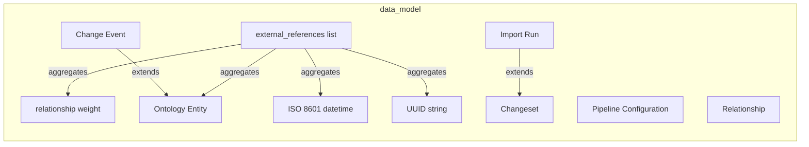

# Data Model

Data entities, relationships, and data structure definitions.

## Report Index

- [Layer Introduction](#layer-introduction)
- [Intra-Layer Relationships](#intra-layer-relationships)
- [Inter-Layer Dependencies](#inter-layer-dependencies)
- [Inter-Layer Relationships Table](#inter-layer-relationships-table)
- [Element Reference](#element-reference)

## Layer Introduction

| Metric                    | Count |
| ------------------------- | ----- |
| Elements                  | 10    |
| Intra-Layer Relationships | 6     |
| Inter-Layer Relationships | 6     |
| Inbound Relationships     | 0     |
| Outbound Relationships    | 6     |

**Cross-Layer References**:

- **Downstream layers**: [Technology](./05-technology-layer-report.md)

## Intra-Layer Relationships

## Inter-Layer Dependencies

## Inter-Layer Relationships Table

| Relationship ID                                                | Source Node                                      | Dest Node                              | Dest Layer   | Predicate    | Cardinality  | Strength |
| -------------------------------------------------------------- | ------------------------------------------------ | -------------------------------------- | ------------ | ------------ | ------------ | -------- |
| `data-model.objectschema.depends-on.technology.systemsoftware` | `data-model.objectschema.change-event`           | `technology.systemsoftware.sqlalchemy` | `technology` | `depends-on` | many-to-many | medium   |
| `data-model.objectschema.depends-on.technology.systemsoftware` | `data-model.objectschema.changeset`              | `technology.systemsoftware.sqlalchemy` | `technology` | `depends-on` | many-to-many | medium   |
| `data-model.objectschema.depends-on.technology.systemsoftware` | `data-model.objectschema.import-run`             | `technology.systemsoftware.sqlalchemy` | `technology` | `depends-on` | many-to-many | medium   |
| `data-model.objectschema.depends-on.technology.systemsoftware` | `data-model.objectschema.ontology-entity`        | `technology.systemsoftware.sqlalchemy` | `technology` | `depends-on` | many-to-many | medium   |
| `data-model.objectschema.depends-on.technology.systemsoftware` | `data-model.objectschema.pipeline-configuration` | `technology.systemsoftware.sqlalchemy` | `technology` | `depends-on` | many-to-many | medium   |
| `data-model.objectschema.depends-on.technology.systemsoftware` | `data-model.objectschema.relationship`           | `technology.systemsoftware.sqlalchemy` | `technology` | `depends-on` | many-to-many | medium   |

## Element Reference

### external_references list {#external-references-list}

**ID**: `data-model.arrayschema.external-references-list`

**Type**: `arrayschema`

Array schema for the external_references list on the Class entity — holds enrichment references from ConceptNet, DBpedia, Wikidata, and schema.org

#### Attributes

| Name        | Value  |
| ----------- | ------ |
| items       | string |
| minItems    | 0      |
| uniqueItems | true   |

#### Relationships

| Type        | Related Element                                | Predicate    | Direction |
| ----------- | ---------------------------------------------- | ------------ | --------- |
| intra-layer | `data-model.numericschema.relationship-weight` | `aggregates` | outbound  |
| intra-layer | `data-model.objectschema.ontology-entity`      | `aggregates` | outbound  |
| intra-layer | `data-model.stringschema.iso-8601-datetime`    | `aggregates` | outbound  |
| intra-layer | `data-model.stringschema.uuid-string`          | `aggregates` | outbound  |

### relationship weight {#relationship-weight}

**ID**: `data-model.numericschema.relationship-weight`

**Type**: `numericschema`

Float schema for the weight property on typed relationships — defaults to 1.0, used for semantic similarity scoring and graph traversal

#### Attributes

| Name    | Value  |
| ------- | ------ |
| maximum | 1      |
| minimum | 0      |
| type    | number |

#### Relationships

| Type        | Related Element                                   | Predicate    | Direction |
| ----------- | ------------------------------------------------- | ------------ | --------- |
| intra-layer | `data-model.arrayschema.external-references-list` | `aggregates` | inbound   |

### Change Event {#change-event}

**ID**: `data-model.objectschema.change-event`

**Type**: `objectschema`

ORM schema for the audit trail of all entity mutations — stores entity_id, entity_type, operation (CREATE/UPDATE/DELETE), new_state and previous_state JSON snapshots, user_id, change_reason, and optional import_run_id correlation

#### Relationships

| Type        | Related Element                           | Predicate    | Direction |
| ----------- | ----------------------------------------- | ------------ | --------- |
| inter-layer | `technology.systemsoftware.sqlalchemy`    | `depends-on` | outbound  |
| intra-layer | `data-model.objectschema.ontology-entity` | `extends`    | outbound  |

### Changeset {#changeset}

**ID**: `data-model.objectschema.changeset`

**Type**: `objectschema`

ORM schema for named collections of change events progressing through version control states (WORKING→STAGED→PROPOSED→APPROVED→MERGED) — stores name, description, state, and a JSON array of event_ids

#### Relationships

| Type        | Related Element                        | Predicate    | Direction |
| ----------- | -------------------------------------- | ------------ | --------- |
| inter-layer | `technology.systemsoftware.sqlalchemy` | `depends-on` | outbound  |
| intra-layer | `data-model.objectschema.import-run`   | `extends`    | inbound   |

### Import Run {#import-run}

**ID**: `data-model.objectschema.import-run`

**Type**: `objectschema`

ORM schema tracking interchange import operations (SKOS/OWL/GraphML) — stores format, source_hash, source_uri, scope, status (PENDING/COMMITTED/FAILED/ROLLED_BACK), resolution records, and created_by for auditability

#### Relationships

| Type        | Related Element                        | Predicate    | Direction |
| ----------- | -------------------------------------- | ------------ | --------- |
| inter-layer | `technology.systemsoftware.sqlalchemy` | `depends-on` | outbound  |
| intra-layer | `data-model.objectschema.changeset`    | `extends`    | outbound  |

### Ontology Entity {#ontology-entity}

**ID**: `data-model.objectschema.ontology-entity`

**Type**: `objectschema`

Single-table inheritance ORM schema for all ontology entities (taxonomy, concept_scheme, class, individual, property_definition) — stores title, description, hierarchy FKs, JSON value objects (external_references, lexical_senses, data_properties), binary embedding, and optimistic-locking version

#### Relationships

| Type        | Related Element                                   | Predicate    | Direction |
| ----------- | ------------------------------------------------- | ------------ | --------- |
| inter-layer | `technology.systemsoftware.sqlalchemy`            | `depends-on` | outbound  |
| intra-layer | `data-model.arrayschema.external-references-list` | `aggregates` | inbound   |
| intra-layer | `data-model.objectschema.change-event`            | `extends`    | inbound   |

### Pipeline Configuration {#pipeline-configuration}

**ID**: `data-model.objectschema.pipeline-configuration`

**Type**: `objectschema`

ORM schema for LLM pipeline configurations in operations.db — stores pipeline slug, title, provider, model, config JSON, system_prompt, user_prompt template, enabled flag, and version counter

#### Relationships

| Type        | Related Element                        | Predicate    | Direction |
| ----------- | -------------------------------------- | ------------ | --------- |
| inter-layer | `technology.systemsoftware.sqlalchemy` | `depends-on` | outbound  |

### Relationship {#relationship}

**ID**: `data-model.objectschema.relationship`

**Type**: `objectschema`

ORM schema for typed directed edges between ontology entities — stores source_id, target_id, optional property_definition_id FK, float weight (0–1), and JSON metadata; used by GraphAnalysisService for graph construction

#### Relationships

| Type        | Related Element                        | Predicate    | Direction |
| ----------- | -------------------------------------- | ------------ | --------- |
| inter-layer | `technology.systemsoftware.sqlalchemy` | `depends-on` | outbound  |

### ISO 8601 datetime {#iso-8601-datetime}

**ID**: `data-model.stringschema.iso-8601-datetime`

**Type**: `stringschema`

String schema for timestamp fields (created_at, updated_at) — ISO 8601 format stored as TEXT in SQLite

#### Attributes

| Name   | Value     |
| ------ | --------- |
| format | date-time |
| type   | string    |

#### Relationships

| Type        | Related Element                                   | Predicate    | Direction |
| ----------- | ------------------------------------------------- | ------------ | --------- |
| intra-layer | `data-model.arrayschema.external-references-list` | `aggregates` | inbound   |

### UUID string {#uuid-string}

**ID**: `data-model.stringschema.uuid-string`

**Type**: `stringschema`

String schema for entity identifiers — UUID v4 format, used as primary keys across all ontology entities and stored as TEXT in SQLite

#### Attributes

| Name      | Value  |
| --------- | ------ |
| format    | uuid   |
| maxLength | 36     |
| minLength | 36     |
| type      | string |

#### Relationships

| Type        | Related Element                                   | Predicate    | Direction |
| ----------- | ------------------------------------------------- | ------------ | --------- |
| intra-layer | `data-model.arrayschema.external-references-list` | `aggregates` | inbound   |

---

Generated: 2026-05-07T22:24:32.020Z | Model Version: 0.1.0
