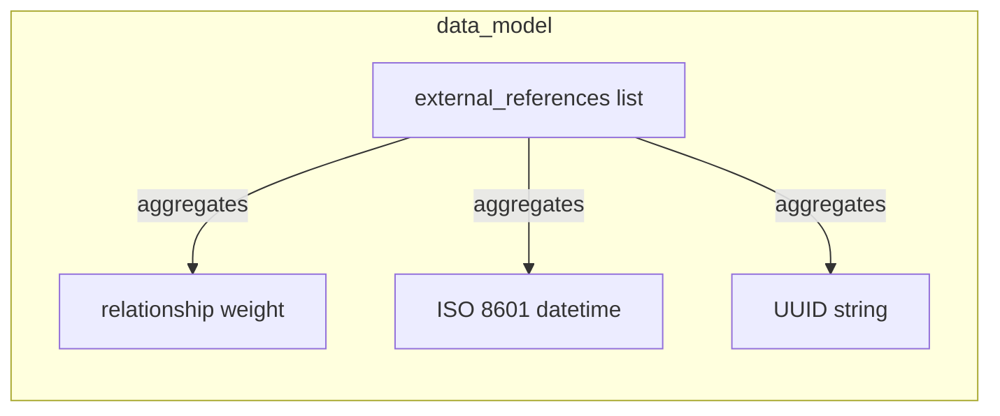

# Data Model

Data entities, relationships, and data structure definitions.

## Report Index

- [Layer Introduction](#layer-introduction)
- [Intra-Layer Relationships](#intra-layer-relationships)
- [Inter-Layer Dependencies](#inter-layer-dependencies)
- [Element Reference](#element-reference)

## Layer Introduction

| Metric                    | Count |
| ------------------------- | ----- |
| Elements                  | 4     |
| Intra-Layer Relationships | 3     |
| Inter-Layer Relationships | 0     |
| Inbound Relationships     | 0     |
| Outbound Relationships    | 0     |

## Intra-Layer Relationships

## Inter-Layer Dependencies

## Element Reference

### external_references list {#external-references-list}

**ID**: `data-model.arrayschema.external-references-list`

**Type**: `arrayschema`

Array schema for the external_references list on the Class entity — holds enrichment references from ConceptNet, DBpedia, Wikidata, and schema.org

#### Attributes

| Name        | Value  |
| ----------- | ------ |
| items       | string |
| minItems    | 0      |
| uniqueItems | true   |

#### Relationships

| Type        | Related Element                                | Predicate    | Direction |
| ----------- | ---------------------------------------------- | ------------ | --------- |
| intra-layer | `data-model.numericschema.relationship-weight` | `aggregates` | outbound  |
| intra-layer | `data-model.stringschema.iso-8601-datetime`    | `aggregates` | outbound  |
| intra-layer | `data-model.stringschema.uuid-string`          | `aggregates` | outbound  |

### relationship weight {#relationship-weight}

**ID**: `data-model.numericschema.relationship-weight`

**Type**: `numericschema`

Float schema for the weight property on typed relationships — defaults to 1.0, used for semantic similarity scoring and graph traversal

#### Attributes

| Name    | Value  |
| ------- | ------ |
| maximum | 1      |
| minimum | 0      |
| type    | number |

#### Relationships

| Type        | Related Element                                   | Predicate    | Direction |
| ----------- | ------------------------------------------------- | ------------ | --------- |
| intra-layer | `data-model.arrayschema.external-references-list` | `aggregates` | inbound   |

### ISO 8601 datetime {#iso-8601-datetime}

**ID**: `data-model.stringschema.iso-8601-datetime`

**Type**: `stringschema`

String schema for timestamp fields (created_at, updated_at) — ISO 8601 format stored as TEXT in SQLite

#### Attributes

| Name   | Value     |
| ------ | --------- |
| format | date-time |
| type   | string    |

#### Relationships

| Type        | Related Element                                   | Predicate    | Direction |
| ----------- | ------------------------------------------------- | ------------ | --------- |
| intra-layer | `data-model.arrayschema.external-references-list` | `aggregates` | inbound   |

### UUID string {#uuid-string}

**ID**: `data-model.stringschema.uuid-string`

**Type**: `stringschema`

String schema for entity identifiers — UUID v4 format, used as primary keys across all ontology entities and stored as TEXT in SQLite

#### Attributes

| Name      | Value  |
| --------- | ------ |
| format    | uuid   |
| maxLength | 36     |
| minLength | 36     |
| type      | string |

#### Relationships

| Type        | Related Element                                   | Predicate    | Direction |
| ----------- | ------------------------------------------------- | ------------ | --------- |
| intra-layer | `data-model.arrayschema.external-references-list` | `aggregates` | inbound   |

---

Generated: 2026-05-07T22:00:51.579Z | Model Version: 0.1.0
