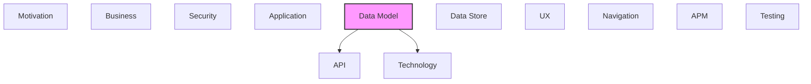

# Data Model

Data entities, relationships, and data structure definitions.

## Report Index

- [Layer Introduction](#layer-introduction)
- [Intra-Layer Relationships](#intra-layer-relationships)
- [Inter-Layer Dependencies](#inter-layer-dependencies)
- [Inter-Layer Relationships Table](#inter-layer-relationships-table)
- [Element Reference](#element-reference)

## Layer Introduction

| Metric                    | Count |
| ------------------------- | ----- |
| Elements                  | 47    |
| Intra-Layer Relationships | 19    |
| Inter-Layer Relationships | 40    |
| Inbound Relationships     | 0     |
| Outbound Relationships    | 40    |

**Cross-Layer References**:

- **Downstream layers**: [API](./06-api-layer-report.md), [Technology](./05-technology-layer-report.md)

## Intra-Layer Relationships

*This layer has >30 elements. Summary table shown instead of diagram.*

| Element                                                 | Type            | Relationships |
| ------------------------------------------------------- | --------------- | ------------- |
| `data-model.arrayschema.external-references-list`       | `arrayschema`   | 4             |
| `data-model.numericschema.relationship-weight`          | `numericschema` | 1             |
| `data-model.objectschema.app-configuration`             | `objectschema`  | 0             |
| `data-model.objectschema.background-task`               | `objectschema`  | 0             |
| `data-model.objectschema.change-event`                  | `objectschema`  | 3             |
| `data-model.objectschema.change-event-entity`           | `objectschema`  | 1             |
| `data-model.objectschema.changeset`                     | `objectschema`  | 4             |
| `data-model.objectschema.changeset-entity`              | `objectschema`  | 1             |
| `data-model.objectschema.changeset-event`               | `objectschema`  | 1             |
| `data-model.objectschema.concept-scheme-entity`         | `objectschema`  | 0             |
| `data-model.objectschema.conflict-entity`               | `objectschema`  | 0             |
| `data-model.objectschema.conflict-report`               | `objectschema`  | 0             |
| `data-model.objectschema.conflict-resolution`           | `objectschema`  | 1             |
| `data-model.objectschema.entity-version`                | `objectschema`  | 1             |
| `data-model.objectschema.entity-version-entity`         | `objectschema`  | 1             |
| `data-model.objectschema.execution-entity`              | `objectschema`  | 0             |
| `data-model.objectschema.extracted-entity`              | `objectschema`  | 0             |
| `data-model.objectschema.extraction-result`             | `objectschema`  | 0             |
| `data-model.objectschema.extraction-run`                | `objectschema`  | 0             |
| `data-model.objectschema.graph-metrics`                 | `objectschema`  | 0             |
| `data-model.objectschema.import-run`                    | `objectschema`  | 3             |
| `data-model.objectschema.import-run-entity`             | `objectschema`  | 1             |
| `data-model.objectschema.individual-class`              | `objectschema`  | 0             |
| `data-model.objectschema.individual-entity`             | `objectschema`  | 0             |
| `data-model.objectschema.knowledge-graph`               | `objectschema`  | 0             |
| `data-model.objectschema.merge-result`                  | `objectschema`  | 0             |
| `data-model.objectschema.ontology-class-entity`         | `objectschema`  | 0             |
| `data-model.objectschema.ontology-entity`               | `objectschema`  | 3             |
| `data-model.objectschema.path-result`                   | `objectschema`  | 0             |
| `data-model.objectschema.pipeline-configuration`        | `objectschema`  | 2             |
| `data-model.objectschema.pipeline-configuration-entity` | `objectschema`  | 2             |
| `data-model.objectschema.pipeline-execution`            | `objectschema`  | 2             |
| `data-model.objectschema.processing-metrics`            | `objectschema`  | 0             |
| `data-model.objectschema.property-definition`           | `objectschema`  | 0             |
| `data-model.objectschema.property-definition-entity`    | `objectschema`  | 0             |
| `data-model.objectschema.proposal`                      | `objectschema`  | 3             |
| `data-model.objectschema.proposal-entity`               | `objectschema`  | 1             |
| `data-model.objectschema.relationship`                  | `objectschema`  | 1             |
| `data-model.objectschema.relationship-entity`           | `objectschema`  | 0             |
| `data-model.objectschema.resolution-record`             | `objectschema`  | 0             |
| `data-model.objectschema.subgraph`                      | `objectschema`  | 0             |
| `data-model.objectschema.subgraph-result`               | `objectschema`  | 0             |
| `data-model.objectschema.system-health`                 | `objectschema`  | 0             |
| `data-model.objectschema.taxonomy-entity`               | `objectschema`  | 0             |
| `data-model.objectschema.triple-extraction-result`      | `objectschema`  | 0             |
| `data-model.stringschema.iso-8601-datetime`             | `stringschema`  | 1             |
| `data-model.stringschema.uuid-string`                   | `stringschema`  | 1             |

## Inter-Layer Dependencies

## Inter-Layer Relationships Table

| Relationship ID                                                | Source Node                                             | Dest Node                                            | Dest Layer   | Predicate    | Cardinality  | Strength |
| -------------------------------------------------------------- | ------------------------------------------------------- | ---------------------------------------------------- | ------------ | ------------ | ------------ | -------- |
| `data-model.objectschema.maps-to.api.response`                 | `data-model.objectschema.app-configuration`             | `api.response.app-configuration-response`            | `api`        | `maps-to`    | many-to-many | medium   |
| `data-model.objectschema.maps-to.api.response`                 | `data-model.objectschema.background-task`               | `api.response.background-task-response`              | `api`        | `maps-to`    | many-to-many | medium   |
| `data-model.objectschema.depends-on.technology.systemsoftware` | `data-model.objectschema.change-event`                  | `technology.systemsoftware.sqlalchemy`               | `technology` | `depends-on` | many-to-many | medium   |
| `data-model.objectschema.maps-to.api.response`                 | `data-model.objectschema.change-event-entity`           | `api.response.change-history-response`               | `api`        | `maps-to`    | many-to-many | medium   |
| `data-model.objectschema.depends-on.technology.systemsoftware` | `data-model.objectschema.changeset`                     | `technology.systemsoftware.sqlalchemy`               | `technology` | `depends-on` | many-to-many | medium   |
| `data-model.objectschema.maps-to.api.response`                 | `data-model.objectschema.changeset-entity`              | `api.response.changeset-response`                    | `api`        | `maps-to`    | many-to-many | medium   |
| `data-model.objectschema.maps-to.api.response`                 | `data-model.objectschema.concept-scheme-entity`         | `api.response.concept-scheme-response`               | `api`        | `maps-to`    | many-to-many | medium   |
| `data-model.objectschema.maps-to.api.response`                 | `data-model.objectschema.conflict-entity`               | `api.response.conflict-response`                     | `api`        | `maps-to`    | many-to-many | medium   |
| `data-model.objectschema.maps-to.api.response`                 | `data-model.objectschema.conflict-report`               | `api.response.conflict-report-response`              | `api`        | `maps-to`    | many-to-many | medium   |
| `data-model.objectschema.maps-to.api.response`                 | `data-model.objectschema.entity-version-entity`         | `api.response.entity-version-response`               | `api`        | `maps-to`    | many-to-many | medium   |
| `data-model.objectschema.maps-to.api.response`                 | `data-model.objectschema.entity-version`                | `api.response.entity-version-response`               | `api`        | `maps-to`    | many-to-many | medium   |
| `data-model.objectschema.maps-to.api.response`                 | `data-model.objectschema.execution-entity`              | `api.response.execution-response`                    | `api`        | `maps-to`    | many-to-many | medium   |
| `data-model.objectschema.maps-to.api.response`                 | `data-model.objectschema.extracted-entity`              | `api.response.extraction-result-schema`              | `api`        | `maps-to`    | many-to-many | medium   |
| `data-model.objectschema.maps-to.api.response`                 | `data-model.objectschema.extraction-result`             | `api.response.extraction-result-schema`              | `api`        | `maps-to`    | many-to-many | medium   |
| `data-model.objectschema.maps-to.api.response`                 | `data-model.objectschema.extraction-run`                | `api.response.extraction-result-schema`              | `api`        | `maps-to`    | many-to-many | medium   |
| `data-model.objectschema.maps-to.api.response`                 | `data-model.objectschema.graph-metrics`                 | `api.response.graph-metrics-response`                | `api`        | `maps-to`    | many-to-many | medium   |
| `data-model.objectschema.depends-on.technology.systemsoftware` | `data-model.objectschema.import-run`                    | `technology.systemsoftware.sqlalchemy`               | `technology` | `depends-on` | many-to-many | medium   |
| `data-model.objectschema.maps-to.api.response`                 | `data-model.objectschema.import-run-entity`             | `api.response.import-run-response`                   | `api`        | `maps-to`    | many-to-many | medium   |
| `data-model.objectschema.maps-to.api.requestbody`              | `data-model.objectschema.individual-class`              | `api.requestbody.individual-class-list-request`      | `api`        | `maps-to`    | many-to-many | medium   |
| `data-model.objectschema.maps-to.api.requestbody`              | `data-model.objectschema.individual-class`              | `api.requestbody.individual-class-request`           | `api`        | `maps-to`    | many-to-many | medium   |
| `data-model.objectschema.maps-to.api.response`                 | `data-model.objectschema.individual-entity`             | `api.response.individual-response`                   | `api`        | `maps-to`    | many-to-many | medium   |
| `data-model.objectschema.maps-to.api.response`                 | `data-model.objectschema.knowledge-graph`               | `api.response.knowledge-graph-response`              | `api`        | `maps-to`    | many-to-many | medium   |
| `data-model.objectschema.maps-to.api.response`                 | `data-model.objectschema.merge-result`                  | `api.response.merge-result-response`                 | `api`        | `maps-to`    | many-to-many | medium   |
| `data-model.objectschema.maps-to.api.response`                 | `data-model.objectschema.ontology-class-entity`         | `api.response.class-response`                        | `api`        | `maps-to`    | many-to-many | medium   |
| `data-model.objectschema.depends-on.technology.systemsoftware` | `data-model.objectschema.ontology-entity`               | `technology.systemsoftware.sqlalchemy`               | `technology` | `depends-on` | many-to-many | medium   |
| `data-model.objectschema.maps-to.api.response`                 | `data-model.objectschema.path-result`                   | `api.response.path-result-response`                  | `api`        | `maps-to`    | many-to-many | medium   |
| `data-model.objectschema.depends-on.technology.systemsoftware` | `data-model.objectschema.pipeline-configuration`        | `technology.systemsoftware.sqlalchemy`               | `technology` | `depends-on` | many-to-many | medium   |
| `data-model.objectschema.maps-to.api.requestbody`              | `data-model.objectschema.pipeline-configuration-entity` | `api.requestbody.pipeline-configuration-create`      | `api`        | `maps-to`    | many-to-many | medium   |
| `data-model.objectschema.maps-to.api.response`                 | `data-model.objectschema.processing-metrics`            | `api.response.service-metrics-response`              | `api`        | `maps-to`    | many-to-many | medium   |
| `data-model.objectschema.maps-to.api.requestbody`              | `data-model.objectschema.property-definition-entity`    | `api.requestbody.property-definition-create-request` | `api`        | `maps-to`    | many-to-many | medium   |
| `data-model.objectschema.maps-to.api.requestbody`              | `data-model.objectschema.property-definition`           | `api.requestbody.property-definition-create-request` | `api`        | `maps-to`    | many-to-many | medium   |
| `data-model.objectschema.maps-to.api.response`                 | `data-model.objectschema.property-definition`           | `api.response.property-definition-response`          | `api`        | `maps-to`    | many-to-many | medium   |
| `data-model.objectschema.depends-on.technology.systemsoftware` | `data-model.objectschema.relationship`                  | `technology.systemsoftware.sqlalchemy`               | `technology` | `depends-on` | many-to-many | medium   |
| `data-model.objectschema.maps-to.api.response`                 | `data-model.objectschema.relationship-entity`           | `api.response.relationship-response`                 | `api`        | `maps-to`    | many-to-many | medium   |
| `data-model.objectschema.maps-to.api.response`                 | `data-model.objectschema.resolution-record`             | `api.response.resolution-record-response`            | `api`        | `maps-to`    | many-to-many | medium   |
| `data-model.objectschema.maps-to.api.response`                 | `data-model.objectschema.subgraph`                      | `api.response.subgraph-data-response`                | `api`        | `maps-to`    | many-to-many | medium   |
| `data-model.objectschema.maps-to.api.response`                 | `data-model.objectschema.subgraph-result`               | `api.response.subgraph-result-response`              | `api`        | `maps-to`    | many-to-many | medium   |
| `data-model.objectschema.maps-to.api.response`                 | `data-model.objectschema.system-health`                 | `api.response.database-health-response`              | `api`        | `maps-to`    | many-to-many | medium   |
| `data-model.objectschema.maps-to.api.response`                 | `data-model.objectschema.taxonomy-entity`               | `api.response.taxonomy-response`                     | `api`        | `maps-to`    | many-to-many | medium   |
| `data-model.objectschema.maps-to.api.response`                 | `data-model.objectschema.triple-extraction-result`      | `api.response.triples-response`                      | `api`        | `maps-to`    | many-to-many | medium   |

## Element Reference

### external_references list {#external-references-list}

**ID**: `data-model.arrayschema.external-references-list`

**Type**: `arrayschema`

Array schema for the external_references list on the Class entity — holds enrichment references from ConceptNet, DBpedia, Wikidata, and schema.org

#### Attributes

| Name        | Value  |
| ----------- | ------ |
| items       | string |
| minItems    | 0      |
| uniqueItems | true   |

#### Relationships

| Type        | Related Element                                | Predicate    | Direction |
| ----------- | ---------------------------------------------- | ------------ | --------- |
| intra-layer | `data-model.numericschema.relationship-weight` | `aggregates` | outbound  |
| intra-layer | `data-model.objectschema.ontology-entity`      | `aggregates` | outbound  |
| intra-layer | `data-model.stringschema.iso-8601-datetime`    | `aggregates` | outbound  |
| intra-layer | `data-model.stringschema.uuid-string`          | `aggregates` | outbound  |

### relationship weight {#relationship-weight}

**ID**: `data-model.numericschema.relationship-weight`

**Type**: `numericschema`

Float schema for the weight property on typed relationships — defaults to 1.0, used for semantic similarity scoring and graph traversal

#### Attributes

| Name    | Value  |
| ------- | ------ |
| maximum | 1      |
| minimum | 0      |
| type    | number |

#### Relationships

| Type        | Related Element                                   | Predicate    | Direction |
| ----------- | ------------------------------------------------- | ------------ | --------- |
| intra-layer | `data-model.arrayschema.external-references-list` | `aggregates` | inbound   |

### App Configuration {#app-configuration}

**ID**: `data-model.objectschema.app-configuration`

**Type**: `objectschema`

Domain entity representing application configuration organized into sections: server, database, llm, nlp, embedding, reference_sources, logging, and optional sync; API key values are unmasked at domain layer

#### Attributes

| Name | Value  |
| ---- | ------ |
| type | object |

#### Relationships

| Type        | Related Element                           | Predicate | Direction |
| ----------- | ----------------------------------------- | --------- | --------- |
| inter-layer | `api.response.app-configuration-response` | `maps-to` | outbound  |

### Background Task {#background-task}

**ID**: `data-model.objectschema.background-task`

**Type**: `objectschema`

Domain entity representing a long-running background task with id, name, status (pending/running/completed/failed), timestamps, and optional error/result; enforces valid state transitions via transition_to()

#### Attributes

| Name | Value  |
| ---- | ------ |
| type | object |

#### Relationships

| Type        | Related Element                         | Predicate | Direction |
| ----------- | --------------------------------------- | --------- | --------- |
| inter-layer | `api.response.background-task-response` | `maps-to` | outbound  |

### Change Event {#change-event}

**ID**: `data-model.objectschema.change-event`

**Type**: `objectschema`

ORM schema for the audit trail of all entity mutations — stores entity_id, entity_type, operation (CREATE/UPDATE/DELETE), new_state and previous_state JSON snapshots, user_id, change_reason, and optional import_run_id correlation

#### Attributes

| Name | Value  |
| ---- | ------ |
| type | object |

#### Relationships

| Type        | Related Element                               | Predicate    | Direction |
| ----------- | --------------------------------------------- | ------------ | --------- |
| inter-layer | `technology.systemsoftware.sqlalchemy`        | `depends-on` | outbound  |
| intra-layer | `data-model.objectschema.change-event-entity` | `extends`    | inbound   |
| intra-layer | `data-model.objectschema.ontology-entity`     | `extends`    | outbound  |
| intra-layer | `data-model.objectschema.import-run`          | `extends`    | inbound   |

### Change Event Entity {#change-event-entity}

**ID**: `data-model.objectschema.change-event-entity`

**Type**: `objectschema`

Domain entity recording a single change to an entity; carries entity_id, entity_type, operation, new_state snapshot, timestamp, optional previous_state, user_id, change_reason, changeset_id, batch_run_id, and processed flag

#### Attributes

| Name | Value  |
| ---- | ------ |
| type | object |

#### Relationships

| Type        | Related Element                        | Predicate | Direction |
| ----------- | -------------------------------------- | --------- | --------- |
| inter-layer | `api.response.change-history-response` | `maps-to` | outbound  |
| intra-layer | `data-model.objectschema.change-event` | `extends` | outbound  |

### Changeset {#changeset}

**ID**: `data-model.objectschema.changeset`

**Type**: `objectschema`

ORM schema for named collections of change events progressing through version control states (WORKING→STAGED→PROPOSED→APPROVED→MERGED) — stores name, description, state, and a JSON array of event_ids

#### Attributes

| Name | Value  |
| ---- | ------ |
| type | object |

#### Relationships

| Type        | Related Element                            | Predicate    | Direction |
| ----------- | ------------------------------------------ | ------------ | --------- |
| inter-layer | `technology.systemsoftware.sqlalchemy`     | `depends-on` | outbound  |
| intra-layer | `data-model.objectschema.changeset-entity` | `extends`    | inbound   |
| intra-layer | `data-model.objectschema.changeset-event`  | `extends`    | outbound  |
| intra-layer | `data-model.objectschema.proposal`         | `extends`    | outbound  |
| intra-layer | `data-model.objectschema.import-run`       | `extends`    | inbound   |

### Changeset Entity {#changeset-entity}

**ID**: `data-model.objectschema.changeset-entity`

**Type**: `objectschema`

Domain entity for a named collection of change events proposed as a unit; enforces state machine transitions (WORKING→STAGED→PROPOSED→APPROVED→MERGED) via transition_to(); prevents direct state assignment

#### Attributes

| Name | Value  |
| ---- | ------ |
| type | object |

#### Relationships

| Type        | Related Element                     | Predicate | Direction |
| ----------- | ----------------------------------- | --------- | --------- |
| inter-layer | `api.response.changeset-response`   | `maps-to` | outbound  |
| intra-layer | `data-model.objectschema.changeset` | `extends` | outbound  |

### Changeset Event {#changeset-event}

**ID**: `data-model.objectschema.changeset-event`

**Type**: `objectschema`

ORM schema for individual change events within a versioning changeset — stores changeset_id FK, entity_id, operation (create/update/delete), before/after JSON snapshots

#### Attributes

| Name | Value  |
| ---- | ------ |
| type | object |

#### Relationships

| Type        | Related Element                     | Predicate | Direction |
| ----------- | ----------------------------------- | --------- | --------- |
| intra-layer | `data-model.objectschema.changeset` | `extends` | inbound   |

### Concept Scheme Entity {#concept-scheme-entity}

**ID**: `data-model.objectschema.concept-scheme-entity`

**Type**: `objectschema`

Domain entity for a concept scheme that groups classes within a taxonomy; has id, taxonomy_id, title, optional description, timestamps, and version

#### Attributes

| Name | Value  |
| ---- | ------ |
| type | object |

#### Relationships

| Type        | Related Element                        | Predicate | Direction |
| ----------- | -------------------------------------- | --------- | --------- |
| inter-layer | `api.response.concept-scheme-response` | `maps-to` | outbound  |

### Conflict Entity {#conflict-entity}

**ID**: `data-model.objectschema.conflict-entity`

**Type**: `objectschema`

Domain entity representing a merge conflict on a single field; carries entity_id, entity_type, field_name, base_value, incoming_value, and resolved_value/strategy; resolved atomically via resolve()

#### Attributes

| Name | Value  |
| ---- | ------ |
| type | object |

#### Relationships

| Type        | Related Element                  | Predicate | Direction |
| ----------- | -------------------------------- | --------- | --------- |
| inter-layer | `api.response.conflict-response` | `maps-to` | outbound  |

### Conflict Report {#conflict-report}

**ID**: `data-model.objectschema.conflict-report`

**Type**: `objectschema`

Report of conflicts in a merge proposal; holds proposal_id and a list of Conflict entities; provides has_conflicts and all_resolved properties

#### Attributes

| Name | Value  |
| ---- | ------ |
| type | object |

#### Relationships

| Type        | Related Element                         | Predicate | Direction |
| ----------- | --------------------------------------- | --------- | --------- |
| inter-layer | `api.response.conflict-report-response` | `maps-to` | outbound  |

### Conflict Resolution {#conflict-resolution}

**ID**: `data-model.objectschema.conflict-resolution`

**Type**: `objectschema`

ORM schema for manual conflict resolution records — stores proposal_id FK, entity_id, conflict type, chosen resolution strategy, and resolved snapshot

#### Attributes

| Name | Value  |
| ---- | ------ |
| type | object |

#### Relationships

| Type        | Related Element                    | Predicate | Direction |
| ----------- | ---------------------------------- | --------- | --------- |
| intra-layer | `data-model.objectschema.proposal` | `extends` | inbound   |

### Entity Version {#entity-version}

**ID**: `data-model.objectschema.entity-version`

**Type**: `objectschema`

ORM schema for entity version snapshots — stores entity_id FK, version number, full JSON snapshot, and the change event that triggered the version

#### Attributes

| Name | Value  |
| ---- | ------ |
| type | object |

#### Relationships

| Type        | Related Element                                 | Predicate | Direction |
| ----------- | ----------------------------------------------- | --------- | --------- |
| inter-layer | `api.response.entity-version-response`          | `maps-to` | outbound  |
| intra-layer | `data-model.objectschema.entity-version-entity` | `extends` | inbound   |

### Entity Version Entity {#entity-version-entity}

**ID**: `data-model.objectschema.entity-version-entity`

**Type**: `objectschema`

Domain entity representing a snapshot of an entity at a specific version; carries entity_id, version number, state enum, snapshot dict, created_at, and optional parent_version

#### Attributes

| Name | Value  |
| ---- | ------ |
| type | object |

#### Relationships

| Type        | Related Element                          | Predicate | Direction |
| ----------- | ---------------------------------------- | --------- | --------- |
| inter-layer | `api.response.entity-version-response`   | `maps-to` | outbound  |
| intra-layer | `data-model.objectschema.entity-version` | `extends` | outbound  |

### Execution Entity {#execution-entity}

**ID**: `data-model.objectschema.execution-entity`

**Type**: `objectschema`

Domain entity recording a single LLM pipeline execution; captures input/output text, provider, model, tokens_in, tokens_out, duration_ms, status (success/error/timeout), optional error message, and timestamp

#### Attributes

| Name | Value  |
| ---- | ------ |
| type | object |

#### Relationships

| Type        | Related Element                   | Predicate | Direction |
| ----------- | --------------------------------- | --------- | --------- |
| inter-layer | `api.response.execution-response` | `maps-to` | outbound  |

### Extracted Entity {#extracted-entity}

**ID**: `data-model.objectschema.extracted-entity`

**Type**: `objectschema`

Domain entity for an entity extracted from text through one or more extraction layers; carries label, entity_type, source_layer (0=KG, 1=LLM, 2=NLP, 3=reference), confidence, optional class match and URI

#### Attributes

| Name | Value  |
| ---- | ------ |
| type | object |

#### Relationships

| Type        | Related Element                         | Predicate | Direction |
| ----------- | --------------------------------------- | --------- | --------- |
| inter-layer | `api.response.extraction-result-schema` | `maps-to` | outbound  |

### Extraction Result {#extraction-result}

**ID**: `data-model.objectschema.extraction-result`

**Type**: `objectschema`

ORM schema for persisted extraction results — stores source text, NLP/LLM pipeline output (JSON), extracted entity IDs, processing metrics, and run timestamps

#### Attributes

| Name | Value  |
| ---- | ------ |
| type | object |

#### Relationships

| Type        | Related Element                         | Predicate | Direction |
| ----------- | --------------------------------------- | --------- | --------- |
| inter-layer | `api.response.extraction-result-schema` | `maps-to` | outbound  |

### Extraction Run {#extraction-run}

**ID**: `data-model.objectschema.extraction-run`

**Type**: `objectschema`

First-class domain entity (audit record) tracking an extraction operation; records pipeline config ref, LLM model, temperature, tokens used, duration, triples extracted vs committed, and status; immutable once constructed

#### Attributes

| Name | Value  |
| ---- | ------ |
| type | object |

#### Relationships

| Type        | Related Element                         | Predicate | Direction |
| ----------- | --------------------------------------- | --------- | --------- |
| inter-layer | `api.response.extraction-result-schema` | `maps-to` | outbound  |

### Graph Metrics {#graph-metrics}

**ID**: `data-model.objectschema.graph-metrics`

**Type**: `objectschema`

Computed structural metrics for a knowledge graph: density, average_degree, connected_components, degree_distribution, centrality scores, community sets, algorithm name, and computed_at timestamp

#### Attributes

| Name | Value  |
| ---- | ------ |
| type | object |

#### Relationships

| Type        | Related Element                       | Predicate | Direction |
| ----------- | ------------------------------------- | --------- | --------- |
| inter-layer | `api.response.graph-metrics-response` | `maps-to` | outbound  |

### Import Run {#import-run}

**ID**: `data-model.objectschema.import-run`

**Type**: `objectschema`

ORM schema tracking interchange import operations (SKOS/OWL/GraphML) — stores format, source_hash, source_uri, scope, status (PENDING/COMMITTED/FAILED/ROLLED_BACK), resolution records, and created_by for auditability

#### Attributes

| Name | Value  |
| ---- | ------ |
| type | object |

#### Relationships

| Type        | Related Element                             | Predicate    | Direction |
| ----------- | ------------------------------------------- | ------------ | --------- |
| inter-layer | `technology.systemsoftware.sqlalchemy`      | `depends-on` | outbound  |
| intra-layer | `data-model.objectschema.import-run-entity` | `extends`    | inbound   |
| intra-layer | `data-model.objectschema.change-event`      | `extends`    | outbound  |
| intra-layer | `data-model.objectschema.changeset`         | `extends`    | outbound  |

### Import Run Entity {#import-run-entity}

**ID**: `data-model.objectschema.import-run-entity`

**Type**: `objectschema`

Domain entity tracking an import operation from inception through completion; records format, source URI/hash, scope, applied conflict resolutions, affected entity IDs, and status (pending/committed/failed/rolled_back)

#### Attributes

| Name | Value  |
| ---- | ------ |
| type | object |

#### Relationships

| Type        | Related Element                      | Predicate | Direction |
| ----------- | ------------------------------------ | --------- | --------- |
| inter-layer | `api.response.import-run-response`   | `maps-to` | outbound  |
| intra-layer | `data-model.objectschema.import-run` | `extends` | outbound  |

### Individual Class {#individual-class}

**ID**: `data-model.objectschema.individual-class`

**Type**: `objectschema`

Association table ORM schema linking individual instances to their parent classes — stores individual_id, class_id FK pair with ordering index for class priority

#### Attributes

| Name | Value  |
| ---- | ------ |
| type | object |

#### Relationships

| Type        | Related Element                                 | Predicate | Direction |
| ----------- | ----------------------------------------------- | --------- | --------- |
| inter-layer | `api.requestbody.individual-class-list-request` | `maps-to` | outbound  |
| inter-layer | `api.requestbody.individual-class-request`      | `maps-to` | outbound  |

### Individual Entity {#individual-entity}

**ID**: `data-model.objectschema.individual-entity`

**Type**: `objectschema`

Domain entity representing an instance of one or more classes; maintains an ordered class_ids list where order determines property inheritance priority; holds data properties and external references

#### Attributes

| Name | Value  |
| ---- | ------ |
| type | object |

#### Relationships

| Type        | Related Element                    | Predicate | Direction |
| ----------- | ---------------------------------- | --------- | --------- |
| inter-layer | `api.response.individual-response` | `maps-to` | outbound  |

### Knowledge Graph {#knowledge-graph}

**ID**: `data-model.objectschema.knowledge-graph`

**Type**: `objectschema`

Lightweight snapshot descriptor of the in-memory knowledge graph state; carries node_count, edge_count, is_directed, and last_built timestamp; not a persistent entity

#### Attributes

| Name | Value  |
| ---- | ------ |
| type | object |

#### Relationships

| Type        | Related Element                         | Predicate | Direction |
| ----------- | --------------------------------------- | --------- | --------- |
| inter-layer | `api.response.knowledge-graph-response` | `maps-to` | outbound  |

### Merge Result {#merge-result}

**ID**: `data-model.objectschema.merge-result`

**Type**: `objectschema`

Result of a successful merge operation; carries proposal_id, changeset_id, merged_at timestamp, events_applied count, and conflicts_resolved count

#### Attributes

| Name | Value  |
| ---- | ------ |
| type | object |

#### Relationships

| Type        | Related Element                      | Predicate | Direction |
| ----------- | ------------------------------------ | --------- | --------- |
| inter-layer | `api.response.merge-result-response` | `maps-to` | outbound  |

### Ontology Class Entity {#ontology-class-entity}

**ID**: `data-model.objectschema.ontology-class-entity`

**Type**: `objectschema`

Domain entity representing a concept (OntologyClass) in the ontology hierarchy; has concept_scheme_id, taxonomy_id, title, optional parent_class_id, structural property, external references, lexical senses, data properties, and embedding

#### Attributes

| Name | Value  |
| ---- | ------ |
| type | object |

#### Relationships

| Type        | Related Element               | Predicate | Direction |
| ----------- | ----------------------------- | --------- | --------- |
| inter-layer | `api.response.class-response` | `maps-to` | outbound  |

### Ontology Entity {#ontology-entity}

**ID**: `data-model.objectschema.ontology-entity`

**Type**: `objectschema`

Single-table inheritance ORM schema for all ontology entities (taxonomy, concept_scheme, class, individual, property_definition) — stores title, description, hierarchy FKs, JSON value objects (external_references, lexical_senses, data_properties), binary embedding, and optimistic-locking version

#### Attributes

| Name | Value  |
| ---- | ------ |
| type | object |

#### Relationships

| Type        | Related Element                                   | Predicate    | Direction |
| ----------- | ------------------------------------------------- | ------------ | --------- |
| inter-layer | `technology.systemsoftware.sqlalchemy`            | `depends-on` | outbound  |
| intra-layer | `data-model.arrayschema.external-references-list` | `aggregates` | inbound   |
| intra-layer | `data-model.objectschema.change-event`            | `extends`    | inbound   |
| intra-layer | `data-model.objectschema.relationship`            | `extends`    | outbound  |

### Path Result {#path-result}

**ID**: `data-model.objectschema.path-result`

**Type**: `objectschema`

An ordered path traversal between two nodes in the knowledge graph; contains source_id, target_id, ordered path node list, edge count (length), and relationship labels traversed

#### Attributes

| Name | Value  |
| ---- | ------ |
| type | object |

#### Relationships

| Type        | Related Element                     | Predicate | Direction |
| ----------- | ----------------------------------- | --------- | --------- |
| inter-layer | `api.response.path-result-response` | `maps-to` | outbound  |

### Pipeline Configuration {#pipeline-configuration}

**ID**: `data-model.objectschema.pipeline-configuration`

**Type**: `objectschema`

ORM schema for LLM pipeline configurations in operations.db — stores pipeline slug, title, provider, model, config JSON, system_prompt, user_prompt template, enabled flag, and version counter

#### Attributes

| Name | Value  |
| ---- | ------ |
| type | object |

#### Relationships

| Type        | Related Element                                         | Predicate    | Direction |
| ----------- | ------------------------------------------------------- | ------------ | --------- |
| inter-layer | `technology.systemsoftware.sqlalchemy`                  | `depends-on` | outbound  |
| intra-layer | `data-model.objectschema.pipeline-configuration-entity` | `extends`    | inbound   |
| intra-layer | `data-model.objectschema.pipeline-execution`            | `extends`    | outbound  |

### Pipeline Configuration Entity {#pipeline-configuration-entity}

**ID**: `data-model.objectschema.pipeline-configuration-entity`

**Type**: `objectschema`

Domain entity for an LLM pipeline configuration; defines provider (openai/anthropic), model, prompts (system and user), runtime config, version, enabled flag, and optional seed; validates provider and version &gt;= 1

#### Attributes

| Name | Value  |
| ---- | ------ |
| type | object |

#### Relationships

| Type        | Related Element                                  | Predicate | Direction |
| ----------- | ------------------------------------------------ | --------- | --------- |
| inter-layer | `api.requestbody.pipeline-configuration-create`  | `maps-to` | outbound  |
| intra-layer | `data-model.objectschema.pipeline-configuration` | `extends` | outbound  |
| intra-layer | `data-model.objectschema.pipeline-execution`     | `extends` | outbound  |

### Pipeline Execution {#pipeline-execution}

**ID**: `data-model.objectschema.pipeline-execution`

**Type**: `objectschema`

ORM schema for pipeline execution records in operations.db — stores pipeline_id FK, trigger, status, input/output JSON, LLM traceability log, and timing metadata

#### Attributes

| Name | Value  |
| ---- | ------ |
| type | object |

#### Relationships

| Type        | Related Element                                         | Predicate | Direction |
| ----------- | ------------------------------------------------------- | --------- | --------- |
| intra-layer | `data-model.objectschema.pipeline-configuration-entity` | `extends` | inbound   |
| intra-layer | `data-model.objectschema.pipeline-configuration`        | `extends` | inbound   |

### Processing Metrics {#processing-metrics}

**ID**: `data-model.objectschema.processing-metrics`

**Type**: `objectschema`

Frozen dataclass capturing metrics for a single extraction layer run: layer_name, duration_ms, tokens_processed, entities_found, relationships_found, error_count, and skipped_count

#### Attributes

| Name | Value  |
| ---- | ------ |
| type | object |

#### Relationships

| Type        | Related Element                         | Predicate | Direction |
| ----------- | --------------------------------------- | --------- | --------- |
| inter-layer | `api.response.service-metrics-response` | `maps-to` | outbound  |

### Property Definition {#property-definition}

**ID**: `data-model.objectschema.property-definition`

**Type**: `objectschema`

ORM schema for property definitions (relationship types/object properties) — stores name, description, domain_id and range_id class FKs, and optional inverse property ID

#### Attributes

| Name | Value  |
| ---- | ------ |
| type | object |

#### Relationships

| Type        | Related Element                                      | Predicate | Direction |
| ----------- | ---------------------------------------------------- | --------- | --------- |
| inter-layer | `api.requestbody.property-definition-create-request` | `maps-to` | outbound  |
| inter-layer | `api.response.property-definition-response`          | `maps-to` | outbound  |

### Property Definition Entity {#property-definition-entity}

**ID**: `data-model.objectschema.property-definition-entity`

**Type**: `objectschema`

Domain entity defining a property (relationship type) with identifier, title, optional description, ontology_mapping, relevance flag, timestamps, and version

#### Attributes

| Name | Value  |
| ---- | ------ |
| type | object |

#### Relationships

| Type        | Related Element                                      | Predicate | Direction |
| ----------- | ---------------------------------------------------- | --------- | --------- |
| inter-layer | `api.requestbody.property-definition-create-request` | `maps-to` | outbound  |

### Proposal {#proposal}

**ID**: `data-model.objectschema.proposal`

**Type**: `objectschema`

ORM schema for merge proposals — stores changeset_id FK, submitter, status (pending/approved/rejected/merged), review metadata, and conflict resolution references

#### Attributes

| Name | Value  |
| ---- | ------ |
| type | object |

#### Relationships

| Type        | Related Element                               | Predicate | Direction |
| ----------- | --------------------------------------------- | --------- | --------- |
| intra-layer | `data-model.objectschema.changeset`           | `extends` | inbound   |
| intra-layer | `data-model.objectschema.proposal-entity`     | `extends` | inbound   |
| intra-layer | `data-model.objectschema.conflict-resolution` | `extends` | outbound  |

### Proposal Entity {#proposal-entity}

**ID**: `data-model.objectschema.proposal-entity`

**Type**: `objectschema`

Domain entity for a formal proposal to merge a changeset; references changeset_id, enforces state transitions (OPEN→APPROVED/REJECTED, APPROVED→MERGED), stores reviewed_at and reviewer_notes

#### Attributes

| Name | Value  |
| ---- | ------ |
| type | object |

#### Relationships

| Type        | Related Element                    | Predicate | Direction |
| ----------- | ---------------------------------- | --------- | --------- |
| intra-layer | `data-model.objectschema.proposal` | `extends` | outbound  |

### Relationship {#relationship}

**ID**: `data-model.objectschema.relationship`

**Type**: `objectschema`

ORM schema for typed directed edges between ontology entities — stores source_id, target_id, optional property_definition_id FK, float weight (0–1), and JSON metadata; used by GraphAnalysisService for graph construction

#### Attributes

| Name | Value  |
| ---- | ------ |
| type | object |

#### Relationships

| Type        | Related Element                           | Predicate    | Direction |
| ----------- | ----------------------------------------- | ------------ | --------- |
| inter-layer | `technology.systemsoftware.sqlalchemy`    | `depends-on` | outbound  |
| intra-layer | `data-model.objectschema.ontology-entity` | `extends`    | inbound   |

### Relationship Entity {#relationship-entity}

**ID**: `data-model.objectschema.relationship-entity`

**Type**: `objectschema`

Domain entity for a typed relationship between two ontology entities; carries source_id, target_id, and property_definition_id; validates source != target

#### Attributes

| Name | Value  |
| ---- | ------ |
| type | object |

#### Relationships

| Type        | Related Element                      | Predicate | Direction |
| ----------- | ------------------------------------ | --------- | --------- |
| inter-layer | `api.response.relationship-response` | `maps-to` | outbound  |

### Resolution Record {#resolution-record}

**ID**: `data-model.objectschema.resolution-record`

**Type**: `objectschema`

A recorded resolution for a specific conflict in an import run; captures match_kind, entity_id, and the resolution_chosen strategy applied

#### Attributes

| Name | Value  |
| ---- | ------ |
| type | object |

#### Relationships

| Type        | Related Element                           | Predicate | Direction |
| ----------- | ----------------------------------------- | --------- | --------- |
| inter-layer | `api.response.resolution-record-response` | `maps-to` | outbound  |

### Subgraph {#subgraph}

**ID**: `data-model.objectschema.subgraph`

**Type**: `objectschema`

A subgraph containing a specified set of nodes and edges; carries node_ids, edge_ids (source/target tuples), node_count, and edge_count

#### Attributes

| Name | Value  |
| ---- | ------ |
| type | object |

#### Relationships

| Type        | Related Element                       | Predicate | Direction |
| ----------- | ------------------------------------- | --------- | --------- |
| inter-layer | `api.response.subgraph-data-response` | `maps-to` | outbound  |

### Subgraph Result {#subgraph-result}

**ID**: `data-model.objectschema.subgraph-result`

**Type**: `objectschema`

Result of depth-based subgraph extraction around a center node; contains center_node_id, node_ids, edge_ids, node_count, edge_count, depth, and extracted_at timestamp

#### Attributes

| Name | Value  |
| ---- | ------ |
| type | object |

#### Relationships

| Type        | Related Element                         | Predicate | Direction |
| ----------- | --------------------------------------- | --------- | --------- |
| inter-layer | `api.response.subgraph-result-response` | `maps-to` | outbound  |

### System Health {#system-health}

**ID**: `data-model.objectschema.system-health`

**Type**: `objectschema`

Domain entity representing overall system health status; includes database connectivity, NLP pipeline readiness, embedding model load status, available LLM providers, uptime, and any identified issues

#### Attributes

| Name | Value  |
| ---- | ------ |
| type | object |

#### Relationships

| Type        | Related Element                         | Predicate | Direction |
| ----------- | --------------------------------------- | --------- | --------- |
| inter-layer | `api.response.database-health-response` | `maps-to` | outbound  |

### Taxonomy Entity {#taxonomy-entity}

**ID**: `data-model.objectschema.taxonomy-entity`

**Type**: `objectschema`

Domain entity for a taxonomy that organizes concepts at the top level; has id, title, optional description, timestamps, and version for optimistic concurrency control

#### Attributes

| Name | Value  |
| ---- | ------ |
| type | object |

#### Relationships

| Type        | Related Element                  | Predicate | Direction |
| ----------- | -------------------------------- | --------- | --------- |
| inter-layer | `api.response.taxonomy-response` | `maps-to` | outbound  |

### Triple Extraction Result {#triple-extraction-result}

**ID**: `data-model.objectschema.triple-extraction-result`

**Type**: `objectschema`

Result of triple extraction from text; contains the list of extracted triple dicts, warnings, and metadata (model, tokens_used, duration_ms)

#### Attributes

| Name | Value  |
| ---- | ------ |
| type | object |

#### Relationships

| Type        | Related Element                 | Predicate | Direction |
| ----------- | ------------------------------- | --------- | --------- |
| inter-layer | `api.response.triples-response` | `maps-to` | outbound  |

### ISO 8601 datetime {#iso-8601-datetime}

**ID**: `data-model.stringschema.iso-8601-datetime`

**Type**: `stringschema`

String schema for timestamp fields (created_at, updated_at) — ISO 8601 format stored as TEXT in SQLite

#### Attributes

| Name   | Value     |
| ------ | --------- |
| format | date-time |
| type   | string    |

#### Relationships

| Type        | Related Element                                   | Predicate    | Direction |
| ----------- | ------------------------------------------------- | ------------ | --------- |
| intra-layer | `data-model.arrayschema.external-references-list` | `aggregates` | inbound   |

### UUID string {#uuid-string}

**ID**: `data-model.stringschema.uuid-string`

**Type**: `stringschema`

String schema for entity identifiers — UUID v4 format, used as primary keys across all ontology entities and stored as TEXT in SQLite

#### Attributes

| Name      | Value  |
| --------- | ------ |
| format    | uuid   |
| maxLength | 36     |
| minLength | 36     |
| type      | string |

#### Relationships

| Type        | Related Element                                   | Predicate    | Direction |
| ----------- | ------------------------------------------------- | ------------ | --------- |
| intra-layer | `data-model.arrayschema.external-references-list` | `aggregates` | inbound   |

---

Generated: 2026-05-10T10:17:36.894Z | Model Version: 0.1.0
