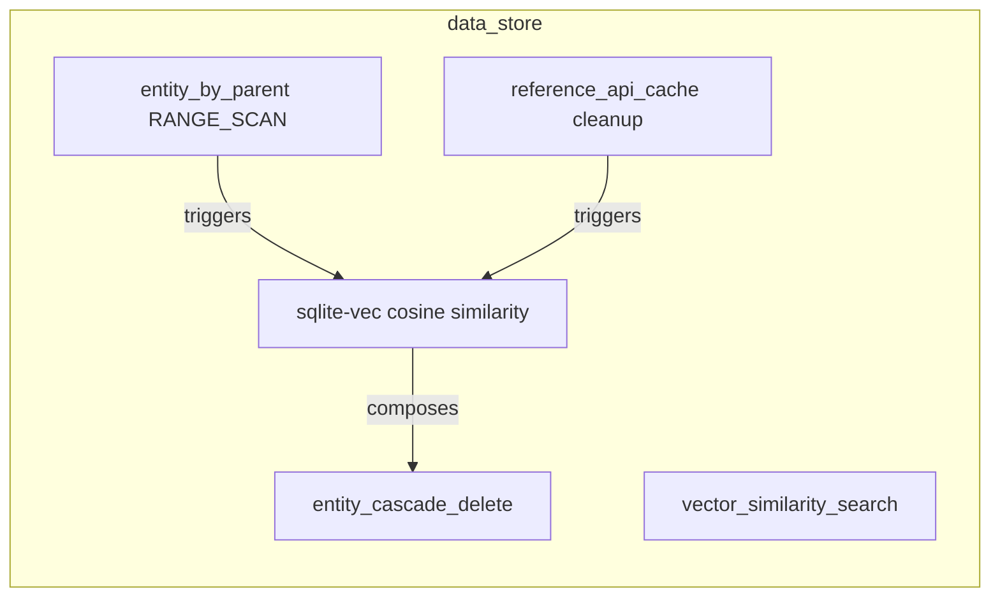
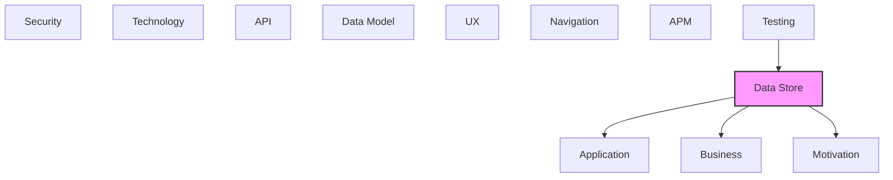

# Data Store

Databases, data stores, and persistence mechanisms.

## Report Index

- [Layer Introduction](#layer-introduction)
- [Intra-Layer Relationships](#intra-layer-relationships)
- [Inter-Layer Dependencies](#inter-layer-dependencies)
- [Inter-Layer Relationships Table](#inter-layer-relationships-table)
- [Element Reference](#element-reference)

## Layer Introduction

| Metric                    | Count |
| ------------------------- | ----- |
| Elements                  | 5     |
| Intra-Layer Relationships | 3     |
| Inter-Layer Relationships | 7     |
| Inbound Relationships     | 2     |
| Outbound Relationships    | 5     |

**Cross-Layer References**:

- **Upstream layers**: [Testing](./12-testing-layer-report.md)
- **Downstream layers**: [Application](./04-application-layer-report.md), [Business](./02-business-layer-report.md), [Motivation](./01-motivation-layer-report.md)

## Intra-Layer Relationships

## Inter-Layer Dependencies

## Inter-Layer Relationships Table

| Relationship ID                                                     | Source Node                                              | Dest Node                                                     | Dest Layer    | Predicate    | Cardinality  | Strength |
| ------------------------------------------------------------------- | -------------------------------------------------------- | ------------------------------------------------------------- | ------------- | ------------ | ------------ | -------- |
| `data-store.accesspattern.serves.application.applicationfunction`   | `data-store.accesspattern.entity-by-parent-range-scan`   | `application.applicationfunction.sparql-query-function`       | `application` | `serves`     | many-to-many | medium   |
| `data-store.accesspattern.serves.application.applicationfunction`   | `data-store.accesspattern.vector-similarity-search`      | `application.applicationfunction.embedding-generation`        | `application` | `serves`     | many-to-many | medium   |
| `data-store.retentionpolicy.satisfies.motivation.constraint`        | `data-store.retentionpolicy.reference-api-cache-cleanup` | `motivation.constraint.external-reference-source-rate-limits` | `motivation`  | `satisfies`  | many-to-many | medium   |
| `data-store.storedlogic.implements.application.applicationfunction` | `data-store.storedlogic.sqlite-vec-cosine-similarity`    | `application.applicationfunction.embedding-generation`        | `application` | `implements` | many-to-many | medium   |
| `data-store.storedlogic.realizes.business.businessfunction`         | `data-store.storedlogic.sqlite-vec-cosine-similarity`    | `business.businessfunction.semantic-search`                   | `business`    | `realizes`   | many-to-many | medium   |
| `testing.testcoveragetarget.tests.data-store.storedlogic`           | `testing.testcoveragetarget.extraction-pipeline`         | `data-store.storedlogic.sqlite-vec-cosine-similarity`         | `data-store`  | `tests`      | many-to-many | medium   |
| `testing.testcoveragetarget.tests.data-store.storedlogic`           | `testing.testcoveragetarget.ontology-crud`               | `data-store.storedlogic.sqlite-vec-cosine-similarity`         | `data-store`  | `tests`      | many-to-many | medium   |

## Element Reference

### entity_by_parent RANGE_SCAN {#entity-by-parent-range-scan}

**ID**: `data-store.accesspattern.entity-by-parent-range-scan`

**Type**: `accesspattern`

Range scan access pattern for retrieving all ontology entities with a specific parent_entity_id — supports hierarchy traversal in the Ontology Management bounded context

#### Attributes

| Name                   | Value                         |
| ---------------------- | ----------------------------- |
| consistencyRequirement | STRONG                        |
| expectedFrequency      | FREQUENT                      |
| keyCondition           | parent_entity_id = :parent_id |
| patternType            | RANGE_SCAN                    |
| targetCollection       | ontology_entities             |

#### Relationships

| Type        | Related Element                                         | Predicate  | Direction |
| ----------- | ------------------------------------------------------- | ---------- | --------- |
| inter-layer | `application.applicationfunction.sparql-query-function` | `serves`   | outbound  |
| intra-layer | `data-store.storedlogic.sqlite-vec-cosine-similarity`   | `triggers` | outbound  |

### vector_similarity_search {#vector-similarity-search}

**ID**: `data-store.accesspattern.vector-similarity-search`

**Type**: `accesspattern`

Vector similarity search access pattern using SQLiteVector cosine similarity — retrieves top-k semantically similar ontology entities by embedding

#### Attributes

| Name                   | Value                              |
| ---------------------- | ---------------------------------- |
| consistencyRequirement | EVENTUAL                           |
| expectedFrequency      | FREQUENT                           |
| keyCondition           | embedding_vector ANN :query_vector |
| patternType            | VECTOR_SIMILARITY                  |
| targetCollection       | ontology_entities                  |

#### Relationships

| Type        | Related Element                                        | Predicate | Direction |
| ----------- | ------------------------------------------------------ | --------- | --------- |
| inter-layer | `application.applicationfunction.embedding-generation` | `serves`  | outbound  |

### reference_api_cache cleanup {#reference-api-cache-cleanup}

**ID**: `data-store.retentionpolicy.reference-api-cache-cleanup`

**Type**: `retentionpolicy`

7-day TTL retention policy for the reference_api_cache.db — cached responses from ConceptNet, DBpedia, Wikidata, and schema.org are dropped and rebuilt on demand

#### Attributes

| Name              | Value               |
| ----------------- | ------------------- |
| action            | DELETE              |
| enabled           | true                |
| retentionDuration | P7D                 |
| targetCollection  | reference_api_cache |

#### Relationships

| Type        | Related Element                                               | Predicate   | Direction |
| ----------- | ------------------------------------------------------------- | ----------- | --------- |
| inter-layer | `motivation.constraint.external-reference-source-rate-limits` | `satisfies` | outbound  |
| intra-layer | `data-store.storedlogic.sqlite-vec-cosine-similarity`         | `triggers`  | outbound  |

### sqlite-vec cosine similarity {#sqlite-vec-cosine-similarity}

**ID**: `data-store.storedlogic.sqlite-vec-cosine-similarity`

**Type**: `storedlogic`

SQLite user-defined function provided by the sqlite-vec extension that computes cosine similarity between two embedding vectors for ANN search

#### Attributes

| Name          | Value |
| ------------- | ----- |
| deterministic | true  |
| language      | C     |
| logicType     | UDF   |
| returnType    | FLOAT |
| sideEffects   | false |

#### Relationships

| Type        | Related Element                                          | Predicate    | Direction |
| ----------- | -------------------------------------------------------- | ------------ | --------- |
| inter-layer | `application.applicationfunction.embedding-generation`   | `implements` | outbound  |
| inter-layer | `business.businessfunction.semantic-search`              | `realizes`   | outbound  |
| inter-layer | `testing.testcoveragetarget.extraction-pipeline`         | `tests`      | inbound   |
| inter-layer | `testing.testcoveragetarget.ontology-crud`               | `tests`      | inbound   |
| intra-layer | `data-store.accesspattern.entity-by-parent-range-scan`   | `triggers`   | inbound   |
| intra-layer | `data-store.retentionpolicy.reference-api-cache-cleanup` | `triggers`   | inbound   |
| intra-layer | `data-store.validationrule.entity-cascade-delete`        | `composes`   | outbound  |

### entity_cascade_delete {#entity-cascade-delete}

**ID**: `data-store.validationrule.entity-cascade-delete`

**Type**: `validationrule`

Foreign key cascade delete rule on parent_entity_id in ontology_entities — deleting a parent Taxonomy or ConceptScheme cascades to child entities

#### Attributes

| Name                 | Value             |
| -------------------- | ----------------- |
| enforcement          | STRICT            |
| onDelete             | CASCADE           |
| onUpdate             | NO_ACTION         |
| referencedCollection | ontology_entities |
| referencedFields     | id                |
| ruleType             | FOREIGN_KEY       |
| targetFields         | parent_entity_id  |

#### Relationships

| Type        | Related Element                                       | Predicate  | Direction |
| ----------- | ----------------------------------------------------- | ---------- | --------- |
| intra-layer | `data-store.storedlogic.sqlite-vec-cosine-similarity` | `composes` | inbound   |

---

Generated: 2026-05-07T22:00:51.579Z | Model Version: 0.1.0
