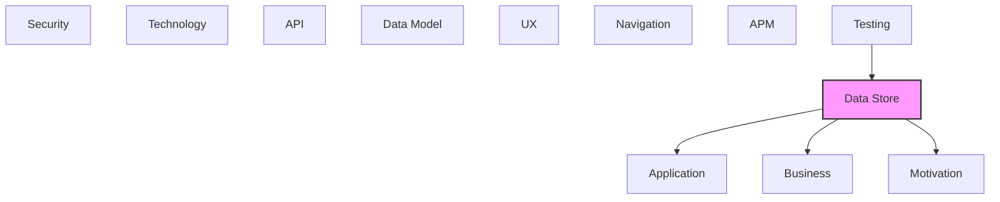

# Data Store

Databases, data stores, and persistence mechanisms.

## Report Index

- [Layer Introduction](#layer-introduction)
- [Intra-Layer Relationships](#intra-layer-relationships)
- [Inter-Layer Dependencies](#inter-layer-dependencies)
- [Inter-Layer Relationships Table](#inter-layer-relationships-table)
- [Element Reference](#element-reference)

## Layer Introduction

| Metric                    | Count |
| ------------------------- | ----- |
| Elements                  | 23    |
| Intra-Layer Relationships | 6     |
| Inter-Layer Relationships | 26    |
| Inbound Relationships     | 4     |
| Outbound Relationships    | 22    |

**Cross-Layer References**:

- **Upstream layers**: [Testing](./12-testing-layer-report.md)
- **Downstream layers**: [Application](./04-application-layer-report.md), [Business](./02-business-layer-report.md), [Motivation](./01-motivation-layer-report.md)

## Intra-Layer Relationships

```mermaid
flowchart LR
  subgraph data_store
    data_store_accesspattern_entity_by_parent_range_scan["entity_by_parent RANGE_SCAN"]
    data_store_accesspattern_vector_similarity_search["vector_similarity_search"]
    data_store_collection_change_events["change_events"]
    data_store_collection_changeset_events_table["changeset_events table"]
    data_store_collection_changesets_table["changesets table"]
    data_store_collection_conflict_resolutions_table["conflict_resolutions table"]
    data_store_collection_entity_versions_table["entity_versions table"]
    data_store_collection_extraction_results_table["extraction_results table"]
    data_store_collection_import_runs_table["import_runs table"]
    data_store_collection_individual_classes_table["individual_classes table"]
    data_store_collection_ontology_entities["ontology_entities"]
    data_store_collection_pipeline_configurations_table["pipeline_configurations table"]
    data_store_collection_pipeline_executions_table["pipeline_executions table"]
    data_store_collection_property_definitions_table["property_definitions table"]
    data_store_collection_proposals_table["proposals table"]
    data_store_collection_relationships["relationships"]
    data_store_database_localdb["local.db"]
    data_store_database_operationsdb["operations.db"]
    data_store_database_reference_api_cachedb["reference_api_cache.db"]
    data_store_database_referencedb["reference.db"]
    data_store_retentionpolicy_reference_api_cache_cleanup["reference_api_cache cleanup"]
    data_store_storedlogic_sqlite_vec_cosine_similarity["sqlite-vec cosine similarity"]
    data_store_validationrule_entity_cascade_delete["entity_cascade_delete"]
    data_store_accesspattern_entity_by_parent_range_scan -->|triggers| data_store_storedlogic_sqlite_vec_cosine_similarity
    data_store_database_localdb -->|composes| data_store_collection_change_events
    data_store_database_localdb -->|composes| data_store_collection_ontology_entities
    data_store_database_localdb -->|composes| data_store_collection_relationships
    data_store_retentionpolicy_reference_api_cache_cleanup -->|triggers| data_store_storedlogic_sqlite_vec_cosine_similarity
    data_store_storedlogic_sqlite_vec_cosine_similarity -->|composes| data_store_validationrule_entity_cascade_delete
  end
```

## Inter-Layer Dependencies

## Inter-Layer Relationships Table

| Relationship ID                                                     | Source Node                                              | Dest Node                                                        | Dest Layer    | Predicate    | Cardinality  | Strength |
| ------------------------------------------------------------------- | -------------------------------------------------------- | ---------------------------------------------------------------- | ------------- | ------------ | ------------ | -------- |
| `data-store.accesspattern.serves.application.applicationfunction`   | `data-store.accesspattern.entity-by-parent-range-scan`   | `application.applicationfunction.sparql-query-function`          | `application` | `serves`     | many-to-many | medium   |
| `data-store.accesspattern.serves.application.applicationfunction`   | `data-store.accesspattern.vector-similarity-search`      | `application.applicationfunction.embedding-generation`           | `application` | `serves`     | many-to-many | medium   |
| `data-store.collection.serves.application.applicationcomponent`     | `data-store.collection.change-events`                    | `application.applicationcomponent.sqlite-change-repository`      | `application` | `serves`     | many-to-many | medium   |
| `data-store.collection.serves.application.applicationcomponent`     | `data-store.collection.changeset-events-table`           | `application.applicationcomponent.sqlite-change-repository`      | `application` | `serves`     | many-to-many | medium   |
| `data-store.collection.serves.application.applicationcomponent`     | `data-store.collection.changesets-table`                 | `application.applicationcomponent.sqlite-change-repository`      | `application` | `serves`     | many-to-many | medium   |
| `data-store.collection.serves.application.applicationcomponent`     | `data-store.collection.conflict-resolutions-table`       | `application.applicationcomponent.sqlite-change-repository`      | `application` | `serves`     | many-to-many | medium   |
| `data-store.collection.serves.application.applicationcomponent`     | `data-store.collection.entity-versions-table`            | `application.applicationcomponent.sqlite-change-repository`      | `application` | `serves`     | many-to-many | medium   |
| `data-store.collection.serves.application.applicationcomponent`     | `data-store.collection.extraction-results-table`         | `application.applicationcomponent.sqlite-extraction-repository`  | `application` | `serves`     | many-to-many | medium   |
| `data-store.collection.serves.application.applicationcomponent`     | `data-store.collection.import-runs-table`                | `application.applicationcomponent.sqlite-interchange-repository` | `application` | `serves`     | many-to-many | medium   |
| `data-store.collection.serves.application.applicationcomponent`     | `data-store.collection.individual-classes-table`         | `application.applicationcomponent.sqlite-ontology-repository`    | `application` | `serves`     | many-to-many | medium   |
| `data-store.collection.serves.application.applicationcomponent`     | `data-store.collection.ontology-entities`                | `application.applicationcomponent.sqlite-ontology-repository`    | `application` | `serves`     | many-to-many | medium   |
| `data-store.collection.serves.application.applicationcomponent`     | `data-store.collection.pipeline-configurations-table`    | `application.applicationcomponent.sqlite-pipeline-repository`    | `application` | `serves`     | many-to-many | medium   |
| `data-store.collection.serves.application.applicationcomponent`     | `data-store.collection.pipeline-executions-table`        | `application.applicationcomponent.sqlite-pipeline-repository`    | `application` | `serves`     | many-to-many | medium   |
| `data-store.collection.serves.application.applicationcomponent`     | `data-store.collection.property-definitions-table`       | `application.applicationcomponent.sqlite-ontology-repository`    | `application` | `serves`     | many-to-many | medium   |
| `data-store.collection.serves.application.applicationcomponent`     | `data-store.collection.proposals-table`                  | `application.applicationcomponent.sqlite-change-repository`      | `application` | `serves`     | many-to-many | medium   |
| `data-store.database.serves.application.applicationcomponent`       | `data-store.database.operationsdb`                       | `application.applicationcomponent.sqlite-pipeline-repository`    | `application` | `serves`     | many-to-many | medium   |
| `data-store.database.serves.application.applicationcomponent`       | `data-store.database.reference-api-cachedb`              | `application.applicationcomponent.cached-reference-source`       | `application` | `serves`     | many-to-many | medium   |
| `data-store.database.serves.application.applicationcomponent`       | `data-store.database.referencedb`                        | `application.applicationcomponent.local-reference-repository`    | `application` | `serves`     | many-to-many | medium   |
| `data-store.retentionpolicy.satisfies.motivation.constraint`        | `data-store.retentionpolicy.reference-api-cache-cleanup` | `motivation.constraint.external-reference-source-rate-limits`    | `motivation`  | `satisfies`  | many-to-many | medium   |
| `data-store.storedlogic.implements.application.applicationfunction` | `data-store.storedlogic.sqlite-vec-cosine-similarity`    | `application.applicationfunction.embedding-generation`           | `application` | `implements` | many-to-many | medium   |
| `data-store.storedlogic.realizes.business.businessfunction`         | `data-store.storedlogic.sqlite-vec-cosine-similarity`    | `business.businessfunction.semantic-search`                      | `business`    | `realizes`   | many-to-many | medium   |
| `data-store.storedlogic.serves.application.applicationservice`      | `data-store.storedlogic.sqlite-vec-cosine-similarity`    | `application.applicationservice.extraction-service`              | `application` | `serves`     | many-to-many | medium   |
| `testing.testcoveragetarget.tests.data-store.collection`            | `testing.testcoveragetarget.e2e-test-suite`              | `data-store.collection.ontology-entities`                        | `data-store`  | `tests`      | many-to-many | medium   |
| `testing.testcoveragetarget.tests.data-store.storedlogic`           | `testing.testcoveragetarget.extraction-pipeline`         | `data-store.storedlogic.sqlite-vec-cosine-similarity`            | `data-store`  | `tests`      | many-to-many | medium   |
| `testing.testcoveragetarget.tests.data-store.storedlogic`           | `testing.testcoveragetarget.ontology-crud`               | `data-store.storedlogic.sqlite-vec-cosine-similarity`            | `data-store`  | `tests`      | many-to-many | medium   |
| `testing.testcoveragetarget.tests.data-store.collection`            | `testing.testcoveragetarget.performance-test-suite`      | `data-store.collection.ontology-entities`                        | `data-store`  | `tests`      | many-to-many | medium   |

## Element Reference

### entity_by_parent RANGE_SCAN {#entity-by-parent-range-scan}

**ID**: `data-store.accesspattern.entity-by-parent-range-scan`

**Type**: `accesspattern`

Range scan access pattern for retrieving all ontology entities with a specific parent_entity_id — supports hierarchy traversal in the Ontology Management bounded context

#### Attributes

| Name                   | Value                         |
| ---------------------- | ----------------------------- |
| consistencyRequirement | STRONG                        |
| expectedFrequency      | FREQUENT                      |
| keyCondition           | parent_entity_id = :parent_id |
| patternType            | RANGE_SCAN                    |
| targetCollection       | ontology_entities             |

#### Relationships

| Type        | Related Element                                         | Predicate  | Direction |
| ----------- | ------------------------------------------------------- | ---------- | --------- |
| inter-layer | `application.applicationfunction.sparql-query-function` | `serves`   | outbound  |
| intra-layer | `data-store.storedlogic.sqlite-vec-cosine-similarity`   | `triggers` | outbound  |

### vector_similarity_search {#vector-similarity-search}

**ID**: `data-store.accesspattern.vector-similarity-search`

**Type**: `accesspattern`

Vector similarity search access pattern using SQLiteVector cosine similarity — retrieves top-k semantically similar ontology entities by embedding

#### Attributes

| Name                   | Value                              |
| ---------------------- | ---------------------------------- |
| consistencyRequirement | EVENTUAL                           |
| expectedFrequency      | FREQUENT                           |
| keyCondition           | embedding_vector ANN :query_vector |
| patternType            | VECTOR_SIMILARITY                  |
| targetCollection       | ontology_entities                  |

#### Relationships

| Type        | Related Element                                        | Predicate | Direction |
| ----------- | ------------------------------------------------------ | --------- | --------- |
| inter-layer | `application.applicationfunction.embedding-generation` | `serves`  | outbound  |

### change_events {#change-events}

**ID**: `data-store.collection.change-events`

**Type**: `collection`

Audit trail of all entity changes — stores entity_id, entity_type, event_type, actor, timestamp, and before/after snapshots for versioning and audit compliance

#### Attributes

| Name           | Value |
| -------------- | ----- |
| collectionType | TABLE |

#### Relationships

| Type        | Related Element                                             | Predicate  | Direction |
| ----------- | ----------------------------------------------------------- | ---------- | --------- |
| inter-layer | `application.applicationcomponent.sqlite-change-repository` | `serves`   | outbound  |
| intra-layer | `data-store.database.localdb`                               | `composes` | inbound   |

### changeset_events table {#changeset-events-table}

**ID**: `data-store.collection.changeset-events-table`

**Type**: `collection`

SQLite table: changeset_events — stores individual entity-level changes within a changeset (operation, entity_id, before/after snapshots); in local.db

#### Attributes

| Name           | Value |
| -------------- | ----- |
| collectionType | TABLE |

#### Relationships

| Type        | Related Element                                             | Predicate | Direction |
| ----------- | ----------------------------------------------------------- | --------- | --------- |
| inter-layer | `application.applicationcomponent.sqlite-change-repository` | `serves`  | outbound  |

### changesets table {#changesets-table}

**ID**: `data-store.collection.changesets-table`

**Type**: `collection`

SQLite table: changesets — groups related change events into a reviewable unit with state machine (draft/staged/submitted/merged); in local.db

#### Attributes

| Name           | Value |
| -------------- | ----- |
| collectionType | TABLE |

#### Relationships

| Type        | Related Element                                             | Predicate | Direction |
| ----------- | ----------------------------------------------------------- | --------- | --------- |
| inter-layer | `application.applicationcomponent.sqlite-change-repository` | `serves`  | outbound  |

### conflict_resolutions table {#conflict-resolutions-table}

**ID**: `data-store.collection.conflict-resolutions-table`

**Type**: `collection`

SQLite table: conflict_resolutions — stores manual conflict resolution decisions with chosen resolution strategy per entity conflict; in local.db

#### Attributes

| Name           | Value |
| -------------- | ----- |
| collectionType | TABLE |

#### Relationships

| Type        | Related Element                                             | Predicate | Direction |
| ----------- | ----------------------------------------------------------- | --------- | --------- |
| inter-layer | `application.applicationcomponent.sqlite-change-repository` | `serves`  | outbound  |

### entity_versions table {#entity-versions-table}

**ID**: `data-store.collection.entity-versions-table`

**Type**: `collection`

SQLite table: entity_versions — stores JSON snapshots of entity state at each version for point-in-time recovery; in local.db

#### Attributes

| Name           | Value |
| -------------- | ----- |
| collectionType | TABLE |

#### Relationships

| Type        | Related Element                                             | Predicate | Direction |
| ----------- | ----------------------------------------------------------- | --------- | --------- |
| inter-layer | `application.applicationcomponent.sqlite-change-repository` | `serves`  | outbound  |

### extraction_results table {#extraction-results-table}

**ID**: `data-store.collection.extraction-results-table`

**Type**: `collection`

SQLite table: extraction_results — stores NLP/LLM extraction run outputs, source text, extracted entity IDs, and processing metrics; in local.db

#### Attributes

| Name           | Value |
| -------------- | ----- |
| collectionType | TABLE |

#### Relationships

| Type        | Related Element                                                 | Predicate | Direction |
| ----------- | --------------------------------------------------------------- | --------- | --------- |
| inter-layer | `application.applicationcomponent.sqlite-extraction-repository` | `serves`  | outbound  |

### import_runs table {#import-runs-table}

**ID**: `data-store.collection.import-runs-table`

**Type**: `collection`

SQLite table: import_runs — stores interchange import run metadata (format, status, entity counts, error details, timestamps); in local.db

#### Attributes

| Name           | Value |
| -------------- | ----- |
| collectionType | TABLE |

#### Relationships

| Type        | Related Element                                                  | Predicate | Direction |
| ----------- | ---------------------------------------------------------------- | --------- | --------- |
| inter-layer | `application.applicationcomponent.sqlite-interchange-repository` | `serves`  | outbound  |

### individual_classes table {#individual-classes-table}

**ID**: `data-store.collection.individual-classes-table`

**Type**: `collection`

SQLite table: individual_classes — association table mapping individual instances to their parent classes with ordering index; in local.db

#### Attributes

| Name           | Value |
| -------------- | ----- |
| collectionType | TABLE |

#### Relationships

| Type        | Related Element                                               | Predicate | Direction |
| ----------- | ------------------------------------------------------------- | --------- | --------- |
| inter-layer | `application.applicationcomponent.sqlite-ontology-repository` | `serves`  | outbound  |

### ontology_entities {#ontology-entities}

**ID**: `data-store.collection.ontology-entities`

**Type**: `collection`

Unified table for all ontology entities (Taxonomy, ConceptScheme, Class, Individual) using single-table inheritance with node_type discriminator — includes vector embedding column for semantic search via sqlite-vec

#### Attributes

| Name           | Value |
| -------------- | ----- |
| collectionType | TABLE |

#### Relationships

| Type        | Related Element                                               | Predicate  | Direction |
| ----------- | ------------------------------------------------------------- | ---------- | --------- |
| inter-layer | `application.applicationcomponent.sqlite-ontology-repository` | `serves`   | outbound  |
| inter-layer | `testing.testcoveragetarget.e2e-test-suite`                   | `tests`    | inbound   |
| inter-layer | `testing.testcoveragetarget.performance-test-suite`           | `tests`    | inbound   |
| intra-layer | `data-store.database.localdb`                                 | `composes` | inbound   |

### pipeline_configurations table {#pipeline-configurations-table}

**ID**: `data-store.collection.pipeline-configurations-table`

**Type**: `collection`

SQLite table: pipeline_configurations — stores LLM pipeline definitions (provider, model, prompt templates, parameters) in operations.db

#### Attributes

| Name           | Value |
| -------------- | ----- |
| collectionType | TABLE |

#### Relationships

| Type        | Related Element                                               | Predicate | Direction |
| ----------- | ------------------------------------------------------------- | --------- | --------- |
| inter-layer | `application.applicationcomponent.sqlite-pipeline-repository` | `serves`  | outbound  |

### pipeline_executions table {#pipeline-executions-table}

**ID**: `data-store.collection.pipeline-executions-table`

**Type**: `collection`

SQLite table: pipeline_executions — stores LLM pipeline execution records (status, input/output, LLM traceability log, timing) in operations.db

#### Attributes

| Name           | Value |
| -------------- | ----- |
| collectionType | TABLE |

#### Relationships

| Type        | Related Element                                               | Predicate | Direction |
| ----------- | ------------------------------------------------------------- | --------- | --------- |
| inter-layer | `application.applicationcomponent.sqlite-pipeline-repository` | `serves`  | outbound  |

### property_definitions table {#property-definitions-table}

**ID**: `data-store.collection.property-definitions-table`

**Type**: `collection`

SQLite table: property_definitions — stores relationship type definitions (object properties) with domain, range, and inverse property FKs; in local.db

#### Attributes

| Name           | Value |
| -------------- | ----- |
| collectionType | TABLE |

#### Relationships

| Type        | Related Element                                               | Predicate | Direction |
| ----------- | ------------------------------------------------------------- | --------- | --------- |
| inter-layer | `application.applicationcomponent.sqlite-ontology-repository` | `serves`  | outbound  |

### proposals table {#proposals-table}

**ID**: `data-store.collection.proposals-table`

**Type**: `collection`

SQLite table: proposals — stores merge proposals linking changesets to review workflow (status, reviewer, timestamps, conflict state); in local.db

#### Attributes

| Name           | Value |
| -------------- | ----- |
| collectionType | TABLE |

#### Relationships

| Type        | Related Element                                             | Predicate | Direction |
| ----------- | ----------------------------------------------------------- | --------- | --------- |
| inter-layer | `application.applicationcomponent.sqlite-change-repository` | `serves`  | outbound  |

### relationships {#relationships}

**ID**: `data-store.collection.relationships`

**Type**: `collection`

Typed directed edges between ontology entities — stores source/target entity references, relationship type, and optional metadata for the knowledge graph structure

#### Attributes

| Name           | Value |
| -------------- | ----- |
| collectionType | TABLE |

#### Relationships

| Type        | Related Element               | Predicate  | Direction |
| ----------- | ----------------------------- | ---------- | --------- |
| intra-layer | `data-store.database.localdb` | `composes` | inbound   |

### local.db {#local-db}

**ID**: `data-store.database.localdb`

**Type**: `database`

Primary workspace database (Alembic-managed SQLite) — stores ontology entities, relationships, property definitions, change events, extraction results, versioning artefacts, and interchange import runs

#### Attributes

| Name     | Value      |
| -------- | ---------- |
| engine   | SQLite     |
| paradigm | RELATIONAL |

#### Relationships

| Type        | Related Element                           | Predicate  | Direction |
| ----------- | ----------------------------------------- | ---------- | --------- |
| intra-layer | `data-store.collection.change-events`     | `composes` | outbound  |
| intra-layer | `data-store.collection.ontology-entities` | `composes` | outbound  |
| intra-layer | `data-store.collection.relationships`     | `composes` | outbound  |

### operations.db {#operations-db}

**ID**: `data-store.database.operationsdb`

**Type**: `database`

Operational database (Alembic-managed SQLite) — stores pipeline configurations and execution records with LLM traceability logs

#### Attributes

| Name     | Value      |
| -------- | ---------- |
| engine   | SQLite     |
| paradigm | RELATIONAL |

#### Relationships

| Type        | Related Element                                               | Predicate | Direction |
| ----------- | ------------------------------------------------------------- | --------- | --------- |
| inter-layer | `application.applicationcomponent.sqlite-pipeline-repository` | `serves`  | outbound  |

### reference_api_cache.db {#reference-api-cache-db}

**ID**: `data-store.database.reference-api-cachedb`

**Type**: `database`

Cached responses from external knowledge source APIs (ConceptNet, DBpedia, Wikidata, schema.org) — no Alembic migrations, can be dropped and rebuilt

#### Attributes

| Name     | Value      |
| -------- | ---------- |
| engine   | SQLite     |
| paradigm | RELATIONAL |

#### Relationships

| Type        | Related Element                                            | Predicate | Direction |
| ----------- | ---------------------------------------------------------- | --------- | --------- |
| inter-layer | `application.applicationcomponent.cached-reference-source` | `serves`  | outbound  |

### reference.db {#reference-db}

**ID**: `data-store.database.referencedb`

**Type**: `database`

Imported reference data from ConceptNet, DBpedia, Wikidata, and schema.org — no Alembic migrations, can be dropped and rebuilt from source APIs

#### Attributes

| Name     | Value      |
| -------- | ---------- |
| engine   | SQLite     |
| paradigm | RELATIONAL |

#### Relationships

| Type        | Related Element                                               | Predicate | Direction |
| ----------- | ------------------------------------------------------------- | --------- | --------- |
| inter-layer | `application.applicationcomponent.local-reference-repository` | `serves`  | outbound  |

### reference_api_cache cleanup {#reference-api-cache-cleanup}

**ID**: `data-store.retentionpolicy.reference-api-cache-cleanup`

**Type**: `retentionpolicy`

7-day TTL retention policy for the reference_api_cache.db — cached responses from ConceptNet, DBpedia, Wikidata, and schema.org are dropped and rebuilt on demand

#### Attributes

| Name              | Value               |
| ----------------- | ------------------- |
| action            | DELETE              |
| enabled           | true                |
| retentionDuration | P7D                 |
| targetCollection  | reference_api_cache |

#### Relationships

| Type        | Related Element                                               | Predicate   | Direction |
| ----------- | ------------------------------------------------------------- | ----------- | --------- |
| inter-layer | `motivation.constraint.external-reference-source-rate-limits` | `satisfies` | outbound  |
| intra-layer | `data-store.storedlogic.sqlite-vec-cosine-similarity`         | `triggers`  | outbound  |

### sqlite-vec cosine similarity {#sqlite-vec-cosine-similarity}

**ID**: `data-store.storedlogic.sqlite-vec-cosine-similarity`

**Type**: `storedlogic`

SQLite user-defined function provided by the sqlite-vec extension that computes cosine similarity between two embedding vectors for ANN search

#### Attributes

| Name          | Value |
| ------------- | ----- |
| deterministic | true  |
| language      | C     |
| logicType     | UDF   |
| returnType    | FLOAT |
| sideEffects   | false |

#### Relationships

| Type        | Related Element                                          | Predicate    | Direction |
| ----------- | -------------------------------------------------------- | ------------ | --------- |
| inter-layer | `application.applicationfunction.embedding-generation`   | `implements` | outbound  |
| inter-layer | `business.businessfunction.semantic-search`              | `realizes`   | outbound  |
| inter-layer | `application.applicationservice.extraction-service`      | `serves`     | outbound  |
| inter-layer | `testing.testcoveragetarget.extraction-pipeline`         | `tests`      | inbound   |
| inter-layer | `testing.testcoveragetarget.ontology-crud`               | `tests`      | inbound   |
| intra-layer | `data-store.accesspattern.entity-by-parent-range-scan`   | `triggers`   | inbound   |
| intra-layer | `data-store.retentionpolicy.reference-api-cache-cleanup` | `triggers`   | inbound   |
| intra-layer | `data-store.validationrule.entity-cascade-delete`        | `composes`   | outbound  |

### entity_cascade_delete {#entity-cascade-delete}

**ID**: `data-store.validationrule.entity-cascade-delete`

**Type**: `validationrule`

Foreign key cascade delete rule on parent_entity_id in ontology_entities — deleting a parent Taxonomy or ConceptScheme cascades to child entities

#### Attributes

| Name                 | Value             |
| -------------------- | ----------------- |
| enforcement          | STRICT            |
| onDelete             | CASCADE           |
| onUpdate             | NO_ACTION         |
| referencedCollection | ontology_entities |
| referencedFields     | id                |
| ruleType             | FOREIGN_KEY       |
| targetFields         | parent_entity_id  |

#### Relationships

| Type        | Related Element                                       | Predicate  | Direction |
| ----------- | ----------------------------------------------------- | ---------- | --------- |
| intra-layer | `data-store.storedlogic.sqlite-vec-cosine-similarity` | `composes` | inbound   |

---

Generated: 2026-05-10T10:17:36.894Z | Model Version: 0.1.0
