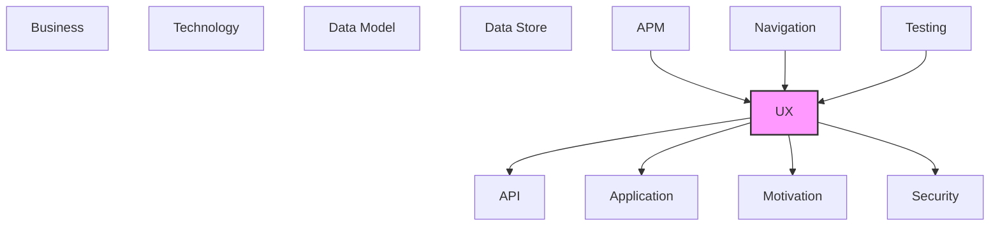

# UX

User interface components, screens, and user experience elements.

## Report Index

- [Layer Introduction](#layer-introduction)
- [Intra-Layer Relationships](#intra-layer-relationships)
- [Inter-Layer Dependencies](#inter-layer-dependencies)
- [Inter-Layer Relationships Table](#inter-layer-relationships-table)
- [Element Reference](#element-reference)

## Layer Introduction

| Metric                    | Count |
| ------------------------- | ----- |
| Elements                  | 17    |
| Intra-Layer Relationships | 3     |
| Inter-Layer Relationships | 40    |
| Inbound Relationships     | 19    |
| Outbound Relationships    | 21    |

**Cross-Layer References**:

- **Upstream layers**: [APM](./11-apm-layer-report.md), [Navigation](./10-navigation-layer-report.md), [Testing](./12-testing-layer-report.md)
- **Downstream layers**: [API](./06-api-layer-report.md), [Application](./04-application-layer-report.md), [Motivation](./01-motivation-layer-report.md), [Security](./03-security-layer-report.md)

## Intra-Layer Relationships

```mermaid
flowchart LR
  subgraph ux
    ux_experiencestate_entity_crud_state["Entity CRUD State"]
    ux_librarycomponent_flowbite_react_components["Flowbite React Components"]
    ux_statepattern_crud_entity_pattern["CRUD Entity Pattern"]
    ux_uxapplication_context_studio_spa["Context Studio SPA"]
    ux_uxlibrary_flowbite_react_component_library["Flowbite React Component Library"]
    ux_uxspec_ontology_editor_ux_spec["Ontology Editor UX Spec"]
    ux_view_admin_view["Admin View"]
    ux_view_classes_view["Classes View"]
    ux_view_concept_schemes_view["Concept Schemes View"]
    ux_view_configuration_view["Configuration View"]
    ux_view_datasets_view["Datasets View"]
    ux_view_individuals_view["Individuals View"]
    ux_view_interchange_view["Interchange View"]
    ux_view_properties_view["Properties View"]
    ux_view_rag_experiments_view["RAG Experiments View"]
    ux_view_relationships_view["Relationships View"]
    ux_view_taxonomies_view["Taxonomies View"]
    ux_statepattern_crud_entity_pattern -->|governs| ux_experiencestate_entity_crud_state
    ux_uxapplication_context_studio_spa -->|aggregates| ux_uxspec_ontology_editor_ux_spec
    ux_uxlibrary_flowbite_react_component_library -->|aggregates| ux_librarycomponent_flowbite_react_components
  end
```

## Inter-Layer Dependencies

## Inter-Layer Relationships Table

| Relationship ID                                 | Source Node                                         | Dest Node                                           | Dest Layer    | Predicate  | Cardinality  | Strength |
| ----------------------------------------------- | --------------------------------------------------- | --------------------------------------------------- | ------------- | ---------- | ------------ | -------- |
| `apm.metricinstrument.monitors.ux.view`         | `apm.metricinstrument.rag-processing-time`          | `ux.view.rag-experiments-view`                      | `ux`          | `monitors` | many-to-many | medium   |
| `apm.span.monitors.ux.view`                     | `apm.span.api-request-span`                         | `ux.view.rag-experiments-view`                      | `ux`          | `monitors` | many-to-many | medium   |
| `apm.span.monitors.ux.view`                     | `apm.span.database-query-span`                      | `ux.view.datasets-view`                             | `ux`          | `monitors` | many-to-many | medium   |
| `navigation.route.maps-to.ux.view`              | `navigation.route.admin-route`                      | `ux.view.admin-view`                                | `ux`          | `maps-to`  | many-to-many | medium   |
| `navigation.route.maps-to.ux.view`              | `navigation.route.classes-route`                    | `ux.view.classes-view`                              | `ux`          | `maps-to`  | many-to-many | medium   |
| `navigation.route.maps-to.ux.view`              | `navigation.route.concept-schemes-route`            | `ux.view.concept-schemes-view`                      | `ux`          | `maps-to`  | many-to-many | medium   |
| `navigation.route.maps-to.ux.view`              | `navigation.route.configuration-route`              | `ux.view.configuration-view`                        | `ux`          | `maps-to`  | many-to-many | medium   |
| `navigation.route.maps-to.ux.view`              | `navigation.route.datasets-route`                   | `ux.view.datasets-view`                             | `ux`          | `maps-to`  | many-to-many | medium   |
| `navigation.route.maps-to.ux.view`              | `navigation.route.individuals-route`                | `ux.view.individuals-view`                          | `ux`          | `maps-to`  | many-to-many | medium   |
| `navigation.route.maps-to.ux.view`              | `navigation.route.interchange-route`                | `ux.view.interchange-view`                          | `ux`          | `maps-to`  | many-to-many | medium   |
| `navigation.route.maps-to.ux.view`              | `navigation.route.properties-route`                 | `ux.view.properties-view`                           | `ux`          | `maps-to`  | many-to-many | medium   |
| `navigation.route.maps-to.ux.view`              | `navigation.route.rag-experiments-route`            | `ux.view.rag-experiments-view`                      | `ux`          | `maps-to`  | many-to-many | medium   |
| `navigation.route.maps-to.ux.view`              | `navigation.route.relationships-route`              | `ux.view.relationships-view`                        | `ux`          | `maps-to`  | many-to-many | medium   |
| `navigation.route.maps-to.ux.view`              | `navigation.route.taxonomies-route`                 | `ux.view.taxonomies-view`                           | `ux`          | `maps-to`  | many-to-many | medium   |
| `testing.testcoveragetarget.covers.ux.view`     | `testing.testcoveragetarget.admin-health`           | `ux.view.admin-view`                                | `ux`          | `covers`   | many-to-many | medium   |
| `testing.testcoveragetarget.covers.ux.view`     | `testing.testcoveragetarget.extraction-pipeline`    | `ux.view.rag-experiments-view`                      | `ux`          | `covers`   | many-to-many | medium   |
| `testing.testcoveragetarget.covers.ux.view`     | `testing.testcoveragetarget.graph-analysis`         | `ux.view.rag-experiments-view`                      | `ux`          | `covers`   | many-to-many | medium   |
| `testing.testcoveragetarget.covers.ux.view`     | `testing.testcoveragetarget.llm-pipeline-execution` | `ux.view.rag-experiments-view`                      | `ux`          | `covers`   | many-to-many | medium   |
| `testing.testcoveragetarget.covers.ux.view`     | `testing.testcoveragetarget.versioning-workflow`    | `ux.view.datasets-view`                             | `ux`          | `covers`   | many-to-many | medium   |
| `ux.view.requires.security.role`                | `ux.view.admin-view`                                | `security.role.administrator`                       | `security`    | `requires` | many-to-many | medium   |
| `ux.view.serves.application.applicationservice` | `ux.view.admin-view`                                | `application.applicationservice.admin-service`      | `application` | `serves`   | many-to-many | medium   |
| `ux.view.serves.motivation.stakeholder`         | `ux.view.admin-view`                                | `motivation.stakeholder.platform-developer`         | `motivation`  | `serves`   | many-to-many | medium   |
| `ux.view.uses.api.securityscheme`               | `ux.view.admin-view`                                | `api.securityscheme.api-key`                        | `api`         | `uses`     | many-to-many | medium   |
| `ux.view.serves.application.applicationservice` | `ux.view.classes-view`                              | `application.applicationservice.ontology-service`   | `application` | `serves`   | many-to-many | medium   |
| `ux.view.serves.application.applicationservice` | `ux.view.concept-schemes-view`                      | `application.applicationservice.ontology-service`   | `application` | `serves`   | many-to-many | medium   |
| `ux.view.serves.application.applicationservice` | `ux.view.configuration-view`                        | `application.applicationservice.admin-service`      | `application` | `serves`   | many-to-many | medium   |
| `ux.view.serves.motivation.stakeholder`         | `ux.view.configuration-view`                        | `motivation.stakeholder.platform-developer`         | `motivation`  | `serves`   | many-to-many | medium   |
| `ux.view.uses.api.securityscheme`               | `ux.view.configuration-view`                        | `api.securityscheme.api-key`                        | `api`         | `uses`     | many-to-many | medium   |
| `ux.view.serves.application.applicationservice` | `ux.view.datasets-view`                             | `application.applicationservice.ontology-service`   | `application` | `serves`   | many-to-many | medium   |
| `ux.view.serves.motivation.stakeholder`         | `ux.view.datasets-view`                             | `motivation.stakeholder.knowledge-manager`          | `motivation`  | `serves`   | many-to-many | medium   |
| `ux.view.uses.api.securityscheme`               | `ux.view.datasets-view`                             | `api.securityscheme.api-key`                        | `api`         | `uses`     | many-to-many | medium   |
| `ux.view.serves.application.applicationservice` | `ux.view.individuals-view`                          | `application.applicationservice.ontology-service`   | `application` | `serves`   | many-to-many | medium   |
| `ux.view.serves.application.applicationservice` | `ux.view.interchange-view`                          | `application.applicationservice.import-run-service` | `application` | `serves`   | many-to-many | medium   |
| `ux.view.serves.application.applicationservice` | `ux.view.properties-view`                           | `application.applicationservice.ontology-service`   | `application` | `serves`   | many-to-many | medium   |
| `ux.view.maps-to.motivation.outcome`            | `ux.view.rag-experiments-view`                      | `motivation.outcome.improved-ai-inference-quality`  | `motivation`  | `maps-to`  | many-to-many | medium   |
| `ux.view.serves.application.applicationservice` | `ux.view.rag-experiments-view`                      | `application.applicationservice.extraction-service` | `application` | `serves`   | many-to-many | medium   |
| `ux.view.serves.motivation.stakeholder`         | `ux.view.rag-experiments-view`                      | `motivation.stakeholder.ai-agent-consumer`          | `motivation`  | `serves`   | many-to-many | medium   |
| `ux.view.uses.api.securityscheme`               | `ux.view.rag-experiments-view`                      | `api.securityscheme.api-key`                        | `api`         | `uses`     | many-to-many | medium   |
| `ux.view.serves.application.applicationservice` | `ux.view.relationships-view`                        | `application.applicationservice.ontology-service`   | `application` | `serves`   | many-to-many | medium   |
| `ux.view.serves.application.applicationservice` | `ux.view.taxonomies-view`                           | `application.applicationservice.ontology-service`   | `application` | `serves`   | many-to-many | medium   |

## Element Reference

### Entity CRUD State {#entity-crud-state}

**ID**: `ux.experiencestate.entity-crud-state`

**Type**: `experiencestate`

The composite experience state representing the loading, success, and error states for entity CRUD operations in the Context Studio SPA. Governs component visibility and enabled/disabled states during entity create, read, update, and delete workflows.

#### Attributes

| Name    | Value |
| ------- | ----- |
| channel | web   |
| initial | false |

#### Relationships

| Type        | Related Element                       | Predicate | Direction |
| ----------- | ------------------------------------- | --------- | --------- |
| intra-layer | `ux.statepattern.crud-entity-pattern` | `governs` | inbound   |

### Flowbite React Components {#flowbite-react-components}

**ID**: `ux.librarycomponent.flowbite-react-components`

**Type**: `librarycomponent`

The Flowbite React component set used throughout the Context Studio SPA. Provides buttons, modals, tables, forms, badges, and other UI primitives built on Tailwind CSS, composing the visual layer of all views.

#### Attributes

| Name     | Value         |
| -------- | ------------- |
| category | ui-primitives |
| type     | display       |

#### Relationships

| Type        | Related Element                                 | Predicate    | Direction |
| ----------- | ----------------------------------------------- | ------------ | --------- |
| intra-layer | `ux.uxlibrary.flowbite-react-component-library` | `aggregates` | inbound   |

### CRUD Entity Pattern {#crud-entity-pattern}

**ID**: `ux.statepattern.crud-entity-pattern`

**Type**: `statepattern`

State pattern for create/read/update/delete operations on ontology entities: idle -&gt; form open -&gt; submitting -&gt; success/error

#### Attributes

| Name        | Value                                                      |
| ----------- | ---------------------------------------------------------- |
| category    | form                                                       |
| description | Standard CRUD state machine for ontology entity operations |

#### Relationships

| Type        | Related Element                        | Predicate | Direction |
| ----------- | -------------------------------------- | --------- | --------- |
| intra-layer | `ux.experiencestate.entity-crud-state` | `governs` | outbound  |

### Context Studio SPA {#context-studio-spa}

**ID**: `ux.uxapplication.context-studio-spa`

**Type**: `uxapplication`

React single-page application for knowledge graph management — the shared front end connecting to the local-server API

#### Attributes

| Name        | Value                                           |
| ----------- | ----------------------------------------------- |
| channel     | web                                             |
| description | Local-first knowledge graph editor and RAG tool |
| version     | 1.0.0                                           |

#### Relationships

| Type        | Related Element                     | Predicate    | Direction |
| ----------- | ----------------------------------- | ------------ | --------- |
| intra-layer | `ux.uxspec.ontology-editor-ux-spec` | `aggregates` | outbound  |

### Flowbite React Component Library {#flowbite-react-component-library}

**ID**: `ux.uxlibrary.flowbite-react-component-library`

**Type**: `uxlibrary`

Primary UI component library (Flowbite React + Tailwind CSS) providing form controls, tables, modals, and layout primitives

#### Attributes

| Name        | Value                                              |
| ----------- | -------------------------------------------------- |
| description | Flowbite React component library with Tailwind CSS |
| version     | latest                                             |

#### Relationships

| Type        | Related Element                                 | Predicate    | Direction |
| ----------- | ----------------------------------------------- | ------------ | --------- |
| intra-layer | `ux.librarycomponent.flowbite-react-components` | `aggregates` | outbound  |

### Ontology Editor UX Spec {#ontology-editor-ux-spec}

**ID**: `ux.uxspec.ontology-editor-ux-spec`

**Type**: `uxspec`

UX specification for the Ontology Editor experience within Context Studio SPA. Covers the views for managing layers, domains, terms, predicates, datasets, and configuration within the React/Vite front-end.

#### Attributes

| Name       | Value  |
| ---------- | ------ |
| experience | visual |
| version    | 0.1.0  |

#### Relationships

| Type        | Related Element                       | Predicate    | Direction |
| ----------- | ------------------------------------- | ------------ | --------- |
| intra-layer | `ux.uxapplication.context-studio-spa` | `aggregates` | inbound   |

### Admin View {#admin-view}

**ID**: `ux.view.admin-view`

**Type**: `view`

Administrative view for system health monitoring, background task management, and schema migration

#### Attributes

| Name     | Value |
| -------- | ----- |
| routable | true  |
| title    | Admin |
| type     | page  |

#### Relationships

| Type        | Related Element                                | Predicate  | Direction |
| ----------- | ---------------------------------------------- | ---------- | --------- |
| inter-layer | `navigation.route.admin-route`                 | `maps-to`  | inbound   |
| inter-layer | `testing.testcoveragetarget.admin-health`      | `covers`   | inbound   |
| inter-layer | `security.role.administrator`                  | `requires` | outbound  |
| inter-layer | `application.applicationservice.admin-service` | `serves`   | outbound  |
| inter-layer | `motivation.stakeholder.platform-developer`    | `serves`   | outbound  |
| inter-layer | `api.securityscheme.api-key`                   | `uses`     | outbound  |

### Classes View {#classes-view}

**ID**: `ux.view.classes-view`

**Type**: `view`

Browse and manage ontology classes

#### Attributes

| Name | Value |
| ---- | ----- |
| type | page  |

#### Relationships

| Type        | Related Element                                   | Predicate | Direction |
| ----------- | ------------------------------------------------- | --------- | --------- |
| inter-layer | `navigation.route.classes-route`                  | `maps-to` | inbound   |
| inter-layer | `application.applicationservice.ontology-service` | `serves`  | outbound  |

### Concept Schemes View {#concept-schemes-view}

**ID**: `ux.view.concept-schemes-view`

**Type**: `view`

Browse and manage concept schemes within taxonomies

#### Attributes

| Name | Value |
| ---- | ----- |
| type | page  |

#### Relationships

| Type        | Related Element                                   | Predicate | Direction |
| ----------- | ------------------------------------------------- | --------- | --------- |
| inter-layer | `navigation.route.concept-schemes-route`          | `maps-to` | inbound   |
| inter-layer | `application.applicationservice.ontology-service` | `serves`  | outbound  |

### Configuration View {#configuration-view}

**ID**: `ux.view.configuration-view`

**Type**: `view`

Page view for server configuration management and LLM pipeline settings

#### Attributes

| Name     | Value         |
| -------- | ------------- |
| routable | true          |
| title    | Configuration |
| type     | page          |

#### Relationships

| Type        | Related Element                                | Predicate | Direction |
| ----------- | ---------------------------------------------- | --------- | --------- |
| inter-layer | `navigation.route.configuration-route`         | `maps-to` | inbound   |
| inter-layer | `application.applicationservice.admin-service` | `serves`  | outbound  |
| inter-layer | `motivation.stakeholder.platform-developer`    | `serves`  | outbound  |
| inter-layer | `api.securityscheme.api-key`                   | `uses`    | outbound  |

### Datasets View {#datasets-view}

**ID**: `ux.view.datasets-view`

**Type**: `view`

Page view for dataset workspace management — list, create, activate, and switch between SQLite dataset files

#### Attributes

| Name     | Value    |
| -------- | -------- |
| routable | true     |
| title    | Datasets |
| type     | page     |

#### Relationships

| Type        | Related Element                                   | Predicate  | Direction |
| ----------- | ------------------------------------------------- | ---------- | --------- |
| inter-layer | `apm.span.database-query-span`                    | `monitors` | inbound   |
| inter-layer | `navigation.route.datasets-route`                 | `maps-to`  | inbound   |
| inter-layer | `testing.testcoveragetarget.versioning-workflow`  | `covers`   | inbound   |
| inter-layer | `application.applicationservice.ontology-service` | `serves`   | outbound  |
| inter-layer | `motivation.stakeholder.knowledge-manager`        | `serves`   | outbound  |
| inter-layer | `api.securityscheme.api-key`                      | `uses`     | outbound  |

### Individuals View {#individuals-view}

**ID**: `ux.view.individuals-view`

**Type**: `view`

Browse and manage individual instances of classes

#### Attributes

| Name | Value |
| ---- | ----- |
| type | page  |

#### Relationships

| Type        | Related Element                                   | Predicate | Direction |
| ----------- | ------------------------------------------------- | --------- | --------- |
| inter-layer | `navigation.route.individuals-route`              | `maps-to` | inbound   |
| inter-layer | `application.applicationservice.ontology-service` | `serves`  | outbound  |

### Interchange View {#interchange-view}

**ID**: `ux.view.interchange-view`

**Type**: `view`

Import and export ontology in SKOS, OWL, and GraphML formats

#### Attributes

| Name | Value |
| ---- | ----- |
| type | page  |

#### Relationships

| Type        | Related Element                                     | Predicate | Direction |
| ----------- | --------------------------------------------------- | --------- | --------- |
| inter-layer | `navigation.route.interchange-route`                | `maps-to` | inbound   |
| inter-layer | `application.applicationservice.import-run-service` | `serves`  | outbound  |

### Properties View {#properties-view}

**ID**: `ux.view.properties-view`

**Type**: `view`

Browse and manage object property definitions

#### Attributes

| Name | Value |
| ---- | ----- |
| type | page  |

#### Relationships

| Type        | Related Element                                   | Predicate | Direction |
| ----------- | ------------------------------------------------- | --------- | --------- |
| inter-layer | `navigation.route.properties-route`               | `maps-to` | inbound   |
| inter-layer | `application.applicationservice.ontology-service` | `serves`  | outbound  |

### RAG Experiments View {#rag-experiments-view}

**ID**: `ux.view.rag-experiments-view`

**Type**: `view`

View for managing RAG test paragraphs, running experiments, and comparing pipeline results

#### Attributes

| Name     | Value           |
| -------- | --------------- |
| routable | true            |
| title    | RAG Experiments |
| type     | page            |

#### Relationships

| Type        | Related Element                                     | Predicate  | Direction |
| ----------- | --------------------------------------------------- | ---------- | --------- |
| inter-layer | `apm.metricinstrument.rag-processing-time`          | `monitors` | inbound   |
| inter-layer | `apm.span.api-request-span`                         | `monitors` | inbound   |
| inter-layer | `navigation.route.rag-experiments-route`            | `maps-to`  | inbound   |
| inter-layer | `testing.testcoveragetarget.extraction-pipeline`    | `covers`   | inbound   |
| inter-layer | `testing.testcoveragetarget.graph-analysis`         | `covers`   | inbound   |
| inter-layer | `testing.testcoveragetarget.llm-pipeline-execution` | `covers`   | inbound   |
| inter-layer | `motivation.outcome.improved-ai-inference-quality`  | `maps-to`  | outbound  |
| inter-layer | `application.applicationservice.extraction-service` | `serves`   | outbound  |
| inter-layer | `motivation.stakeholder.ai-agent-consumer`          | `serves`   | outbound  |
| inter-layer | `api.securityscheme.api-key`                        | `uses`     | outbound  |

### Relationships View {#relationships-view}

**ID**: `ux.view.relationships-view`

**Type**: `view`

Browse and manage typed relationships between entities

#### Attributes

| Name | Value |
| ---- | ----- |
| type | page  |

#### Relationships

| Type        | Related Element                                   | Predicate | Direction |
| ----------- | ------------------------------------------------- | --------- | --------- |
| inter-layer | `navigation.route.relationships-route`            | `maps-to` | inbound   |
| inter-layer | `application.applicationservice.ontology-service` | `serves`  | outbound  |

### Taxonomies View {#taxonomies-view}

**ID**: `ux.view.taxonomies-view`

**Type**: `view`

Browse and manage taxonomy containers

#### Attributes

| Name | Value |
| ---- | ----- |
| type | page  |

#### Relationships

| Type        | Related Element                                   | Predicate | Direction |
| ----------- | ------------------------------------------------- | --------- | --------- |
| inter-layer | `navigation.route.taxonomies-route`               | `maps-to` | inbound   |
| inter-layer | `application.applicationservice.ontology-service` | `serves`  | outbound  |

---

Generated: 2026-05-10T11:56:49.462Z | Model Version: 0.1.0
