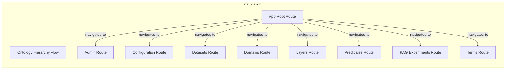
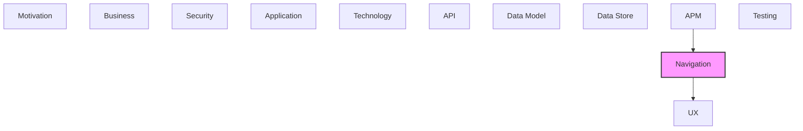

# Navigation

Application routing, navigation flows, and page structures.

## Report Index

- [Layer Introduction](#layer-introduction)
- [Intra-Layer Relationships](#intra-layer-relationships)
- [Inter-Layer Dependencies](#inter-layer-dependencies)
- [Inter-Layer Relationships Table](#inter-layer-relationships-table)
- [Element Reference](#element-reference)

## Layer Introduction

| Metric                    | Count |
| ------------------------- | ----- |
| Elements                  | 10    |
| Intra-Layer Relationships | 8     |
| Inter-Layer Relationships | 13    |
| Inbound Relationships     | 5     |
| Outbound Relationships    | 8     |

**Cross-Layer References**:

- **Upstream layers**: [APM](./11-apm-layer-report.md)
- **Downstream layers**: [UX](./09-ux-layer-report.md)

## Intra-Layer Relationships

## Inter-Layer Dependencies

## Inter-Layer Relationships Table

| Relationship ID                                  | Source Node                                        | Dest Node                                           | Dest Layer   | Predicate  | Cardinality  | Strength |
| ------------------------------------------------ | -------------------------------------------------- | --------------------------------------------------- | ------------ | ---------- | ------------ | -------- |
| `apm.metricinstrument.monitors.navigation.route` | `apm.metricinstrument.background-task-queue-depth` | `navigation.route.admin-route`                      | `navigation` | `monitors` | many-to-many | medium   |
| `apm.metricinstrument.monitors.navigation.route` | `apm.metricinstrument.llm-execution-tracker`       | `navigation.route.rag-experiments-route`            | `navigation` | `monitors` | many-to-many | medium   |
| `apm.metricinstrument.monitors.navigation.route` | `apm.metricinstrument.rag-processing-time`         | `navigation.route.rag-experiments-route`            | `navigation` | `monitors` | many-to-many | medium   |
| `apm.span.monitors.navigation.navigationflow`    | `apm.span.api-request-span`                        | `navigation.navigationflow.ontology-hierarchy-flow` | `navigation` | `monitors` | many-to-many | medium   |
| `apm.span.monitors.navigation.route`             | `apm.span.database-query-span`                     | `navigation.route.layers-route`                     | `navigation` | `monitors` | many-to-many | medium   |
| `navigation.route.maps-to.ux.view`               | `navigation.route.admin-route`                     | `ux.view.admin-view`                                | `ux`         | `maps-to`  | many-to-many | medium   |
| `navigation.route.maps-to.ux.view`               | `navigation.route.configuration-route`             | `ux.view.configuration-view`                        | `ux`         | `maps-to`  | many-to-many | medium   |
| `navigation.route.maps-to.ux.view`               | `navigation.route.datasets-route`                  | `ux.view.datasets-view`                             | `ux`         | `maps-to`  | many-to-many | medium   |
| `navigation.route.maps-to.ux.view`               | `navigation.route.domains-route`                   | `ux.view.domains-view`                              | `ux`         | `maps-to`  | many-to-many | medium   |
| `navigation.route.maps-to.ux.view`               | `navigation.route.layers-route`                    | `ux.view.layers-view`                               | `ux`         | `maps-to`  | many-to-many | medium   |
| `navigation.route.maps-to.ux.view`               | `navigation.route.predicates-route`                | `ux.view.predicates-view`                           | `ux`         | `maps-to`  | many-to-many | medium   |
| `navigation.route.maps-to.ux.view`               | `navigation.route.rag-experiments-route`           | `ux.view.rag-experiments-view`                      | `ux`         | `maps-to`  | many-to-many | medium   |
| `navigation.route.maps-to.ux.view`               | `navigation.route.terms-route`                     | `ux.view.terms-view`                                | `ux`         | `maps-to`  | many-to-many | medium   |

## Element Reference

### Ontology Hierarchy Flow {#ontology-hierarchy-flow}

**ID**: `navigation.navigationflow.ontology-hierarchy-flow`

**Type**: `navigationflow`

Three-step navigation flow guiding the user through the knowledge graph hierarchy: Taxonomies -&gt; Concept Schemes -&gt; Classes

#### Attributes

| Name        | Value                                                                      |
| ----------- | -------------------------------------------------------------------------- |
| description | Hierarchical drill-down through taxonomy, concept scheme, and class levels |

#### Relationships

| Type        | Related Element             | Predicate  | Direction |
| ----------- | --------------------------- | ---------- | --------- |
| inter-layer | `apm.span.api-request-span` | `monitors` | inbound   |

### Admin Route {#admin-route}

**ID**: `navigation.route.admin-route`

**Type**: `route`

Route serving the administrative monitoring and health view

#### Attributes

| Name  | Value  |
| ----- | ------ |
| title | Admin  |
| type  | public |

#### Relationships

| Type        | Related Element                                    | Predicate      | Direction |
| ----------- | -------------------------------------------------- | -------------- | --------- |
| inter-layer | `apm.metricinstrument.background-task-queue-depth` | `monitors`     | inbound   |
| inter-layer | `ux.view.admin-view`                               | `maps-to`      | outbound  |
| intra-layer | `navigation.route.app-root-route`                  | `navigates-to` | inbound   |

### App Root Route {#app-root-route}

**ID**: `navigation.route.app-root-route`

**Type**: `route`

Root application layout route — renders the navigation shell, sidebar, and main content area

#### Attributes

| Name  | Value          |
| ----- | -------------- |
| title | Context Studio |
| type  | public         |

#### Relationships

| Type        | Related Element                          | Predicate      | Direction |
| ----------- | ---------------------------------------- | -------------- | --------- |
| intra-layer | `navigation.route.admin-route`           | `navigates-to` | outbound  |
| intra-layer | `navigation.route.configuration-route`   | `navigates-to` | outbound  |
| intra-layer | `navigation.route.datasets-route`        | `navigates-to` | outbound  |
| intra-layer | `navigation.route.domains-route`         | `navigates-to` | outbound  |
| intra-layer | `navigation.route.layers-route`          | `navigates-to` | outbound  |
| intra-layer | `navigation.route.predicates-route`      | `navigates-to` | outbound  |
| intra-layer | `navigation.route.rag-experiments-route` | `navigates-to` | outbound  |
| intra-layer | `navigation.route.terms-route`           | `navigates-to` | outbound  |

### Configuration Route {#configuration-route}

**ID**: `navigation.route.configuration-route`

**Type**: `route`

Route serving the application configuration view

#### Attributes

| Name  | Value         |
| ----- | ------------- |
| title | Configuration |
| type  | public        |

#### Relationships

| Type        | Related Element                   | Predicate      | Direction |
| ----------- | --------------------------------- | -------------- | --------- |
| inter-layer | `ux.view.configuration-view`      | `maps-to`      | outbound  |
| intra-layer | `navigation.route.app-root-route` | `navigates-to` | inbound   |

### Datasets Route {#datasets-route}

**ID**: `navigation.route.datasets-route`

**Type**: `route`

Route for the dataset workspace management page — /app/datasets

#### Attributes

| Name  | Value    |
| ----- | -------- |
| title | Datasets |
| type  | public   |

#### Relationships

| Type        | Related Element                   | Predicate      | Direction |
| ----------- | --------------------------------- | -------------- | --------- |
| inter-layer | `ux.view.datasets-view`           | `maps-to`      | outbound  |
| intra-layer | `navigation.route.app-root-route` | `navigates-to` | inbound   |

### Domains Route {#domains-route}

**ID**: `navigation.route.domains-route`

**Type**: `route`

Route for the Concept Schemes (Domains) management page — /app/domains

#### Attributes

| Name  | Value   |
| ----- | ------- |
| title | Domains |
| type  | public  |

#### Relationships

| Type        | Related Element                   | Predicate      | Direction |
| ----------- | --------------------------------- | -------------- | --------- |
| inter-layer | `ux.view.domains-view`            | `maps-to`      | outbound  |
| intra-layer | `navigation.route.app-root-route` | `navigates-to` | inbound   |

### Layers Route {#layers-route}

**ID**: `navigation.route.layers-route`

**Type**: `route`

Route for the Taxonomy (Layers) management page — /app/layers

#### Attributes

| Name  | Value  |
| ----- | ------ |
| title | Layers |
| type  | public |

#### Relationships

| Type        | Related Element                   | Predicate      | Direction |
| ----------- | --------------------------------- | -------------- | --------- |
| inter-layer | `apm.span.database-query-span`    | `monitors`     | inbound   |
| inter-layer | `ux.view.layers-view`             | `maps-to`      | outbound  |
| intra-layer | `navigation.route.app-root-route` | `navigates-to` | inbound   |

### Predicates Route {#predicates-route}

**ID**: `navigation.route.predicates-route`

**Type**: `route`

Route for the property definitions management page — /app/predicates

#### Attributes

| Name  | Value      |
| ----- | ---------- |
| title | Predicates |
| type  | public     |

#### Relationships

| Type        | Related Element                   | Predicate      | Direction |
| ----------- | --------------------------------- | -------------- | --------- |
| inter-layer | `ux.view.predicates-view`         | `maps-to`      | outbound  |
| intra-layer | `navigation.route.app-root-route` | `navigates-to` | inbound   |

### RAG Experiments Route {#rag-experiments-route}

**ID**: `navigation.route.rag-experiments-route`

**Type**: `route`

Route serving the RAG experiments and pipeline testing view

#### Attributes

| Name  | Value           |
| ----- | --------------- |
| title | RAG Experiments |
| type  | public          |

#### Relationships

| Type        | Related Element                              | Predicate      | Direction |
| ----------- | -------------------------------------------- | -------------- | --------- |
| inter-layer | `apm.metricinstrument.llm-execution-tracker` | `monitors`     | inbound   |
| inter-layer | `apm.metricinstrument.rag-processing-time`   | `monitors`     | inbound   |
| inter-layer | `ux.view.rag-experiments-view`               | `maps-to`      | outbound  |
| intra-layer | `navigation.route.app-root-route`            | `navigates-to` | inbound   |

### Terms Route {#terms-route}

**ID**: `navigation.route.terms-route`

**Type**: `route`

Route for the Classes (Terms) management page — /app/terms

#### Attributes

| Name  | Value  |
| ----- | ------ |
| title | Terms  |
| type  | public |

#### Relationships

| Type        | Related Element                   | Predicate      | Direction |
| ----------- | --------------------------------- | -------------- | --------- |
| inter-layer | `ux.view.terms-view`              | `maps-to`      | outbound  |
| intra-layer | `navigation.route.app-root-route` | `navigates-to` | inbound   |

---

Generated: 2026-05-07T22:00:51.579Z | Model Version: 0.1.0
