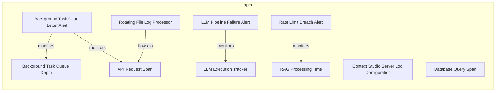
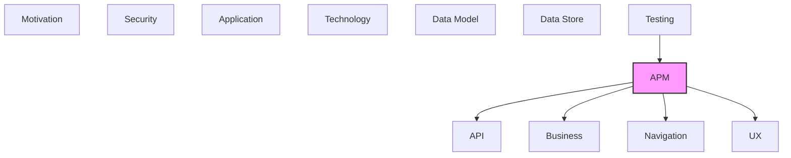

# APM

Observability, monitoring, metrics, logging, and tracing.

## Report Index

- [Layer Introduction](#layer-introduction)
- [Intra-Layer Relationships](#intra-layer-relationships)
- [Inter-Layer Dependencies](#inter-layer-dependencies)
- [Inter-Layer Relationships Table](#inter-layer-relationships-table)
- [Element Reference](#element-reference)

## Layer Introduction

| Metric                    | Count |
| ------------------------- | ----- |
| Elements                  | 10    |
| Intra-Layer Relationships | 5     |
| Inter-Layer Relationships | 12    |
| Inbound Relationships     | 3     |
| Outbound Relationships    | 9     |

**Cross-Layer References**:

- **Upstream layers**: [Testing](./12-testing-layer-report.md)
- **Downstream layers**: [API](./06-api-layer-report.md), [Business](./02-business-layer-report.md), [Navigation](./10-navigation-layer-report.md), [UX](./09-ux-layer-report.md)

## Intra-Layer Relationships

## Inter-Layer Dependencies

## Inter-Layer Relationships Table

| Relationship ID                                              | Source Node                                                    | Dest Node                                           | Dest Layer   | Predicate    | Cardinality  | Strength |
| ------------------------------------------------------------ | -------------------------------------------------------------- | --------------------------------------------------- | ------------ | ------------ | ------------ | -------- |
| `apm.alert.monitors.api.ratelimit`                           | `apm.alert.rate-limit-breach-alert`                            | `api.ratelimit.external-reference-api-rate-limit`   | `api`        | `monitors`   | many-to-many | medium   |
| `apm.logconfiguration.monitors.business.businessservice`     | `apm.logconfiguration.context-studio-server-log-configuration` | `business.businessservice.rest-api-gateway-service` | `business`   | `monitors`   | many-to-many | medium   |
| `apm.metricinstrument.monitors.navigation.route`             | `apm.metricinstrument.background-task-queue-depth`             | `navigation.route.admin-route`                      | `navigation` | `monitors`   | many-to-many | medium   |
| `apm.metricinstrument.monitors.navigation.route`             | `apm.metricinstrument.llm-execution-tracker`                   | `navigation.route.rag-experiments-route`            | `navigation` | `monitors`   | many-to-many | medium   |
| `apm.metricinstrument.monitors.navigation.route`             | `apm.metricinstrument.rag-processing-time`                     | `navigation.route.rag-experiments-route`            | `navigation` | `monitors`   | many-to-many | medium   |
| `apm.metricinstrument.monitors.ux.view`                      | `apm.metricinstrument.rag-processing-time`                     | `ux.view.rag-experiments-view`                      | `ux`         | `monitors`   | many-to-many | medium   |
| `apm.span.monitors.navigation.navigationflow`                | `apm.span.api-request-span`                                    | `navigation.navigationflow.ontology-hierarchy-flow` | `navigation` | `monitors`   | many-to-many | medium   |
| `apm.span.monitors.ux.view`                                  | `apm.span.api-request-span`                                    | `ux.view.rag-experiments-view`                      | `ux`         | `monitors`   | many-to-many | medium   |
| `apm.span.monitors.ux.view`                                  | `apm.span.database-query-span`                                 | `ux.view.datasets-view`                             | `ux`         | `monitors`   | many-to-many | medium   |
| `testing.testcoveragetarget.references.apm.metricinstrument` | `testing.testcoveragetarget.admin-health`                      | `apm.metricinstrument.background-task-queue-depth`  | `apm`        | `references` | many-to-many | medium   |
| `testing.testcoveragetarget.references.apm.metricinstrument` | `testing.testcoveragetarget.extraction-pipeline`               | `apm.metricinstrument.llm-execution-tracker`        | `apm`        | `references` | many-to-many | medium   |
| `testing.testcoveragetarget.references.apm.metricinstrument` | `testing.testcoveragetarget.graph-analysis`                    | `apm.metricinstrument.rag-processing-time`          | `apm`        | `references` | many-to-many | medium   |

## Element Reference

### Background Task Dead Letter Alert {#background-task-dead-letter-alert}

**ID**: `apm.alert.background-task-dead-letter-alert`

**Type**: `alert`

Alert triggered when background tasks accumulate in the dead-letter state in operations.db, indicating persistent failures in the admin bounded context

#### Attributes

| Name               | Value                                 |
| ------------------ | ------------------------------------- |
| condition          | dead_letter_task_count &gt; 0         |
| description        | Background tasks in dead-letter state |
| evaluationInterval | PT5M                                  |
| severity           | warning                               |

#### Relationships

| Type        | Related Element                                    | Predicate  | Direction |
| ----------- | -------------------------------------------------- | ---------- | --------- |
| intra-layer | `apm.metricinstrument.background-task-queue-depth` | `monitors` | outbound  |
| intra-layer | `apm.span.api-request-span`                        | `monitors` | outbound  |

### LLM Pipeline Failure Alert {#llm-pipeline-failure-alert}

**ID**: `apm.alert.llm-pipeline-failure-alert`

**Type**: `alert`

Alert triggered when LLM pipeline execution fails or times out, recorded in the operations.db pipeline_executions table with ERROR status

#### Attributes

| Name               | Value                                |
| ------------------ | ------------------------------------ |
| condition          | pipeline_execution.status == failed  |
| description        | LLM pipeline execution failure alert |
| evaluationInterval | PT1M                                 |
| severity           | critical                             |

#### Relationships

| Type        | Related Element                              | Predicate  | Direction |
| ----------- | -------------------------------------------- | ---------- | --------- |
| intra-layer | `apm.metricinstrument.llm-execution-tracker` | `monitors` | outbound  |

### Rate Limit Breach Alert {#rate-limit-breach-alert}

**ID**: `apm.alert.rate-limit-breach-alert`

**Type**: `alert`

Warning alert when external reference API rate limits are approached — the reference adapter in adapters/reference enforces per-source limits from config.json

#### Attributes

| Name               | Value                                               |
| ------------------ | --------------------------------------------------- |
| condition          | external_api_request_rate &gt; rate_limit_threshold |
| description        | External reference API rate limit approaching       |
| evaluationInterval | PT1M                                                |
| severity           | warning                                             |

#### Relationships

| Type        | Related Element                                   | Predicate  | Direction |
| ----------- | ------------------------------------------------- | ---------- | --------- |
| inter-layer | `api.ratelimit.external-reference-api-rate-limit` | `monitors` | outbound  |
| intra-layer | `apm.metricinstrument.rag-processing-time`        | `monitors` | outbound  |

### Context Studio Server Log Configuration {#context-studio-server-log-configuration}

**ID**: `apm.logconfiguration.context-studio-server-log-configuration`

**Type**: `logconfiguration`

Rotating file logger for the local-server. Configured via config.json logging settings (log_level, max_bytes, backup_count). Falls back to stderr StreamHandler if file logging fails.

#### Attributes

| Name            | Value                       |
| --------------- | --------------------------- |
| minimumSeverity | INFO                        |
| serviceName     | context-studio-local-server |

#### Relationships

| Type        | Related Element                                     | Predicate  | Direction |
| ----------- | --------------------------------------------------- | ---------- | --------- |
| inter-layer | `business.businessservice.rest-api-gateway-service` | `monitors` | outbound  |

### Rotating File Log Processor {#rotating-file-log-processor}

**ID**: `apm.logprocessor.rotating-file-log-processor`

**Type**: `logprocessor`

Python RotatingFileHandler-based log processor writing to context_studio.log. Rotates based on configurable max_bytes and backup_count. Used by all domain, adapter, and route modules via utils/logger.py.

#### Attributes

| Name    | Value  |
| ------- | ------ |
| enabled | true   |
| type    | simple |

#### Relationships

| Type        | Related Element             | Predicate  | Direction |
| ----------- | --------------------------- | ---------- | --------- |
| intra-layer | `apm.span.api-request-span` | `flows-to` | outbound  |

### Background Task Queue Depth {#background-task-queue-depth}

**ID**: `apm.metricinstrument.background-task-queue-depth`

**Type**: `metricinstrument`

Gauge instrument monitoring the number of pending and running background tasks managed by the admin bounded context

#### Attributes

| Name        | Value                                     |
| ----------- | ----------------------------------------- |
| description | Pending and running background task count |
| enabled     | true                                      |
| type        | Gauge                                     |
| unit        | tasks                                     |

#### Relationships

| Type        | Related Element                               | Predicate    | Direction |
| ----------- | --------------------------------------------- | ------------ | --------- |
| inter-layer | `navigation.route.admin-route`                | `monitors`   | outbound  |
| inter-layer | `testing.testcoveragetarget.admin-health`     | `references` | inbound   |
| intra-layer | `apm.alert.background-task-dead-letter-alert` | `monitors`   | inbound   |

### LLM Execution Tracker {#llm-execution-tracker}

**ID**: `apm.metricinstrument.llm-execution-tracker`

**Type**: `metricinstrument`

Counter instrument tracking LLM API call counts, token usage, latency, and errors per pipeline execution — traced in operations.db pipeline_executions table

#### Attributes

| Name        | Value                               |
| ----------- | ----------------------------------- |
| description | LLM API call tracking per execution |
| enabled     | true                                |
| type        | Counter                             |
| unit        | calls                               |

#### Relationships

| Type        | Related Element                                  | Predicate    | Direction |
| ----------- | ------------------------------------------------ | ------------ | --------- |
| inter-layer | `navigation.route.rag-experiments-route`         | `monitors`   | outbound  |
| inter-layer | `testing.testcoveragetarget.extraction-pipeline` | `references` | inbound   |
| intra-layer | `apm.alert.llm-pipeline-failure-alert`           | `monitors`   | inbound   |

### RAG Processing Time {#rag-processing-time}

**ID**: `apm.metricinstrument.rag-processing-time`

**Type**: `metricinstrument`

Histogram instrument measuring processing time in milliseconds for RAG pipeline execution in the extraction bounded context

#### Attributes

| Name        | Value                            |
| ----------- | -------------------------------- |
| description | RAG pipeline processing duration |
| enabled     | true                             |
| type        | Histogram                        |
| unit        | ms                               |

#### Relationships

| Type        | Related Element                             | Predicate    | Direction |
| ----------- | ------------------------------------------- | ------------ | --------- |
| inter-layer | `navigation.route.rag-experiments-route`    | `monitors`   | outbound  |
| inter-layer | `ux.view.rag-experiments-view`              | `monitors`   | outbound  |
| inter-layer | `testing.testcoveragetarget.graph-analysis` | `references` | inbound   |
| intra-layer | `apm.alert.rate-limit-breach-alert`         | `monitors`   | inbound   |

### API Request Span {#api-request-span}

**ID**: `apm.span.api-request-span`

**Type**: `span`

Trace span representing the full duration of a single HTTP API request, from receipt to response in the FastAPI application

#### Attributes

| Name                   | Value  |
| ---------------------- | ------ |
| droppedAttributesCount | 0      |
| droppedEventsCount     | 0      |
| droppedLinksCount      | 0      |
| endTimeUnixNano        | 0      |
| parentSpanId           |        |
| spanId                 |        |
| spanKind               | SERVER |
| startTimeUnixNano      | 0      |
| traceId                |        |
| traceState             |        |

#### Relationships

| Type        | Related Element                                     | Predicate  | Direction |
| ----------- | --------------------------------------------------- | ---------- | --------- |
| inter-layer | `navigation.navigationflow.ontology-hierarchy-flow` | `monitors` | outbound  |
| inter-layer | `ux.view.rag-experiments-view`                      | `monitors` | outbound  |
| intra-layer | `apm.alert.background-task-dead-letter-alert`       | `monitors` | inbound   |
| intra-layer | `apm.logprocessor.rotating-file-log-processor`      | `flows-to` | inbound   |

### Database Query Span {#database-query-span}

**ID**: `apm.span.database-query-span`

**Type**: `span`

OpenTelemetry span covering SQLAlchemy database query execution across local.db and operations.db

#### Attributes

| Name                   | Value  |
| ---------------------- | ------ |
| droppedAttributesCount | 0      |
| droppedEventsCount     | 0      |
| droppedLinksCount      | 0      |
| endTimeUnixNano        | 0      |
| parentSpanId           |        |
| spanId                 |        |
| spanKind               | CLIENT |
| startTimeUnixNano      | 0      |
| traceId                |        |
| traceState             |        |

#### Relationships

| Type        | Related Element         | Predicate  | Direction |
| ----------- | ----------------------- | ---------- | --------- |
| inter-layer | `ux.view.datasets-view` | `monitors` | outbound  |

---

Generated: 2026-05-10T11:56:49.462Z | Model Version: 0.1.0
