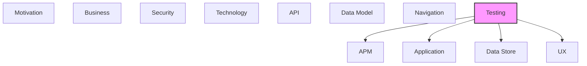

# Testing

Test strategies, test cases, test data, and test coverage.

## Report Index

- [Layer Introduction](#layer-introduction)
- [Intra-Layer Relationships](#intra-layer-relationships)
- [Inter-Layer Dependencies](#inter-layer-dependencies)
- [Inter-Layer Relationships Table](#inter-layer-relationships-table)
- [Element Reference](#element-reference)

## Layer Introduction

| Metric                    | Count |
| ------------------------- | ----- |
| Elements                  | 23    |
| Intra-Layer Relationships | 11    |
| Inter-Layer Relationships | 21    |
| Inbound Relationships     | 0     |
| Outbound Relationships    | 21    |

**Cross-Layer References**:

- **Downstream layers**: [APM](./11-apm-layer-report.md), [Application](./04-application-layer-report.md), [Data Store](./08-data-store-layer-report.md), [UX](./09-ux-layer-report.md)

## Intra-Layer Relationships

```mermaid
flowchart LR
  subgraph testing
    testing_coverageexclusion_llm_api_live_call_tests["LLM API Live Call Tests"]
    testing_coveragegap_s3_sync_e2e_coverage["S3 Sync E2E Coverage"]
    testing_coveragerequirement_domain_unit_test_coverage["Domain Unit Test Coverage"]
    testing_coveragerequirement_e2e_test_coverage["E2E Test Coverage"]
    testing_coveragerequirement_route_integration_test_coverage["Route Integration Test Coverage"]
    testing_inputspacepartition_entity_node_type_discriminator["Entity node_type Discriminator"]
    testing_outcomecategory_entity_creation_success["Entity Creation Success"]
    testing_outcomecategory_validation_error["Validation Error"]
    testing_testcoveragemodel_context_studio_backend_test_coverage_model["Context Studio Backend Test Coverage Model"]
    testing_testcoveragetarget_adapter_unit_tests["Adapter Unit Tests"]
    testing_testcoveragetarget_admin_health["Admin Health"]
    testing_testcoveragetarget_domain_unit_tests["Domain Unit Tests"]
    testing_testcoveragetarget_e2e_test_suite["E2E Test Suite"]
    testing_testcoveragetarget_extraction_pipeline["Extraction Pipeline"]
    testing_testcoveragetarget_graph_analysis["Graph Analysis"]
    testing_testcoveragetarget_interchange_integration_tests["Interchange Integration Tests"]
    testing_testcoveragetarget_interchange_round_trip_tests["Interchange Round-Trip Tests"]
    testing_testcoveragetarget_llm_pipeline_execution["LLM Pipeline Execution"]
    testing_testcoveragetarget_ontology_crud["Ontology CRUD"]
    testing_testcoveragetarget_performance_test_suite["Performance Test Suite"]
    testing_testcoveragetarget_route_integration_tests["Route Integration Tests"]
    testing_testcoveragetarget_versioning_integration_tests["Versioning Integration Tests"]
    testing_testcoveragetarget_versioning_workflow["Versioning Workflow"]
    testing_coverageexclusion_llm_api_live_call_tests -->|references| testing_testcoveragetarget_llm_pipeline_execution
    testing_coveragegap_s3_sync_e2e_coverage -->|references| testing_testcoveragetarget_versioning_workflow
    testing_inputspacepartition_entity_node_type_discriminator -->|serves| testing_testcoveragetarget_extraction_pipeline
    testing_inputspacepartition_entity_node_type_discriminator -->|serves| testing_testcoveragetarget_ontology_crud
    testing_testcoveragemodel_context_studio_backend_test_coverage_model -->|aggregates| testing_testcoveragetarget_domain_unit_tests
    testing_testcoveragemodel_context_studio_backend_test_coverage_model -->|aggregates| testing_testcoveragetarget_e2e_test_suite
    testing_testcoveragemodel_context_studio_backend_test_coverage_model -->|aggregates| testing_testcoveragetarget_graph_analysis
    testing_testcoveragemodel_context_studio_backend_test_coverage_model -->|aggregates| testing_testcoveragetarget_ontology_crud
    testing_testcoveragemodel_context_studio_backend_test_coverage_model -->|aggregates| testing_testcoveragetarget_route_integration_tests
    testing_testcoveragetarget_ontology_crud -->|composes| testing_outcomecategory_entity_creation_success
    testing_testcoveragetarget_ontology_crud -->|composes| testing_outcomecategory_validation_error
  end
```

## Inter-Layer Dependencies

## Inter-Layer Relationships Table

| Relationship ID                                                      | Source Node                                                   | Dest Node                                                        | Dest Layer    | Predicate    | Cardinality  | Strength |
| -------------------------------------------------------------------- | ------------------------------------------------------------- | ---------------------------------------------------------------- | ------------- | ------------ | ------------ | -------- |
| `testing.coveragerequirement.covers.application.applicationfunction` | `testing.coveragerequirement.domain-unit-test-coverage`       | `application.applicationfunction.embedding-generation`           | `application` | `covers`     | many-to-many | medium   |
| `testing.coveragerequirement.covers.application.applicationfunction` | `testing.coveragerequirement.e2e-test-coverage`               | `application.applicationfunction.llm-provider-routing`           | `application` | `covers`     | many-to-many | medium   |
| `testing.coveragerequirement.covers.application.applicationfunction` | `testing.coveragerequirement.route-integration-test-coverage` | `application.applicationfunction.sparql-query-function`          | `application` | `covers`     | many-to-many | medium   |
| `testing.testcoveragetarget.tests.application.applicationcomponent`  | `testing.testcoveragetarget.adapter-unit-tests`               | `application.applicationcomponent.spa-cy-nlp-processor`          | `application` | `tests`      | many-to-many | medium   |
| `testing.testcoveragetarget.covers.ux.view`                          | `testing.testcoveragetarget.admin-health`                     | `ux.view.admin-view`                                             | `ux`          | `covers`     | many-to-many | medium   |
| `testing.testcoveragetarget.references.apm.metricinstrument`         | `testing.testcoveragetarget.admin-health`                     | `apm.metricinstrument.background-task-queue-depth`               | `apm`         | `references` | many-to-many | medium   |
| `testing.testcoveragetarget.tests.application.applicationcomponent`  | `testing.testcoveragetarget.domain-unit-tests`                | `application.applicationcomponent.sqlite-ontology-repository`    | `application` | `tests`      | many-to-many | medium   |
| `testing.testcoveragetarget.tests.data-store.collection`             | `testing.testcoveragetarget.e2e-test-suite`                   | `data-store.collection.ontology-entities`                        | `data-store`  | `tests`      | many-to-many | medium   |
| `testing.testcoveragetarget.covers.ux.view`                          | `testing.testcoveragetarget.extraction-pipeline`              | `ux.view.rag-experiments-view`                                   | `ux`          | `covers`     | many-to-many | medium   |
| `testing.testcoveragetarget.references.apm.metricinstrument`         | `testing.testcoveragetarget.extraction-pipeline`              | `apm.metricinstrument.llm-execution-tracker`                     | `apm`         | `references` | many-to-many | medium   |
| `testing.testcoveragetarget.tests.data-store.storedlogic`            | `testing.testcoveragetarget.extraction-pipeline`              | `data-store.storedlogic.sqlite-vec-cosine-similarity`            | `data-store`  | `tests`      | many-to-many | medium   |
| `testing.testcoveragetarget.covers.ux.view`                          | `testing.testcoveragetarget.graph-analysis`                   | `ux.view.rag-experiments-view`                                   | `ux`          | `covers`     | many-to-many | medium   |
| `testing.testcoveragetarget.references.apm.metricinstrument`         | `testing.testcoveragetarget.graph-analysis`                   | `apm.metricinstrument.rag-processing-time`                       | `apm`         | `references` | many-to-many | medium   |
| `testing.testcoveragetarget.tests.application.applicationcomponent`  | `testing.testcoveragetarget.interchange-integration-tests`    | `application.applicationcomponent.sqlite-interchange-repository` | `application` | `tests`      | many-to-many | medium   |
| `testing.testcoveragetarget.tests.application.applicationcomponent`  | `testing.testcoveragetarget.interchange-round-trip-tests`     | `application.applicationcomponent.skos-interchange-adapter`      | `application` | `tests`      | many-to-many | medium   |
| `testing.testcoveragetarget.covers.ux.view`                          | `testing.testcoveragetarget.llm-pipeline-execution`           | `ux.view.rag-experiments-view`                                   | `ux`          | `covers`     | many-to-many | medium   |
| `testing.testcoveragetarget.tests.data-store.storedlogic`            | `testing.testcoveragetarget.ontology-crud`                    | `data-store.storedlogic.sqlite-vec-cosine-similarity`            | `data-store`  | `tests`      | many-to-many | medium   |
| `testing.testcoveragetarget.tests.data-store.collection`             | `testing.testcoveragetarget.performance-test-suite`           | `data-store.collection.ontology-entities`                        | `data-store`  | `tests`      | many-to-many | medium   |
| `testing.testcoveragetarget.tests.application.applicationcomponent`  | `testing.testcoveragetarget.route-integration-tests`          | `application.applicationcomponent.sqlite-ontology-repository`    | `application` | `tests`      | many-to-many | medium   |
| `testing.testcoveragetarget.tests.application.applicationcomponent`  | `testing.testcoveragetarget.versioning-integration-tests`     | `application.applicationcomponent.sqlite-change-repository`      | `application` | `tests`      | many-to-many | medium   |
| `testing.testcoveragetarget.covers.ux.view`                          | `testing.testcoveragetarget.versioning-workflow`              | `ux.view.datasets-view`                                          | `ux`          | `covers`     | many-to-many | medium   |

## Element Reference

### LLM API Live Call Tests {#llm-api-live-call-tests}

**ID**: `testing.coverageexclusion.llm-api-live-call-tests`

**Type**: `coverageexclusion`

Tests requiring live LLM API calls to OpenAI/Anthropic are excluded from the CI test suite to avoid costs and flakiness

#### Attributes

| Name         | Value                                                                              |
| ------------ | ---------------------------------------------------------------------------------- |
| approvedBy   | team                                                                               |
| description  | Live LLM API tests excluded from automated CI                                      |
| reason       | External dependency on paid LLM APIs makes these tests unreliable and costly in CI |
| riskAccepted | true                                                                               |

#### Relationships

| Type        | Related Element                                     | Predicate    | Direction |
| ----------- | --------------------------------------------------- | ------------ | --------- |
| intra-layer | `testing.testcoveragetarget.llm-pipeline-execution` | `references` | outbound  |

### S3 Sync E2E Coverage {#s3-sync-e2e-coverage}

**ID**: `testing.coveragegap.s3-sync-e2e-coverage`

**Type**: `coveragegap`

Coverage gap: S3 sync operations are not covered by automated E2E tests due to external AWS dependency — manual verification required

#### Attributes

| Name                 | Value                                                        |
| -------------------- | ------------------------------------------------------------ |
| affectedRequirements | s3-sync-workflow                                             |
| description          | S3 sync E2E testing requires AWS credentials and live bucket |
| remediationStatus    | deferred                                                     |
| severity             | medium                                                       |

#### Relationships

| Type        | Related Element                                  | Predicate    | Direction |
| ----------- | ------------------------------------------------ | ------------ | --------- |
| intra-layer | `testing.testcoveragetarget.versioning-workflow` | `references` | outbound  |

### Domain Unit Test Coverage {#domain-unit-test-coverage}

**ID**: `testing.coveragerequirement.domain-unit-test-coverage`

**Type**: `coveragerequirement`

Coverage requirement for domain layer pure unit tests: all domain entities, services, and value objects must be tested with fake port implementations

#### Attributes

| Name             | Value          |
| ---------------- | -------------- |
| coverageCriteria | all-partitions |
| priority         | critical       |

#### Relationships

| Type        | Related Element                                        | Predicate | Direction |
| ----------- | ------------------------------------------------------ | --------- | --------- |
| inter-layer | `application.applicationfunction.embedding-generation` | `covers`  | outbound  |

### E2E Test Coverage {#e2e-test-coverage}

**ID**: `testing.coveragerequirement.e2e-test-coverage`

**Type**: `coveragerequirement`

Coverage requirement for end-to-end workflow tests: key multi-bounded-context flows (extraction, versioning, pipeline) must be covered

#### Attributes

| Name             | Value         |
| ---------------- | ------------- |
| coverageCriteria | path-coverage |
| priority         | high          |

#### Relationships

| Type        | Related Element                                        | Predicate | Direction |
| ----------- | ------------------------------------------------------ | --------- | --------- |
| inter-layer | `application.applicationfunction.llm-provider-routing` | `covers`  | outbound  |

### Route Integration Test Coverage {#route-integration-test-coverage}

**ID**: `testing.coveragerequirement.route-integration-test-coverage`

**Type**: `coveragerequirement`

Coverage requirement for FastAPI route integration tests: all CRUD endpoints must be tested with real SQLite DB, covering success and error paths

#### Attributes

| Name             | Value       |
| ---------------- | ----------- |
| coverageCriteria | each-choice |
| priority         | high        |

#### Relationships

| Type        | Related Element                                         | Predicate | Direction |
| ----------- | ------------------------------------------------------- | --------- | --------- |
| inter-layer | `application.applicationfunction.sparql-query-function` | `covers`  | outbound  |

### Entity node_type Discriminator {#entity-node-type-discriminator}

**ID**: `testing.inputspacepartition.entity-node-type-discriminator`

**Type**: `inputspacepartition`

Input space partition for node_type discriminator: covers Taxonomy, ConceptScheme, Class (valid), and invalid/empty values — maps to unified ontology_entities table in local.db

#### Attributes

| Name         | Value                                                                 |
| ------------ | --------------------------------------------------------------------- |
| description  | node_type discriminator partition for unified ontology_entities table |
| fieldRef     | OntologyEntity.node_type                                              |
| presenceRule | required                                                              |

#### Relationships

| Type        | Related Element                                  | Predicate | Direction |
| ----------- | ------------------------------------------------ | --------- | --------- |
| intra-layer | `testing.testcoveragetarget.extraction-pipeline` | `serves`  | outbound  |
| intra-layer | `testing.testcoveragetarget.ontology-crud`       | `serves`  | outbound  |

### Entity Creation Success {#entity-creation-success}

**ID**: `testing.outcomecategory.entity-creation-success`

**Type**: `outcomecategory`

Expected outcome category: entity created with correct node_type, title, and parent assignment, returned with UUID

#### Attributes

| Name        | Value                                    |
| ----------- | ---------------------------------------- |
| description | Entity successfully created and returned |
| outcomeType | success                                  |

#### Relationships

| Type        | Related Element                            | Predicate  | Direction |
| ----------- | ------------------------------------------ | ---------- | --------- |
| intra-layer | `testing.testcoveragetarget.ontology-crud` | `composes` | inbound   |

### Validation Error {#validation-error}

**ID**: `testing.outcomecategory.validation-error`

**Type**: `outcomecategory`

Expected outcome for invalid inputs: missing required fields, duplicate titles, or invalid node_type values

#### Attributes

| Name        | Value                                             |
| ----------- | ------------------------------------------------- |
| description | Validation failure with descriptive error message |
| outcomeType | validation-error                                  |

#### Relationships

| Type        | Related Element                            | Predicate  | Direction |
| ----------- | ------------------------------------------ | ---------- | --------- |
| intra-layer | `testing.testcoveragetarget.ontology-crud` | `composes` | inbound   |

### Context Studio Backend Test Coverage Model {#context-studio-backend-test-coverage-model}

**ID**: `testing.testcoveragemodel.context-studio-backend-test-coverage-model`

**Type**: `testcoveragemodel`

ISP-based test coverage model for the Context Studio local-server backend, covering unit, integration, E2E, and performance test tiers across all bounded contexts

#### Attributes

| Name        | Value                       |
| ----------- | --------------------------- |
| application | context-studio-local-server |
| version     | 1.0                         |

#### Relationships

| Type        | Related Element                                      | Predicate    | Direction |
| ----------- | ---------------------------------------------------- | ------------ | --------- |
| intra-layer | `testing.testcoveragetarget.domain-unit-tests`       | `aggregates` | outbound  |
| intra-layer | `testing.testcoveragetarget.e2e-test-suite`          | `aggregates` | outbound  |
| intra-layer | `testing.testcoveragetarget.graph-analysis`          | `aggregates` | outbound  |
| intra-layer | `testing.testcoveragetarget.ontology-crud`           | `aggregates` | outbound  |
| intra-layer | `testing.testcoveragetarget.route-integration-tests` | `aggregates` | outbound  |

### Adapter Unit Tests {#adapter-unit-tests}

**ID**: `testing.testcoveragetarget.adapter-unit-tests`

**Type**: `testcoveragetarget`

Unit tests for adapter-layer components using fakes: LLM provider routing, change recorder, in-process event publisher, NLP processor, cached reference source, and web schema validation. Located in tests/unit/adapters/.

#### Attributes

| Name       | Value            |
| ---------- | ---------------- |
| priority   | high             |
| targetType | integration-flow |

#### Relationships

| Type        | Related Element                                         | Predicate | Direction |
| ----------- | ------------------------------------------------------- | --------- | --------- |
| inter-layer | `application.applicationcomponent.spa-cy-nlp-processor` | `tests`   | outbound  |

### Admin Health {#admin-health}

**ID**: `testing.testcoveragetarget.admin-health`

**Type**: `testcoveragetarget`

Coverage target for health checks, background task management, and configuration in the SystemAdministration bounded context

#### Attributes

| Name        | Value                                                           |
| ----------- | --------------------------------------------------------------- |
| description | SystemAdministration bounded context health and task management |
| priority    | medium                                                          |
| targetType  | api-endpoint                                                    |

#### Relationships

| Type        | Related Element                                    | Predicate    | Direction |
| ----------- | -------------------------------------------------- | ------------ | --------- |
| inter-layer | `ux.view.admin-view`                               | `covers`     | outbound  |
| inter-layer | `apm.metricinstrument.background-task-queue-depth` | `references` | outbound  |

### Domain Unit Tests {#domain-unit-tests}

**ID**: `testing.testcoveragetarget.domain-unit-tests`

**Type**: `testcoveragetarget`

Pure unit tests for all 6 bounded context domain services using fake port implementations. Tests span ontology, graph, extraction, pipeline, versioning, admin, and interchange domains. Located in tests/unit/domain/.

#### Attributes

| Name       | Value             |
| ---------- | ----------------- |
| priority   | critical          |
| targetType | business-workflow |

#### Relationships

| Type        | Related Element                                                        | Predicate    | Direction |
| ----------- | ---------------------------------------------------------------------- | ------------ | --------- |
| inter-layer | `application.applicationcomponent.sqlite-ontology-repository`          | `tests`      | outbound  |
| intra-layer | `testing.testcoveragemodel.context-studio-backend-test-coverage-model` | `aggregates` | inbound   |

### E2E Test Suite {#e2e-test-suite}

**ID**: `testing.testcoveragetarget.e2e-test-suite`

**Type**: `testcoveragetarget`

End-to-end tests covering full-stack service interaction across ontology, graph, extraction, pipeline, versioning, and interchange contexts (8 test files)

#### Attributes

| Name       | Value             |
| ---------- | ----------------- |
| priority   | high              |
| targetType | business-workflow |

#### Relationships

| Type        | Related Element                                                        | Predicate    | Direction |
| ----------- | ---------------------------------------------------------------------- | ------------ | --------- |
| inter-layer | `data-store.collection.ontology-entities`                              | `tests`      | outbound  |
| intra-layer | `testing.testcoveragemodel.context-studio-backend-test-coverage-model` | `aggregates` | inbound   |

### Extraction Pipeline {#extraction-pipeline}

**ID**: `testing.testcoveragetarget.extraction-pipeline`

**Type**: `testcoveragetarget`

Coverage target for the RAG pipeline: text input -&gt; NLP extraction -&gt; embedding -&gt; entity output via the KnowledgeExtraction bounded context

#### Attributes

| Name        | Value                                        |
| ----------- | -------------------------------------------- |
| description | KnowledgeExtraction bounded context services |
| priority    | high                                         |
| targetType  | business-workflow                            |

#### Relationships

| Type        | Related Element                                              | Predicate    | Direction |
| ----------- | ------------------------------------------------------------ | ------------ | --------- |
| inter-layer | `ux.view.rag-experiments-view`                               | `covers`     | outbound  |
| inter-layer | `apm.metricinstrument.llm-execution-tracker`                 | `references` | outbound  |
| inter-layer | `data-store.storedlogic.sqlite-vec-cosine-similarity`        | `tests`      | outbound  |
| intra-layer | `testing.inputspacepartition.entity-node-type-discriminator` | `serves`     | inbound   |

### Graph Analysis {#graph-analysis}

**ID**: `testing.testcoveragetarget.graph-analysis`

**Type**: `testcoveragetarget`

Coverage target for in-memory graph construction, traversal, SPARQL query execution, and network metrics computation

#### Attributes

| Name        | Value                                   |
| ----------- | --------------------------------------- |
| description | Graph Analysis bounded context services |
| priority    | critical                                |
| targetType  | business-workflow                       |

#### Relationships

| Type        | Related Element                                                        | Predicate    | Direction |
| ----------- | ---------------------------------------------------------------------- | ------------ | --------- |
| inter-layer | `ux.view.rag-experiments-view`                                         | `covers`     | outbound  |
| inter-layer | `apm.metricinstrument.rag-processing-time`                             | `references` | outbound  |
| intra-layer | `testing.testcoveragemodel.context-studio-backend-test-coverage-model` | `aggregates` | inbound   |

### Interchange Integration Tests {#interchange-integration-tests}

**ID**: `testing.testcoveragetarget.interchange-integration-tests`

**Type**: `testcoveragetarget`

Integration test suite for SKOS/OWL/GraphML round-trip serialization, import run lifecycle, and persistence adapter correctness (6 test files)

#### Attributes

| Name       | Value            |
| ---------- | ---------------- |
| priority   | high             |
| targetType | integration-flow |

#### Relationships

| Type        | Related Element                                                  | Predicate | Direction |
| ----------- | ---------------------------------------------------------------- | --------- | --------- |
| inter-layer | `application.applicationcomponent.sqlite-interchange-repository` | `tests`   | outbound  |

### Interchange Round-Trip Tests {#interchange-round-trip-tests}

**ID**: `testing.testcoveragetarget.interchange-round-trip-tests`

**Type**: `testcoveragetarget`

Integration tests verifying lossless round-trips across SKOS, OWL, and GraphML serialization formats. Located in tests/integration/interchange/. Covers cross-format round-trips and lossiness documentation.

#### Attributes

| Name       | Value            |
| ---------- | ---------------- |
| priority   | high             |
| targetType | integration-flow |

#### Relationships

| Type        | Related Element                                             | Predicate | Direction |
| ----------- | ----------------------------------------------------------- | --------- | --------- |
| inter-layer | `application.applicationcomponent.skos-interchange-adapter` | `tests`   | outbound  |

### LLM Pipeline Execution {#llm-pipeline-execution}

**ID**: `testing.testcoveragetarget.llm-pipeline-execution`

**Type**: `testcoveragetarget`

Coverage target for pipeline configuration and execution tracking in the LLMPipelineManagement bounded context — traces stored in operations.db

#### Attributes

| Name        | Value                                          |
| ----------- | ---------------------------------------------- |
| description | LLMPipelineManagement bounded context services |
| priority    | high                                           |
| targetType  | business-workflow                              |

#### Relationships

| Type        | Related Element                                     | Predicate    | Direction |
| ----------- | --------------------------------------------------- | ------------ | --------- |
| inter-layer | `ux.view.rag-experiments-view`                      | `covers`     | outbound  |
| intra-layer | `testing.coverageexclusion.llm-api-live-call-tests` | `references` | inbound   |

### Ontology CRUD {#ontology-crud}

**ID**: `testing.testcoveragetarget.ontology-crud`

**Type**: `testcoveragetarget`

Coverage target for the full CRUD lifecycle of ontology entities (Taxonomy, ConceptScheme, Class) via the OntologyManagement bounded context and REST API

#### Attributes

| Name        | Value                                              |
| ----------- | -------------------------------------------------- |
| description | OntologyManagement bounded context CRUD operations |
| priority    | critical                                           |
| targetType  | api-endpoint                                       |

#### Relationships

| Type        | Related Element                                                        | Predicate    | Direction |
| ----------- | ---------------------------------------------------------------------- | ------------ | --------- |
| inter-layer | `data-store.storedlogic.sqlite-vec-cosine-similarity`                  | `tests`      | outbound  |
| intra-layer | `testing.inputspacepartition.entity-node-type-discriminator`           | `serves`     | inbound   |
| intra-layer | `testing.testcoveragemodel.context-studio-backend-test-coverage-model` | `aggregates` | inbound   |
| intra-layer | `testing.outcomecategory.entity-creation-success`                      | `composes`   | outbound  |
| intra-layer | `testing.outcomecategory.validation-error`                             | `composes`   | outbound  |

### Performance Test Suite {#performance-test-suite}

**ID**: `testing.testcoveragetarget.performance-test-suite`

**Type**: `testcoveragetarget`

Performance tests covering scalability and throughput for ontology operations, graph traversal, extraction pipeline, and API response times (6 test files)

#### Attributes

| Name       | Value        |
| ---------- | ------------ |
| priority   | medium       |
| targetType | api-endpoint |

#### Relationships

| Type        | Related Element                           | Predicate | Direction |
| ----------- | ----------------------------------------- | --------- | --------- |
| inter-layer | `data-store.collection.ontology-entities` | `tests`   | outbound  |

### Route Integration Tests {#route-integration-tests}

**ID**: `testing.testcoveragetarget.route-integration-tests`

**Type**: `testcoveragetarget`

Route-level integration tests covering all 8 FastAPI route modules (ontology, graph, extraction, admin, reference, interchange, versioning, pipeline) against real SQLite (7 test files)

#### Attributes

| Name       | Value        |
| ---------- | ------------ |
| priority   | high         |
| targetType | api-endpoint |

#### Relationships

| Type        | Related Element                                                        | Predicate    | Direction |
| ----------- | ---------------------------------------------------------------------- | ------------ | --------- |
| inter-layer | `application.applicationcomponent.sqlite-ontology-repository`          | `tests`      | outbound  |
| intra-layer | `testing.testcoveragemodel.context-studio-backend-test-coverage-model` | `aggregates` | inbound   |

### Versioning Integration Tests {#versioning-integration-tests}

**ID**: `testing.testcoveragetarget.versioning-integration-tests`

**Type**: `testcoveragetarget`

Integration test suite for the versioning bounded context — change event persistence, entity versions, changeset lifecycle, and proposal workflows (3 test files)

#### Attributes

| Name       | Value            |
| ---------- | ---------------- |
| priority   | high             |
| targetType | integration-flow |

#### Relationships

| Type        | Related Element                                             | Predicate | Direction |
| ----------- | ----------------------------------------------------------- | --------- | --------- |
| inter-layer | `application.applicationcomponent.sqlite-change-repository` | `tests`   | outbound  |

### Versioning Workflow {#versioning-workflow}

**ID**: `testing.testcoveragetarget.versioning-workflow`

**Type**: `testcoveragetarget`

Coverage target for the complete version control workflow: change events, changesets, proposals, and conflict resolution in the VersionControl bounded context

#### Attributes

| Name        | Value                                                             |
| ----------- | ----------------------------------------------------------------- |
| description | VersionControl bounded context versioning and changeset lifecycle |
| priority    | critical                                                          |
| targetType  | business-workflow                                                 |

#### Relationships

| Type        | Related Element                            | Predicate    | Direction |
| ----------- | ------------------------------------------ | ------------ | --------- |
| inter-layer | `ux.view.datasets-view`                    | `covers`     | outbound  |
| intra-layer | `testing.coveragegap.s3-sync-e2e-coverage` | `references` | inbound   |

---

Generated: 2026-05-11T12:10:16.880Z | Model Version: 0.1.0
