# System Architecture

## Overview

Context Studio is designed as a local-first knowledge graph management platform with a Python FastAPI backend, React TypeScript frontend, and SQLite database with vector extensions. The architecture supports multi-dataset management, advanced collaboration workflows, and integration with external AI services.

## High-Level Architecture

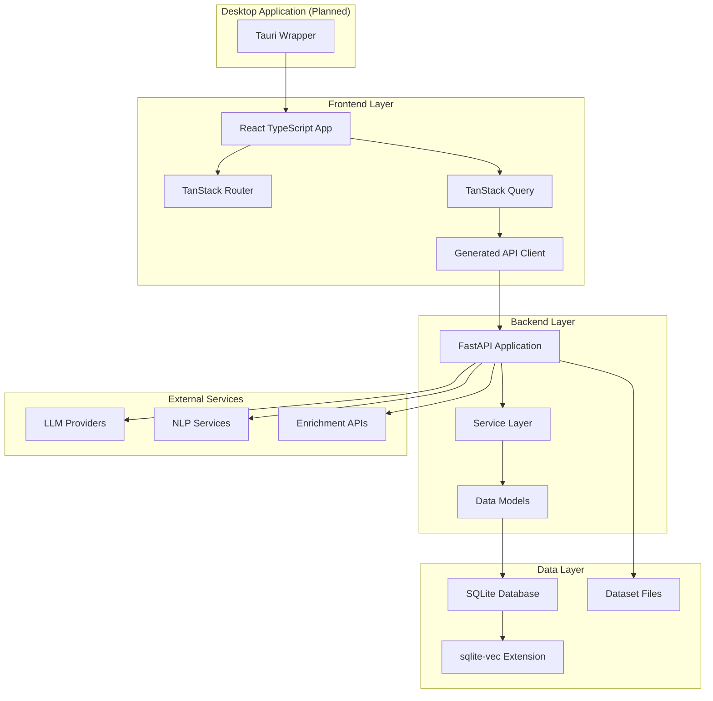

## Component Architecture

### Backend Components

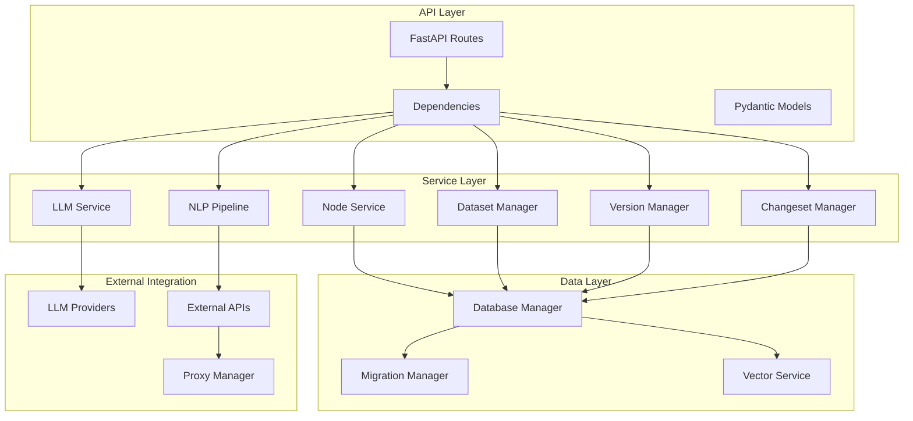

### Frontend Components

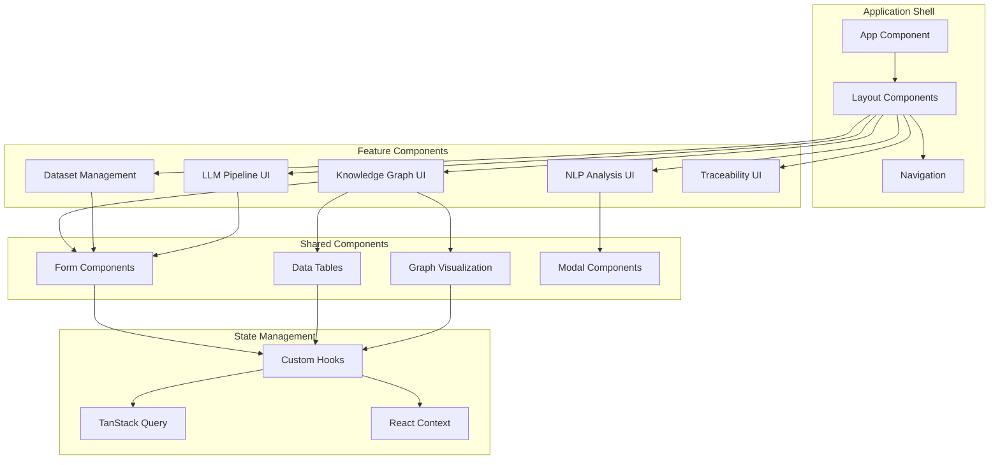

## Data Flow Architecture

### Request/Response Flow

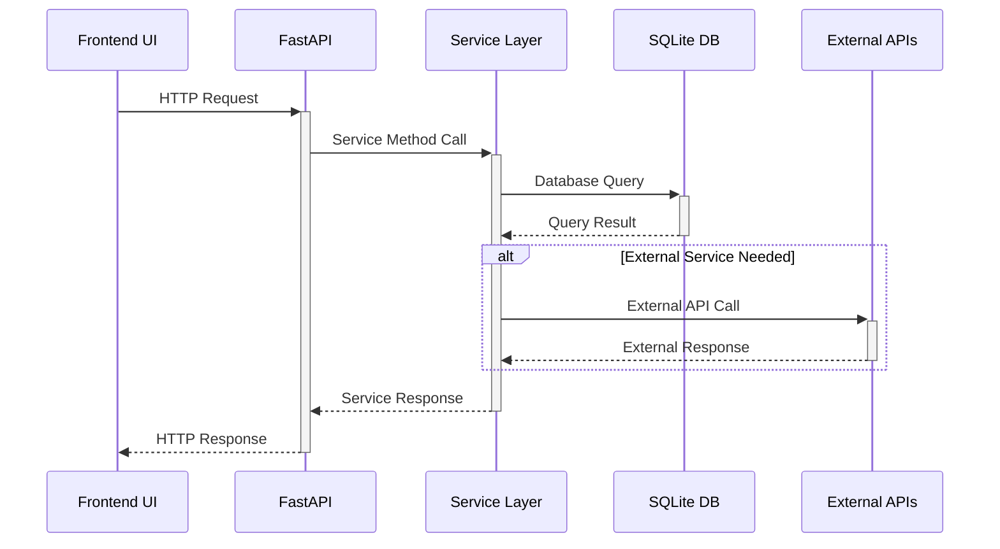

### Change Event Flow

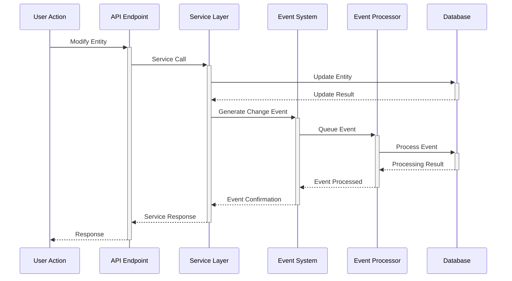

## Technology Stack

### Backend Technologies

| Component | Technology | Purpose |
|-----------|------------|---------|
| Web Framework | FastAPI | REST API server with automatic OpenAPI |
| Database | SQLite | Local-first data storage |
| Vector Database | sqlite-vec | Vector embeddings and similarity search |
| ORM | SQLAlchemy | Database abstraction and migrations |
| Async Support | asyncio | Asynchronous request handling |
| Validation | Pydantic | Data validation and serialization |
| Testing | pytest | Unit and integration testing |

### Frontend Technologies

| Component | Technology | Purpose |
|-----------|------------|---------|
| Framework | React 18 | User interface library |
| Language | TypeScript | Type safety and development experience |
| Build Tool | Vite | Fast development and building |
| Routing | TanStack Router | Type-safe routing with search params |
| State Management | TanStack Query | Server state management and caching |
| UI Components | Flowbite-React | Tailwind CSS component library |
| Styling | Tailwind CSS | Utility-first CSS framework |
| Testing | Vitest + Testing Library | Component and integration testing |

### Development Tools

| Tool | Purpose |
|------|---------|
| Poetry | Python dependency management |
| npm | Node.js package management |
| ESLint | JavaScript/TypeScript linting |
| Prettier | Code formatting |
| Black | Python code formatting |
| mypy | Python type checking |

## Deployment Architecture

### Local Development

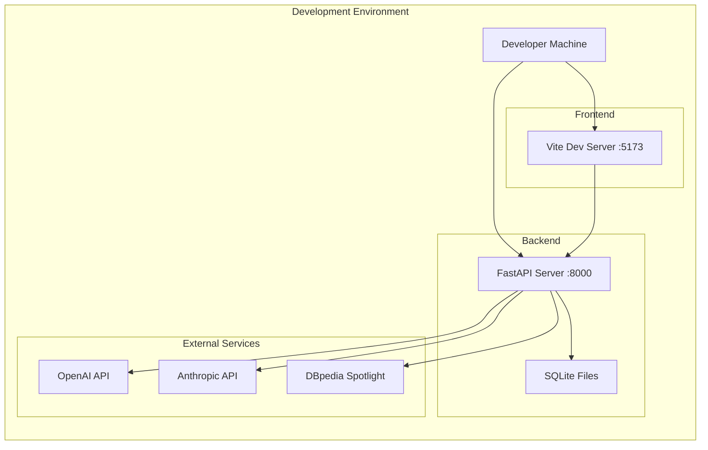

### Production Deployment (Planned)

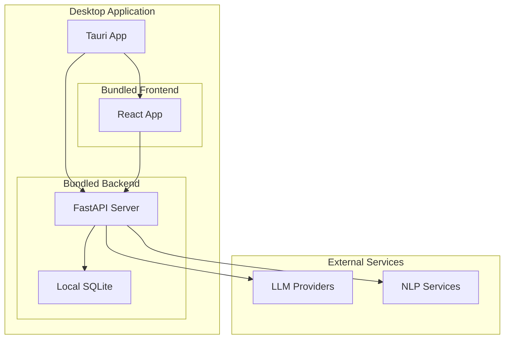

## Security Architecture

### Data Security

- **Local-first**: All sensitive data stored locally
- **No cloud dependencies**: Core functionality works offline
- **API key management**: Secure storage of external service credentials
- **Database encryption**: Optional SQLite encryption support

### API Security

- **Input validation**: Comprehensive request validation with Pydantic
- **Error handling**: Sanitized error responses
- **Rate limiting**: Configurable request rate limits
- **CORS configuration**: Restricted cross-origin access

### Authentication (Future)

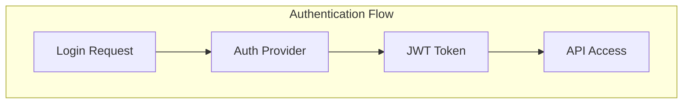

## Scalability Considerations

### Current Scale

- **Target**: Single user workstation
- **Dataset size**: Up to 1GB per dataset
- **Concurrent users**: 1 (local-first)
- **API throughput**: 100-1000 requests/minute

### Future Scale (Enterprise)

- **Multi-tenant**: Organization-level isolation
- **Distributed storage**: Remote sync capabilities
- **Load balancing**: Multiple API instances
- **Caching layers**: Redis for shared caching

## Integration Points

### External Service Integration

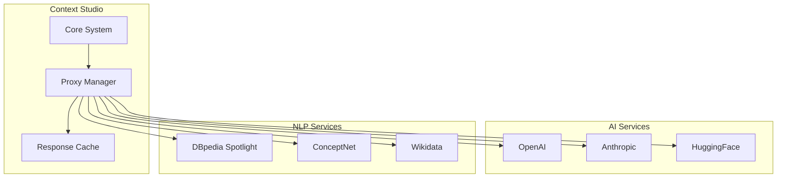

### Future Integrations (Planned)

- **MCP Server**: Model Context Protocol integration
- **Business Chat**: Slack, Teams, Discord connectors
- **Browser Extension**: Web content integration
- **Mobile Apps**: iOS and Android companion apps

## Performance Architecture

### Caching Strategy

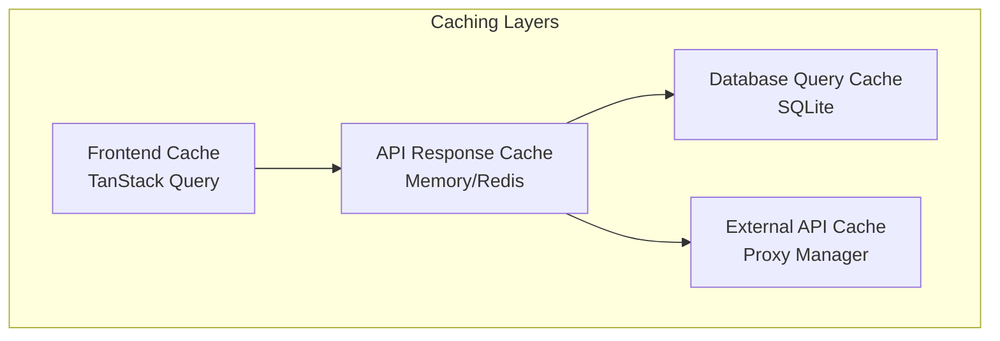

### Database Optimization

- **Indexing strategy**: Comprehensive indexes for query patterns
- **Query optimization**: Analyzed and optimized query plans
- **Connection pooling**: Efficient database connection management
- **Vector indexing**: Optimized similarity search with sqlite-vec

### Async Architecture

- **Non-blocking I/O**: Async/await throughout the stack
- **Background processing**: Event processing in background tasks
- **Streaming responses**: Real-time data streaming for LLM responses
- **Parallel processing**: Concurrent external API calls

## Monitoring and Observability

### Metrics Collection

- **Application metrics**: Request rates, response times, error rates
- **Database metrics**: Query performance, connection pool usage
- **External service metrics**: API response times, success rates
- **Resource metrics**: CPU, memory, disk usage

### Logging Strategy

- **Structured logging**: JSON-formatted logs with context
- **Log levels**: Configurable verbosity levels
- **Request tracing**: Request ID tracking across components
- **Error tracking**: Comprehensive error logging and alerting

### Health Checks

- **Service health**: Individual component health monitoring
- **Dependency health**: External service availability
- **Database health**: Connection and performance checks
- **Overall system health**: Aggregated health status

## Development and Testing Architecture

### Testing Strategy

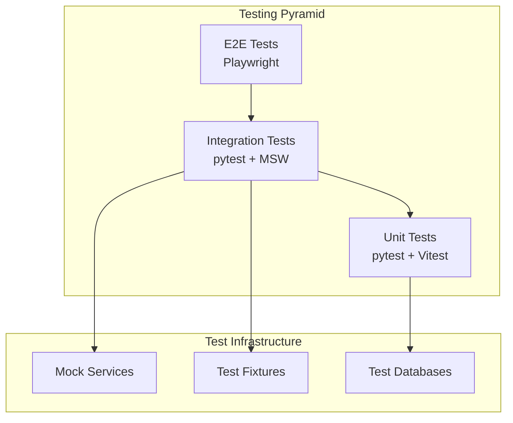

### CI/CD Pipeline

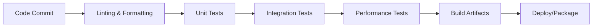

## Future Architecture Evolution

### Phase 1: Desktop Application
- Tauri wrapper for native desktop experience
- Offline-first capabilities
- Local file system integration

### Phase 2: Collaboration Features
- Real-time collaboration
- Conflict resolution improvements
- Advanced version control

### Phase 3: Enterprise Features
- Multi-tenant architecture
- Advanced security and compliance
- Scalable deployment options

### Phase 4: Ecosystem Integration
- MCP server implementation
- Business chat platform integration
- Browser extension and mobile apps