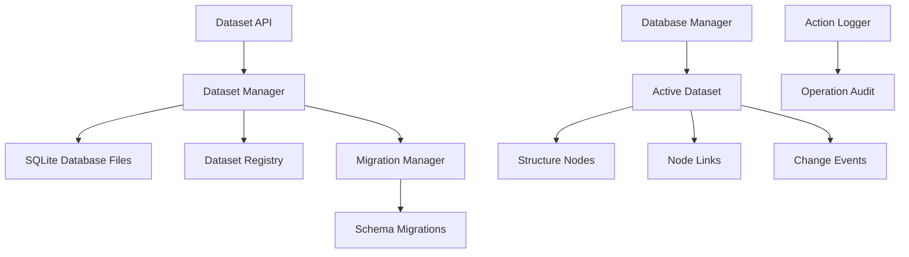

# Dataset Management System

## Overview

The Dataset Management System enables Context Studio to work with multiple independent knowledge graphs through separate SQLite database instances. Each dataset represents a complete knowledge graph with its own structure nodes, relationships, and metadata, allowing users to organize different domains of knowledge separately while maintaining the ability to switch between them seamlessly.

## Architecture

### Core Components



## API Endpoints

### Dataset Operations (`/api/datasets`)

#### Core Dataset Management

**List All Datasets**
```http
GET /api/datasets
```
Response:
```json
[
  {
    "id": "dataset-uuid",
    "title": "AI Research",
    "filename": "ai_research.db",
    "created_at": "2025-01-15T10:00:00Z",
    "last_accessed": "2025-01-15T14:30:00Z",
    "schema_version": "011",
    "is_active": true,
    "metrics": {
      "structure_nodes_count": 1250,
      "predicates_count": 45,
      "size_mb": 15.2
    }
  }
]
```

**Create New Dataset**
```http
POST /api/datasets
Content-Type: application/json

{
  "title": "Business Strategy",
  "filename": "business_strategy.db"
}
```

**Get Dataset Details**
```http
GET /api/datasets/{dataset_id}
```

**Activate Dataset**
```http
POST /api/datasets/{dataset_id}/activate
```

**Delete Dataset**
```http
DELETE /api/datasets/{dataset_id}
```
- Physically removes database file
- Cannot undo this operation

**Forget Dataset**
```http
POST /api/datasets/{dataset_id}/forget
```
- Removes from registry but keeps database file
- Can be re-added later

#### Dataset Discovery and Management

**Get Active Dataset**
```http
GET /api/datasets/active
```

**Add Existing Dataset**
```http
POST /api/datasets/add-existing
Content-Type: application/json

{
  "file_path": "/path/to/existing.db",
  "title": "Imported Dataset"
}
```

**Update Datasets Directory**
```http
POST /api/datasets/directory
Content-Type: application/json

{
  "datasets_directory": "/new/path/to/datasets"
}
```

**Get Startup Information**
```http
GET /api/datasets/startup-info
```
Returns system initialization status and dataset availability.

**Get Action Log**
```http
GET /api/datasets/action-log?days=30
```
Returns audit log of dataset operations for the specified number of days.

## Data Models

### Dataset Model

```python
class Dataset:
    id: str
    title: str
    filename: str
    created_at: datetime
    last_accessed: datetime
    schema_version: str
    is_active: bool

    # Metrics object contains:
    metrics: {
        structure_nodes_count: int
        predicates_count: int
        size_mb: float
    }
```

### Dataset Registry

The dataset registry maintains metadata about all available datasets in a central registry file:

```json
{
  "datasets": {
    "dataset-uuid": {
      "title": "AI Research",
      "filename": "ai_research.db",
      "created_at": "2025-01-15T10:00:00Z",
      "last_accessed": "2025-01-15T14:30:00Z",
      "schema_version": "011"
    }
  },
  "active_dataset_id": "dataset-uuid",
  "datasets_directory": "/path/to/datasets"
}
```

## Features

### Multi-Dataset Architecture

#### Isolation
- **Complete separation**: Each dataset has its own SQLite database
- **Independent schemas**: Separate migration tracking per dataset
- **Isolated operations**: No cross-dataset data leakage
- **Resource isolation**: Memory and disk usage per dataset

#### Dataset Lifecycle

1. **Creation**: Initialize new SQLite database with current schema
2. **Activation**: Switch runtime context to selected dataset
3. **Migration**: Automatic schema updates when switching datasets
4. **Backup**: Copy database files for preservation
5. **Deletion**: Secure removal of database files

### Schema Management

#### Migration System
- **Automatic migrations**: Applied when switching to outdated datasets
- **Version tracking**: Each dataset tracks its schema version
- **Rollback prevention**: No downgrade migrations supported
- **Migration validation**: Pre-flight checks before applying changes

#### Schema Versions
Current schema version: `011`

Migration sequence:
- `001`: Initial schema (structure nodes, predicates)
- `002`: Graph events tracking
- `003`: Vector tables for embeddings
- `004`: Title uniqueness constraints
- `005`: Predicate sets
- `006`: Unified nodes structure
- `007`: Change management events
- `008`: Collaboration system
- `009`: Advanced analytics features
- `010`: Performance optimizations
- `011`: Branch management removal

### Dataset Operations

#### Import/Export
```python
# Export dataset
export_dataset(dataset_id, export_path, format='sqlite')

# Import dataset
import_dataset(source_path, target_name, validate_schema=True)
```

#### Backup and Restore
```python
# Create backup
backup_dataset(dataset_id, backup_path)

# Restore from backup
restore_dataset(backup_path, target_name)
```

#### Dataset Statistics
- **Node counts**: Total structure nodes by type
- **Relationship counts**: Node links and predicates
- **Storage usage**: Database file size and growth
- **Activity metrics**: Recent modifications and operations

### Action Logging

All dataset operations are logged for audit purposes:

```python
class ActionLog:
    timestamp: datetime
    action: str  # create, activate, delete, etc.
    dataset_id: UUID
    details: dict
    user_context: Optional[str]
    success: bool
    error_message: Optional[str]
```

## Configuration

### Dataset Settings

```json
{
  "datasets": {
    "default_directory": "./datasets",
    "max_datasets": 100,
    "auto_backup": true,
    "backup_interval_hours": 24,
    "max_backup_count": 10,
    "validate_on_switch": true
  }
}
```

### Storage Configuration

```json
{
  "storage": {
    "sqlite_options": {
      "journal_mode": "WAL",
      "synchronous": "NORMAL",
      "cache_size": 10000,
      "temp_store": "MEMORY"
    },
    "max_db_size_mb": 1000,
    "compression_enabled": false
  }
}
```

## Performance Considerations

### Database Optimization

#### SQLite Configuration
- **WAL mode**: Write-Ahead Logging for better concurrency
- **Memory caching**: Aggressive caching for frequently accessed data
- **Connection pooling**: Reuse database connections
- **Pragma optimization**: Tuned SQLite settings

#### File System Optimization
- **SSD storage**: Recommended for optimal performance
- **File system**: APFS/NTFS/ext4 for large file support
- **Backup location**: Separate drive for backup storage

### Memory Management

#### Active Dataset Caching
- **Connection caching**: Keep active database connections warm
- **Query plan caching**: SQLite query plan reuse
- **Metadata caching**: Dataset registry and statistics

#### Resource Limits
- **Memory limits**: Per-dataset memory allocation
- **Connection limits**: Maximum concurrent database connections
- **Query timeouts**: Prevent long-running operations

## Error Handling

### Common Errors

#### Dataset Creation
```json
{
  "error": "DATASET_ALREADY_EXISTS",
  "message": "Dataset with name 'AI Research' already exists",
  "details": {
    "existing_dataset_id": "uuid",
    "conflicting_name": "AI Research"
  }
}
```

#### Dataset Activation
```json
{
  "error": "DATASET_MIGRATION_REQUIRED",
  "message": "Dataset schema is outdated and requires migration",
  "details": {
    "current_version": "008",
    "required_version": "011",
    "migration_count": 3
  }
}
```

#### File System Errors
```json
{
  "error": "DATABASE_FILE_NOT_FOUND",
  "message": "Dataset database file not found at specified path",
  "details": {
    "file_path": "/path/to/missing.db",
    "dataset_id": "uuid"
  }
}
```

## Integration Points

### Change Management
- **Dataset-scoped changes**: Change events isolated per dataset
- **Cross-dataset operations**: Blocked by design for data integrity
- **Migration tracking**: Change management aware of dataset switches

### Vector Search
- **Per-dataset embeddings**: Vector tables isolated per dataset
- **Index rebuilding**: Vector indexes rebuilt on dataset switch
- **Search scoping**: Vector search limited to active dataset

### Service Integration
- **Service factory**: Services scoped to active dataset
- **Connection management**: Database connections per dataset
- **Cache invalidation**: Service caches cleared on dataset switch

## Usage Examples

### Basic Dataset Workflow

```python
# List available datasets
datasets = list_datasets()

# Create new dataset
new_dataset = create_dataset({
    "name": "Product Catalog",
    "description": "E-commerce product categorization"
})

# Activate dataset
activate_dataset(new_dataset.id)

# Work with knowledge graph
# (all structure node operations now use this dataset)

# Switch to different dataset
activate_dataset(other_dataset.id)
```

### Dataset Management Operations

```python
# Add existing database file
existing = add_existing_dataset({
    "file_path": "/backups/archive.db",
    "name": "Archive Dataset",
    "description": "Historical data archive"
})

# Get detailed statistics
stats = get_dataset(dataset_id)
print(f"Nodes: {stats.node_count}, Size: {stats.size_mb}MB")

# Clean up unused dataset
forget_dataset(old_dataset.id)  # Remove from registry
delete_dataset(unused_dataset.id)  # Delete permanently
```

### Import/Export Operations

```python
# Export current dataset
export_dataset(
    dataset_id=active_dataset.id,
    export_path="/exports/backup.db",
    format="sqlite"
)

# Import from backup
imported = import_dataset(
    source_path="/imports/external.db",
    target_name="Imported Knowledge",
    validate_schema=True
)
```

## Best Practices

### Dataset Organization
1. **Logical separation**: Create datasets for distinct knowledge domains
2. **Naming conventions**: Use descriptive, consistent names
3. **Size management**: Keep individual datasets under 1GB for performance
4. **Regular backups**: Implement automated backup strategies

### Performance Optimization
1. **Active dataset**: Keep frequently used dataset active
2. **Minimize switches**: Dataset switching has overhead
3. **Monitor storage**: Track database growth and optimize queries
4. **Cache warming**: Allow time for caches to populate after switching

### Data Management
1. **Schema consistency**: Ensure all datasets use current schema version
2. **Migration planning**: Test migrations on backup copies first
3. **Cleanup procedures**: Regularly remove unused datasets
4. **Access patterns**: Design datasets around typical usage patterns

## Troubleshooting

### Dataset Switch Issues
1. **Migration failures**: Check schema compatibility
2. **File permissions**: Verify database file access rights
3. **Disk space**: Ensure sufficient space for operations
4. **Lock conflicts**: Check for active connections to database

### Performance Issues
1. **Query optimization**: Analyze slow operations
2. **Index maintenance**: Rebuild indexes periodically
3. **Cache tuning**: Adjust cache sizes based on usage
4. **Storage optimization**: Consider file system optimization

### Data Integrity
1. **Backup verification**: Regularly test backup restoration
2. **Schema validation**: Verify database structure consistency
3. **Referential integrity**: Check foreign key constraints
4. **Action log review**: Monitor operation audit trail