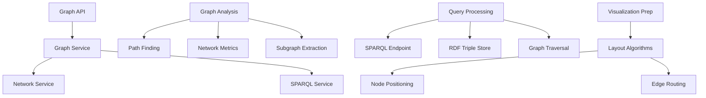

# Graph Services

## Overview

Graph Services provide advanced analysis, querying, and visualization capabilities for Context Studio's knowledge graphs. The system includes network analysis tools, SPARQL query support for semantic web compatibility, and sophisticated graph algorithms for path finding and relationship discovery.

## Architecture



## API Endpoints

### Graph Analysis (`/api/graph`)

**Network Analysis**
```http
GET /api/graph/network-analysis?root_node_id=uuid&depth=3
```

**Path Finding**
```http
GET /api/graph/shortest-path?source=uuid&target=uuid&max_depth=6
```

**Subgraph Extraction**
```http
POST /api/graph/subgraph
Content-Type: application/json

{
  "center_node_id": "uuid",
  "radius": 2,
  "include_types": ["domain", "term"],
  "exclude_predicates": ["deprecated_relation"]
}
```

**Graph Metrics**
```http
GET /api/graph/metrics?node_types=domain,term
```

### SPARQL Query (`/api/graph/sparql`)

**Execute SPARQL Query**
```http
POST /api/graph/sparql/query
Content-Type: application/sparql-query

SELECT ?subject ?predicate ?object
WHERE {
  ?subject ?predicate ?object .
  ?subject a :Domain .
}
LIMIT 100
```

**Get RDF Export**
```http
GET /api/graph/rdf?format=turtle&include_types=all
```

## Core Features

### Network Analysis

#### Graph Metrics
```python
class GraphMetrics:
    node_count: int
    edge_count: int
    density: float
    average_degree: float
    diameter: int
    clustering_coefficient: float

    # Centrality measures
    betweenness_centrality: Dict[UUID, float]
    closeness_centrality: Dict[UUID, float]
    eigenvector_centrality: Dict[UUID, float]
    pagerank: Dict[UUID, float]
```

#### Network Properties
- **Connectivity**: Component analysis, bridge detection
- **Centrality**: Node importance metrics
- **Community Detection**: Cluster identification
- **Path Analysis**: Shortest paths, path enumeration

### Path Finding Algorithms

#### Shortest Path
```python
def find_shortest_path(
    source_id: UUID,
    target_id: UUID,
    max_depth: int = 6,
    exclude_predicates: List[str] = None
) -> PathResult:
    # Breadth-first search with predicate filtering
    pass
```

#### All Paths
```python
def find_all_paths(
    source_id: UUID,
    target_id: UUID,
    max_depth: int = 4,
    max_paths: int = 100
) -> List[Path]:
    # Depth-first search with path enumeration
    pass
```

#### Semantic Paths
```python
def find_semantic_paths(
    source_id: UUID,
    target_id: UUID,
    semantic_weight_function: Callable
) -> List[WeightedPath]:
    # Dijkstra's algorithm with semantic weighting
    pass
```

### Subgraph Operations

#### Extraction Methods
- **Radius-based**: Extract nodes within N hops
- **Type-based**: Filter by node types
- **Predicate-based**: Filter by relationship types
- **Importance-based**: Extract high-centrality nodes

#### Subgraph Analysis
```python
class SubgraphAnalysis:
    def extract_ego_network(
        self,
        center_node_id: UUID,
        radius: int = 2
    ) -> Subgraph:
        # Extract neighborhood around node
        pass

    def extract_concept_cluster(
        self,
        seed_concepts: List[UUID],
        similarity_threshold: float = 0.7
    ) -> Subgraph:
        # Extract semantically related concepts
        pass
```

## SPARQL Integration

### Query Support

#### Supported Features
- **Basic Graph Patterns**: Triple patterns with variables
- **Property Paths**: Regular expression paths
- **Filters**: Conditional constraints
- **Aggregation**: COUNT, SUM, AVG, GROUP BY
- **Subqueries**: Nested query support
- **Federation**: Distributed query processing

#### Query Examples

**Find All Domains in AI Layer**
```sparql
PREFIX : <http://context-studio.local/>
PREFIX rdf: <http://www.w3.org/1999/02/22-rdf-syntax-ns#>

SELECT ?domain ?title ?description
WHERE {
  ?layer rdf:type :Layer ;
         :title "Artificial Intelligence" .
  ?domain rdf:type :Domain ;
          :parent ?layer ;
          :title ?title ;
          :description ?description .
}
```

**Find Related Concepts with Path**
```sparql
PREFIX : <http://context-studio.local/>

SELECT ?concept1 ?concept2 ?path
WHERE {
  ?concept1 :title "Machine Learning" .
  ?concept1 (:relatedTo|:partOf)+ ?concept2 .
  ?concept2 rdf:type :Term .
}
```

### RDF Triple Generation

#### Triple Store Schema
```turtle
@prefix : <http://context-studio.local/> .
@prefix rdf: <http://www.w3.org/1999/02/22-rdf-syntax-ns#> .
@prefix rdfs: <http://www.w3.org/2000/01/rdf-schema#> .

:Layer rdf:type rdfs:Class ;
       rdfs:label "Knowledge Layer" .

:Domain rdf:type rdfs:Class ;
        rdfs:label "Knowledge Domain" ;
        rdfs:subClassOf :Layer .

:Term rdf:type rdfs:Class ;
      rdfs:label "Knowledge Term" ;
      rdfs:subClassOf :Domain .

:partOf rdf:type rdf:Property ;
        rdfs:domain :Term ;
        rdfs:range :Domain .
```

#### Export Formats
- **Turtle**: Human-readable RDF
- **N-Triples**: Line-based RDF
- **RDF/XML**: XML-serialized RDF
- **JSON-LD**: JSON-based linked data

## Graph Algorithms

### Centrality Measures

#### Betweenness Centrality
```python
def calculate_betweenness_centrality(graph: Graph) -> Dict[UUID, float]:
    """
    Measures nodes that act as bridges between other nodes
    """
    centrality = {}
    for node in graph.nodes:
        paths_through_node = count_shortest_paths_through(node, graph)
        total_paths = count_all_shortest_paths(graph)
        centrality[node.id] = paths_through_node / total_paths
    return centrality
```

#### PageRank
```python
def calculate_pagerank(
    graph: Graph,
    damping_factor: float = 0.85,
    max_iterations: int = 100,
    tolerance: float = 1e-6
) -> Dict[UUID, float]:
    """
    Measures node importance based on link structure
    """
    # Iterative PageRank calculation
    pass
```

### Community Detection

#### Modularity-based Clustering
```python
def detect_communities(graph: Graph) -> List[Community]:
    """
    Identify clusters of densely connected nodes
    """
    communities = []
    # Louvain algorithm implementation
    return communities
```

#### Semantic Clustering
```python
def cluster_by_semantics(
    nodes: List[Node],
    similarity_threshold: float = 0.7
) -> List[SemanticCluster]:
    """
    Group nodes by semantic similarity
    """
    # Vector-based clustering using embeddings
    pass
```

## Visualization Support

### Layout Algorithms

#### Force-Directed Layout
```python
class ForceDirectedLayout:
    def __init__(self):
        self.repulsion_strength = 1000
        self.attraction_strength = 0.1
        self.damping = 0.9

    def calculate_positions(
        self,
        nodes: List[Node],
        edges: List[Edge]
    ) -> Dict[UUID, Position]:
        # Physics simulation for node positioning
        pass
```

#### Hierarchical Layout
```python
class HierarchicalLayout:
    def arrange_tree(
        self,
        root_node: Node,
        tree_structure: Dict
    ) -> Dict[UUID, Position]:
        # Layered tree layout
        pass
```

### Visualization Data Preparation

#### Node Attributes
```python
class VisNode:
    id: UUID
    label: str
    type: str
    size: float         # Based on importance/centrality
    color: str          # Based on type or community
    position: Position  # x, y coordinates

    # Metadata
    centrality_score: float
    community_id: Optional[str]
    hierarchy_level: int
```

#### Edge Attributes
```python
class VisEdge:
    source_id: UUID
    target_id: UUID
    label: str
    type: str
    weight: float
    color: str

    # Routing information
    control_points: List[Position]
    curvature: float
```

## Performance Optimization

### Indexing Strategy

```sql
-- Graph traversal indexes
CREATE INDEX idx_node_links_from_node ON structure_node_links(from_node_id);
CREATE INDEX idx_node_links_to_node ON structure_node_links(to_node_id);
CREATE INDEX idx_node_links_predicate ON structure_node_links(predicate_id);

-- Type-based filtering
CREATE INDEX idx_structure_nodes_type ON structure_nodes(node_type);

-- Composite indexes for common queries
CREATE INDEX idx_nodes_type_parent ON structure_nodes(node_type, parent_id);
CREATE INDEX idx_links_from_predicate ON structure_node_links(from_node_id, predicate_id);
```

### Caching Strategy

#### Query Result Caching
```python
@cache(ttl=3600)
def get_subgraph(center_node_id: UUID, radius: int) -> Subgraph:
    # Cached subgraph extraction
    pass

@cache(ttl=7200)
def calculate_network_metrics(node_ids: List[UUID]) -> NetworkMetrics:
    # Cached metrics calculation
    pass
```

#### Graph Structure Caching
- **Adjacency matrices**: Fast path queries
- **Precomputed paths**: Common path queries
- **Centrality caches**: Expensive centrality measures

### Algorithm Optimization

#### Parallel Processing
```python
from concurrent.futures import ThreadPoolExecutor

def parallel_centrality_calculation(graph: Graph) -> Dict[str, Dict[UUID, float]]:
    with ThreadPoolExecutor(max_workers=4) as executor:
        futures = {
            'betweenness': executor.submit(calculate_betweenness_centrality, graph),
            'closeness': executor.submit(calculate_closeness_centrality, graph),
            'eigenvector': executor.submit(calculate_eigenvector_centrality, graph)
        }

        results = {}
        for measure, future in futures.items():
            results[measure] = future.result()
        return results
```

## Configuration

### Graph Services Settings
```json
{
  "graph_services": {
    "max_path_depth": 10,
    "max_paths_per_query": 1000,
    "enable_caching": true,
    "cache_ttl_seconds": 3600,
    "parallel_processing": true,
    "max_workers": 4
  }
}
```

### SPARQL Configuration
```json
{
  "sparql": {
    "enable_endpoint": true,
    "max_query_time_seconds": 30,
    "max_results": 10000,
    "enable_query_logging": true,
    "export_formats": ["turtle", "ntriples", "rdf-xml", "json-ld"]
  }
}
```

### Performance Settings
```json
{
  "performance": {
    "algorithm_cache_size": 1000,
    "precompute_centrality": true,
    "enable_query_optimization": true,
    "batch_size": 10000
  }
}
```

## Usage Examples

### Network Analysis
```python
# Analyze network structure
metrics = await graph_service.calculate_network_metrics()
print(f"Graph density: {metrics.density:.3f}")
print(f"Average clustering: {metrics.clustering_coefficient:.3f}")

# Find most central nodes
central_nodes = sorted(
    metrics.betweenness_centrality.items(),
    key=lambda x: x[1],
    reverse=True
)[:10]
```

### Path Finding
```python
# Find shortest path between concepts
path = await graph_service.find_shortest_path(
    source_id=ml_concept_id,
    target_id=ai_concept_id,
    max_depth=5
)

print(f"Path length: {len(path.nodes)}")
for i, node in enumerate(path.nodes):
    if i < len(path.nodes) - 1:
        edge = path.edges[i]
        print(f"{node.title} --{edge.predicate}--> ", end="")
    else:
        print(node.title)
```

### SPARQL Queries
```python
# Execute SPARQL query
query = """
SELECT ?domain ?termCount WHERE {
    ?domain a :Domain .
    {
        SELECT ?domain (COUNT(?term) as ?termCount) WHERE {
            ?term a :Term ;
                  :parent ?domain .
        } GROUP BY ?domain
    }
} ORDER BY DESC(?termCount)
"""

results = await sparql_service.execute_query(query)
for result in results:
    print(f"Domain: {result['domain']}, Terms: {result['termCount']}")
```

## Best Practices

### Query Optimization
1. **Use indexes**: Ensure proper indexing for graph traversal
2. **Limit depth**: Avoid deep graph traversals
3. **Filter early**: Apply filters at query level
4. **Cache results**: Cache expensive computations

### Algorithm Selection
1. **Choose appropriate algorithms**: Match algorithm to use case
2. **Consider scalability**: Test performance with realistic data sizes
3. **Parallel processing**: Use parallelization for independent computations
4. **Incremental updates**: Update metrics incrementally when possible

### SPARQL Best Practices
1. **Optimize queries**: Use LIMIT and filters effectively
2. **Index properties**: Ensure frequently queried properties are indexed
3. **Avoid Cartesian products**: Be careful with multiple optional patterns
4. **Monitor performance**: Track query execution times

## Troubleshooting

### Performance Issues
- **Slow path queries**: Check graph depth and add appropriate limits
- **Memory issues**: Implement pagination for large result sets
- **Query timeouts**: Optimize SPARQL queries and add timeouts

### Algorithm Issues
- **Centrality calculation failures**: Check for disconnected components
- **Path finding problems**: Verify graph connectivity
- **Community detection errors**: Ensure sufficient graph density

### SPARQL Issues
- **Query syntax errors**: Validate SPARQL syntax
- **Namespace problems**: Check prefix declarations
- **Result format issues**: Verify export format support