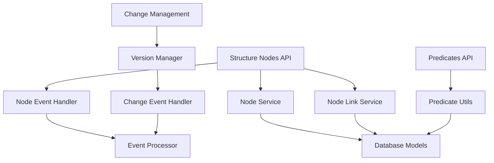

# Knowledge Graph Management

## Overview

The Knowledge Graph Management system is the core of Context Studio's structure management capabilities. It provides unified CRUD operations for layers, domains, and terms through a hierarchical node system, along with sophisticated relationship management through predicates and node links.

## Architecture

### Core Components



## API Endpoints

### Structure Nodes API (`/api/structure_nodes`)

The Structure Nodes API provides unified operations for managing all types of knowledge graph nodes.

#### Core Operations

**Create Node**
```http
POST /api/structure_nodes
Content-Type: application/json

{
  "title": "Machine Learning",
  "definition": "Artificial intelligence techniques for learning",
  "node_type": "domain",
  "parent_node_id": "ai-layer-uuid"
}
```

**List Nodes**
```http
GET /api/structure_nodes?node_type=domain&parent_id=uuid
```

**Search Nodes**
```http
GET /api/structure_nodes/search?q=machine&node_type=domain
```

**Get Node Details**
```http
GET /api/structure_nodes/{node_id}
```

**Update Node**
```http
PUT /api/structure_nodes/{node_id}
Content-Type: application/json

{
  "title": "Updated Title",
  "definition": "Updated definition"
}
```

**Delete Node**
```http
DELETE /api/structure_nodes/{node_id}
```

#### Hierarchical Operations

**Move Nodes**
```http
POST /api/structure_nodes/move
Content-Type: application/json

{
  "node_ids": ["uuid1", "uuid2"],
  "new_parent_id": "parent-uuid"
}
```

**Get Node Children**
```http
GET /api/structure_nodes/{node_id}/children
```
Returns all direct children of a structure node.

**Get Node Ancestors**
```http
GET /api/structure_nodes/{node_id}/ancestors
```
Returns all ancestors of a structure node in hierarchical order.

### Node Links API

The Node Links API manages relationships between structure nodes using predicate-based connections.

#### Link Operations

**Create Node Link**
```http
POST /api/structure_nodes/links
Content-Type: application/json

{
  "source_node_id": "source-uuid",
  "target_node_id": "target-uuid",
  "predicate_id": "predicate-uuid"
}
```

**List Node Links**
```http
GET /api/structure_nodes/links?source_node_id=uuid
```

**Update Node Link**
```http
PUT /api/structure_nodes/links/{link_id}
Content-Type: application/json

{
  "predicate_id": "new-predicate-uuid"
}
```

**Delete Node Link**
```http
DELETE /api/structure_nodes/links/{link_id}
```

## Data Models

### Structure Node Model

```python
class StructureNode:
    id: str  # UUID as string
    title: str
    definition: Optional[str]
    node_type: NodeType  # layer, domain, term
    parent_node_id: Optional[str]
    structural_predicate_id: Optional[str]
    created_at: datetime
    last_modified: datetime
    version: int

    # Vector embeddings for similarity search
    title_embedding: Optional[bytes]
    definition_embedding: Optional[bytes]
```

### Structure Node Link Model

```python
class StructureNodeLink:
    id: str  # UUID as string
    source_node_id: str
    target_node_id: str
    predicate: str
    predicate_id: Optional[str]
    created_at: datetime
    # Note: StructureNodeLink doesn't have last_modified or version fields in current implementation
```

## Node Types

### Layers
- **Purpose**: Top-level organizational containers
- **Characteristics**: No parent nodes, can contain domains
- **Examples**: "Technology", "Business Process", "Scientific Domain"

### Domains
- **Purpose**: Subject area containers within layers
- **Characteristics**: Must have layer parent, can contain terms
- **Examples**: "Machine Learning", "Web Development", "Data Science"

### Terms
- **Purpose**: Specific concepts or entities
- **Characteristics**: Must have domain parent, leaf nodes in hierarchy
- **Examples**: "Neural Network", "REST API", "Pandas DataFrame"

## Features

### Hierarchical Relationships

The system maintains strict hierarchical relationships:

```
Layer (root)
├── Domain (child of layer)
│   ├── Term (child of domain)
│   └── Term (child of domain)
└── Domain (child of layer)
    └── Term (child of domain)
```

### Search and Filtering

- **Full-text search** across titles and definitions
- **Node type filtering** (layer, domain, term)
- **Hierarchical filtering** by parent relationships
- **Vector similarity search** using embeddings (**Note: Currently NOT IMPLEMENTED - returns 501 status**)

### Bulk Operations

- **Bulk creation** of multiple nodes
- **Bulk updates** with batch processing
- **Bulk movement** of node hierarchies
- **Bulk deletion** with cascade handling

### Hierarchical Organization

- Parent-child relationships between nodes
- Type-based hierarchy constraints
- Cascade deletion of child nodes

## Integration Points

### Change Management
- All operations generate change events
- Version tracking for all modifications
- Rollback capabilities through version management

### Vector Search
- Automatic embedding generation for titles and descriptions
- Similarity-based node recommendations
- Semantic search capabilities

### Event Processing
- Real-time event generation for all CRUD operations
- Asynchronous processing of change events
- Integration with collaboration workflow

### NLP Integration
- Automatic concept extraction from descriptions
- Entity linking to external knowledge bases
- Semantic relationship suggestions

## Performance Considerations

### Indexing Strategy

```sql
-- Primary indexes
CREATE INDEX idx_structure_nodes_type_parent ON structure_nodes(node_type, parent_node_id);
CREATE INDEX idx_structure_nodes_parent_position ON structure_nodes(parent_node_id, position);

-- Search indexes
CREATE INDEX idx_structure_nodes_title_search ON structure_nodes(title);
CREATE INDEX idx_structure_nodes_definition_search ON structure_nodes(definition);

-- Link indexes
CREATE INDEX idx_structure_node_links_source ON structure_node_links(source_node_id);
CREATE INDEX idx_structure_node_links_target ON structure_node_links(target_node_id);
```

### Caching Strategy

- **Node hierarchy caching** for frequently accessed trees
- **Search result caching** with TTL-based invalidation
- **Relationship caching** for complex link queries

### Batch Processing

- **Batch insertion** for large data imports
- **Batch updates** for bulk modifications
- **Batch validation** for consistency checks

## Error Handling

### Validation Errors

- **Hierarchy validation**: Prevents circular references
- **Type validation**: Ensures proper node type constraints
- **Title uniqueness**: Prevents duplicate titles within same parent
- **Parent existence**: Validates parent node existence

### Common Error Responses

```json
{
  "error": "INVALID_HIERARCHY",
  "message": "Cannot create circular reference in node hierarchy",
  "details": {
    "node_id": "uuid",
    "attempted_parent_id": "parent-uuid"
  }
}
```

## Configuration

### Node Limits

```json
{
  "max_nodes_per_parent": 1000,
  "max_hierarchy_depth": 10,
  "max_title_length": 255,
  "max_description_length": 5000
}
```

### Feature Flags

```json
{
  "enable_vector_search": true,
  "enable_bulk_operations": true,
  "enable_position_management": true,
  "enable_cascade_delete": true
}
```

## Usage Examples

### Creating a Knowledge Domain

```python
# Create layer
layer = create_node({
    "title": "Artificial Intelligence",
    "definition": "AI and machine learning concepts",
    "node_type": "layer"
})

# Create domain
domain = create_node({
    "title": "Deep Learning",
    "definition": "Neural network architectures and training",
    "node_type": "domain",
    "parent_node_id": layer.id
})

# Create terms
transformer = create_node({
    "title": "Transformer",
    "definition": "Attention-based neural network architecture",
    "node_type": "term",
    "parent_node_id": domain.id
})

# Create relationship between terms
create_node_link({
    "source_node_id": transformer.id,
    "target_node_id": attention.id,
    "predicate_id": "uses-predicate-uuid"  # Must be valid predicate ID
})
```

### Searching Knowledge Graph

```python
# Search across all nodes
results = search_nodes(query="machine learning", node_type="domain")

# Get hierarchy using API endpoints
# GET /api/structure_nodes/{domain_id}/children
# GET /api/structure_nodes/{term_id}/ancestors
```

## Best Practices

### Node Organization
1. Use clear, descriptive titles
2. Maintain consistent hierarchy depth
3. Avoid deeply nested structures (>5 levels)
4. Use meaningful descriptions for context

### Relationship Management
1. Use appropriate predicates for relationships
2. Avoid creating too many links per node
3. Validate relationship semantics
4. Document custom predicates

### Performance Optimization
1. Batch operations when possible
2. Use specific node type filters
3. Implement proper caching strategies
4. Monitor query performance

## Troubleshooting

### Common Issues

1. **Hierarchy Validation Errors**
   - Check for circular references
   - Validate parent-child relationships
   - Ensure proper node types

2. **Performance Issues**
   - Review query patterns
   - Check index usage
   - Monitor cache hit rates

3. **Data Consistency Issues**
   - Run consistency checks
   - Validate foreign key relationships
   - Check event processing status