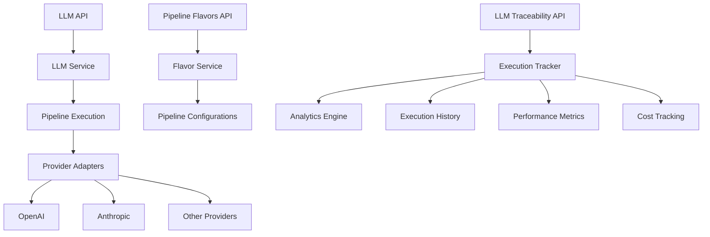

# LLM Pipeline Infrastructure

## Overview

The LLM Pipeline Infrastructure provides a comprehensive system for configuring, executing, and monitoring large language model interactions within Context Studio. It supports multiple LLM providers, customizable pipeline configurations (flavors), complete execution traceability, and advanced analytics for performance optimization.

## Architecture

### Core Components



## Pipeline Flavors System

### Overview

Pipeline Flavors are reusable configurations that define how LLM requests should be processed, including provider settings, prompt templates, and execution parameters.

### API Endpoints (`/api/pipeline_flavors`)

**Create Flavor**
```http
POST /api/pipeline_flavors
Content-Type: application/json

{
  "name": "domain_definition_assistant",
  "description": "Generates definitions for domain concepts",
  "provider": "openai",
  "model": "gpt-4",
  "system_prompt": "You are an expert knowledge curator...",
  "user_prompt_template": "Define the domain concept: {{concept}}",
  "parameters": {
    "temperature": 0.7,
    "max_tokens": 500,
    "top_p": 0.9
  },
  "enabled": true
}
```

**List Flavors**
```http
GET /api/pipeline_flavors?enabled_only=true
```

**Get Flavor Details**
```http
GET /api/pipeline_flavors/{flavor_id}
```

**Update Flavor**
```http
PUT /api/pipeline_flavors/{flavor_id}
Content-Type: application/json

{
  "parameters": {
    "temperature": 0.8,
    "max_tokens": 750
  }
}
```

**Delete Flavor**
```http
DELETE /api/pipeline_flavors/{flavor_id}
```

### Flavor Configuration Model

```python
class PipelineFlavor:
    id: UUID
    name: str
    description: Optional[str]
    provider: str  # openai, anthropic, etc.
    model: str     # gpt-4, claude-3-sonnet, etc.

    # Prompt configuration
    system_prompt: Optional[str]
    user_prompt_template: str

    # Model parameters
    parameters: dict  # temperature, max_tokens, etc.

    # Management
    enabled: bool
    version: int
    created_at: datetime
    updated_at: datetime

    # Usage statistics
    execution_count: int
    average_duration_ms: float
    average_cost: float
```

### Built-in Flavors

Context Studio includes several pre-configured flavors:

1. **Term Definition Assistant**
   - Purpose: Generate definitions for knowledge graph terms
   - Provider: OpenAI GPT-4
   - Optimized for accuracy and clarity

2. **Domain Concept Analyzer**
   - Purpose: Analyze and structure domain knowledge
   - Provider: Anthropic Claude
   - Optimized for structured thinking

3. **Layer Organizer**
   - Purpose: Organize high-level knowledge categories
   - Provider: OpenAI GPT-3.5-turbo
   - Optimized for speed and cost

## LLM Execution System

### API Endpoints (`/api/llm`)

**Execute Pipeline**
```http
POST /api/llm/execute-pipeline
Content-Type: application/json

{
  "flavor_id": "flavor-uuid",
  "inputs": {
    "concept": "Machine Learning",
    "context": "AI domain knowledge"
  },
  "stream": false
}
```

**Execute Pipeline (Streaming)**
```http
POST /api/llm/execute-pipeline-stream
Content-Type: application/json

{
  "flavor_id": "flavor-uuid",
  "inputs": {
    "concept": "Neural Networks"
  }
}
```
Returns: Server-Sent Events stream with real-time response chunks.

**Health Check**
```http
GET /api/llm/health
```

### Domain-Specific Endpoints

**Suggest Term Definition**
```http
POST /api/llm/suggest-term-definition
Content-Type: application/json

{
  "term": "Transformer Architecture",
  "context": "Deep learning models",
  "stream": false
}
```

**Suggest Domain Definition**
```http
POST /api/llm/suggest-domain-definition
Content-Type: application/json

{
  "domain": "Natural Language Processing",
  "layer_context": "Artificial Intelligence"
}
```

**Suggest Layer Definition**
```http
POST /api/llm/suggest_layer_definition
Content-Type: application/json

{
  "layer_title": "Computer Science",
  "contained_domains": ["Software Engineering", "Data Science"]
}
```

## Execution Tracking and Traceability

### API Endpoints (`/api/llm_traceability`)

**Record Execution Selection**
```http
POST /api/llm_traceability/record-selection
Content-Type: application/json

{
  "execution_id": "exec-uuid",
  "selection_type": "accepted",
  "user_feedback": "Good definition, very helpful"
}
```

**Get Execution History**
```http
GET /api/llm_traceability/execution-history?limit=50&flavor_id=uuid
```

**Get Execution Details**
```http
GET /api/llm_traceability/execution/{execution_id}
```

**Get Execution Analytics**
```http
GET /api/llm_traceability/analytics?start_date=2025-01-01&end_date=2025-01-31
```

**Get Flavor Analytics**
```http
GET /api/llm_traceability/flavor-analytics/{flavor_id}
```

**Traceability Health Check**
```http
GET /api/llm_traceability/health
```

### Execution Tracking Model

```python
class LLMExecution:
    id: UUID
    flavor_id: UUID

    # Request details
    inputs: dict
    prompt_tokens: int
    completion_tokens: int
    total_tokens: int

    # Response details
    response: str
    response_chunks: Optional[list]  # For streaming

    # Performance metrics
    start_time: datetime
    end_time: datetime
    duration_ms: int

    # Cost tracking
    cost_usd: Optional[float]

    # Quality metrics
    user_selection: Optional[str]  # accepted, rejected, modified
    feedback: Optional[str]

    # Technical details
    provider: str
    model: str
    parameters: dict
    error_message: Optional[str]

    created_at: datetime
```

## Provider Integration

### Supported Providers

#### OpenAI
- **Models**: GPT-4, GPT-4-turbo, GPT-3.5-turbo
- **Features**: Chat completions, streaming, function calling
- **Configuration**: API key, organization ID, custom endpoints

```python
{
  "provider": "openai",
  "model": "gpt-4",
  "api_key": "${OPENAI_API_KEY}",
  "organization": "${OPENAI_ORG_ID}",
  "base_url": "https://api.openai.com/v1"
}
```

#### Anthropic
- **Models**: Claude-3-opus, Claude-3-sonnet, Claude-3-haiku
- **Features**: Messages API, streaming, system prompts
- **Configuration**: API key, version specification

```python
{
  "provider": "anthropic",
  "model": "claude-3-sonnet-20240229",
  "api_key": "${ANTHROPIC_API_KEY}",
  "version": "2023-06-01"
}
```

### Provider Adapter Interface

```python
class LLMProviderAdapter(ABC):
    @abstractmethod
    async def execute(
        self,
        prompt: str,
        parameters: dict
    ) -> LLMResponse:
        pass

    @abstractmethod
    async def execute_stream(
        self,
        prompt: str,
        parameters: dict
    ) -> AsyncGenerator[str, None]:
        pass

    @abstractmethod
    def calculate_cost(
        self,
        prompt_tokens: int,
        completion_tokens: int
    ) -> float:
        pass
```

## Features

### Prompt Template System

#### Template Variables
Templates support Jinja2-style variable substitution:

```python
user_prompt_template = """
Define the {{node_type}} "{{title}}" in the context of {{parent_context}}.

Requirements:
- Provide a clear, concise definition
- Include key characteristics
- Mention relationships to related concepts

- Provide examples: {{examples}}

"""
```

#### Template Functions
Built-in functions for common operations:

```python
# Current date/time
"Generated on {{now().strftime('%Y-%m-%d')}}"

# String manipulation
"{{title|upper}} - {{description|truncate(100)}}"

# Conditional rendering
"Context: {{context}}"
```

### Cost Management

#### Cost Calculation
- **Automatic cost tracking** based on token usage
- **Provider-specific pricing** tables
- **Cost budgeting** and alerts
- **Historical cost analysis**

#### Cost Models

```python
# OpenAI GPT-4 pricing (example)
PRICING = {
    "gpt-4": {
        "prompt_tokens_per_1k": 0.03,
        "completion_tokens_per_1k": 0.06
    },
    "gpt-3.5-turbo": {
        "prompt_tokens_per_1k": 0.0015,
        "completion_tokens_per_1k": 0.002
    }
}
```

### Performance Analytics

#### Execution Metrics
- **Response times**: Average, p95, p99 latencies
- **Token efficiency**: Tokens per response quality
- **Success rates**: Error rates by provider/model
- **Cost efficiency**: Cost per successful completion

#### Quality Metrics
- **User satisfaction**: Acceptance rates, feedback scores
- **Response quality**: Length, coherence, relevance
- **Template effectiveness**: Performance by prompt template
- **A/B testing**: Comparative flavor performance

## Configuration

### LLM Service Configuration

```json
{
  "llm": {
    "default_timeout_seconds": 30,
    "max_retries": 3,
    "retry_delay_seconds": 1,
    "enable_caching": true,
    "cache_ttl_seconds": 3600,
    "enable_streaming": true,
    "max_concurrent_requests": 10
  }
}
```

### Provider Configuration

```json
{
  "providers": {
    "openai": {
      "api_key": "${OPENAI_API_KEY}",
      "organization": "${OPENAI_ORG_ID}",
      "base_url": "https://api.openai.com/v1",
      "timeout": 30,
      "max_retries": 3
    },
    "anthropic": {
      "api_key": "${ANTHROPIC_API_KEY}",
      "base_url": "https://api.anthropic.com",
      "version": "2023-06-01",
      "timeout": 30
    }
  }
}
```

### Feature Flags

```json
{
  "features": {
    "enable_execution_tracking": true,
    "enable_cost_tracking": true,
    "enable_streaming_responses": true,
    "enable_prompt_caching": true,
    "enable_quality_feedback": true
  }
}
```

## Error Handling

### Common Errors

#### Provider Errors
```json
{
  "error": "PROVIDER_API_ERROR",
  "message": "OpenAI API returned an error",
  "details": {
    "provider": "openai",
    "status_code": 429,
    "provider_error": "Rate limit exceeded"
  }
}
```

#### Configuration Errors
```json
{
  "error": "INVALID_FLAVOR_CONFIGURATION",
  "message": "Flavor template contains invalid variables",
  "details": {
    "flavor_id": "uuid",
    "invalid_variables": ["{{undefined_var}}"]
  }
}
```

#### Timeout Errors
```json
{
  "error": "EXECUTION_TIMEOUT",
  "message": "LLM request exceeded timeout limit",
  "details": {
    "timeout_seconds": 30,
    "execution_id": "uuid"
  }
}
```

## Integration Points

### Knowledge Graph Integration
- **Context injection**: Automatically include relevant graph context
- **Result integration**: Parse responses for structured data
- **Feedback loop**: Use graph updates to improve prompt effectiveness

### Change Management Integration
- **Execution versioning**: Track flavor versions used
- **Change attribution**: Link knowledge updates to LLM executions
- **Rollback capability**: Revert changes based on execution history

### NLP Integration
- **Preprocessing**: Clean and prepare inputs for LLM processing
- **Postprocessing**: Extract structured information from responses
- **Validation**: Verify response quality against knowledge graph

## Usage Examples

### Basic Pipeline Execution

```python
# Execute with custom flavor
response = await llm_service.execute_pipeline(
    flavor_id="domain-definition-assistant",
    inputs={
        "concept": "Machine Learning",
        "context": "Artificial Intelligence domain"
    }
)

print(f"Response: {response.content}")
print(f"Cost: ${response.cost_usd:.4f}")
print(f"Duration: {response.duration_ms}ms")
```

### Streaming Execution

```python
# Stream response in real-time
async for chunk in llm_service.execute_pipeline_stream(
    flavor_id="concept-analyzer",
    inputs={"topic": "Neural Networks"}
):
    print(chunk.content, end="", flush=True)
```

### Flavor Management

```python
# Create custom flavor
flavor = await flavor_service.create_flavor({
    "name": "custom_analyzer",
    "provider": "anthropic",
    "model": "claude-3-sonnet-20240229",
    "system_prompt": "You are a domain expert in {{domain}}",
    "user_prompt_template": "Analyze: {{input_text}}",
    "parameters": {
        "temperature": 0.5,
        "max_tokens": 1000
    }
})

# Update flavor parameters
await flavor_service.update_flavor(flavor.id, {
    "parameters": {"temperature": 0.7}
})
```

### Analytics and Monitoring

```python
# Get execution analytics
analytics = await traceability_service.get_execution_analytics(
    start_date="2025-01-01",
    end_date="2025-01-31"
)

print(f"Total executions: {analytics.total_executions}")
print(f"Average cost: ${analytics.average_cost:.4f}")
print(f"Success rate: {analytics.success_rate:.2%}")

# Get flavor performance
flavor_stats = await traceability_service.get_flavor_analytics(
    flavor_id="domain-definition-assistant"
)

print(f"Acceptance rate: {flavor_stats.acceptance_rate:.2%}")
print(f"Average response time: {flavor_stats.avg_duration_ms}ms")
```

## Best Practices

### Flavor Design
1. **Specific purposes**: Create flavors for specific use cases
2. **Clear templates**: Write unambiguous prompt templates
3. **Appropriate models**: Match model capabilities to task complexity
4. **Parameter tuning**: Optimize temperature and token limits

### Performance Optimization
1. **Caching**: Enable response caching for repeated queries
2. **Streaming**: Use streaming for long responses
3. **Batch processing**: Group related requests when possible
4. **Cost monitoring**: Track and optimize token usage

### Quality Management
1. **Feedback loops**: Collect and act on user feedback
2. **A/B testing**: Compare flavor performance regularly
3. **Template refinement**: Continuously improve prompts
4. **Error analysis**: Monitor and address failure patterns

### Security
1. **API key management**: Secure provider credentials
2. **Input validation**: Sanitize user inputs
3. **Output filtering**: Review responses for sensitive content
4. **Access control**: Limit flavor modification permissions

## Troubleshooting

### Performance Issues
1. **High latency**: Check provider status and network
2. **Rate limiting**: Implement exponential backoff
3. **Memory usage**: Monitor large response handling
4. **Cost overruns**: Review token usage patterns

### Quality Issues
1. **Poor responses**: Refine prompt templates
2. **Inconsistent results**: Adjust temperature settings
3. **Template errors**: Validate variable substitutions
4. **Model selection**: Match model to task complexity

### Integration Issues
1. **Provider failures**: Implement fallback providers
2. **Authentication errors**: Verify API credentials
3. **Version compatibility**: Check provider API versions
4. **Configuration drift**: Validate flavor configurations