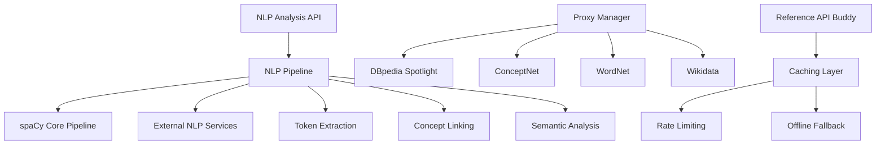

# NLP Processing Pipeline

## Overview

The NLP Processing Pipeline provides comprehensive text analysis capabilities, including named entity recognition, concept extraction, semantic analysis, and integration with external knowledge bases. It features a sophisticated proxy management system for external API integration and caching for performance optimization.

## Architecture



## API Endpoints

### NLP Analysis (`/api/nlp_analysis`)

**Analyze Text**
```http
POST /api/nlp_analysis
Content-Type: application/json

{
  "text": "Machine learning is a subset of artificial intelligence that focuses on algorithms.",
  "include_entities": true,
  "include_concepts": true,
  "include_tokens": true,
  "include_enrichment": true
}
```

Response:
```json
{
  "analysis_id": "analysis-uuid",
  "text": "Machine learning is a subset of artificial intelligence...",
  "tokens": [
    {
      "text": "Machine learning",
      "pos": "NOUN",
      "lemma": "machine learning",
      "start": 0,
      "end": 16,
      "entity_type": "TECHNOLOGY"
    }
  ],
  "entities": [
    {
      "text": "Machine learning",
      "label": "TECHNOLOGY",
      "start": 0,
      "end": 16,
      "confidence": 0.95,
      "dbpedia_uri": "http://dbpedia.org/resource/Machine_learning"
    }
  ],
  "concepts": [
    {
      "concept": "machine_learning",
      "relations": ["subset_of", "related_to"],
      "source": "conceptnet"
    }
  ],
  "enrichment": {
    "dbpedia": [...],
    "conceptnet": [...],
    "wikidata": [...]
  }
}
```

### Proxy Management

**Configure Proxy**
```http
POST /api/nlp_analysis/configure-proxy
Content-Type: application/json

{
  "dbpedia_spotlight": {
    "endpoint": "https://api.dbpedia-spotlight.org/en/annotate",
    "confidence": 0.5,
    "support": 20
  },
  "conceptnet": {
    "endpoint": "http://api.conceptnet.io",
    "language": "en"
  }
}
```

**Get Proxy Status**
```http
GET /api/nlp_analysis/proxy-status
```

**Get Proxy Monitoring**
```http
GET /api/nlp_analysis/proxy-monitoring
```

## Core Components

### spaCy Pipeline

#### Model Configuration
```python
# English language model with custom components
nlp = spacy.load("en_core_web_lg")

# Add custom components
nlp.add_pipe("dbpedia_spotlight", last=True)
nlp.add_pipe("conceptnet_linker", last=True)
nlp.add_pipe("wordnet_enricher", last=True)
```

#### Token Analysis
- **Part-of-speech tagging**: Grammatical classification
- **Lemmatization**: Root form identification
- **Named entity recognition**: Person, organization, location detection
- **Dependency parsing**: Syntactic relationship analysis

### External Integrations

#### DBpedia Spotlight
- **Purpose**: Entity linking to DBpedia knowledge base
- **Capabilities**: Named entity recognition and disambiguation
- **Configuration**: Confidence thresholds, support levels

```python
{
  "dbpedia_spotlight": {
    "endpoint": "https://api.dbpedia-spotlight.org/en/annotate",
    "confidence": 0.5,
    "support": 20,
    "types": ["DBpedia:Agent", "DBpedia:Place", "DBpedia:Organisation"]
  }
}
```

#### ConceptNet
- **Purpose**: Common sense reasoning and concept relationships
- **Capabilities**: Semantic relationship extraction
- **Features**: Multi-language support, relationship types

```python
{
  "conceptnet": {
    "endpoint": "http://api.conceptnet.io",
    "language": "en",
    "limit": 50,
    "relation_types": ["RelatedTo", "IsA", "PartOf", "UsedFor"]
  }
}
```

#### WordNet
- **Purpose**: Lexical database for semantic analysis
- **Capabilities**: Synonym detection, semantic similarity
- **Features**: Hypernym/hyponym relationships, sense disambiguation

#### Wikidata
- **Purpose**: Structured knowledge base integration
- **Capabilities**: Entity enrichment with structured data
- **Features**: Property extraction, relationship mapping

### Reference API Proxy System

#### Caching Layer
```python
class APICache:
    ttl_seconds: int = 3600
    max_entries: int = 10000
    compression: bool = True

    # Cache strategies
    strategies = {
        "dbpedia": "content_hash",
        "conceptnet": "url_params",
        "wikidata": "entity_id"
    }
```

#### Rate Limiting
```python
{
  "rate_limits": {
    "dbpedia_spotlight": {
      "requests_per_minute": 60,
      "burst_capacity": 10
    },
    "conceptnet": {
      "requests_per_minute": 120,
      "burst_capacity": 20
    }
  }
}
```

#### Offline Fallback
- **Local caches**: Pre-populated common entities
- **Fallback responses**: Default values when APIs unavailable
- **Graceful degradation**: Reduced functionality without external APIs

## NLP Processing Features

### Token Extraction

#### Token Analysis
```python
class Token:
    text: str
    pos: str          # Part of speech
    tag: str          # Fine-grained POS tag
    lemma: str        # Root form
    start: int        # Character start position
    end: int          # Character end position
    is_alpha: bool    # Contains alphabetic characters
    is_stop: bool     # Is stop word
    sentiment: float  # Sentiment score (-1 to 1)
```

#### Named Entity Recognition
```python
class Entity:
    text: str
    label: str        # PERSON, ORG, GPE, etc.
    start: int
    end: int
    confidence: float

    # External linking
    dbpedia_uri: Optional[str]
    wikidata_id: Optional[str]
    conceptnet_uri: Optional[str]
```

### Concept Extraction

#### Concept Identification
- **Statistical methods**: TF-IDF, N-gram analysis
- **Semantic methods**: Word embeddings, contextual analysis
- **Knowledge base matching**: Entity linking to external sources

#### Relationship Extraction
```python
class ConceptRelation:
    subject: str
    predicate: str
    object: str
    confidence: float
    source: str       # conceptnet, wordnet, etc.

    # Relationship types
    types = [
        "IsA", "PartOf", "RelatedTo", "UsedFor",
        "HasProperty", "CapableOf", "AtLocation"
    ]
```

### Semantic Analysis

#### Similarity Calculation
- **Word embeddings**: Vector-based similarity
- **Semantic networks**: Path-based similarity
- **Context analysis**: Contextual embeddings

#### Sentiment Analysis
```python
class SentimentAnalysis:
    polarity: float   # -1 (negative) to 1 (positive)
    subjectivity: float  # 0 (objective) to 1 (subjective)
    confidence: float

    # Fine-grained emotions
    emotions: Dict[str, float]  # joy, anger, fear, etc.
```

## Data Models

### NLP Analysis Result
```python
class NLPAnalysisResult:
    id: UUID
    text: str

    # Token analysis
    tokens: List[Token]
    entities: List[Entity]

    # Concept extraction
    concepts: List[Concept]
    relations: List[ConceptRelation]

    # Enrichment data
    enrichment: Dict[str, Any]

    # Metadata
    processing_time_ms: int
    model_version: str
    created_at: datetime
```

### Processing Configuration
```python
class NLPConfig:
    # Core pipeline settings
    model_name: str = "en_core_web_lg"
    batch_size: int = 100
    max_length: int = 1000000

    # Feature toggles
    include_entities: bool = True
    include_concepts: bool = True
    include_tokens: bool = True
    include_enrichment: bool = True

    # External service settings
    external_services: Dict[str, ServiceConfig]

    # Performance settings
    timeout_seconds: int = 30
    max_retries: int = 3
    cache_enabled: bool = True
```

## Configuration

### NLP Pipeline Settings
```json
{
  "nlp": {
    "model": "en_core_web_lg",
    "batch_size": 100,
    "max_text_length": 1000000,
    "enable_gpu": false,
    "custom_components": [
      "dbpedia_spotlight",
      "conceptnet_linker",
      "wordnet_enricher"
    ]
  }
}
```

### External Services
```json
{
  "external_services": {
    "dbpedia_spotlight": {
      "enabled": true,
      "endpoint": "https://api.dbpedia-spotlight.org/en/annotate",
      "confidence": 0.5,
      "support": 20,
      "timeout": 10
    },
    "conceptnet": {
      "enabled": true,
      "endpoint": "http://api.conceptnet.io",
      "language": "en",
      "limit": 50,
      "timeout": 5
    },
    "wordnet": {
      "enabled": true,
      "similarity_threshold": 0.6
    }
  }
}
```

### Proxy Configuration
```json
{
  "proxy": {
    "cache": {
      "enabled": true,
      "ttl_seconds": 3600,
      "max_entries": 10000,
      "compression": true
    },
    "rate_limiting": {
      "enabled": true,
      "window_seconds": 60,
      "max_requests": 100
    },
    "offline_mode": {
      "enabled": true,
      "fallback_cache": true,
      "default_responses": true
    }
  }
}
```

## Performance Considerations

### Processing Optimization

#### Batch Processing
- **Text chunking**: Process large texts in chunks
- **Parallel processing**: Multi-threaded analysis
- **Memory management**: Efficient model loading and caching

#### Model Management
```python
# Model caching strategy
models = {
    "en_core_web_lg": {"memory_mb": 750, "load_time_s": 15},
    "en_core_web_sm": {"memory_mb": 50, "load_time_s": 2}
}

# Lazy loading for memory efficiency
def get_model(name: str) -> Language:
    if name not in loaded_models:
        loaded_models[name] = spacy.load(name)
    return loaded_models[name]
```

### External API Optimization

#### Caching Strategy
- **Content-based caching**: Hash-based cache keys
- **Time-based expiration**: TTL for cache entries
- **Size-based eviction**: LRU cache management

#### Request Optimization
- **Batch requests**: Group multiple queries
- **Request deduplication**: Avoid redundant API calls
- **Async processing**: Non-blocking external calls

## Error Handling

### Common Errors

#### Processing Errors
```json
{
  "error": "NLP_PROCESSING_FAILED",
  "message": "Failed to process text with spaCy pipeline",
  "details": {
    "text_length": 50000,
    "error_stage": "entity_recognition",
    "model": "en_core_web_lg"
  }
}
```

#### External Service Errors
```json
{
  "error": "EXTERNAL_SERVICE_UNAVAILABLE",
  "message": "DBpedia Spotlight service is not responding",
  "details": {
    "service": "dbpedia_spotlight",
    "endpoint": "https://api.dbpedia-spotlight.org",
    "last_success": "2025-01-15T10:30:00Z"
  }
}
```

#### Configuration Errors
```json
{
  "error": "INVALID_NLP_CONFIGURATION",
  "message": "Unsupported spaCy model specified",
  "details": {
    "requested_model": "invalid_model",
    "available_models": ["en_core_web_lg", "en_core_web_sm"]
  }
}
```

## Integration Points

### Knowledge Graph Integration
- **Entity linking**: Connect extracted entities to graph nodes
- **Concept mapping**: Map concepts to domain terms
- **Relationship inference**: Suggest new graph relationships

### LLM Pipeline Integration
- **Context enhancement**: Enrich LLM prompts with NLP analysis
- **Response validation**: Validate LLM outputs using NLP
- **Concept extraction**: Extract structured data from LLM responses

### Vector Database Integration
- **Embedding generation**: Create embeddings for similarity search
- **Semantic indexing**: Index concepts for retrieval
- **Similarity queries**: Find related concepts and entities

## Usage Examples

### Basic Text Analysis
```python
# Analyze text with full feature set
result = await nlp_service.analyze_text(
    text="Machine learning algorithms learn patterns from data.",
    include_entities=True,
    include_concepts=True,
    include_enrichment=True
)

# Access analysis results
for entity in result.entities:
    print(f"Entity: {entity.text} ({entity.label}) - {entity.dbpedia_uri}")

for concept in result.concepts:
    print(f"Concept: {concept.concept} - Relations: {concept.relations}")
```

### Custom Configuration
```python
# Configure NLP pipeline
config = NLPConfig(
    model_name="en_core_web_lg",
    include_entities=True,
    include_concepts=False,
    external_services={
        "dbpedia_spotlight": {
            "confidence": 0.7,
            "support": 50
        }
    }
)

result = await nlp_service.analyze_text(text, config)
```

### Proxy Management
```python
# Check proxy status
status = await nlp_service.get_proxy_status()
print(f"DBpedia available: {status['dbpedia_spotlight']['available']}")

# Configure proxy settings
await nlp_service.configure_proxy({
    "dbpedia_spotlight": {
        "confidence": 0.6,
        "timeout": 15
    }
})
```

## Best Practices

### Performance Optimization
1. **Model selection**: Choose appropriate model size for use case
2. **Batch processing**: Process multiple texts together
3. **Caching**: Enable caching for repeated analyses
4. **Resource monitoring**: Monitor memory and CPU usage

### Quality Assurance
1. **Threshold tuning**: Adjust confidence thresholds for accuracy
2. **Result validation**: Review extraction quality regularly
3. **Fallback strategies**: Handle external service failures gracefully
4. **Language considerations**: Ensure model matches text language

### Integration Strategies
1. **Incremental processing**: Process new content incrementally
2. **Error resilience**: Design for external service failures
3. **Configuration management**: Version and validate configurations
4. **Monitoring**: Track processing metrics and service health

## Troubleshooting

### Processing Issues
1. **Memory errors**: Reduce batch size or use smaller model
2. **Timeout issues**: Increase timeout values or optimize text preprocessing
3. **Quality problems**: Adjust confidence thresholds and review model selection
4. **Language issues**: Ensure text language matches model language

### External Service Issues
1. **API failures**: Check service status and authentication
2. **Rate limiting**: Implement proper backoff strategies
3. **Response quality**: Validate and filter external service responses
4. **Network issues**: Configure appropriate timeouts and retries