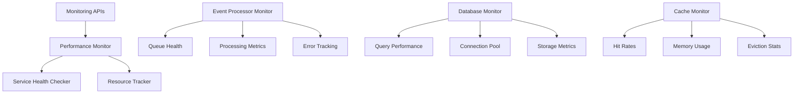

# Performance & Monitoring

## Overview

The Performance & Monitoring system provides comprehensive observability into Context Studio's operations, including performance tracking, resource monitoring, service health checks, and analytics for optimization. It implements advanced monitoring for all system components with alerting and reporting capabilities.

## Architecture



## Monitoring Components

### Service Monitoring (`/api/admin/service_monitoring`)

**Service Health Check**
```http
GET /api/admin/service_monitoring/health
```

Response:
```json
{
  "overall_status": "healthy",
  "services": {
    "database": {
      "status": "healthy",
      "response_time_ms": 15,
      "last_check": "2025-01-15T10:30:00Z"
    },
    "llm_service": {
      "status": "healthy",
      "active_requests": 3,
      "avg_response_time_ms": 1250
    },
    "nlp_pipeline": {
      "status": "warning",
      "external_services_available": 2,
      "external_services_total": 3
    }
  }
}
```

**Performance Metrics**
```http
GET /api/admin/service_monitoring/performance?duration=1h
```

**System Resources**
```http
GET /api/admin/service_monitoring/resources
```

### Database Monitoring (`/api/admin/database_monitoring`)

**Database Health**
```http
GET /api/admin/database_monitoring/health
```

**Query Performance**
```http
GET /api/admin/database_monitoring/query-performance?limit=50
```

**Connection Pool Status**
```http
GET /api/admin/database_monitoring/connection-pool
```

**Storage Analytics**
```http
GET /api/admin/database_monitoring/storage
```

### Event Processor Monitoring (`/api/admin/event_processor_monitoring`)

**Queue Health**
```http
GET /api/admin/event_processor_monitoring/queue-health
```

**Processing Metrics**
```http
GET /api/admin/event_processor_monitoring/processing-metrics
```

**Error Analysis**
```http
GET /api/admin/event_processor_monitoring/error-analysis?hours=24
```

## Performance Metrics

### System Performance

#### Response Time Tracking
```python
class ResponseTimeMetrics:
    endpoint: str
    method: str

    # Time measurements
    min_response_time_ms: float
    max_response_time_ms: float
    avg_response_time_ms: float
    p95_response_time_ms: float
    p99_response_time_ms: float

    # Request counts
    request_count: int
    error_count: int
    success_rate: float

    # Time window
    measurement_start: datetime
    measurement_end: datetime
```

#### Resource Utilization
```python
class ResourceMetrics:
    # CPU metrics
    cpu_usage_percent: float
    cpu_cores: int
    load_average: float

    # Memory metrics
    memory_total_mb: float
    memory_used_mb: float
    memory_available_mb: float
    memory_usage_percent: float

    # Disk metrics
    disk_total_gb: float
    disk_used_gb: float
    disk_available_gb: float
    disk_usage_percent: float

    # Network metrics
    network_bytes_sent: int
    network_bytes_received: int
    active_connections: int
```

### Database Performance

#### Query Performance
```python
class QueryMetrics:
    query_hash: str
    query_type: str  # SELECT, INSERT, UPDATE, DELETE

    # Timing
    execution_time_ms: float
    planning_time_ms: float
    total_time_ms: float

    # Resource usage
    rows_examined: int
    rows_returned: int
    bytes_sent: int

    # Frequency
    execution_count: int
    last_executed: datetime

    # Index usage
    indexes_used: List[str]
    full_table_scans: bool
```

#### Connection Pool Metrics
```python
class ConnectionPoolMetrics:
    pool_size: int
    active_connections: int
    idle_connections: int
    waiting_requests: int

    # Performance
    avg_checkout_time_ms: float
    max_checkout_time_ms: float
    pool_exhausted_count: int

    # Health
    failed_connections: int
    connection_errors: int
    last_health_check: datetime
```

### Application Metrics

#### LLM Pipeline Metrics
```python
class LLMPipelineMetrics:
    # Execution metrics
    total_executions: int
    successful_executions: int
    failed_executions: int
    avg_execution_time_ms: float

    # Cost metrics
    total_cost_usd: float
    avg_cost_per_execution: float
    tokens_processed: int

    # Quality metrics
    user_satisfaction_rate: float
    response_acceptance_rate: float

    # Provider metrics
    provider_response_times: Dict[str, float]
    provider_error_rates: Dict[str, float]
```

#### NLP Processing Metrics
```python
class NLPProcessingMetrics:
    # Processing volume
    texts_analyzed: int
    tokens_processed: int
    entities_extracted: int
    concepts_identified: int

    # Performance
    avg_processing_time_ms: float
    throughput_texts_per_second: float

    # External services
    external_api_calls: int
    cache_hit_rate: float
    service_availability: Dict[str, bool]

    # Quality
    extraction_confidence: float
    validation_success_rate: float
```

## Health Check System

### Service Health Definitions

#### Health Status Levels
- **healthy**: Service operating normally
- **warning**: Service functional but showing issues
- **critical**: Service impaired but partially functional
- **down**: Service unavailable or non-responsive

#### Health Check Types
```python
class HealthCheck:
    def database_health(self) -> HealthStatus:
        # Check database connectivity and response time
        pass

    def llm_service_health(self) -> HealthStatus:
        # Check LLM provider availability
        pass

    def nlp_pipeline_health(self) -> HealthStatus:
        # Check NLP components and external services
        pass

    def cache_health(self) -> HealthStatus:
        # Check cache connectivity and performance
        pass

    def storage_health(self) -> HealthStatus:
        # Check disk space and file system health
        pass
```

### Automated Health Monitoring

#### Health Check Scheduler
```python
class HealthCheckScheduler:
    def __init__(self):
        self.check_interval_seconds = 60
        self.checks = [
            ('database', self.check_database, 30),
            ('llm_service', self.check_llm_service, 120),
            ('nlp_pipeline', self.check_nlp_pipeline, 180),
            ('cache', self.check_cache, 60),
            ('storage', self.check_storage, 300)
        ]

    async def run_health_checks(self):
        # Execute health checks on schedule
        pass
```

## Alerting System

### Alert Configuration

#### Alert Rules
```python
class AlertRule:
    name: str
    condition: str           # threshold expression
    severity: str           # info, warning, critical
    notification_channels: List[str]

    # Examples
    rules = [
        {
            "name": "High Response Time",
            "condition": "avg_response_time_ms > 5000",
            "severity": "warning"
        },
        {
            "name": "Database Connection Pool Exhausted",
            "condition": "waiting_requests > 10",
            "severity": "critical"
        },
        {
            "name": "High Error Rate",
            "condition": "error_rate > 0.05",
            "severity": "warning"
        }
    ]
```

#### Notification Channels
```python
class NotificationChannels:
    email: List[str]
    slack_webhook: Optional[str]
    webhook_urls: List[str]
    log_file: str = "alerts.log"

    def send_alert(
        self,
        alert: Alert,
        channels: List[str]
    ):
        # Send notifications to configured channels
        pass
```

## Analytics and Reporting

### Performance Analytics

#### Trend Analysis
```python
class PerformanceTrends:
    def analyze_response_time_trends(
        self,
        time_window: timedelta = timedelta(days=7)
    ) -> TrendAnalysis:
        # Analyze performance trends over time
        pass

    def detect_performance_anomalies(
        self,
        metrics: List[Metric]
    ) -> List[Anomaly]:
        # Statistical anomaly detection
        pass

    def generate_performance_report(
        self,
        start_date: datetime,
        end_date: datetime
    ) -> PerformanceReport:
        # Comprehensive performance report
        pass
```

#### Capacity Planning
```python
class CapacityPlanner:
    def predict_resource_usage(
        self,
        historical_data: List[ResourceMetric],
        forecast_days: int = 30
    ) -> ResourceForecast:
        # Predict future resource needs
        pass

    def identify_bottlenecks(
        self,
        system_metrics: SystemMetrics
    ) -> List[Bottleneck]:
        # Identify performance bottlenecks
        pass
```

### Usage Analytics

#### User Activity Tracking
```python
class UsageAnalytics:
    # Endpoint usage
    endpoint_usage: Dict[str, int]
    feature_usage: Dict[str, int]
    user_activity: Dict[str, ActivityMetrics]

    # Time-based analysis
    peak_usage_hours: List[int]
    usage_patterns: Dict[str, UsagePattern]

    # Performance correlation
    usage_vs_performance: CorrelationAnalysis
```

## Configuration

### Monitoring Settings
```json
{
  "monitoring": {
    "health_check_interval_seconds": 60,
    "metrics_retention_days": 90,
    "enable_detailed_logging": true,
    "performance_sampling_rate": 1.0
  }
}
```

### Alert Settings
```json
{
  "alerts": {
    "enable_alerting": true,
    "alert_cooldown_minutes": 15,
    "notification_channels": {
      "email": ["admin@example.com"],
      "slack_webhook": "https://hooks.slack.com/...",
      "log_file": "alerts.log"
    }
  }
}
```

### Performance Thresholds
```json
{
  "thresholds": {
    "response_time_warning_ms": 3000,
    "response_time_critical_ms": 10000,
    "error_rate_warning": 0.05,
    "error_rate_critical": 0.15,
    "memory_usage_warning": 0.8,
    "memory_usage_critical": 0.95,
    "disk_usage_warning": 0.85,
    "disk_usage_critical": 0.95
  }
}
```

## Integration Points

### Logging Integration
```python
class MonitoringLogger:
    def log_performance_metric(
        self,
        metric_name: str,
        value: float,
        tags: Dict[str, str] = None
    ):
        # Log performance metrics
        pass

    def log_health_check_result(
        self,
        service: str,
        status: HealthStatus,
        details: Dict[str, Any]
    ):
        # Log health check results
        pass
```

### External Monitoring Tools

#### Prometheus Integration
```python
from prometheus_client import Counter, Histogram, Gauge

# Metrics for Prometheus
REQUEST_COUNT = Counter('requests_total', 'Total requests', ['method', 'endpoint'])
REQUEST_LATENCY = Histogram('request_duration_seconds', 'Request latency')
ACTIVE_CONNECTIONS = Gauge('active_connections', 'Active database connections')
```

#### Grafana Dashboard Configuration
```yaml
# Example Grafana dashboard config
dashboard:
  title: "Context Studio Performance"
  panels:
    - title: "Response Time"
      type: "graph"
      targets:
        - expr: "avg(response_time_ms)"
    - title: "Request Rate"
      type: "singlestat"
      targets:
        - expr: "rate(requests_total[5m])"
```

## Usage Examples

### Performance Monitoring
```python
# Get current performance metrics
metrics = await monitoring_service.get_performance_metrics(
    time_window=timedelta(hours=1)
)

print(f"Average response time: {metrics.avg_response_time_ms}ms")
print(f"Success rate: {metrics.success_rate:.2%}")

# Check service health
health = await monitoring_service.check_service_health()
for service, status in health.services.items():
    print(f"{service}: {status.status}")
```

### Database Monitoring
```python
# Monitor database performance
db_metrics = await db_monitor.get_query_performance(limit=10)

for query in db_metrics.slow_queries:
    print(f"Slow query: {query.execution_time_ms}ms - {query.query_type}")

# Check connection pool
pool_status = await db_monitor.get_connection_pool_status()
print(f"Active connections: {pool_status.active_connections}")
print(f"Pool utilization: {pool_status.utilization_percent:.1f}%")
```

### Alert Management
```python
# Configure alert rules
alert_manager.add_rule(AlertRule(
    name="High LLM Costs",
    condition="daily_llm_cost_usd > 100",
    severity="warning",
    notification_channels=["email", "slack"]
))

# Check active alerts
active_alerts = alert_manager.get_active_alerts()
for alert in active_alerts:
    print(f"ALERT: {alert.name} - {alert.message}")
```

## Best Practices

### Monitoring Strategy
1. **Monitor key metrics**: Focus on business-critical metrics
2. **Set appropriate thresholds**: Avoid alert fatigue
3. **Use trend analysis**: Look for patterns over time
4. **Implement automated remediation**: Where possible, auto-fix issues

### Performance Optimization
1. **Regular monitoring**: Continuously track performance
2. **Capacity planning**: Plan for growth and usage patterns
3. **Bottleneck identification**: Proactively identify constraints
4. **Performance testing**: Regular load and stress testing

### Alert Management
1. **Meaningful alerts**: Alert on actionable issues
2. **Alert prioritization**: Categorize by business impact
3. **Documentation**: Document alert resolution procedures
4. **Regular review**: Periodically review and tune alert rules

## Troubleshooting

### Performance Issues
- **High response times**: Check database queries, external services
- **Memory issues**: Monitor application memory usage and leaks
- **High CPU usage**: Identify CPU-intensive operations
- **Disk space**: Monitor storage usage and implement cleanup

### Monitoring Issues
- **Missing metrics**: Check metric collection and storage
- **False alerts**: Review and tune alert thresholds
- **Monitoring overhead**: Optimize monitoring impact on performance
- **Data retention**: Manage metric storage and archiving

### Health Check Failures
- **Service unavailability**: Check service status and dependencies
- **Network issues**: Verify connectivity and DNS resolution
- **Configuration errors**: Validate service configurations
- **Resource exhaustion**: Check system resource availability