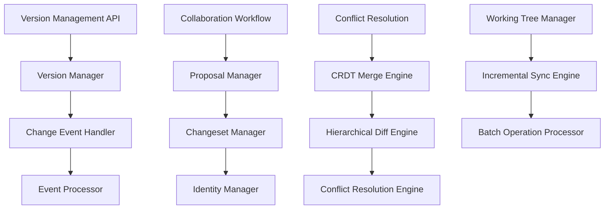

# Version Control & Change Management

## Overview

The Version Control & Change Management system provides comprehensive tracking of all entity changes, collaborative workflows for knowledge curation, and advanced merge capabilities for distributed knowledge graph editing. It implements CRDT (Conflict-free Replicated Data Types) merge strategies and sophisticated diff algorithms for hierarchical data structures.

## Architecture



## Core Components

### Change Event Tracking

All entity modifications generate change events that capture complete state transitions:

```python
class ChangeEvent:
    id: UUID
    entity_type: str      # structure_node, node_link, predicate
    entity_id: UUID
    operation: str        # create, update, delete

    # State snapshots
    before_state: Optional[dict]
    after_state: Optional[dict]

    # Change metadata
    change_summary: dict
    identity_id: UUID
    timestamp: datetime

    # Processing status
    processing_status: str  # pending, processed, failed
    processed_at: Optional[datetime]
```

### Identity Management

The system tracks contributors and maintains identity consistency across collaborations:

```python
class Identity:
    id: UUID
    display_name: str
    email: Optional[str]

    # Authentication
    auth_provider: Optional[str]
    external_id: Optional[str]

    # Activity tracking
    created_at: datetime
    last_active: datetime
    contribution_count: int
```

### Changeset Management

Changes are grouped into logical changesets for review and collaboration:

```python
class Changeset:
    id: UUID
    title: str
    description: Optional[str]

    # Change tracking
    change_event_ids: List[UUID]
    author_identity_id: UUID

    # Workflow status
    status: str  # draft, proposed, reviewing, approved, rejected, merged

    # Review metadata
    reviewers: List[UUID]
    approval_count: int
    rejection_count: int

    # Timestamps
    created_at: datetime
    proposed_at: Optional[datetime]
    merged_at: Optional[datetime]
```

## API Endpoints

### Version Management (`/api/version_management`)

**Get Entity Version History**
```http
GET /api/version_management/history/{entity_type}/{entity_id}?limit=50
```

**Get Change Event Details**
```http
GET /api/version_management/change-events/{event_id}
```

**Generate Diff Between Versions**
```http
GET /api/version_management/diff/{entity_type}/{entity_id}?from_version=1&to_version=5
```

**Rollback to Previous Version**
```http
POST /api/version_management/rollback/{entity_type}/{entity_id}
Content-Type: application/json

{
  "target_version": 3,
  "reason": "Reverting incorrect changes"
}
```

### Changeset Management (`/api/changeset_management`)

**Create Changeset**
```http
POST /api/changeset_management/changesets
Content-Type: application/json

{
  "title": "Add machine learning domain structure",
  "description": "Create comprehensive ML taxonomy",
  "change_event_ids": ["event-uuid-1", "event-uuid-2"]
}
```

**List Changesets**
```http
GET /api/changeset_management/changesets?status=proposed&author=identity-uuid
```

**Submit for Review**
```http
POST /api/changeset_management/changesets/{changeset_id}/propose
Content-Type: application/json

{
  "reviewers": ["reviewer-uuid-1", "reviewer-uuid-2"],
  "message": "Ready for review"
}
```

### Proposal Management (`/api/proposal_management`)

**Review Changeset**
```http
POST /api/proposal_management/changesets/{changeset_id}/review
Content-Type: application/json

{
  "decision": "approve",  // approve, reject, request_changes
  "comments": "Looks good, approved",
  "reviewer_identity_id": "reviewer-uuid"
}
```

**Merge Changeset**
```http
POST /api/proposal_management/changesets/{changeset_id}/merge
Content-Type: application/json

{
  "merge_strategy": "auto",  // auto, manual, force
  "merge_message": "Merged ML domain structure"
}
```

### Identity Management (`/api/identity_management`)

**Create Identity**
```http
POST /api/identity_management/identities
Content-Type: application/json

{
  "display_name": "Jane Smith",
  "email": "jane@example.com",
  "auth_provider": "oauth2",
  "external_id": "google:123456789"
}
```

**Get Identity Profile**
```http
GET /api/identity_management/identities/{identity_id}
```

### Conflict Resolution (`/api/conflict_resolution`)

**Detect Conflicts**
```http
POST /api/conflict_resolution/detect
Content-Type: application/json

{
  "changeset_ids": ["changeset-1", "changeset-2"],
  "merge_strategy": "crdt"
}
```

**Resolve Conflicts**
```http
POST /api/conflict_resolution/resolve
Content-Type: application/json

{
  "conflict_id": "conflict-uuid",
  "resolution_strategy": "manual",
  "resolved_state": {
    "title": "Merged title",
    "description": "Combined description"
  }
}
```

## Advanced Features

### CRDT Merge Engine

Implements Conflict-free Replicated Data Type algorithms for automatic merge resolution:

```python
class CRDTMergeEngine:
    def merge_concurrent_changes(
        self,
        base_state: dict,
        local_changes: List[ChangeEvent],
        remote_changes: List[ChangeEvent]
    ) -> MergeResult:
        # CRDT merge strategies
        strategies = {
            'last_write_wins': self._lww_merge,
            'multi_value': self._mv_merge,
            'operational_transform': self._ot_merge
        }
```

### Hierarchical Diff Engine

Specialized diff algorithm for knowledge graph hierarchies:

```python
class HierarchicalDiffEngine:
    def generate_structural_diff(
        self,
        before_tree: dict,
        after_tree: dict
    ) -> StructuralDiff:
        return {
            'nodes_added': [...],
            'nodes_removed': [...],
            'nodes_moved': [...],
            'relationships_changed': [...],
            'hierarchy_modifications': [...]
        }
```

### Incremental Synchronization

Efficient synchronization of changes across distributed instances:

```python
class IncrementalSyncEngine:
    def sync_changes(
        self,
        last_sync_timestamp: datetime,
        source_instance: str,
        target_instance: str
    ) -> SyncResult:
        # Delta-based synchronization
        pass
```

## Collaboration Workflow

### Proposal Lifecycle

1. **Draft Phase**
   - Changes accumulate in working tree
   - Local modifications tracked
   - No external visibility

2. **Proposal Phase**
   - Changeset created and submitted
   - Reviewers assigned
   - Change summary generated

3. **Review Phase**
   - Reviewers examine changes
   - Comments and feedback provided
   - Approval/rejection decisions made

4. **Merge Phase**
   - Approved changes integrated
   - Conflicts resolved if necessary
   - Final state committed

### Review Process

```python
class ReviewProcess:
    required_approvals: int = 2
    allow_self_approval: bool = False
    auto_merge_threshold: float = 0.95  # Confidence threshold

    conflict_resolution_strategies = [
        "automatic_crdt",
        "reviewer_decision",
        "author_revision"
    ]
```

## Performance Optimizations

### Event Processing

#### Batch Processing
```python
class BatchProcessor:
    batch_size: int = 1000
    processing_interval_seconds: int = 5
    max_queue_size: int = 10000

    def process_event_batch(
        self,
        events: List[ChangeEvent]
    ) -> ProcessingResult:
        # Batch processing optimization
        pass
```

#### Asynchronous Processing
- **Event queues**: Redis-based event queuing
- **Worker processes**: Background change processing
- **Priority queues**: High-priority change handling

### Storage Optimization

#### Change Event Storage
```sql
-- Partitioned change events table
CREATE TABLE change_events (
    id UUID PRIMARY KEY,
    entity_type VARCHAR(50),
    entity_id UUID,
    operation VARCHAR(20),
    before_state JSONB,
    after_state JSONB,
    timestamp TIMESTAMP,
    identity_id UUID
) PARTITION BY RANGE (timestamp);

-- Indexes for performance
CREATE INDEX idx_change_events_entity ON change_events(entity_type, entity_id);
CREATE INDEX idx_change_events_timestamp ON change_events(timestamp);
CREATE INDEX idx_change_events_identity ON change_events(identity_id);
```

## Configuration

### Change Management Settings
```json
{
  "change_management": {
    "enable_change_tracking": true,
    "max_history_days": 365,
    "batch_processing_enabled": true,
    "batch_size": 1000,
    "processing_interval_seconds": 5
  }
}
```

### Collaboration Settings
```json
{
  "collaboration": {
    "require_review": true,
    "min_reviewers": 2,
    "allow_self_approval": false,
    "auto_merge_threshold": 0.95,
    "conflict_resolution_timeout_hours": 24
  }
}
```

### Performance Settings
```json
{
  "performance": {
    "async_processing": true,
    "max_queue_size": 10000,
    "worker_count": 4,
    "enable_compression": true,
    "storage_optimization": true
  }
}
```

## Best Practices

### Change Management
1. **Atomic changes**: Group related modifications together
2. **Descriptive messages**: Provide clear change descriptions
3. **Regular commits**: Commit changes frequently
4. **Review granularity**: Keep changesets focused and reviewable

### Collaboration
1. **Clear proposals**: Write detailed proposal descriptions
2. **Timely reviews**: Review proposed changes promptly
3. **Constructive feedback**: Provide specific, actionable feedback
4. **Conflict avoidance**: Coordinate overlapping work areas

### Performance
1. **Batch operations**: Use batch processing for large changes
2. **Monitor queues**: Track event processing queues
3. **Optimize queries**: Use appropriate indexes for history queries
4. **Archive old data**: Clean up old change events regularly

## Troubleshooting

### Common Issues

#### Change Event Backlog
- **Symptoms**: Slow change processing, growing queue
- **Solutions**: Increase worker count, optimize processing batch size

#### Merge Conflicts
- **Symptoms**: Failed automatic merges, conflict alerts
- **Solutions**: Use manual resolution, improve change coordination

#### Performance Issues
- **Symptoms**: Slow history queries, high database load
- **Solutions**: Optimize indexes, implement archiving, tune batch sizes

#### Identity Management
- **Symptoms**: Authentication failures, orphaned changes
- **Solutions**: Validate identity configurations, clean up orphaned records