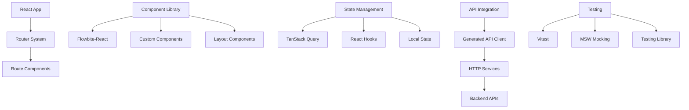

# User Interface Framework

## Overview

Context Studio's frontend is built using React with TypeScript, leveraging Flowbite-React for consistent UI components and Vite for modern development tooling. The framework provides a modular, accessible, and responsive design system optimized for knowledge graph management workflows.

## Architecture



## Technology Stack

### Core Framework
- **React 18**: Modern React with concurrent features
- **TypeScript**: Type safety and enhanced development experience
- **Vite**: Fast development build tool with HMR
- **TanStack Router**: Type-safe routing with search params

### UI Components
- **Flowbite-React**: Tailwind CSS-based component library
- **Tailwind CSS**: Utility-first CSS framework
- **Heroicons**: Consistent icon system
- **React Hook Form**: Form handling and validation

### Data Management
- **TanStack Query**: Server state management and caching
- **Generated API Client**: Type-safe API integration
- **React Context**: Global state management

### Development Tools
- **Vite**: Development server and bundling
- **ESLint**: Code linting and style enforcement
- **Prettier**: Code formatting
- **TypeScript**: Type checking and IntelliSense

## Component Architecture

### Component Organization

```
src/components/
├── layout/           # Layout and navigation components
├── forms/           # Form components and input handling
├── graphs/          # Graph visualization components
├── node_renderers/  # Knowledge graph node display
├── node_tables/     # Tabular data display
├── node_details/    # Detail views for entities
├── datasets/        # Dataset management UI
├── llm_pipelines/   # LLM pipeline configuration
├── llm_traceability/# Execution tracking UI
├── nlp/            # NLP analysis interfaces
├── panels/         # Sidebar and panel components
├── hooks/          # Custom React hooks
├── misc/           # Utility components
└── examples/       # Example and demo components
```

### Component Types

#### Layout Components
```typescript
// Navigation and page structure
interface LayoutComponent {
  Sidebar: React.Component;
  Header: React.Component;
  MainContent: React.Component;
  Footer: React.Component;
}

// Responsive layout with sidebar
const AppLayout: React.FC<{ children: React.ReactNode }> = ({ children }) => {
  return (
    <div className="flex h-screen bg-gray-50">
      <Sidebar />
      <div className="flex-1 flex flex-col overflow-hidden">
        <Header />
        <main className="flex-1 overflow-y-auto p-6">
          {children}
        </main>
      </div>
    </div>
  );
};
```

#### Form Components
```typescript
// Reusable form components with validation
interface FormComponents {
  StructureNodeForm: React.Component<StructureNodeFormProps>;
  PredicateForm: React.Component<PredicateFormProps>;
  PipelineFlavorForm: React.Component<PipelineFlavorFormProps>;
  SearchForm: React.Component<SearchFormProps>;
}

// Example: Structure Node Form
const StructureNodeForm: React.FC<StructureNodeFormProps> = ({
  initialData,
  onSubmit,
  onCancel
}) => {
  const { register, handleSubmit, formState: { errors } } = useForm();

  return (
    <form onSubmit={handleSubmit(onSubmit)} className="space-y-4">
      <div>
        <Label htmlFor="title">Title</Label>
        <TextInput
          id="title"
          {...register("title", { required: "Title is required" })}
          color={errors.title ? "failure" : undefined}
          helperText={errors.title?.message}
        />
      </div>
      {/* Additional form fields */}
    </form>
  );
};
```

#### Data Display Components
```typescript
// Node rendering components
interface NodeRendererProps {
  node: StructureNode;
  variant: "card" | "list" | "tree";
  interactive?: boolean;
  onSelect?: (node: StructureNode) => void;
}

const StructureNodeRenderer: React.FC<NodeRendererProps> = ({
  node,
  variant,
  interactive = false,
  onSelect
}) => {
  const handleClick = () => {
    if (interactive && onSelect) {
      onSelect(node);
    }
  };

  if (variant === "card") {
    return (
      <Card
        className={`${interactive ? "cursor-pointer hover:shadow-md" : ""}`}
        onClick={handleClick}
      >
        <h3 className="text-lg font-semibold">{node.title}</h3>
        <p className="text-gray-600">{node.description}</p>
        <Badge color="info">{node.node_type}</Badge>
      </Card>
    );
  }

  // Additional variants...
};
```

## State Management

### Server State with TanStack Query

#### API Integration
```typescript
// Generated API hooks from OpenAPI specification
import { useQuery, useMutation, useQueryClient } from '@tanstack/react-query';
import { structureNodesApi } from '../api/generated';

// Query hook for fetching structure nodes
export const useStructureNodes = (params?: StructureNodeParams) => {
  return useQuery({
    queryKey: ['structure-nodes', params],
    queryFn: () => structureNodesApi.listNodes(params),
    staleTime: 5 * 60 * 1000, // 5 minutes
  });
};

// Mutation hook for creating nodes
export const useCreateStructureNode = () => {
  const queryClient = useQueryClient();

  return useMutation({
    mutationFn: structureNodesApi.createNode,
    onSuccess: () => {
      queryClient.invalidateQueries({ queryKey: ['structure-nodes'] });
    },
  });
};
```

#### Cache Management
```typescript
// Query key factory for consistent cache keys
export const queryKeys = {
  structureNodes: {
    all: ['structure-nodes'] as const,
    lists: () => [...queryKeys.structureNodes.all, 'list'] as const,
    list: (filters: string) =>
      [...queryKeys.structureNodes.lists(), filters] as const,
    details: () => [...queryKeys.structureNodes.all, 'detail'] as const,
    detail: (id: string) =>
      [...queryKeys.structureNodes.details(), id] as const,
  },
  datasets: {
    all: ['datasets'] as const,
    active: () => [...queryKeys.datasets.all, 'active'] as const,
  },
} as const;
```

### Local State Management

#### React Context
```typescript
// Global application context
interface AppContextType {
  activeDataset: Dataset | null;
  user: User | null;
  theme: 'light' | 'dark';
  sidebarCollapsed: boolean;
}

const AppContext = React.createContext<AppContextType | undefined>(undefined);

export const AppProvider: React.FC<{ children: React.ReactNode }> = ({
  children
}) => {
  const [state, setState] = React.useState<AppContextType>({
    activeDataset: null,
    user: null,
    theme: 'light',
    sidebarCollapsed: false,
  });

  return (
    <AppContext.Provider value={{ ...state, setState }}>
      {children}
    </AppContext.Provider>
  );
};

export const useAppContext = () => {
  const context = React.useContext(AppContext);
  if (!context) {
    throw new Error('useAppContext must be used within AppProvider');
  }
  return context;
};
```

## Routing System

### TanStack Router Configuration

#### Route Definitions
```typescript
// Type-safe routing with search parameters
import { createRouter, createRoute, createRootRoute } from '@tanstack/react-router';

// Root route
const rootRoute = createRootRoute({
  component: AppLayout,
});

// Structure nodes routes
const structureNodesRoute = createRoute({
  getParentRoute: () => rootRoute,
  path: '/structure-nodes',
  component: StructureNodesPage,
});

const structureNodeRoute = createRoute({
  getParentRoute: () => structureNodesRoute,
  path: '/$nodeId',
  component: StructureNodeDetailPage,
});

// Search parameters validation
const structureNodesIndexRoute = createRoute({
  getParentRoute: () => structureNodesRoute,
  path: '/',
  validateSearch: z.object({
    node_type: z.enum(['layer', 'domain', 'term']).optional(),
    parent_id: z.string().optional(),
    search: z.string().optional(),
    page: z.number().int().min(1).optional().default(1),
  }),
  component: StructureNodesListPage,
});

// Router configuration
const router = createRouter({
  routeTree: rootRoute.addChildren([
    structureNodesRoute.addChildren([
      structureNodesIndexRoute,
      structureNodeRoute,
    ]),
    // Additional routes...
  ]),
});
```

#### Navigation Components
```typescript
// Type-safe navigation
import { Link, useNavigate } from '@tanstack/react-router';

const NavigationMenu: React.FC = () => {
  return (
    <nav className="space-y-2">
      <Link
        to="/structure-nodes"
        search={{ node_type: 'layer' }}
        className="block px-4 py-2 text-sm font-medium text-gray-700 hover:bg-gray-100"
        activeProps={{
          className: "bg-blue-50 text-blue-700"
        }}
      >
        Knowledge Layers
      </Link>

      <Link
        to="/datasets"
        className="block px-4 py-2 text-sm font-medium text-gray-700 hover:bg-gray-100"
      >
        Datasets
      </Link>
    </nav>
  );
};

// Programmatic navigation
const useNavigateToNode = () => {
  const navigate = useNavigate();

  return (nodeId: string) => {
    navigate({
      to: '/structure-nodes/$nodeId',
      params: { nodeId },
    });
  };
};
```

## Component Patterns

### Custom Hooks

#### Data Fetching Hooks
```typescript
// Composite hook for structure node operations
export const useStructureNodeOperations = (nodeId?: string) => {
  const queryClient = useQueryClient();

  const nodeQuery = useQuery({
    queryKey: queryKeys.structureNodes.detail(nodeId!),
    queryFn: () => structureNodesApi.getNode(nodeId!),
    enabled: !!nodeId,
  });

  const childrenQuery = useQuery({
    queryKey: ['structure-node-children', nodeId],
    queryFn: () => structureNodesApi.getNodeChildren(nodeId!),
    enabled: !!nodeId,
  });

  const updateMutation = useMutation({
    mutationFn: (data: Partial<StructureNode>) =>
      structureNodesApi.updateNode(nodeId!, data),
    onSuccess: () => {
      queryClient.invalidateQueries({
        queryKey: queryKeys.structureNodes.detail(nodeId!)
      });
    },
  });

  const deleteMutation = useMutation({
    mutationFn: () => structureNodesApi.deleteNode(nodeId!),
    onSuccess: () => {
      queryClient.invalidateQueries({
        queryKey: queryKeys.structureNodes.all
      });
    },
  });

  return {
    node: nodeQuery.data,
    children: childrenQuery.data,
    isLoading: nodeQuery.isLoading || childrenQuery.isLoading,
    error: nodeQuery.error || childrenQuery.error,
    updateNode: updateMutation.mutateAsync,
    deleteNode: deleteMutation.mutateAsync,
    isUpdating: updateMutation.isPending,
    isDeleting: deleteMutation.isPending,
  };
};
```

#### UI State Hooks
```typescript
// Modal management hook
export const useModal = (initialOpen = false) => {
  const [isOpen, setIsOpen] = React.useState(initialOpen);

  const openModal = React.useCallback(() => setIsOpen(true), []);
  const closeModal = React.useCallback(() => setIsOpen(false), []);
  const toggleModal = React.useCallback(() => setIsOpen(prev => !prev), []);

  return {
    isOpen,
    openModal,
    closeModal,
    toggleModal,
  };
};

// Selection management hook
export const useSelection = <T extends { id: string }>() => {
  const [selectedItems, setSelectedItems] = React.useState<Set<string>>(
    new Set()
  );

  const selectItem = React.useCallback((id: string) => {
    setSelectedItems(prev => new Set(prev).add(id));
  }, []);

  const deselectItem = React.useCallback((id: string) => {
    setSelectedItems(prev => {
      const newSet = new Set(prev);
      newSet.delete(id);
      return newSet;
    });
  }, []);

  const toggleItem = React.useCallback((id: string) => {
    setSelectedItems(prev => {
      const newSet = new Set(prev);
      if (newSet.has(id)) {
        newSet.delete(id);
      } else {
        newSet.add(id);
      }
      return newSet;
    });
  }, []);

  const clearSelection = React.useCallback(() => {
    setSelectedItems(new Set());
  }, []);

  return {
    selectedItems: Array.from(selectedItems),
    selectedCount: selectedItems.size,
    isSelected: (id: string) => selectedItems.has(id),
    selectItem,
    deselectItem,
    toggleItem,
    clearSelection,
  };
};
```

### Error Handling

#### Error Boundary
```typescript
interface ErrorBoundaryState {
  hasError: boolean;
  error?: Error;
}

export class ErrorBoundary extends React.Component<
  React.PropsWithChildren<{}>,
  ErrorBoundaryState
> {
  constructor(props: React.PropsWithChildren<{}>) {
    super(props);
    this.state = { hasError: false };
  }

  static getDerivedStateFromError(error: Error): ErrorBoundaryState {
    return { hasError: true, error };
  }

  componentDidCatch(error: Error, errorInfo: React.ErrorInfo) {
    console.error('Error boundary caught an error:', error, errorInfo);
  }

  render() {
    if (this.state.hasError) {
      return (
        <div className="min-h-screen flex items-center justify-center bg-gray-50">
          <div className="max-w-md w-full bg-white shadow-lg rounded-lg p-6">
            <div className="flex items-center">
              <ExclamationCircleIcon className="h-12 w-12 text-red-400" />
              <div className="ml-4">
                <h1 className="text-lg font-medium text-gray-900">
                  Something went wrong
                </h1>
                <p className="mt-1 text-sm text-gray-500">
                  We apologize for the inconvenience. Please try refreshing the page.
                </p>
              </div>
            </div>
            <div className="mt-6">
              <Button onClick={() => window.location.reload()}>
                Refresh Page
              </Button>
            </div>
          </div>
        </div>
      );
    }

    return this.props.children;
  }
}
```

## Styling and Theming

### Tailwind Configuration
```javascript
// tailwind.config.js
module.exports = {
  content: [
    './src/**/*.{js,jsx,ts,tsx}',
    'node_modules/flowbite-react/**/*.{js,jsx,ts,tsx}'
  ],
  theme: {
    extend: {
      colors: {
        primary: {
          50: '#eff6ff',
          500: '#3b82f6',
          900: '#1e3a8a',
        },
      },
      spacing: {
        '18': '4.5rem',
        '88': '22rem',
      },
    },
  },
  plugins: [require('flowbite/plugin')],
};
```

### Component Styling Patterns
```typescript
// Consistent styling with Tailwind utilities
const ComponentStyles = {
  card: "bg-white shadow rounded-lg p-6",
  button: {
    primary: "bg-blue-600 hover:bg-blue-700 text-white",
    secondary: "bg-gray-600 hover:bg-gray-700 text-white",
    outline: "border border-gray-300 hover:bg-gray-50",
  },
  input: "border-gray-300 rounded-md focus:ring-blue-500 focus:border-blue-500",
  text: {
    heading: "text-lg font-semibold text-gray-900",
    body: "text-sm text-gray-700",
    caption: "text-xs text-gray-500",
  },
};

// Usage in components
const MyComponent: React.FC = () => (
  <div className={ComponentStyles.card}>
    <h2 className={ComponentStyles.text.heading}>
      Component Title
    </h2>
    <p className={ComponentStyles.text.body}>
      Component content
    </p>
  </div>
);
```

## Testing Strategy

### Testing Framework Setup
```typescript
// vitest.config.ts
import { defineConfig } from 'vitest/config';
import react from '@vitejs/plugin-react';

export default defineConfig({
  plugins: [react()],
  test: {
    environment: 'jsdom',
    setupFiles: ['./src/test/setup.ts'],
    globals: true,
  },
});

// Test setup file
import '@testing-library/jest-dom';
import { server } from './mocks/server';

beforeAll(() => server.listen());
afterEach(() => server.resetHandlers());
afterAll(() => server.close());
```

### Component Testing
```typescript
// Component test example
import { render, screen, fireEvent, waitFor } from '@testing-library/react';
import { QueryClient, QueryClientProvider } from '@tanstack/react-query';
import { StructureNodeForm } from '../StructureNodeForm';

const createTestQueryClient = () => new QueryClient({
  defaultOptions: {
    queries: { retry: false },
    mutations: { retry: false },
  },
});

const TestWrapper: React.FC<{ children: React.ReactNode }> = ({ children }) => {
  const queryClient = createTestQueryClient();

  return (
    <QueryClientProvider client={queryClient}>
      {children}
    </QueryClientProvider>
  );
};

describe('StructureNodeForm', () => {
  it('renders form fields correctly', () => {
    render(
      <StructureNodeForm onSubmit={vi.fn()} onCancel={vi.fn()} />,
      { wrapper: TestWrapper }
    );

    expect(screen.getByLabelText('Title')).toBeInTheDocument();
    expect(screen.getByLabelText('Description')).toBeInTheDocument();
    expect(screen.getByRole('button', { name: 'Save' })).toBeInTheDocument();
  });

  it('handles form submission', async () => {
    const mockSubmit = vi.fn();

    render(
      <StructureNodeForm onSubmit={mockSubmit} onCancel={vi.fn()} />,
      { wrapper: TestWrapper }
    );

    fireEvent.change(screen.getByLabelText('Title'), {
      target: { value: 'Test Node' }
    });

    fireEvent.click(screen.getByRole('button', { name: 'Save' }));

    await waitFor(() => {
      expect(mockSubmit).toHaveBeenCalledWith({
        title: 'Test Node',
        // ... other form data
      });
    });
  });
});
```

## Performance Considerations

### Code Splitting
```typescript
// Lazy loading for route components
const StructureNodesPage = React.lazy(() =>
  import('../pages/StructureNodesPage')
);
const DatasetsPage = React.lazy(() =>
  import('../pages/DatasetsPage')
);

// Suspense wrapper for lazy components
const LazyComponent: React.FC<{ Component: React.LazyExoticComponent<any> }> = ({
  Component
}) => (
  <React.Suspense fallback={<LoadingSpinner />}>
    <Component />
  </React.Suspense>
);
```

### Memoization
```typescript
// Memoized expensive components
const ExpensiveComponent = React.memo<ExpensiveComponentProps>(({
  data,
  onUpdate
}) => {
  const processedData = React.useMemo(() =>
    expensiveDataProcessing(data),
    [data]
  );

  const handleUpdate = React.useCallback((id: string) => {
    onUpdate(id);
  }, [onUpdate]);

  return (
    <div>
      {processedData.map(item => (
        <Item
          key={item.id}
          data={item}
          onUpdate={handleUpdate}
        />
      ))}
    </div>
  );
});
```

## Best Practices

### Component Design
1. **Single Responsibility**: Each component should have a single, clear purpose
2. **Composition over Inheritance**: Use composition patterns for flexibility
3. **Props Interface**: Define clear, typed interfaces for component props
4. **Accessibility**: Implement proper ARIA attributes and keyboard navigation

### State Management
1. **Server State**: Use TanStack Query for server data
2. **Local State**: Use React state for UI-only state
3. **Global State**: Use Context sparingly for truly global state
4. **State Colocation**: Keep state as close to where it's used as possible

### Performance
1. **Lazy Loading**: Implement code splitting for large components
2. **Memoization**: Use React.memo and useMemo appropriately
3. **Virtual Scrolling**: For large lists, implement virtualization
4. **Bundle Analysis**: Regular bundle size analysis and optimization

## Troubleshooting

### Common Issues
1. **Hydration Errors**: Check for server/client rendering mismatches
2. **Memory Leaks**: Clean up subscriptions and intervals in useEffect
3. **Infinite Re-renders**: Avoid creating objects/functions in render
4. **Performance Issues**: Profile with React DevTools and identify bottlenecks